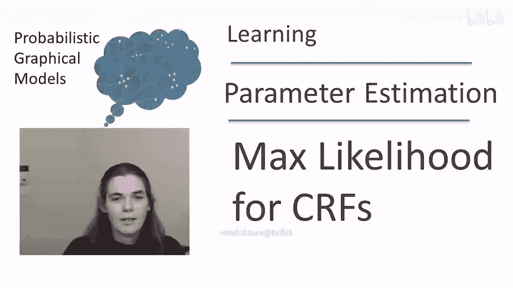
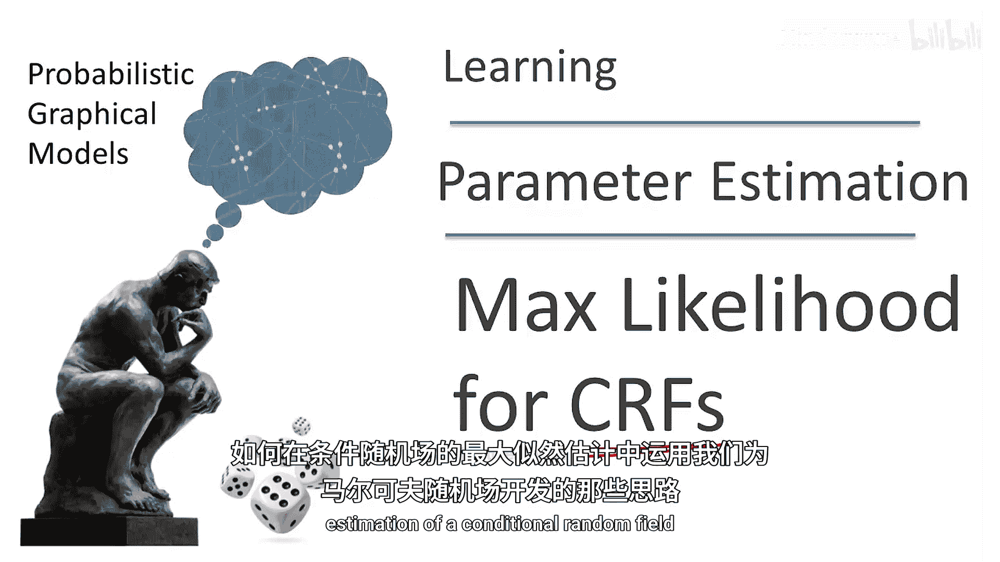
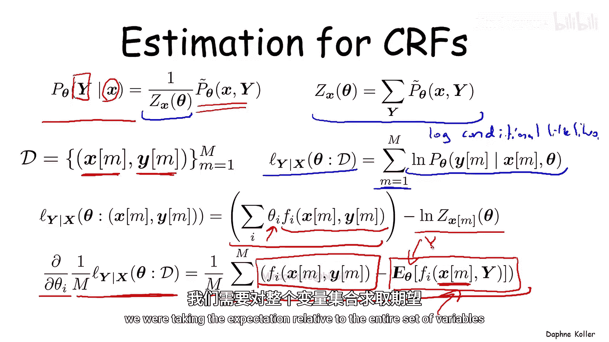
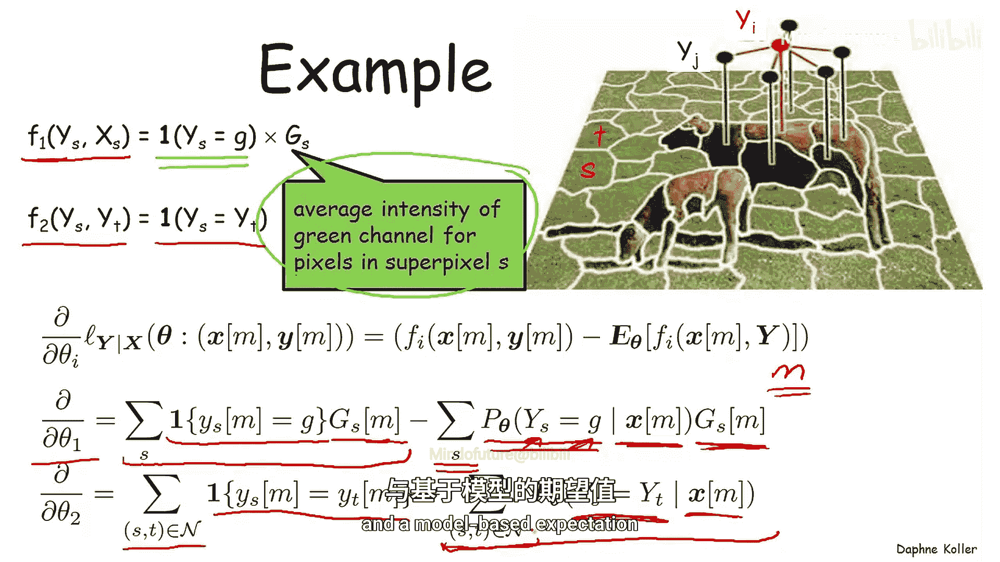
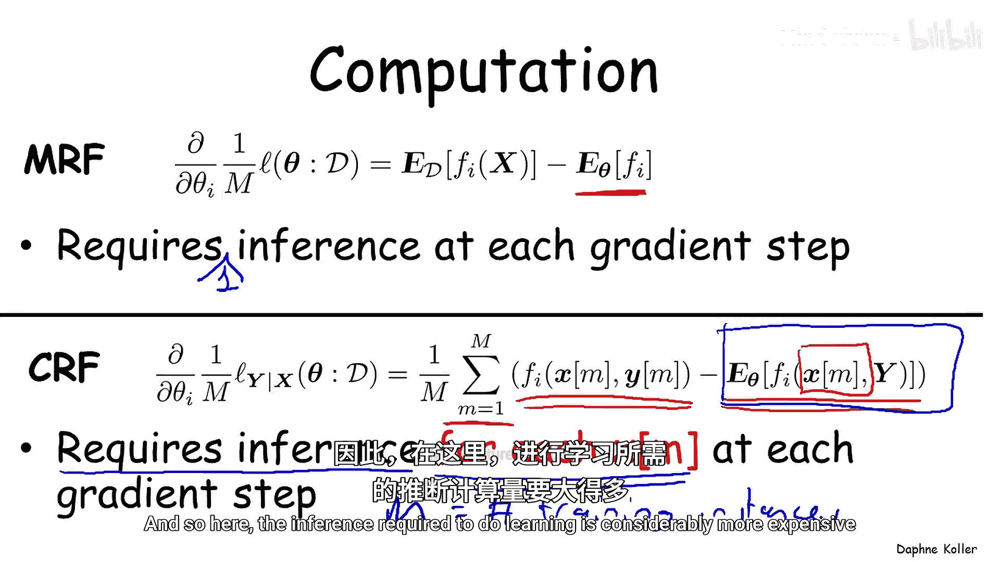
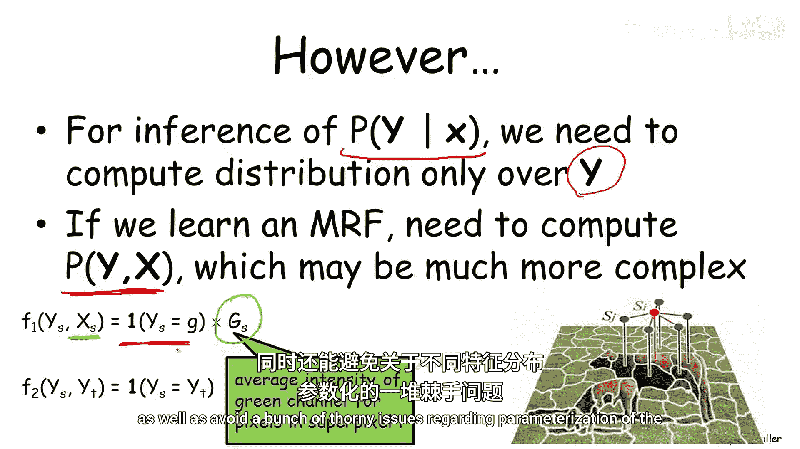
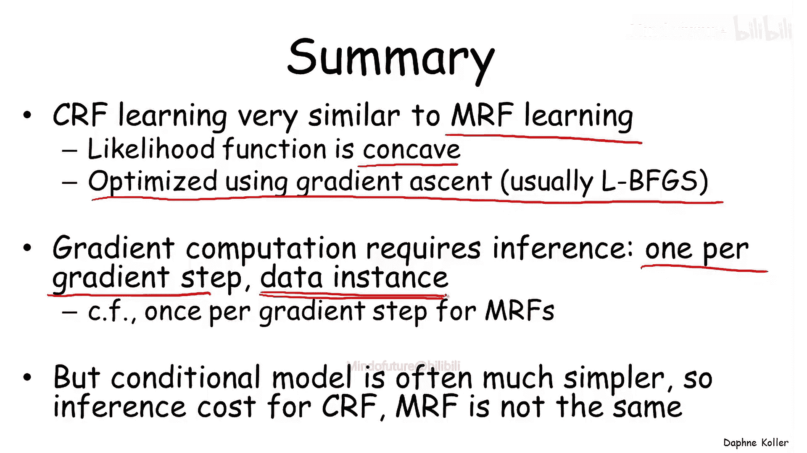

# 014：条件随机场的最大似然估计

在本节课中，我们将学习如何将马尔可夫随机场的最大似然估计思想，应用于条件随机场的学习。我们将探讨其目标函数、梯度计算，并通过一个图像分割的实例来具体说明，最后比较CRF与MRF在训练成本上的差异。

## 概述

上一节我们介绍了马尔可夫随机场的最大似然估计。本节中，我们来看看其扩展模型——条件随机场的最大似然估计方法。CRF的核心目标是学习在给定观测变量 **X** 的条件下，目标变量 **Y** 的条件概率分布。

## CRF模型回顾

条件随机场用于计算在给定一组观测变量 **X** 时，特定目标变量集 **Y** 的概率。其未归一化密度 **P̃(x, y)** 的参数化方式与MRF相同（例如，因子乘积或对数线性模型）。关键区别在于，CRF使用一个与 **x** 相关的配分函数 **Z(x)**，以确保对于给定的 **x**，我们得到的是在 **y** 上的归一化条件分布。

其条件概率公式为：
**P(y | x) = (1 / Z(x)) * P̃_θ(x, y)**
其中，配分函数 **Z(x) = Σ_y P̃_θ(x, y)** 仅对 **y** 进行归一化。

## 条件对数似然目标函数

CRF的学习数据是一组配对数据 **(X, Y)**，其中训练数据中两者均被观测到。合适的目标函数是条件对数似然（更准确地说，是对数条件似然）。

对于 **M** 个数据实例，目标函数定义为：
**L(θ) = Σ_m log P_θ(y^m | x^m)**

将其展开（以对数线性模型为例），我们得到：
**L(θ) = Σ_m [ Σ_i θ_i * f_i(x^m, y^m) - log Z(x^m) ]**

这个形式与MRF的似然函数非常相似。

## 梯度计算

我们对参数 **θ_i** 求目标函数的梯度。经过推导，梯度表达式为：
**∂L/∂θ_i = Σ_m [ f_i(x^m, y^m) - E_θ[f_i(x^m, Y) | x^m] ]**

这个梯度是两项期望之差：
1.  **经验期望**：特征函数在观测数据 **(x^m, y^m)** 上的值。
2.  **模型期望**：在给定 **x^m** 的条件下，特征函数关于模型分布 **P_θ(Y | x^m)** 的期望值。

**重要提示**：此处的模型期望是**在固定 x^m 的情况下，仅对变量 Y 求期望**，这与MRF中对所有变量求期望不同。

## 实例：图像分割模型

让我们通过一个简化的图像分割模型来具体理解梯度计算。模型有两个特征，且参数是共享的。

以下是模型的两个特征定义：

*   **特征 F1 (单点特征)**：对于图像中的每个超像素 **S**，如果其标签 **Y_S** 是“草地”，则该特征值为该超像素的平均绿色通道值 **g_S**，否则为0。
    *   **公式**: `F1(x, y) = Σ_S 1{Y_S = “grass”} * g_S`
*   **特征 F2 (成对特征)**：对于每一对相邻的超像素 **(S, T)**，如果它们的标签相同（同为“草地”或同为“奶牛”），则特征值为1，否则为0。
    *   **公式**: `F2(x, y) = Σ_{(S,T)相邻} 1{Y_S = Y_T}`

现在，我们将这些特征代入梯度公式。对于单个训练图像 **m**：

*   **参数 θ1 的梯度**:
    `∂L/∂θ1 = Σ_S [ 1{Y_S = “grass”} * g_S - P_θ(Y_S = “grass” | x^m) * g_S ]`
    *   第一项（经验期望）对所有实际标记为“草地”的超像素求和其绿色值。
    *   第二项（模型期望）对所有超像素求和，但用模型预测的“该超像素为草地”的概率 **P_θ(Y_S = “grass” | x^m)** 加权其绿色值。

*   **参数 θ2 的梯度**:
    `∂L/∂θ2 = Σ_{(S,T)相邻} [ 1{Y_S = Y_T} - P_θ(Y_S = Y_T | x^m) ]`
    *   第一项对所有实际标签相同的相邻超像素对计数。
    *   第二项对所有相邻超像素对，求和它们标签相同的模型预测概率。

在这两种情况下，梯度都是经验计数与模型预测概率期望之间的差值。

## 训练成本比较：CRF vs MRF

理解CRF与MRF训练的计算成本差异至关重要。

*   **MRF训练**：每个梯度步长需要计算一次模型期望，这涉及在**完整联合分布 P(x, y)** 上运行推断。虽然昂贵，但**每个梯度步只需一次推断**。
*   **CRF训练**：从梯度公式 `∂L/∂θ_i = Σ_m [ ... - E_θ[f_i(x^m, Y) | x^m] ]` 可以看出，模型期望项 **E_θ[f_i(x^m, Y) | x^m]** **对于每个训练实例 x^m 都是不同的**。因此，**每个梯度步长需要进行 M 次条件推断**（M是训练实例数），这比MRF昂贵得多。

## 模型复杂性的权衡

然而，不能仅凭推断次数来简单判断成本。必须权衡所有影响计算复杂度的因素。

在CRF中，我们计算的是条件概率 **P(y | x)**。此时，观测变量 **x** 是固定的（已实例化），因此模型中的因子仅涉及目标变量 **y**，图模型更简单。

如果我们因为CRF训练推断成本高而想改用MRF训练，就需要为**联合分布 P(x, y)** 建模。这通常更复杂，因为：
1.  模型包含更多变量（**x** 和 **y**）。
2.  在许多CRF应用场景中（如上述图像分割），观测变量 **x**（如平均绿色值）可能是连续值。在MRF中为其定义合理的参数化分布（如高斯混合模型）非常棘手且难以处理。

因此，尽管CRF训练中每个梯度步的推断次数更多，但**每次条件推断本身的计算成本通常远低于MRF中联合分布的推断**，并且避免了为复杂观测特征建模分布的难题。

## 总结

本节课中，我们一起学习了条件随机场的最大似然估计。

*   **数学形式**：CRF学习在数学形式上与MRF学习非常相似。其（条件）似然函数同样具有凹性，通常使用相同的优化算法（如L-BFGS）。
*   **梯度计算**：关键区别在于梯度计算。CRF的梯度需要**在每个梯度步长中，为每个训练实例运行一次条件推断**，这比MRF（每个梯度步一次推断）成本更高。
*   **模型权衡**：选择CRF还是MRF不能只考虑训练成本。CRF的条件模型 **P(y | x)** 通常比MRF的联合模型 **P(x, y)** 更简单，每次推断更快，并且避免了为观测变量建模的困难。在实际应用中，需要根据具体模型复杂度、推断成本以及整体泛化性能来综合权衡选择哪种框架。