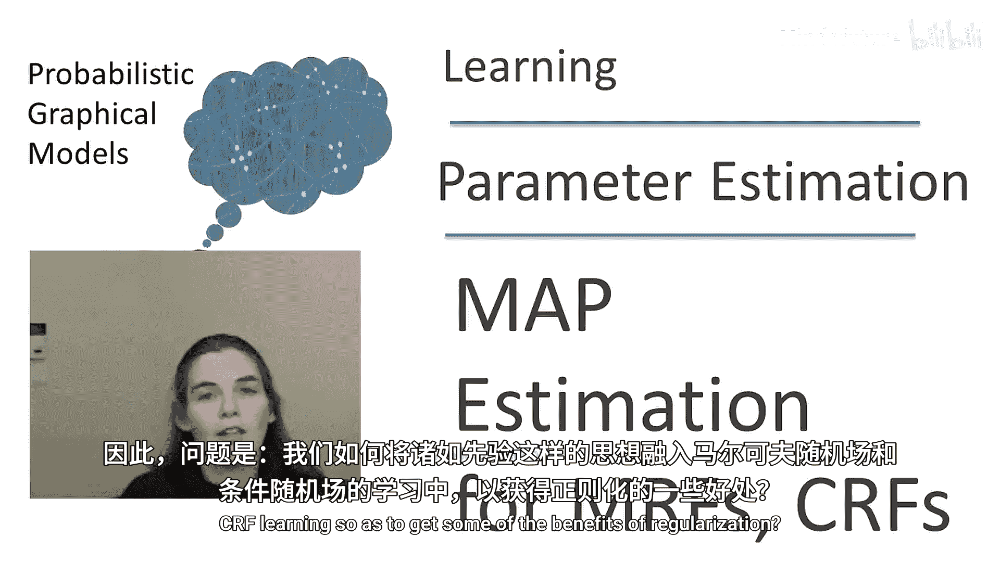
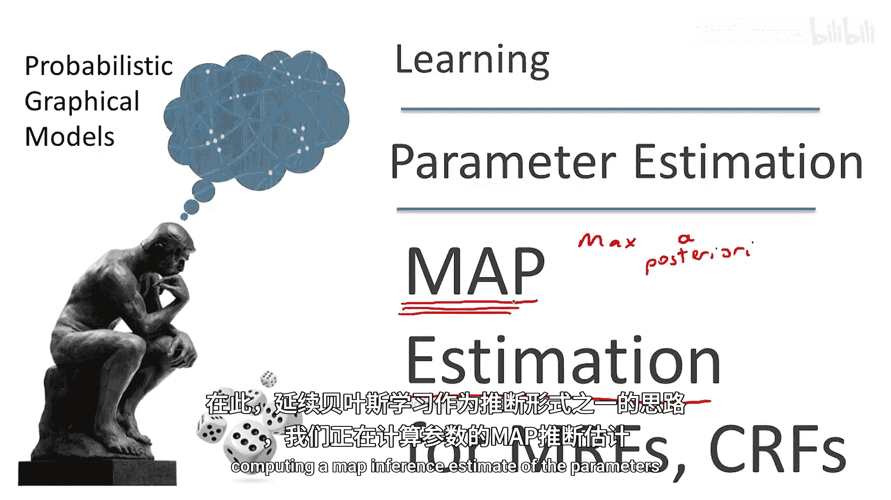
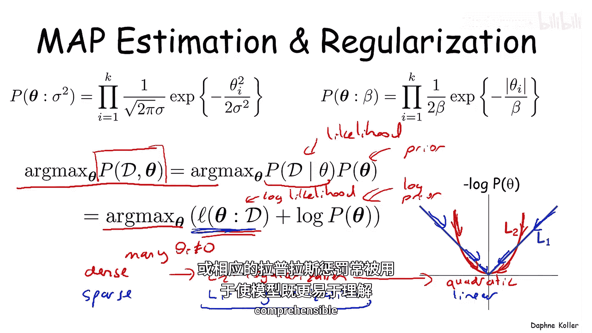
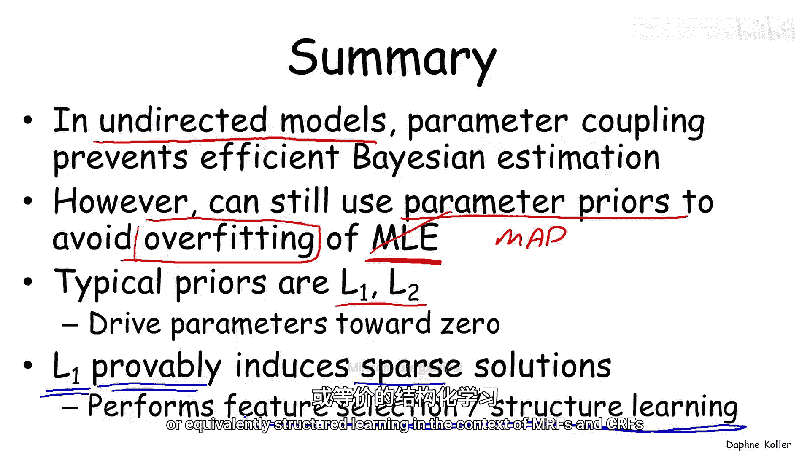

# 概率图模型：3：MRF与CRF的MAP估计

在本节课中，我们将要学习如何为马尔可夫随机场（MRF）和条件随机场（CRF）引入参数先验，以解决最大似然估计容易过拟合的问题。我们将重点介绍最大后验概率（MAP）估计方法，并比较两种常用的先验分布：高斯先验（L2正则化）和拉普拉斯先验（L1正则化）。

---

## 从最大似然估计到MAP估计

上一节我们介绍了MRF和CRF的最大似然估计。然而，与贝叶斯网络一样，最大似然估计容易对训练数据的特定细节产生过拟合。因此，我们希望引入参数先验来平滑参数估计，尤其是在数据量有限的初期阶段。

在贝叶斯网络中，我们可以使用共轭先验（如狄利克雷先验），并与似然函数结合得到闭式解的后验分布，计算上非常优雅。但在MRF和CRF中，似然函数本身就没有闭式解，因此后验分布也无法优雅地计算。

那么，我们如何在MRF和CRF学习中融入先验思想，以获得正则化的好处呢？

这里的核心思想是使用**最大后验概率（MAP）估计**。我们有一个先验分布，但我们不维持一个闭式后验，而是计算参数的**最大后验估计**。这与我们在概率图模型中进行MAP推理的概念相同：我们计算一个单一的、最可能的参数赋值。

---

## 两种常见的参数先验

在MRF或CRF学习的背景下，MAP估计通常如何实现？一个典型的解决方案是为每个参数 `θ_i` 单独定义一个先验分布。

以下是两种最常用的先验分布：

### 1. 高斯先验（L2正则化）

为每个参数 `θ_i` 定义一个零均值的单变量高斯分布，其方差为 `σ²`。

*   **公式**：`P(θ_i) ∝ exp(-θ_i² / (2σ²))`
*   **超参数**：方差 `σ²`。`σ²` 越小，我们越确信参数接近零；`σ²` 越大，我们越倾向于相信数据。

### 2. 拉普拉斯先验（L1正则化）

另一种常用的先验是拉普拉斯先验。

*   **公式**：`P(θ_i) ∝ exp(-|θ_i| / β)`
*   **超参数**：尺度参数 `β`。与高斯分布类似，`β` 控制着分布围绕零的紧密程度。

这两种先验都鼓励参数值向零靠近，但方式不同。我们将每个参数的先验乘在一起，得到联合参数先验 `P(θ)`。

---

## MAP估计的目标函数

现在，让我们看看在这两种先验下，MAP估计的具体形式。MAP估计的目标是找到最大化联合分布 `P(D, θ)` 的参数 `θ`。

根据概率论，联合分布等于似然 `P(D|θ)` 与先验 `P(θ)` 的乘积。由于对数函数的单调性，最大化联合分布等价于最大化其对数。

**MAP目标函数**：
`θ_MAP = argmax_θ [ log P(D|θ) + log P(θ) ]`

其中，`log P(D|θ)` 是**对数似然**，`log P(θ)` 是**对数先验**（即正则化项）。

接下来，我们看看这两种先验对应的正则化项。

---

## L2与L1正则化的比较

当我们取负对数先验（即惩罚项）时，可以更清楚地看到区别：

*   **高斯先验（L2正则化）**：负对数先验正比于 `θ_i²`。
    *   **效果**：这是一个二次惩罚，将参数推向零。当参数值较大时，惩罚力度很强；当参数接近零时，惩罚力度减弱。因此，使用L2正则化的模型往往是**稠密**的，即许多参数值很小但不为零。
*   **拉普拉斯先验（L1正则化）**：负对数先验正比于 `|θ_i|`。
    *   **效果**：这是一个线性惩罚，无论参数值大小，都给予一致的推力使其归零。这使得模型倾向于将那些对似然函数贡献不大的参数**精确地推到零**。因此，使用L1正则化的模型往往是**稀疏**的。

稀疏性具有重要价值：更稀疏的模型通常意味着更少的特征或更简单的图结构（移除边），这使得模型更容易理解，并且推理计算通常更高效。

---

## 总结

本节课中我们一起学习了在无向图模型（MRF/CRF）中引入MAP估计来避免过拟合。

1.  **动机**：由于似然函数中参数的耦合，我们无法像贝叶斯网络那样高效地进行完整的贝叶斯估计（维持参数后验）。因此，我们采用MAP估计作为替代，它结合了先验信息。
2.  **方法**：MAP估计的目标是最大化 `对数似然 + 对数先验`。常用的先验是高斯先验（L2正则化）和拉普拉斯先验（L1正则化）。
3.  **核心区别**：两者都将参数推向零以防止过拟合，但**L1正则化（拉普拉斯先验）能产生稀疏解**。这相当于自动进行了特征选择或图结构学习，使模型更简洁、计算更高效。

