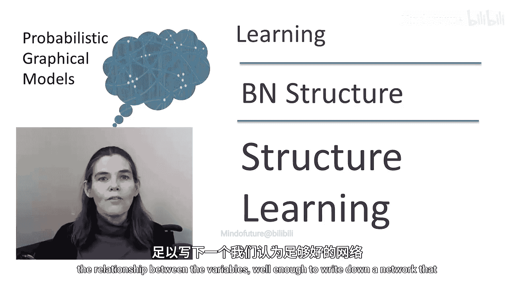
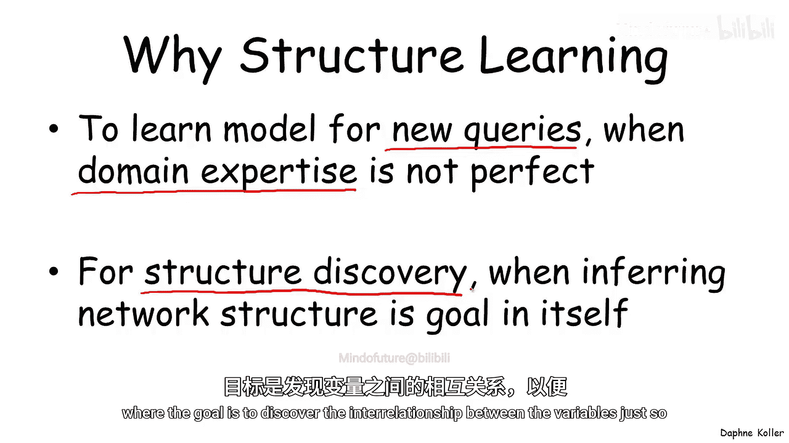
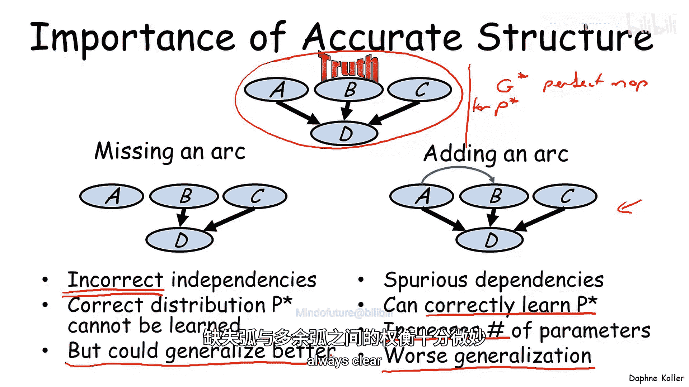
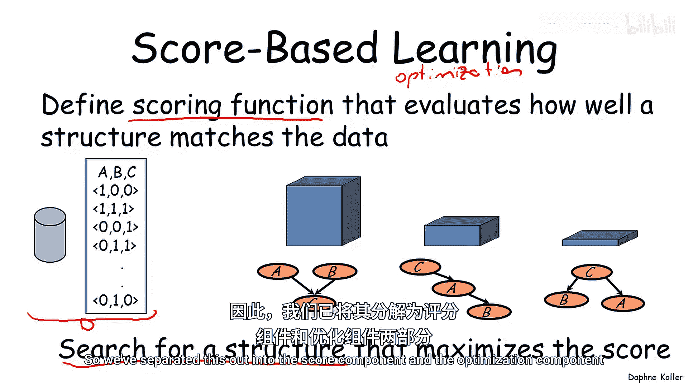

# 概率图模型3：学习：P16：结构学习概述

在本节课中，我们将要学习贝叶斯网络结构学习的基本概念。我们将探讨为什么需要学习网络结构，分析结构错误（如缺失边或多余边）对模型性能的影响，并介绍结构学习的一般范式：通过定义评分函数和搜索算法来寻找最优网络结构。

---

我们之前讨论了在给定网络结构的情况下，学习贝叶斯网络参数的问题。

但情况并非总是如此。我们并不总是拥有一位能够充分理解领域结构、清楚变量之间关系的领域专家，来为我们提供一个足够好的网络。

那么，在哪些情况下会发生这种情况呢？第一种情况是，我们确实希望使用一个网络来执行各种查询，例如在医疗领域或其他场景中进行新的医疗查询。

在这种情况下，虽然可能存在一些领域知识，但这些知识可能不足以构建一个足够好用的模型。通过利用数据并学习数据所揭示的最显著的依赖关系，我们可能会做得更好。

第二种情况是，我们甚至不一定关心使用这个网络，我们只是想发现网络结构。这种应用模式出现在例如科学或生物数据集中，其目标仅仅是更好地理解变量之间的相互关系，从而加深对领域的认识。

让我们暂时关注上述两种情况中的第一种，即我们的目标是为了使用而学习一个网络。让我们思考可能发生的错误类型，以及它们如何影响网络在新实例上的应用能力。

假设真实的网络是这里的这个。现在，让我们考虑学习算法可能犯的不同类型的错误。例如，一种情况是学习算法可能学到一个缺失了一条边的网络。

另一方面，它可能学到一个我们添加了一条边的网络。当然，也可能存在两种情况混合的例子，但让我们分别思考这两种错误类型。

如果我们缺失了一条边，学习到的网络所暗示的独立性实际上是不正确的。相对于真实网络（我们称之为 **G***），我们学到的网络做出了与 **G*** 不符的独立性假设。

相反，在添加了多余边的情况下，我们引入了虚假的依赖关系。例如，此时在变量 A 和 B 之间就存在一个虚假的依赖关系。那么，这有什么影响呢？

如果缺失了一条边，那么正确的分布 **P*** 就无法被学习到。一般来说，如果 **P*** 与这里的网络 **G*** 相关联（即 **G*** 是 **P*** 的一个完美映射），那么我们就无法使用一个缺失了边的网络来学习 **P***。

这看起来可能非常糟糕。我们或许会更倾向于右边这种错误模型，尽管它有这些多余的边，但它确实允许我们正确地学习 **P***。也就是说，在 A 和 B 之间的这条额外边上，存在一组参数设置，使得正确的分布 **P*** 仍然可以在这个网络结构上被估计出来。

因此，似乎这种错误模型实际上比缺失边的模型更好。但经验表明，这实际上是一种过于简化的观点。具体来说，具有多余边的模型会导致参数数量增加。而我们需要从有限的数据中估计的参数越多，正确估计它们的难度就越大。我们在讨论“数据碎片化”问题时已经谈过这一点：随着父节点数量的增加，每个父节点配置下的数据量会减少。

因此，由此得出的一个重要结论是，正如我们已经看到的，这可能导致更差的泛化能力，即在未见过的实例上表现更差。

所以，事实是，有时拥有更少的边实际上可能比拥有更多的边泛化得更好，即使正确的分布无法被编码。因此，缺失边和多余边之间的权衡是微妙的，并不总是清楚哪种情况能给我们带来最佳性能。

基于以上介绍，我们通常如何从数据中学习贝叶斯网络结构呢？一般的范式是：我们定义一个评分函数，用于评估每个结构与数据的匹配程度。在后续课程中，我们将细化这个范式。

这里我们有一个数据集 **D**，以及三个示例网络结构。我们将定义一个评分函数，告诉我们每个网络结构相对于我们所见数据的优劣程度。

然后，我们的目标是搜索一个能最大化该评分的网络结构。这样，我们就把学习问题转化成了一个优化问题。

这是一个在组合空间（即网络结构的空间）上的优化问题。通过定义一个评分函数，我们得到了要优化的目标。现在，我们需要提出一个算法来优化这个评分。因此，我们将这个问题分解为评分组件和优化组件，并将在后续部分分别讨论它们。

---

本节课中，我们一起学习了贝叶斯网络结构学习的必要性、结构错误对模型的影响，以及结构学习的基本框架：通过评分函数评估网络结构，并通过搜索算法寻找最优结构。我们了解到，在有限数据下，模型复杂度（边数）与泛化能力之间存在微妙的权衡。