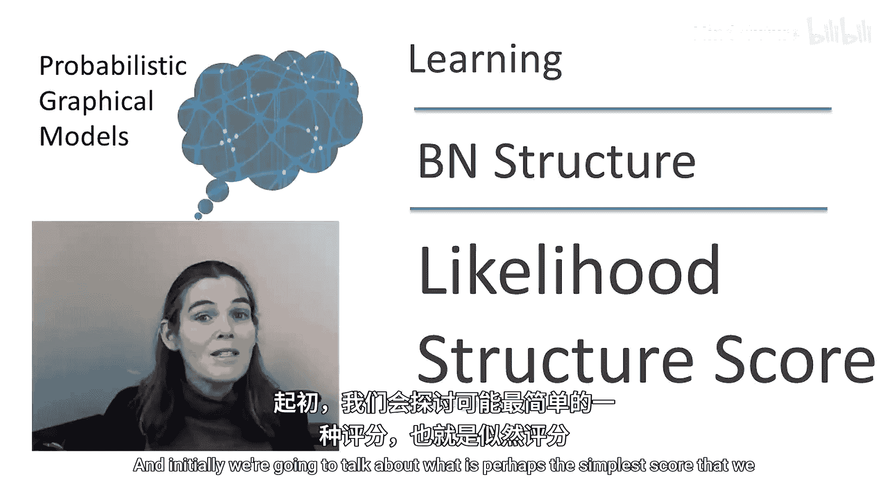
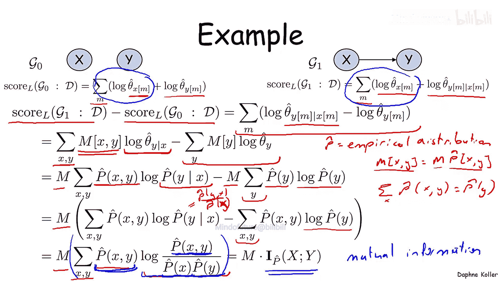
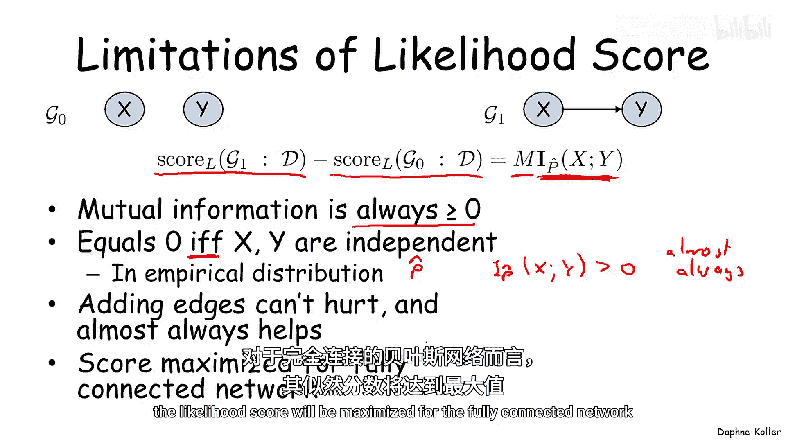
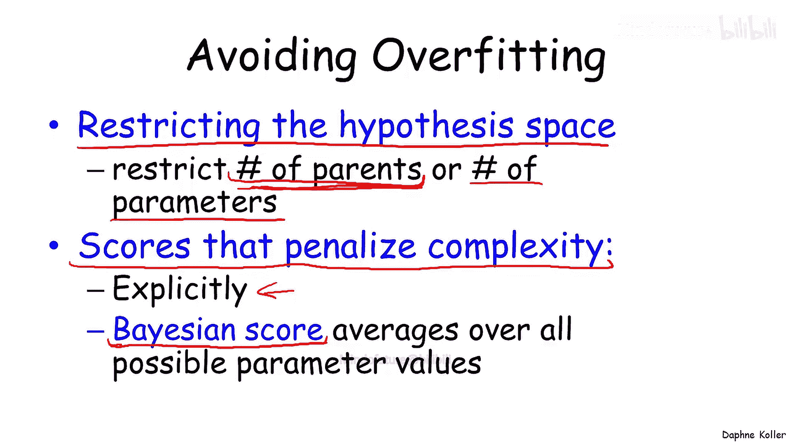
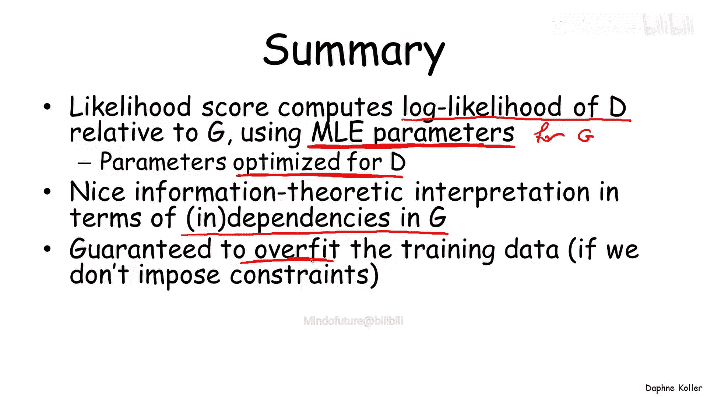

# 概率图模型：3.1：似然分数 📊

在本节中，我们将学习贝叶斯网络结构学习中的一个核心概念：评分函数。我们将首先探讨最简单的评分函数——似然分数，理解其定义、计算方式以及优缺点。

## 概述

贝叶斯网络结构学习可以看作由两部分组成：一是定义一个评分函数来评估不同网络结构的优劣；二是设计一个搜索或优化过程，以选择得分最高的网络。本节我们将重点讨论第一部分，即评分函数，并首先介绍最简单的似然分数。

## 似然分数的定义

我们已经知道，似然可以用来评估一个给定网络（及其参数）的质量。似然分数定义为：对于一个给定的图结构 **G**，我们找到能最大化数据 **D** 的对数似然的最优参数 **θ̂**，并将此最大对数似然值作为图 **G** 的分数。

用公式表示，图 **G** 的似然分数为：
`score_L(G) = log P(D | G, θ̂_G)`
其中，**θ̂_G** 是在给定图 **G** 和数据 **D** 的条件下，参数的最大似然估计。

这意味着，对于任何一个图结构，我们先找出其最优参数，然后用这个最优参数下的数据似然来评估该图的质量。

## 一个简单例子

为了更直观地理解似然分数，让我们看一个包含两个随机变量 **X** 和 **Y** 的简单例子。我们比较两个图：
*   **G₀**：**X** 和 **Y** 之间没有边（相互独立）。
*   **G₁**：存在一条从 **X** 指向 **Y** 的边。

根据之前参数估计的知识，我们可以分解对数似然函数。

对于图 **G₀**，其似然分数为：
`score_L(G₀) = Σ_m [log θ̂_{x[m]} + log θ̂_{y[m]}]`
其中，求和遍历所有数据实例 **m**，`x[m]` 和 `y[m]` 是第 **m** 个实例中 **X** 和 **Y** 的取值，**θ̂** 是图 **G₀** 下的最大似然参数。

对于图 **G₁**，其似然分数为：
`score_L(G₁) = Σ_m [log θ̂_{x[m]} + log θ̂_{y[m] | x[m]}]`
这里的 **θ̂** 是图 **G₁** 下的最大似然参数。

## 深入分析：互信息

为了更深入地比较这两个图，我们计算它们分数的差值：`score_L(G₁) - score_L(G₀)`。经过一系列代数变换（利用充分统计量和经验分布 **P̂**），这个差值可以简化为：
`score_L(G₁) - score_L(G₀) = M * I_{P̂}(X; Y)`
其中：
*   **M** 是数据实例的总数。
*   **I_{P̂}(X; Y)** 是在经验分布 **P̂** 下，变量 **X** 和 **Y** 之间的**互信息**。

互信息的计算公式为：
`I_{P̂}(X; Y) = Σ_{x,y} P̂(x, y) log [ P̂(x, y) / (P̂(x) P̂(y)) ]`
它衡量了联合分布 **P̂(X, Y)** 与假设 **X** 和 **Y** 独立时的分布（即边缘分布的乘积 **P̂(X)P̂(Y)**）之间的平均“距离”。互信息越大，表示 **X** 和 **Y** 之间的相关性越强。

上一节我们通过一个双变量例子引入了互信息的概念。现在，让我们将其推广到任意网络。

对于一个任意的贝叶斯网络图 **G**，其似然分数可以重新表述为：
`score_L(G) = M * Σ_i I_{P̂}(X_i; Pa_{X_i}) - M * Σ_i H_{P̂}(X_i)`
其中：
*   **Pa_{X_i}** 表示图中节点 **X_i** 的父节点集合。
*   **H_{P̂}(X_i)** 是变量 **X_i** 在经验分布 **P̂** 下的熵。
*   第二项 `- M * Σ_i H_{P̂}(X_i)` 是一个与图结构 **G** 无关的常数。

这个结果非常重要，它表明：
**一个网络的似然分数越高，当且仅当图中每个节点与其父节点之间的互信息之和越大。**
这非常直观：我们为一个变量选择的父节点，应该是与它相关性最强（互信息最大）的那些变量。这符合我们构建贝叶斯网络以捕捉变量间强依赖关系的初衷。

## 似然分数的问题：过拟合

虽然互信息的解释很直观，但它也揭示了似然分数的一个严重缺陷。回顾两个图的分数差值公式：
`score_L(G₁) - score_L(G₀) = M * I_{P̂}(X; Y)`

根据信息论，互信息 **I_{P̂}(X; Y)** 总是**非负**的。并且，它等于零的**充要条件**是 **X** 和 **Y** 在分布 **P̂** 中严格独立。

问题在于：即使在真实的底层分布中 **X** 和 **Y** 是独立的，由于抽样带来的随机波动，在有限数据集 **D** 上得到的经验分布 **P̂** 中，它们也**几乎不可能**达到完美的独立。因此，互信息 **I_{P̂}(X; Y)** 几乎总是大于零。

这意味着，在这个例子中，添加边 **X → Y** **几乎总是能提高**似然分数。这个结论可以推广：对于似然分数而言，添加更多的边几乎总是使分数更高。因此，**完全连通的网络（即最大可能的图）通常会取得最高的似然分数**。

这导致了显著的**过拟合**问题：更复杂的模型（更多边）有更多参数，会将数据分割到更小的“桶”里，每个桶内的数据实例很少，使得参数估计不可靠。模型只是记住了训练数据中的噪声，而未能捕捉真实的底层结构，泛化能力会很差。

## 如何避免过拟合？

既然似然分数容易导致过拟合，我们有什么策略来应对呢？主要有两种思路：

1.  **限制假设空间**：这是一种硬性约束。例如，我们可以限制每个节点最多能有多少个父节点，或者直接限制模型的总参数数量。这种方法简单直接，但不够灵活，可能会阻止算法学习到真正需要的复杂结构。

2.  **使用带复杂度惩罚的评分函数**：这是一种更灵活的策略。评分函数在奖励模型对数据拟合程度的同时，也会惩罚模型的复杂度。这样，只有当变量间的相关性信号足够强，能够抵消复杂度惩罚时，算法才会选择添加边。这类评分函数又主要分为两种：
    *   **显式复杂度惩罚分数**：如BIC（贝叶斯信息准则）、AIC（赤池信息准则）等，在似然项后直接减去一个与模型参数数量成正比的惩罚项。
    *   **贝叶斯分数**：遵循贝叶斯范式，对未知参数引入先验分布并进行积分（平均）。我们将在后续章节看到，这天然地产生了一种平衡拟合优度和模型复杂度的分数。

## 总结

本节课我们一起学习了贝叶斯网络结构学习中的**似然分数**。

*   我们首先定义了似然分数：它使用给定图结构 **G** 下的最大似然参数 **θ̂_G**，计算数据 **D** 的对数似然值作为评分。
*   通过一个双变量例子，我们推导出图结构的优劣可以归结为变量与其父节点间的**互信息**大小。这为选择父节点提供了清晰的信息论解释：应选择相关性最强的变量。
*   然而，分析也揭示了似然分数的核心缺陷：互信息非负的性质导致它**总是倾向于选择更复杂的模型**（更多的边），从而引发**过拟合**。
*   最后，我们简要讨论了避免过拟合的两种主要策略：限制假设空间和使用带复杂度惩罚的评分函数（包括显式惩罚和贝叶斯方法）。

理解似然分数的优点和局限性，为我们后续学习更鲁棒、更实用的评分函数（如贝叶斯分数）奠定了重要基础。