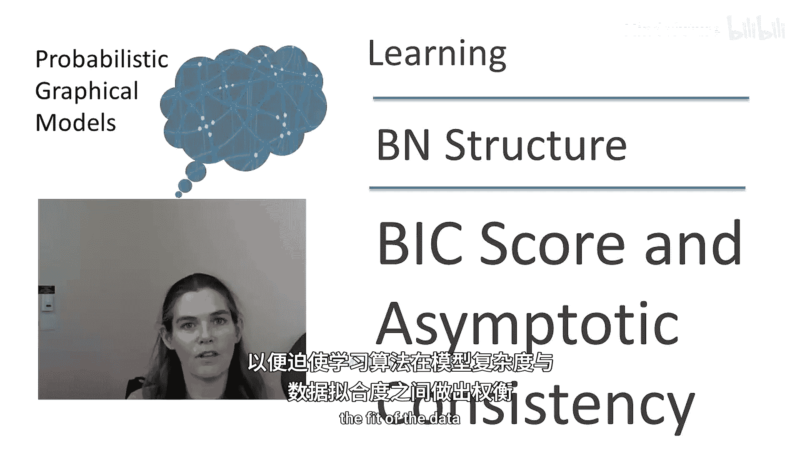
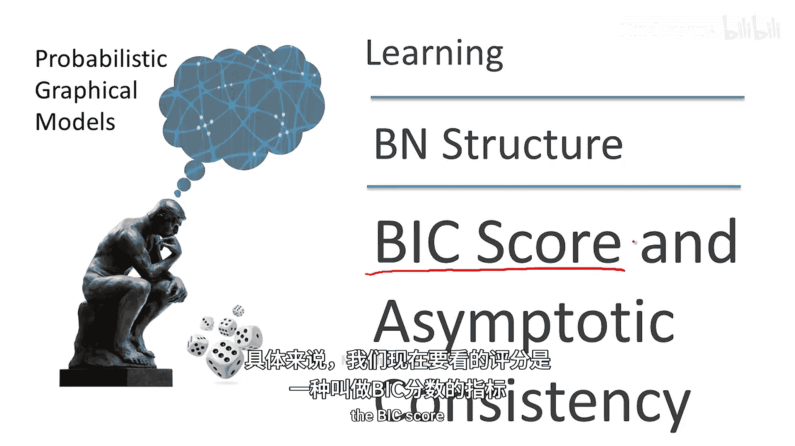
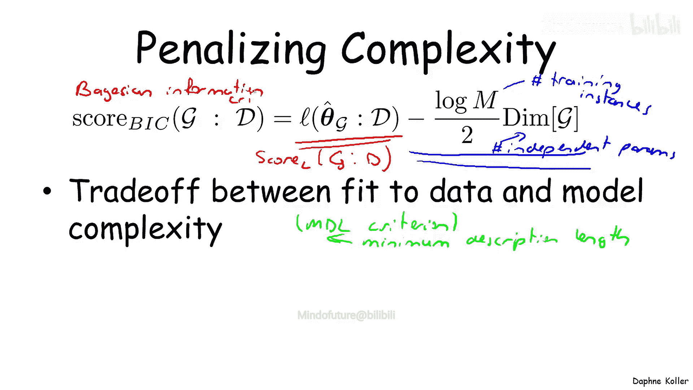
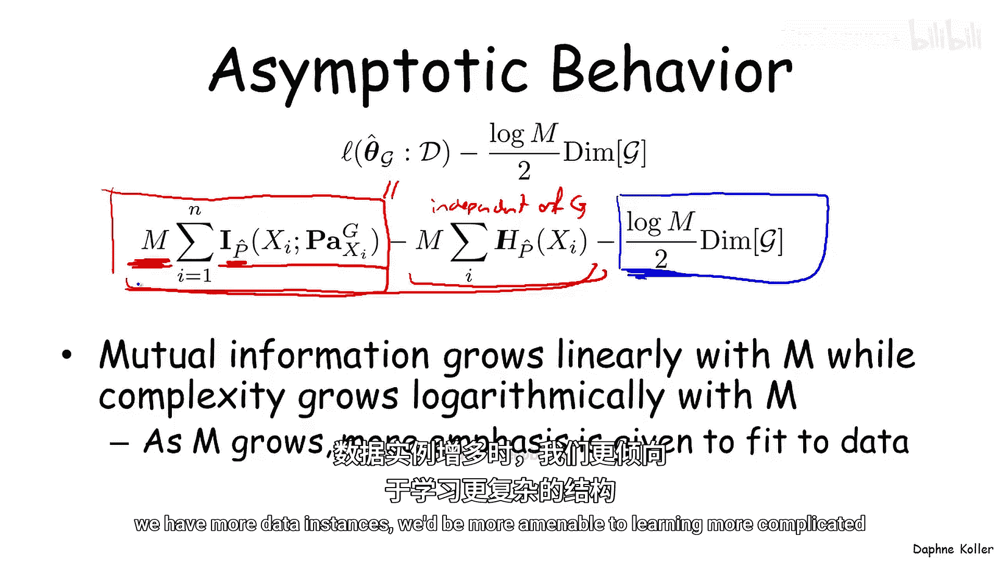
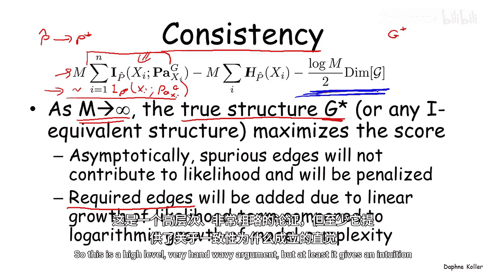
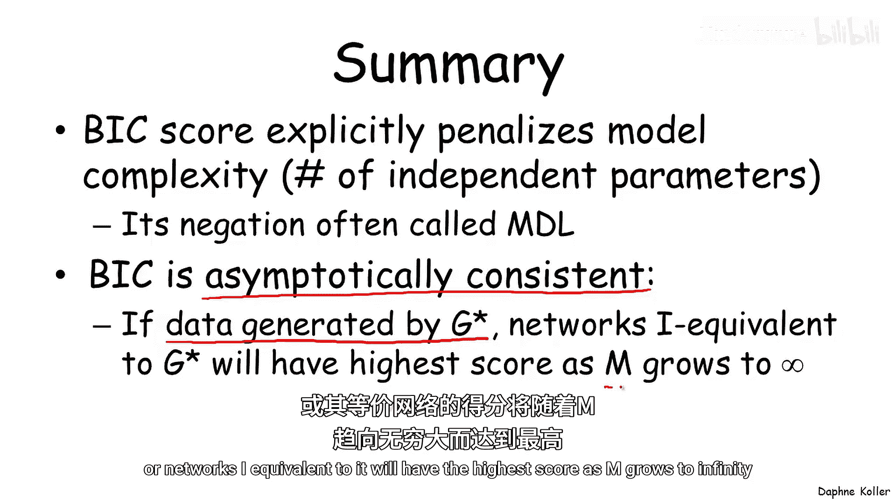

# 概率图模型：3.5：BIC与渐近一致性 📊

在本节课中，我们将学习贝叶斯网络结构学习中的一种重要评分函数——BIC评分。我们将探讨它如何通过惩罚模型复杂度来避免过拟合，并理解其具有的渐近一致性性质。

## 结构学习与评分函数

上一节我们介绍了将贝叶斯网络结构学习视为在结构空间上优化一个评分函数。在此过程中，一个关键的设计选择是决定使用哪个评分函数。

我们的首次尝试是使用似然评分。但我们已经看到，似然评分非常容易过拟合，并且只要结构空间允许，它总会学习到最复杂的网络。

## 引入复杂度惩罚

现在，我们考虑一种不同的方法。这种方法不是（或不仅仅是）约束结构空间，而是对我们学习到的结构的复杂度施加惩罚，从而迫使学习算法在模型复杂度与数据拟合度之间进行权衡。

具体来说，我们现在要看的评分被称为BIC评分。

以下是BIC评分的公式：

**Score_BIC(G : D) = log P(D | θ̂_G, G) - (log M / 2) * dim(G)**

让我们看看BIC评分惩罚复杂度的一种方式。BIC评分包含两项：第一项是图及其相对于数据的最大似然参数的似然值。这是一个熟悉的项，它与似然评分代表的意义相同。如果单独使用这一项，我们会得到同样的过拟合行为。

但我们在此之上增加了一个惩罚项，即公式右边的第二项。该项是 `-(log M / 2) * dim(G)`。

我们来理解一下这些不同的部分：
*   **M** 是训练实例的数量。
*   **dim(G)** 是网络中独立参数的数量。

我们在多项式网络的背景下讨论过独立参数的概念。作为提醒，一个多项式分布的独立参数数量比多项式条目数少一个。由此我们可以计算任何多项式网络的独立参数数量。这基本上计算了我们在网络中估计独立参数时所拥有的自由度数量。

因此，这两项相互平衡。我们已经看到，左边的项（对数似然）试图推动模型更好地拟合训练数据；而右边的惩罚项则试图保持独立参数的数量（从而降低网络复杂度）。因此，该评分在数据拟合度和模型复杂度之间提供了一种权衡。

这是这种权衡的一种选择。实际上，还有其他评分使用这两项之间不同的权衡方式。但BIC评分在实践中非常常用，并且有几个独特的动机，其中一些我们会讨论，另一些则不会。不过，值得指出的一点是，这个评分的负数通常被称为MDL准则，其中MDL代表最小描述长度。实际上，最小描述长度的概念为此提供了信息论上的证明。而另一个证明则源于一个更贝叶斯的准则，这也是BIC实际上代表贝叶斯信息准则的原因。

## BIC评分的渐近行为

现在，让我们看看这个惩罚评分的渐近行为。我们已经看到，在似然评分的背景下，无论我们有多少训练数据，我们几乎总是会选择我们假设允许的最密集连接的网络。

但当我们使用这种惩罚评分时，情况就不再如此了。为了理解这一点，让我们分解前两项中的第一项（即似然评分），并提醒自己，至少在多项式网络的背景下，似然评分可以重写为以下形式：

**Score_L(G : D) = M * Σ_i MI_P̂(X_i; Pa_{X_i}^G) + M * Σ_i H_P̂(X_i)**

这是似然评分的分解，它包含这两项。第一项是数据实例数 **M** 乘以变量 **X_i** 与其在网络中的父节点之间的互信息之和，该互信息是相对于经验分布 **P̂** 的。似然评分中的第二项也是一个项，即 **M** 乘以变量在经验分布中的熵之和。正如我们之前讨论过的，这一项与 **G** 无关，因此不影响选择哪个结构，因为它对所有结构都是相同的。

因此，我们有两项在相互制衡。我们有这里的红色项，即 **M** 乘以互信息之和；我们还有第二项，即蓝色项，它是 **(log M / 2)** 乘以 **G** 中独立参数的数量。

现在，如果我们考虑这两项，我们会发现互信息项随 **M** 线性增长，而复杂度项随 **M** 对数增长。因此，随着我们获得越来越多的数据实例，我们会更加强调数据拟合度，而较少强调模型复杂度。直观上，我们可以推断，随着数据实例增多，我们会更倾向于学习更复杂的结构。

## 渐近一致性

这个性质产生了一个关于BIC评分非常重要的结果，这个结果被称为**一致性**。一致性告诉我们，当样本数量增长到无穷大时，我们会得到什么行为，即我们会学习到哪个网络。

这里我们假设数据实际上是从一个特定的真实结构 **G*** 生成的。一致性性质表明，随着 **M** 增长到无穷大，最大化评分的结构将是真实结构 **G***。

这一点本身并不完全准确，因为真实结构 **G*** 可能有其他几个与其I等价的结构。我们已经看到，似然评分（实际上惩罚项也是如此）对于I等价的网络是相同的。因此，最大化评分的不仅仅是真实结构本身，而是真实结构或任何其他与其I等价的结构。但就我们的目的而言，这没问题，因为我们实际上学到了概率分布的正确表示。

为了理解为什么这个结果成立，我们将给出一个非常高层次的直观论证，而不是完全形式化地证明这个定理。

首先，考虑为什么这不会导致过拟合，即为什么在最大化评分时，随着实例数量增长到无穷大，我们不会学习到虚假的边。

我们回到这里的公式，我们看到随着 **M** 增长到无穷大，**P̂** 将趋近于 **P***，其中 **P*** 是我真实的底层分布。因此，我们在这里的第一项中得到的，本质上是 **X_i** 与其父节点相对于 **P*** 的互信息。在 **P*** 中，**X_i** 与其父节点之间的互信息，从添加额外的、虚假的父节点中得不到任何好处。因为在真实的底层分布 **P*** 中，不存在额外的独立性或相关性。因此，在这一点上，更复杂的结构在第一项方面将与 **G*** 大致相同，但虚假的边将在蓝色项的参数数量方面让我们付出代价。所以，虚假的边不会对数据似然项有贡献，但会受到更多的惩罚，因此我们将选择对应于 **G*** 的更稀疏的网络。

反之，为什么我们不会欠拟合？也就是说，为什么我们最终会学习到所有正确的边？这是因为数据似然项告诉我们，必需的边（例如，在 **G*** 中或在I等价网络中的边），如果我们没有包含它们，这个互信息项将低于其可能的值。因此，通过在模型中包含这些项，我们将获得更高的评分。并且由于这个互信息项随 **M** 线性增长，而惩罚项随 **M** 对数增长，最终第一项将占主导地位，学习算法添加 **G*** 中所需的边将是有益的。

这是一个高层次、非常粗略的论证，但至少它提供了关于一致性为何成立的直觉。

## 总结

本节课中我们一起学习了BIC评分。BIC评分是一种非常简单的评分，它在模型复杂度与数据拟合度之间进行权衡，因此具有**渐近一致性**这一重要性质。这意味着，如果数据实际上是由一个网络 **G*** 生成的（该网络是分布的一个完美映射），那么随着 **M** 增长到无穷大，**G*** 或与其I等价的网络将具有最高的评分。