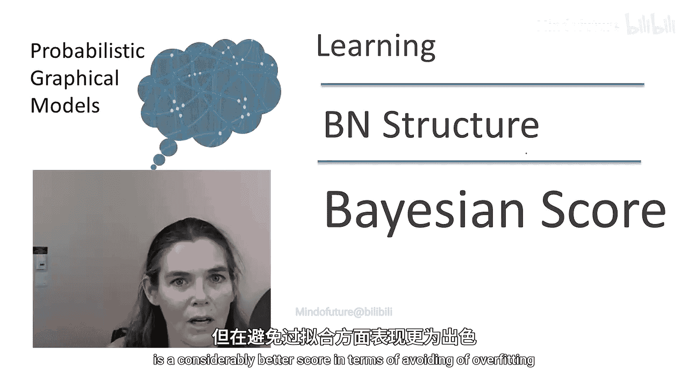
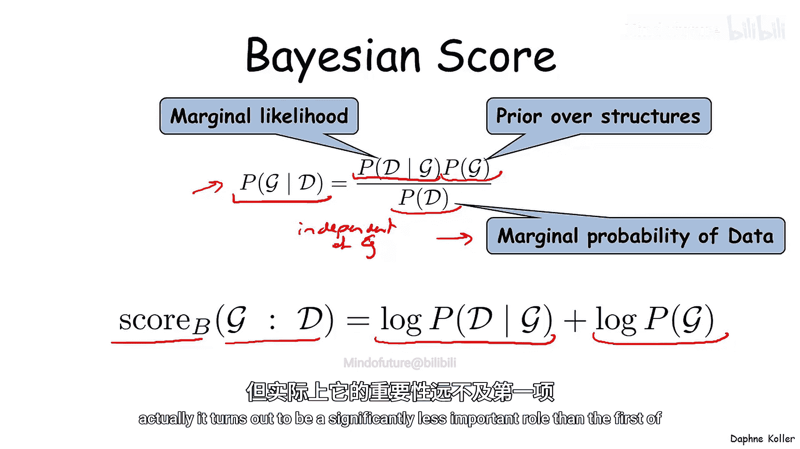
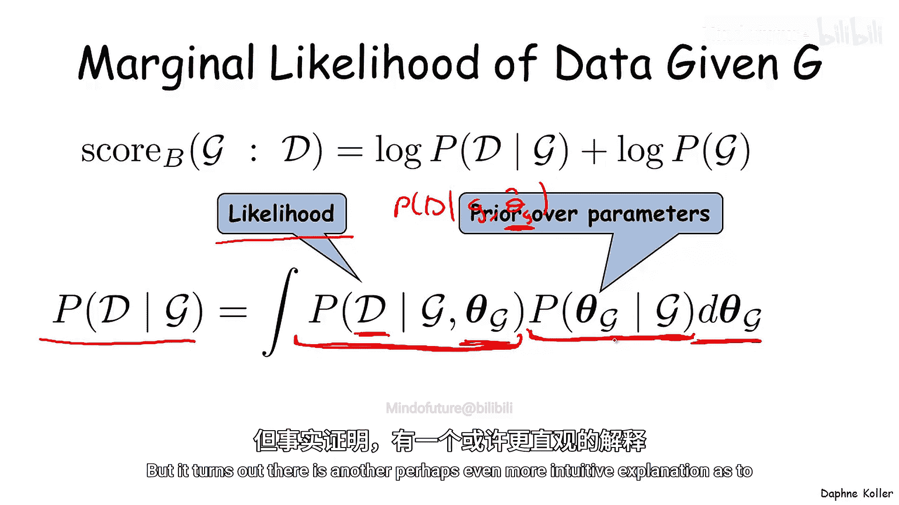
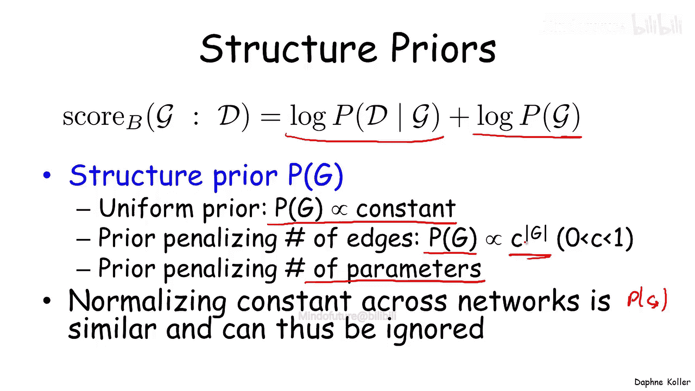
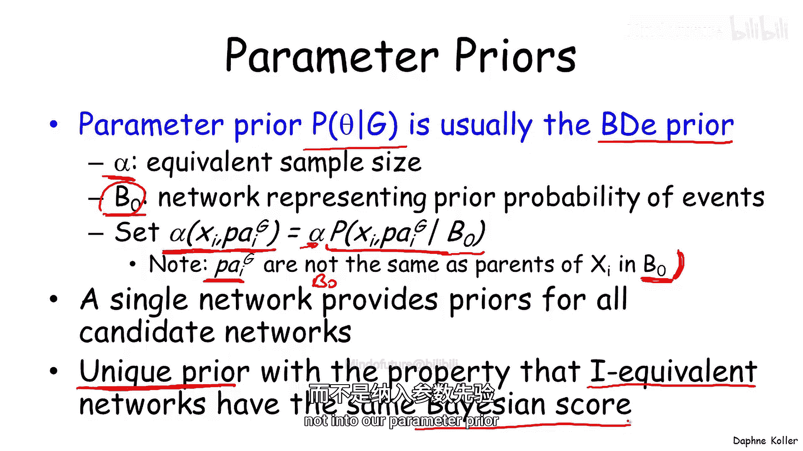
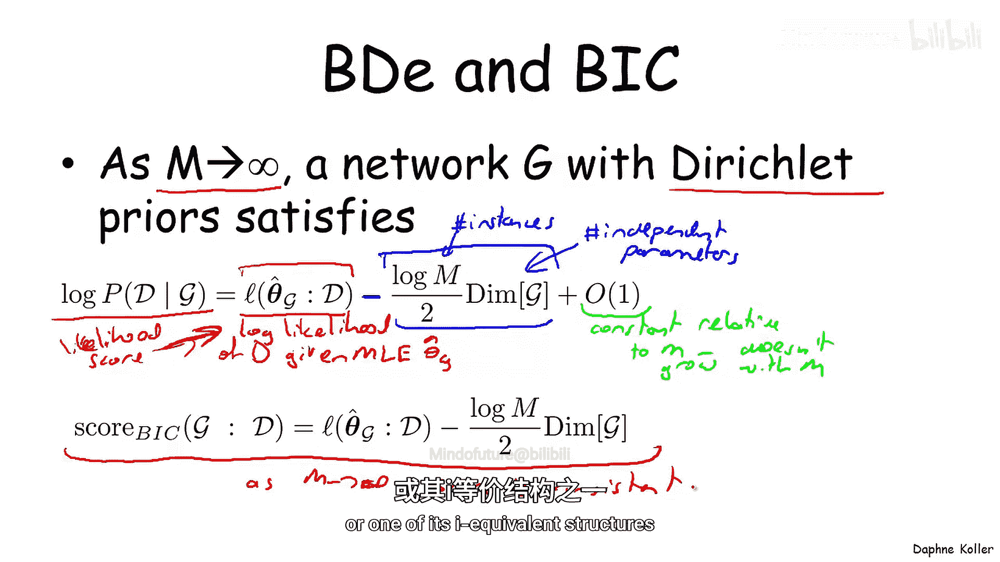
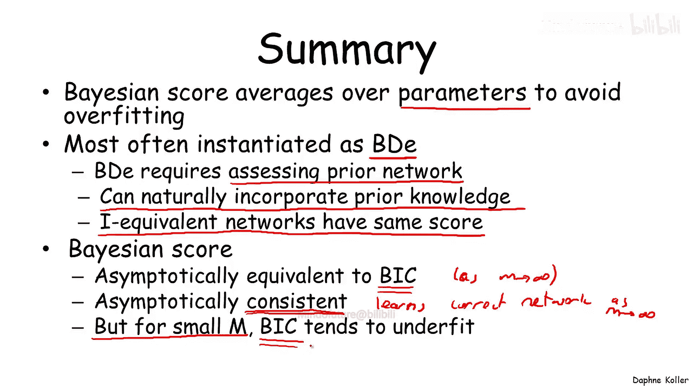

# 019：贝叶斯分数 🧮

在本节课中，我们将学习贝叶斯分数。这是一种用于贝叶斯网络结构学习的评分函数，它基于贝叶斯原理，能有效避免过拟合问题。我们将探讨其定义、计算方式、关键性质及其与似然分数的区别。



## 贝叶斯分数概述

上一节我们介绍了贝叶斯网络结构学习是优化网络结构空间上的评分函数的问题，并讨论了最简单的似然分数存在严重的过拟合问题。本节中，我们将探讨一种基于贝叶斯原理推导出的不同分数。我们将看到，尽管它在表面上与似然分数有相似之处，但在避免过拟合方面表现更佳。


贝叶斯分数源于贝叶斯范式，该范式认为，任何我们不确定的事物都需要有一个概率分布来描述。因此，如果我们对图结构不确定，就需要有一个图结构的先验分布；如果我们对参数不确定，就需要有一个参数的概率分布。

现在，如果我们将优化问题定义为寻找最大化给定数据 `D` 时图 `G` 的概率的图 `G`，即 `P(G|D)`。使用贝叶斯定理重写这个概率，我们得到以下表达式：



`P(G|D) = [P(D|G) * P(G)] / P(D)`

让我们分别看看每一项。第一项 `P(D|G)` 被称为**边际似然**，是给定图结构时数据的概率。第二项 `P(G)` 是图结构的先验分布。最后一项 `P(D)` 是分母，被称为数据的**边际概率**。重要的是，数据的边际概率与 `G` 无关，因此不会影响我们选择哪个图。在寻找单个图或最大化分数的图的模型选择问题中，我们可以忽略它。

因此，我们定义贝叶斯分数 `score_B(G)` 相对于数据集 `D` 为这个表达式分子的对数，即边际似然的对数加上图先验的对数：

`score_B(G) = log P(D|G) + log P(G)`

我们可能认为这个分数会因为使用了图先验而避免过拟合。虽然先验可以发挥作用，但实际上第一项（边际似然）的作用远比它重要。让我们更深入地看看边际似然。

## 深入理解边际似然



边际似然 `P(D|G)` 与对数似然不同，因为它对所有可能的参数设置进行积分。从数学角度看，我们将在概率表达式中引入变量 `θ_G`，然后将其积分掉（因为是连续空间，所以用积分而不是求和）。

`P(D|G) = ∫ P(D|G, θ_G) * P(θ_G|G) dθ_G`

上述表达式中的第一项 `P(D|G, θ_G)` 是**似然**，正是我们在对数似然分数中使用的成分。但重要的是，与似然分数不同，我们不是仅针对最大似然参数 `θ_hat_G` 计算 `P(D|G, θ_G)`，而是计算这个概率在所有可能参数设置上的平均值。这给了我们一个对给定特定结构的数据概率的、不那么乐观的评估，因为我们必须考虑所有可能的参数设置 `θ_G`，而不仅仅是恰好针对我们数据集的那个 `θ_hat` 参数集，并使用参数先验进行平均。

这种不那么乐观的评估是为什么它可能不会过拟合那么多的一个直觉解释。但事实证明，关于为什么这个分数能减少过拟合，还有另一个可能更直观的解释。


让我们看看这个边际似然项 `P(D|G)`，并将其重写为所有实例 `x_1` 到 `x_M` 给定 `G` 的概率。我们将使用概率的链式法则（不是贝叶斯网络的链式法则）来分解这个联合分布：

`P(D|G) = P(x_1|G) * P(x_2|x_1, G) * P(x_3|x_1, x_2, G) * ... * P(x_M|x_1, ..., x_{M-1}, G)`

观察每一项，每一项实际上都是在给定先前实例 `x_1` 到 `x_{M-1}` 的情况下，对未见实例 `x_M` 进行预测。因此，你可以将其视为几乎在进行某种交叉验证或泛化能力估计，因为我们是在估计给定先前实例预测未见实例的能力。所以，`P(D)` 在某种意义上将某种泛化能力分析纳入了其中。

你可能会说，标准的似然分数肯定也做了完全相同的事情。但稍加思考就会发现，如果我们想对最大似然参数集进行这种分析，那么该参数集 `θ_hat_G` 依赖于所有实例。因此，我们不能以这种方式分解它，因为如果我们右边有 `θ_hat_G`，它已经包含了所有实例，包括未见过的实例。这又是为什么最大似然分数倾向于过拟合的另一个直觉解释。

现在，贝叶斯分数可能看起来有点吓人，因为它包含所有这些积分，我们不知道如何计算它。事实证明，对于多项式贝叶斯网络的情况，贝叶斯分数实际上可以使用一个称为伽马函数的函数以闭式形式写出。


伽马函数如上所示，它也是一个积分，但事实证明伽马函数实际上是阶乘函数的连续扩展，因为 `Γ(x) = x * Γ(x-1)`，并且大多数计算机都有伽马函数的实现。

利用伽马函数，我们实际上可以将 `P(D|G)` 重写为如下形式的一个乘积：

```
P(D|G) = ∏_i [ ∏_{u_i} [ Γ(α_{i|u_i}) / Γ(α_{i|u_i} + M_{i|u_i}) ] * ∏_{x_i^j} [ Γ(α_{i|u_i, x_i^j} + M_{i|u_i, x_i^j}) / Γ(α_{i|u_i, x_i^j}) ] ]
```

其中：
*   `i` 遍历所有变量。
*   `u_i` 遍历变量 `X_i` 父节点的所有可能赋值。
*   `x_i^j` 遍历变量 `X_i` 本身的所有可能值。
*   `α` 是狄利克雷先验参数。
*   `M` 是充分统计量。

虽然这个表达式看起来可能仍然有点吓人，但它是可以直接插入计算机并轻松计算的东西。

边际似然的另一个有价值的性质是，如果我们进一步观察它并取其对数，我们会发现这个表达式（最初是变量 `i` 的乘积）实际上在对数下变成了 `i` 的和，其中每一项只涉及变量 `X_i` 及其父节点集的“族分数”。因此，就像我们之前见过的其他分数一样，评分函数分解为仅涉及 `X_i` 及其父节点的项之和。我们将看到，这个性质从计算角度来看可能非常重要。



## 先验分布的选择

从边际似然出发，表达式中的第二项是 `log P(G)`。为了容纳这一项，我们需要一个图结构的先验 `P(G)`。人们使用了多种不同的先验，事实证明一个相当常见的选择是简单地使 `P(G)` 为常数。虽然它没有明确地对复杂性施加任何惩罚，但由于边际似然对复杂性施加了惩罚，它通常效果很好。

但是，如果我们想引入额外的复杂性惩罚，我们可以使先验成为对边数或参数数量进行指数惩罚的东西，从而诱导额外的稀疏性。重要的是，我们实际上并不想定义一个在所有可能结构（甚至更严格地说，在所有可能无环结构）上正确归一化的图结构先验概率。但幸运的是，我们不需要这样做，因为分布 `P(G)` 中的归一化常数在不同的网络中是恒定的，因此可以完全忽略。我们只需要考虑随图结构变化的项，而忽略归一化常数或配分函数。


这是结构先验，那么参数先验呢？

在贝叶斯分数上下文中最常用的参数先验是所谓的 **BDE 先验**。我们在讨论贝叶斯网络的参数估计时实际上已经见过 BDE 先验。作为提醒，BDE 先验由两个组成部分定义：
1.  一个等效样本大小 `α`，这是我们在某个想象世界中可能见过的实例总数。
2.  一个概率分布 `P_0`，通常由一个先验贝叶斯网络 `B_0` 编码，它编码了我们对世界的先验信念。

因此，我们为变量 `X_i` 的特定值组合及其父节点的特定赋值定义想象计数为：
`α_{i|u_i, x_i^j} = α * P_0(x_i^j, u_i)`

一个重要的注意事项是，图 `G` 中变量 `X_i` 的父节点与先验网络 `B_0` 中 `X_i` 的父节点不同。事实上，在许多情况下，我们选择网络 `B_0` 为一个没有边的网络，其中所有变量都是独立的。然后我们计算 `B_0` 中的概率分布，并用它来计算给定图 `G` 的学习问题上下文中的超参数 `α`。重要的是，单个网络 `B_0` 为我们提供了所有候选网络的先验，因此我们不需要为指数级的网络获取先验；我们有一个单一的网络 `B_0` 和一个单一的等效样本大小，我们可以用它来计算我们感兴趣评估的所有可能网络的参数先验 `P(θ|G)`。

除了方便之外，为什么选择这个先验而不是其他先验？事实证明，可以证明这个先验是多项式贝叶斯网络的**唯一**先验，具有以下重要性质：如果两个网络是 **I-等价** 的，那么它们具有相同的贝叶斯分数。也就是说，如果我们使用不符合此模式的另一组狄利克雷先验，我们可能会遇到两个 I-等价网络 `G` 和 `G‘` 具有不同贝叶斯分数的情况。在将其纳入参数先验方面，这没有真正的理由，因为这些网络在表示概率分布或同一组概率分布的能力上是完全等价的。那么，为什么其中一个的贝叶斯分数会与另一个不同呢？或者，如果我们确实有一些先验知识认为其中一个图比另一个更合适，我们应该将其放入我们的结构先验中，而不是参数先验中。



## 贝叶斯分数的渐近行为

BDE 分数的一个有趣性质与其渐近行为有关。让我们考虑当样本数 `M` 趋于无穷大时，BDE 分数（或一般的贝叶斯分数）会发生什么。


事实证明，当 `M` 趋于无穷大时，具有狄利克雷先验的网络 `G` 的边际似然对数满足以下等式：

`log P(D|G) = log P(D|G, θ_hat_G) - (log M / 2) * Dim(G) + O(1)`

其中：
*   第一项 `log P(D|G, θ_hat_G)` 是给定最大似然参数的数据的**对数似然**。这就是我们见过的似然分数，它在拟合数据方面有一些好的性质，但也容易过拟合。
*   第二项是 `-(log M / 2) * Dim(G)`，其中 `M` 是实例数，`Dim(G)` 是独立参数的数量（对于多项式分布，是分布中的条目数减 1）。这一项带有负号，意味着随着参数数量的增加，边际似然的对数将会减少。因此，这两项之间存在一种张力：第一项（如我们所见）试图拥有更复杂的网络以最大化数据拟合度，而第二项则试图通过减少参数数量来降低模型的复杂性。
*   第三项 `O(1)` 表示在形式符号上，这一项相对于 `M` 是常数，意味着它不随实例数 `M` 增长。这意味着随着实例数量的增长，只有前两项在选择哪个结构将被选中方面发挥作用。

前两项恰好有一个名字，叫做 **BIC 分数**，它只关注似然成分和惩罚项。在本课程的另一部分，我们讨论了 BIC 分数及其一些性质，特别是例如，当 `M` 增长到无穷大时，该分数是**一致**的，这意味着正确的图或其 I-等价图之一，将在我们考虑的所有可能图中具有最高分数。

因此，这再次证明了贝叶斯分数是避免过拟合的一种方法，因为在**大样本极限**下，我们将学习到正确的图，要么是正确图，要么是其 I-等价图之一。



## 总结


本节课中我们一起学习了贝叶斯分数。让我们总结一下关键点：

*   **核心思想**：贝叶斯分数使用贝叶斯原理，特别是对我们不确定的参数进行平均，以避免过拟合。
*   **常见形式**：贝叶斯分数最常实例化为一个称为 **BDE** 的特定变体，它要求我们评估一个先验网络以计算参数先验，但这同时也为我们提供了一个将先验知识纳入学习算法的自然位置。
*   **重要性质**：BDE 先验具有 **I-等价网络具有相同分数** 的重要性质。
*   **渐近行为**：在大样本极限下，贝叶斯分数等价于一个称为 **BIC** 的不同分数（我们在本课程中单独分析）。由于这种等价性，可以证明它是**渐近一致**的，即当 `M` 趋于无穷大时，它能学习到正确的网络。
*   **实际考虑**：虽然这种渐近行为很重要，但同样重要的是要认识到，我们通常没有非常大量的样本（至少在大多数应用中没有）。因此，考虑在更合理的样本数 `M` 下的行为也很重要。在这种情况下，可以证明 BIC 分数倾向于**欠拟合**模型结构，即它会学习过于稀疏的模型。



