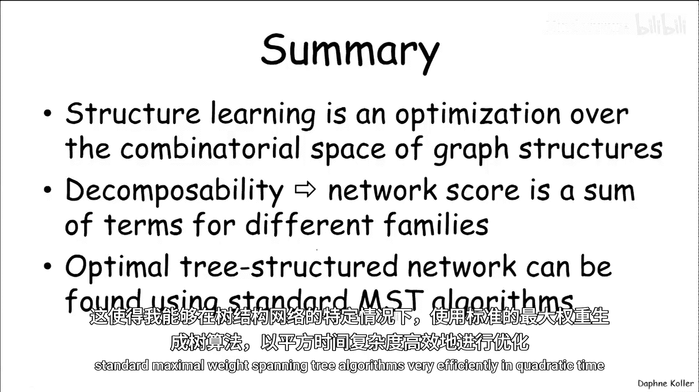

# 概率图模型：3：学习树结构网络 🌳

在本节课中，我们将学习如何为概率图模型学习最优的树结构网络。我们将从定义结构评分标准开始，然后探讨如何在所有可能的候选结构中优化这个评分，并首先聚焦于树结构这一特定情况。

## 概述

结构学习的目标是找到一个能最好地匹配数据的图结构。这是一个优化问题：输入是训练集、评分函数和可能的结构空间，输出是一个网络。计算效率的关键在于评分函数的**可分解性**，即评分可以分解为各个变量与其父节点组成的“家庭”的评分之和。

## 为什么学习树结构？ 🤔

我们首先关注学习**树**或**森林**的问题。森林是指每个变量最多有一个父节点的图，它可以是多个不连通的组件。而树则要求图是连通的。

尽管树的表达能力有限，但我们仍关注它，原因有三：
1.  **数学上的优雅性**：这带来了高效的优化算法。
2.  **计算的高效性**：即使对于高维问题，也能有效求解。
3.  **泛化能力强**：由于其参数化非常稀疏，树结构更不容易过拟合，尤其在数据量（M）相对于网络复杂度较小时，可能提供更好的泛化性能。

## 树结构学习的公式化 📝

我们引入符号：令 `P(i)` 表示变量 `Xi` 的父节点，若 `Xi` 无父节点，则 `P(i) = 0`。

对于一个可分解的评分函数（如似然、BIC或BDE评分），其总评分是各个家庭评分之和。对于树或森林，每个变量最多有一个父节点，因此总评分可以写为：

`总评分 = Σ_{i: P(i)≠0} [得分(Xi | P(i))] + Σ_{i: P(i)=0} [得分(Xi)]`

通过巧妙的数学变换，我们可以将这个表达式重写为：

`总评分 = 常数 + Σ_{i: P(i)≠0} [得分(Xi | P(i)) - 得分(Xi)]`

这里的“常数”部分对所有树结构都相同，不影响结构间的比较。因此，优化总评分等价于优化这个求和项。我们可以将其视为**边权重**的求和。

## 定义边权重与算法 🧮

基于上述推导，我们定义从节点 `i` 到节点 `j` 的边的权重为：

`W(i->j) = 得分(Xj | Xi) - 得分(Xj)`

这个权重衡量了将 `Xi` 设为 `Xj` 的父节点所带来的评分增益。

对于**评分等价**的评分函数（我们讨论的三种都是），可以证明 `W(i->j) = W(j->i)`。这意味着边的权重是无向的。此外，对于似然评分，这个权重正比于变量 `Xi` 和 `Xj` 之间的**互信息**，总是非负的。而对于BIC或BDE，权重可能为负，表示增加这条边可能因复杂度惩罚而降低总评分。

基于这些观察，我们得到以下高效算法：

1.  **构建无向加权图**：以所有变量为节点。对于每对变量 `(i, j)`，计算权重 `W_ij = max(得分(Xj | Xi) - 得分(Xj)， 0)`。取最大值是为了剔除负权重，便于后续优化。
2.  **寻找最大权重生成树**：使用标准的**最大权重生成树算法**（如Prim或Kruskal算法）在这个无向加权图上找到一棵树，使得所有边的权重之和最大。这是一个时间复杂度为 **O(n²)** 的高效过程。
3.  **生成最终森林**：如果算法结果中存在权重为0的边（它们源自原始计算中的负权重），则移除这些边。最终得到的可能是一个连通树，也可能是一个由多棵树组成的森林，这就是相对于评分函数的最优结构。

## 实例分析 🏥

以ICU警报网络为例。下图左侧是原始网络结构，右侧是应用上述树学习算法得到的结果。
*   红色边：在学到的树中存在，并且在原始网络中也存在。
*   蓝色边：在学到的树中存在，但**不在**原始网络中（伪边）。

这个例子说明，虽然学到的树中很多边确实反映了真实结构，但也会引入一些伪边。这些伪边通常源于原始网络中通过间接路径产生的变量相关性。此外，学到的树本质上是无向的，算法本身无法确定边的方向，即无法推断因果关系的前后顺序。

## 总结 🎯

本节课我们一起学习了概率图模型中树结构的学习方法：
1.  结构学习是一个在组合图空间上的优化问题。
2.  **评分函数的可分解性**是高效计算的关键，它将全局评分分解为局部家庭评分之和。
3.  对于**树或森林结构**，我们可以将优化问题转化为在无向加权图上寻找**最大权重生成树**的问题。
4.  利用标准的图算法（如Prim或Kruskal算法），我们可以在 **O(n²)** 的时间内找到全局最优的树结构，这适用于我们讨论过的所有评分等价标准（似然、BIC、BDE）。
5.  学到的树结构具有表达简洁、抗过拟合的优点，但可能无法捕获变量间所有的依赖关系，且边的方向性信息缺失。