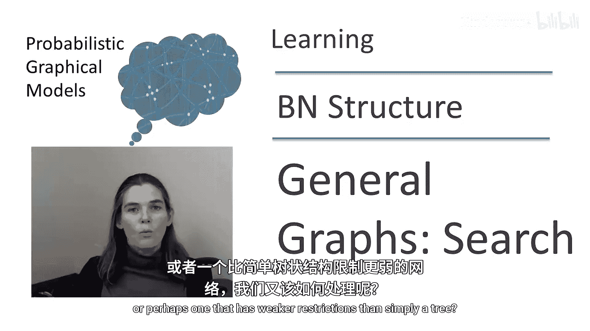
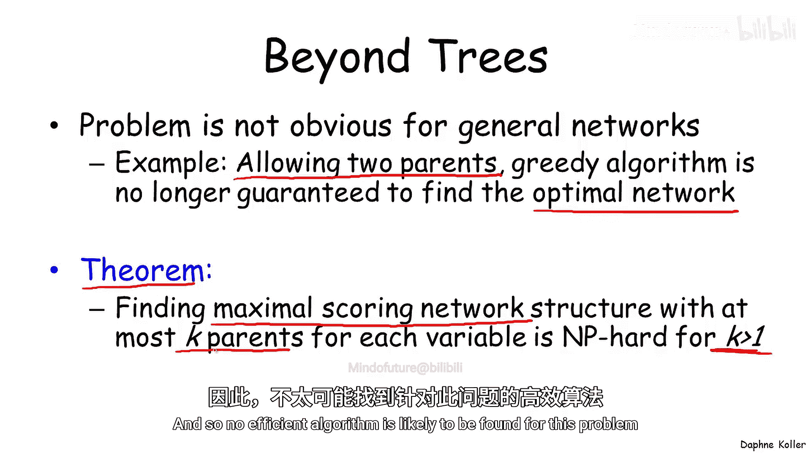
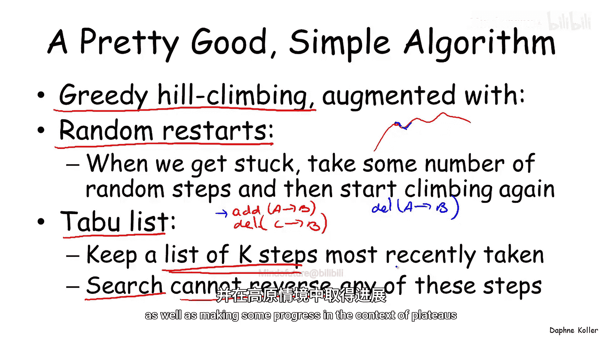
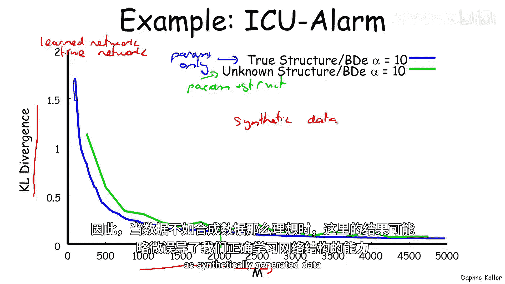
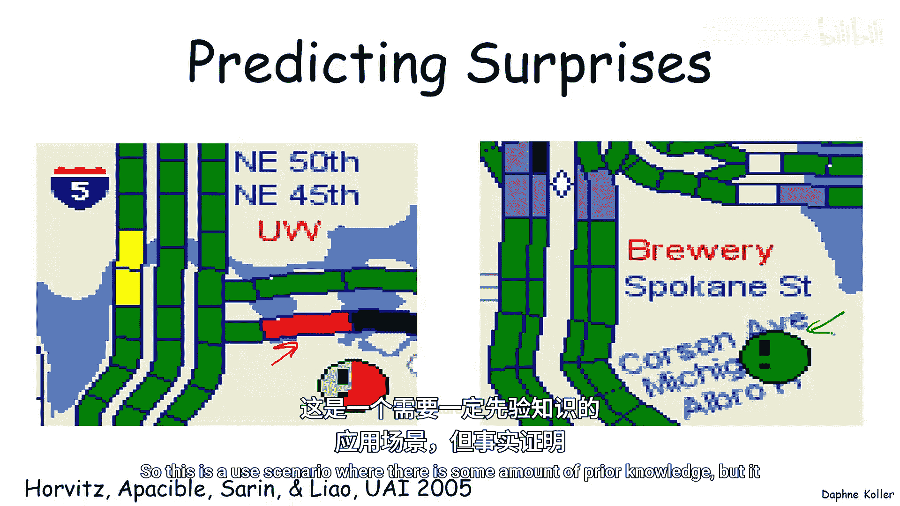
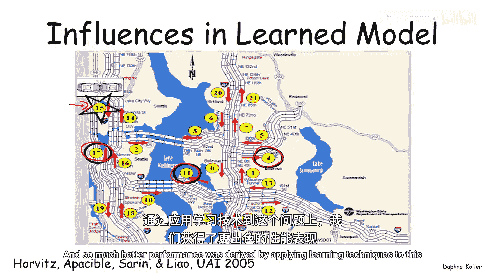
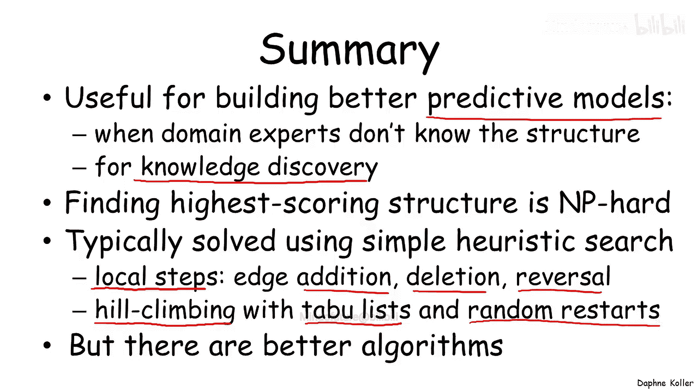

# 021：学习通用图-启发式搜索

## 概述
在本节课中，我们将要学习如何为通用贝叶斯网络结构（而不仅仅是树结构）寻找最优评分。我们将了解到这是一个NP难问题，因此需要采用启发式搜索方法，特别是贪婪爬山算法及其改进策略。

## 从树结构到通用图结构
上一节我们介绍了将贝叶斯网络结构学习视为一个优化问题，并将其分解为定义评分函数和设计优化算法两部分。我们讨论了当网络结构被限制为树或森林（每个变量至多有一个父节点）时，如何高效地解决此优化问题。

那么，当我们试图学习一个不受限制的网络，或者限制比树结构更宽松的网络时，该如何处理呢？

## 通用结构学习的挑战
我们的输入是一个训练集、一个评分函数以及一组可能的网络结构。期望的输出是在我们愿意考虑的结构集合中，能最大化评分的某个网络结构。

在树结构的背景下，我们可以应用一个简单的贪婪算法来寻找最大权重生成树。然而，对于更通用的网络，即使只允许每个节点最多有两个父节点，这种构建树的贪婪算法也不再有效，无法保证找到评分最优的网络。

事实上，一个简单算法无法解决此问题并不令人意外，因为有如下定理：对于任何大于1的K值，寻找具有最高评分、且每个节点最多有K个父节点的最佳网络是一个NP难问题。当K=1时，我们回到了树或森林的上下文，存在多项式时间算法。但对于K=2，问题就变成了NP难问题。因此，不太可能为此问题找到高效的算法。

## 启发式搜索：贪婪爬山法
那么，我们该怎么办呢？标准的解决方案是采用某种启发式的爬山搜索。

我们从一个当前网络开始（稍后会讨论如何初始化），然后考虑可以对该网络进行的各种修改。例如，我们可以考虑进行可能提高（也可能不提高）网络相对于评分的质量的局部扰动。

在设计启发式搜索算法时，有两个主要的设计选择需要决定：
1.  **操作符集合**：即我们可以采取的、将一个网络扰动为另一个网络的步骤集合。例如，我们刚才看到的例子中，我们采取了局部步骤：添加边、删除边或反转边。这些都是对网络相当小的扰动。也有算法使用更大的全局步骤，例如将整个节点从网络中取出并插入到其他地方，这种步骤成本更高，但在网络空间中移动的幅度也更大。
2.  **搜索技术**：我们最终使用哪种搜索技术？是使用所谓的“贪婪爬山法”（只求尽快向上爬升），还是采用其他类型的局部组合搜索算法（有很多种）？

让我们从讨论贪婪爬山法开始，它是当今使用的大多数贝叶斯网络学习算法的基础。

## 贪婪爬山法的工作原理
贪婪爬山法如何工作？
1.  **初始化**：从一个给定的网络开始。初始网络通常是空网络，因为空网络能引入稀疏性，避免网络过于复杂而导致过拟合。我们也可以从通过之前讨论的高效树学习算法得到的最佳树开始，或者从一个随机网络开始（这是一种更广泛探索空间的方式）。我们还可以从多个随机起点开始，或者在有领域专家知识的情况下，利用先验知识来初始化过程。
2.  **迭代改进**：初始化后，我们迭代地尝试改进网络。我们考虑基于我们定义为合法的操作符可以采取的不同步骤。然后，对于每个可能的改变，我们计算其得到的评分。
3.  **贪婪选择**：应用最能提高评分的那个改变。这就是“贪婪”的部分：我们查看所有可能的改变，并贪婪地选择最能提高评分的那个。
4.  **重复与终止**：这给了我们一个新的网络，然后我们可以再次考虑可以应用于这个新网络的下一步可能改变，并重复此过程。这个过程一直持续到我们“卡住”为止，即我们可用的所有修改都无法提高评分。当这种情况发生时，我们就到达了一个所谓的“局部最大值”，即网络空间中没有改变能导致评分提高的一个点。

## 贪婪爬山法的缺陷
这个贪婪爬山过程有哪些缺陷？
1.  **局部最大值**：这个局部最大值可能只是一个局部最优，而非全局最大值。如果我们从某个点开始，只采取小的爬山步骤，我们可能会到达一个相对于全局最大值来说非常差的局部最大值。
2.  **高原**：高原是指在我们周围有一大堆网络，它们的评分都基本相同。虽然某些方向可能在经过一定步数后最终通向一个“山峰”，但其他方向可能不会。问题在于，从评分的角度来看，所有方向看起来都一样，我们不知道应该朝哪个方向前进。这在贝叶斯网络结构学习中很常见，因为当你有一个网络时，通常存在许多与之等价的其他网络（例如，通过反转边得到的网络），它们具有相同的评分。在这些等价网络之间移动，不清楚哪一个最终会让我们跳出高原，进入一个评分更高的网络。

## 操作符选择：为什么需要边反转？
局部最大值和高原的问题也与我们使用的搜索操作符有关。我们讨论了边添加、边删除和边反转。有人可能会问，为什么我们需要边反转？毕竟，边反转可以通过先删除一条边再添加另一条边来替代。

这与我们搜索的贪婪性有关。考虑一个例子：假设有一个生成数据的真实图 G*，我们试图从中学习网络。我们从空网络开始，假设网络中A和C之间、B和C之间存在强相关性，并且B和C之间的相关性更强，因此我们先添加这条边。此时，从C到B的边和从B到C的边是完全对称的，这两个网络等价，评分相同。我们可以任意选择从C到B的边。然后，我们添加另一条边，比如从A到C。现在，从C到B的边是“错误”的，我们实际上希望反转它。但如果没有边反转操作，唯一的方法就是先删除那条边，然后再添加另一个方向的边。然而，删除那条边会在评分上造成很大损失，因为它原本是一条非常好的边。因此，删除它不是一个贪婪的（即评分提升的）步骤。如果我们没有边反转操作，这个带有从A到C和从C到B的边的网络就会成为一个局部最大值。除非我们有边反转步骤，否则仅通过一步贪婪搜索无法跳出这个局部最大值。因此，边反转是避免这些常见局部最大值的一种方法。但它并不能解决所有局部最大值，特别是那些更大的局部最大值。

## 改进策略：避免局部最优
那么，人们通常使用什么算法来解决这个问题而不陷入这些常见的局部最大值呢？

一个相当好且简单的算法是：我们确实使用贪婪爬山法，但用两种策略来增强它，以尝试避免局部最大值和高原。
1.  **随机重启**：如果你在爬升过程中卡住了，就采取一定数量的随机步骤，然后重新开始爬升。希望是，如果我们处在一个相对较浅的局部最大值，那么少量的随机步骤会将我们移入一个更好最大值的吸引区域，然后我们将继续爬升到一个更好的最优点。
2.  **禁忌表**：这是一种避免反复踏足同一区域的方法，对局部最大值和高原都有用。我们保存一份最近采取步骤的列表（禁忌表），并限制我们的搜索不能反转这些步骤。具体来说，如果“添加边A->B”在我们的禁忌表上，那么只要这个添加步骤还在最近步骤列表中，“删除边A->B”就是我们不可以做的操作。这迫使我们向前推进，而不是重复做同样的步骤、反转它、尝试另一个版本、再反转它。事实证明，这有助于避免局部最大值，也有助于在高原地带取得进展。

## 实践效果与应用
那么，这在实践中效果如何呢？首先看一个合成数据的例子：这是我们之前在贝叶斯网络参数估计中见过的ICU警报网络。这里展示了两种学习场景：蓝线（下方）是仅学习参数（给定真实结构）；绿线是同时尝试学习参数和结构。X轴是数据实例数量M，Y轴是学习到的网络与真实网络之间的距离（用KL散度或相对熵衡量）。我们可以看到，当只尝试学习参数时，至少在初始阶段（样本数较少时），性能更好。但随着数据越来越多，即使只有大约2000个样本，两者的性能已经非常接近。这表明结构学习问题本质上并不比单独的参数估计困难太多。

然而，这个结果需要谨慎看待，因为从合成数据（这里的数据是从网络生成的）中学习的问题实际上比从真实数据集中学习更容易。合成数据在相关性结构上具有更清晰、更强的信号。因此，这里的性能可能有点误导性，不能完全代表我们在数据不如合成数据“完美”时正确学习网络结构的能力。

尽管如此，在许多应用中，即使使用真实数据，贝叶斯网络结构学习也带来了显著优势。
*   **交通预测**：微软研究院的一个应用旨在预测交通堵塞的发生地点，以及可能出现比正常情况更少或更多交通的“意外”地点。该应用利用高速公路上的传感器数据，通过贝叶斯网络结构学习来预测没有传感器的路段以及未来30或60分钟的交通状况。学习到的网络揭示了不同路段、事故报告和时间等因素之间复杂的相互关系，其中一些相关性可能不是人类专家能轻易推断出来的，从而获得了更好的预测性能。
*   **科学发现**：另一个非常不同的应用是在科学发现领域。一个实验测量了单个细胞中不同蛋白质的水平，目标是发现一种蛋白质水平如何影响另一种蛋白质水平的调控机制。将贝叶斯网络学习应用于此问题，以尝试理解细胞内的调控网络。学习到的边中，许多（特别是标记为蓝色的）是文献中已知的，这验证了算法的有效性。更重要的是，一些学习到的边（标记为红色的）在文献中支持较弱或仅在其它细胞类型中已知，但在这个实验的B细胞中未被证实。其中一条边随后在湿实验室中被测试并发现同样存在于这些细胞中，揭示了不同生物通路之间的“串扰”。这是一个很好的例子，说明贝叶斯网络结构学习可以用于知识发现本身，而不仅仅是提高预测性能。

## 总结
本节课中我们一起学习了通用贝叶斯网络结构学习的启发式搜索方法。

我们了解到，在森林/树结构之外，寻找最高评分的网络结构是一个NP难问题，通常使用简单的启发式搜索来解决。最常用的是使用局部步骤（如边添加、删除或反转）来修改网络的贪婪爬山法。为了避免由此产生的局部最优，我们通常不仅使用简单的爬山法，还通过使用禁忌表（避免撤销最近的更改）和随机重启来修改它，以探索空间的不同部分。

虽然这是一个非常成功的策略，但实际上还有更好的算法，它们能在空间中同时进行更大的更改。这些算法计算成本更高，实现更困难，但可以在空间中实现更大的移动，因此，特别是在信号不明确的大型空间中，可以比简单的贪婪搜索找到更好的结构。