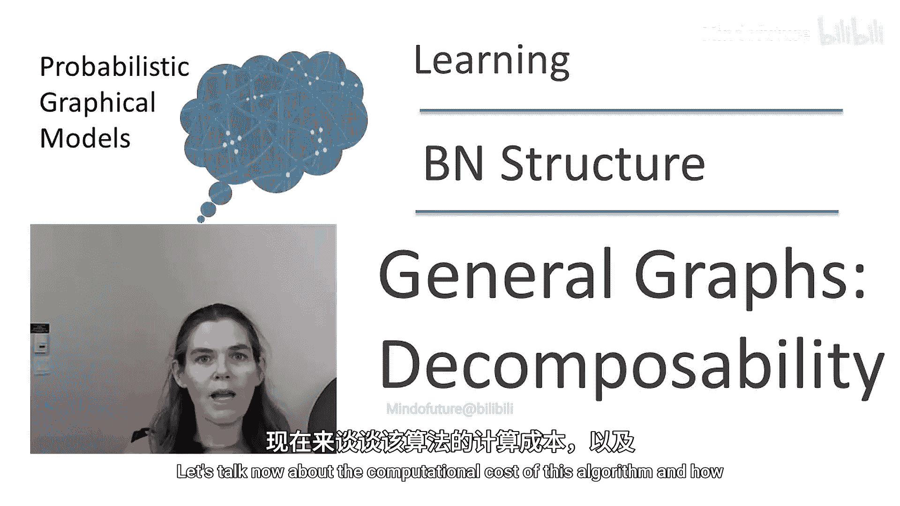
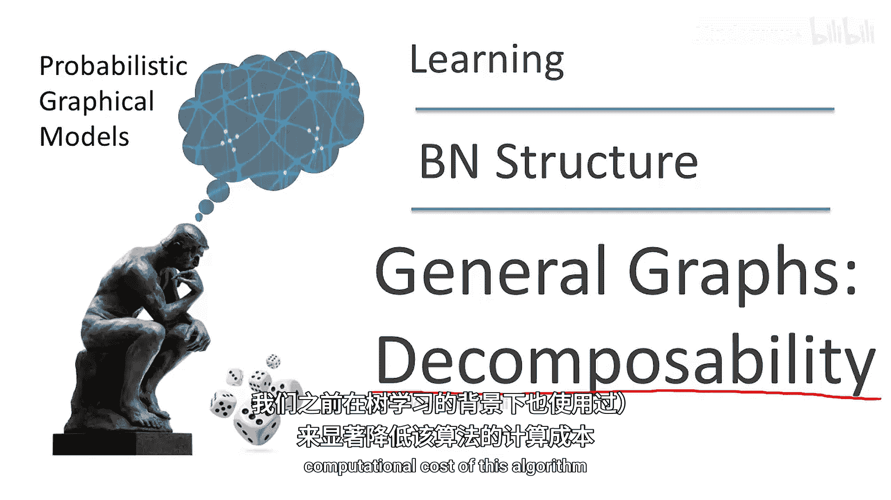
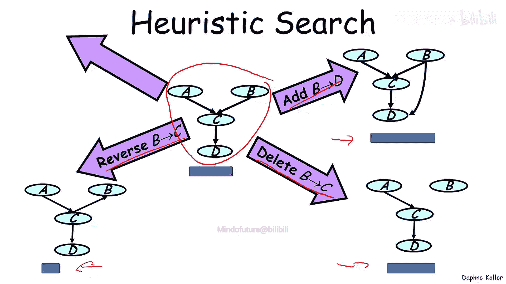
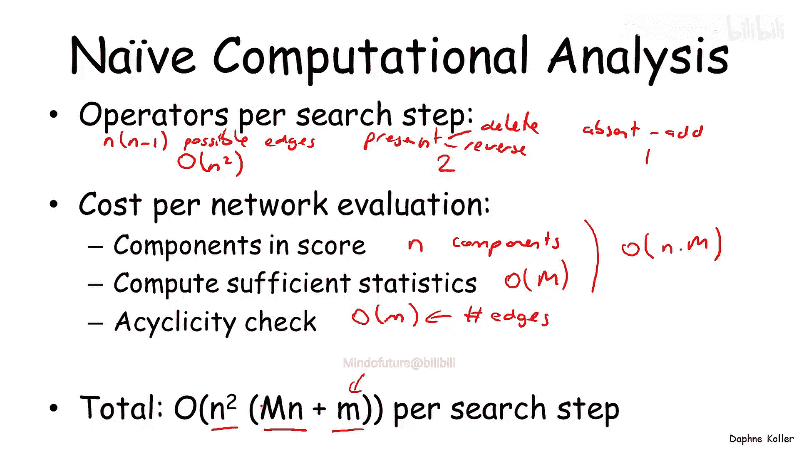
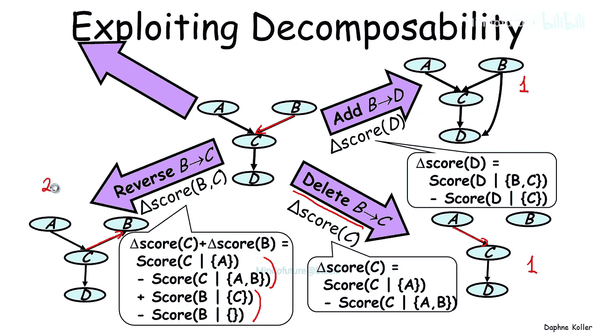
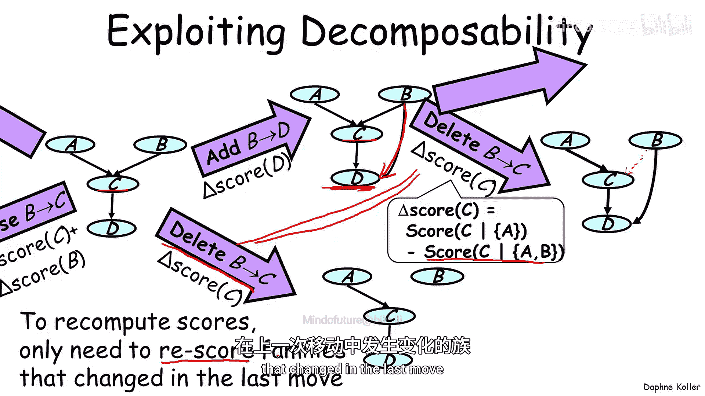
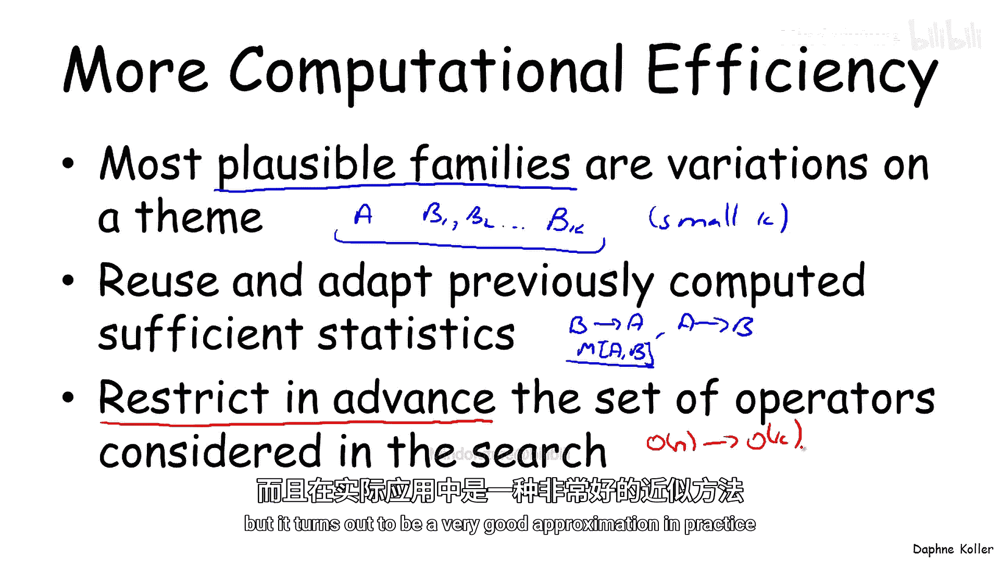
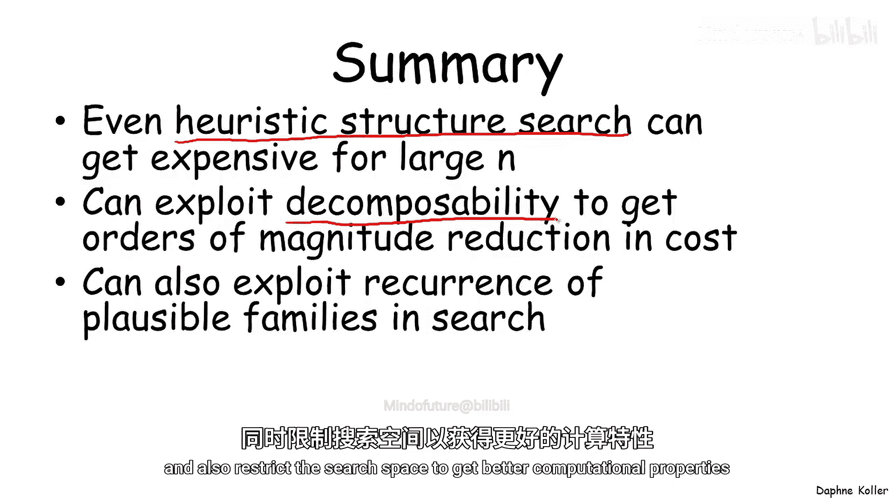

# 022：学习通用图-搜索与可分解性 🧠

在本节课中，我们将要学习如何将通用贝叶斯网络结构的学习问题视为一个组合优化问题，并探讨如何利用**可分解性**这一特性，来显著降低搜索算法的计算成本。

上一节我们介绍了将结构学习视为搜索问题，本节中我们来看看这个搜索算法的计算复杂度，以及如何通过优化来提升效率。

## 算法复杂度分析 🔍

首先，我们来分析一个朴素实现该搜索算法的计算成本。

以下是算法每一步需要评估的操作数量：
*   在一个包含 **N** 个节点的贝叶斯网络中，存在 **N × (N-1)** 条可能的边。
*   对于每条边，如果它存在于当前图中，我们可以**删除**或**反转**它；如果不存在，我们可以**添加**它。
*   因此，在算法的每一步，我们需要评估 **O(N²)** 个可能的操作。

接下来，评估每个候选后继网络（即应用一个操作后得到的新网络）的成本如下：
*   由于分数的**可分解性**，网络的总分是每个变量与其父节点构成的“家庭”分数之和，共有 **N** 个分量。
*   计算每个家庭分数需要遍历训练数据以获取充分统计量，这需要 **O(M)** 时间，其中 **M** 是训练实例的数量。
*   因此，评估一个网络需要 **O(N × M)** 时间。
*   此外，还需要检查操作后的图是否无环，这通常需要 **O(|E|)** 时间，其中 |E| 是图中的边数。

综合以上，**每个搜索步骤的总计算成本约为 O(N² × M × N)**，这在变量数（N）较大时会变得难以处理。

## 利用可分解性优化计算 💡

那么，我们如何改进呢？关键在于利用分数的**可分解性**。

考虑一个具体的操作，例如在原始网络中添加一条从 B 到 D 的边。原始网络的总分 `Score(G_original)` 可分解为：
`Score(G_original) = Score(A | ∅) + Score(B | ∅) + Score(C | {A, B}) + Score(D | {C})`

添加边 B→D 后，新网络 `G_new` 的分数为：
`Score(G_new) = Score(A | ∅) + Score(B | ∅) + Score(C | {A, B}) + Score(D | {C, B})`

我们可以发现，只有变量 D 的家庭分数发生了变化。因此，我们无需重新计算整个网络的分数，只需计算**分数差（Delta Score）**：
`Δ = Score(G_new) - Score(G_original) = Score(D | {C, B}) - Score(D | {C})`

这个 Δ 值仅涉及单个家庭（D 的家庭）的计算。

以下是不同操作的影响范围：
*   **添加边**：只影响**一个**家庭（子节点所在的家庭）。
*   **删除边**：只影响**一个**家庭（子节点所在的家庭）。
*   **反转边**：影响**两个**家庭（原父节点和原子节点各自的家庭）。

这意味着，在评估一个操作时，我们只需重新计算受影响的少数家庭，而不是整个网络，从而大幅降低了计算量。

## 在连续搜索步骤中缓存结果 🗂️

可分解性带来的第二个优化是在连续的搜索步骤中避免重复计算。

假设在上一步中，我们执行了添加边 B→D 的操作。现在，在下一步中，我们需要再次评估所有可能的操作，其中包括删除边 B→D。

请注意，这个“删除 B→D”的操作我们在上一步（添加边之前）已经评估过一次。更重要的是，在评估这个操作时，变量 D 的家庭构成（父节点集合）在上一步和当前这一步是相同的（都是 {B, C}）。因此，这个操作的 Δ 分数也完全相同，我们没有必要重新计算它。

总结来说：**我们只需要重新计算那些在上一步操作中发生了变化的家庭所涉及的 Δ 分数**。其他未受影响的操作的分数可以沿用之前计算的结果，无需更新。

## 优化后的成本与数据结构 🚀

综合以上优化，让我们重新评估计算成本。

**决定并执行一个移动后的成本**：一次移动通常只影响 1 到 2 个家庭。对于每个受影响的家庭，最多有 **O(N)** 条与之相关的边需要重新计算 Δ 分数。计算每个 Δ 需要 **O(M)** 时间。因此，这一步的成本是 **O(N × M)**，比朴素实现的 **O(N³ × M)** 降低了两个数量级。

**选择最佳移动的成本**：朴素方法需要遍历 **O(N²)** 个操作并计算分数。我们可以通过使用**优先队列**数据结构来优化：
*   我们维护一个按 Δ 分数排序的所有可能操作的优先队列。
*   当执行一步移动后，只有 **O(N)** 个受影响的操作的 Δ 分数需要更新。我们将它们从队列中取出，更新后重新插入。
*   更新和重新插入 **O(N)** 个元素到优先队列的成本是 **O(N log N)**。
*   此后，最佳操作始终位于队列顶端，可以在常数时间内取出。

这样，选择移动的成本从 **O(N²)** 降低到了 **O(N log N)**。

## 高级优化策略：缓存与剪枝 ⚡

基于另一个观察，我们可以获得更高的计算效率：在大多数网络学习算法中，合理的家庭结构（即哪些变量可能成为某个变量的父节点）是有限的、重复出现的。

以下是两种利用该特性的方法：
1.  **缓存充分统计量**：由于相同的家庭组合（如变量 A 和 B 同时作为某个家庭的成员）可能在搜索过程中多次出现，我们可以预先计算并缓存这些组合的充分统计量。当再次需要时，直接从缓存中读取，避免重复遍历整个数据集，这能极大降低计算成本。
2.  **限制候选父节点集**：对于每个变量，我们可以预先根据领域知识或简单启发式方法，确定一个较小的、合理的候选父节点集合（例如 K 个），而不是考虑所有其他 N-1 个变量。这样，需要评估的操作数量就从 **O(N)** 降到了 **O(K)**。虽然这是一种启发式剪枝，可能影响最终结果，但在实践中通常是一个很好的近似，能显著提升速度。

## 总结 📝

本节课中我们一起学习了如何优化贝叶斯网络结构搜索的计算效率。

*   朴素的结构搜索算法（如贪婪爬山法）在变量数 N 较大时，计算成本（**O(N³ × M)**）会变得非常高。
*   通过利用分数的**可分解性**，我们可以将计算集中在受局部操作影响的少数家庭上，并将成本降低到 **O(N × M)**。
*   在连续的搜索步骤中，我们可以避免为未变化的家庭重复计算分数差。
*   使用**优先队列**管理待评估操作，可以将选择最佳操作的成本从 **O(N²)** 降至 **O(N log N)**。
*   进一步的优化包括**缓存**常用的充分统计量，以及预先**剪枝**不合理的候选父节点，从而在实践中实现更高效的学习。

这些技术共同作用，使得学习大规模贝叶斯网络结构变得可行。