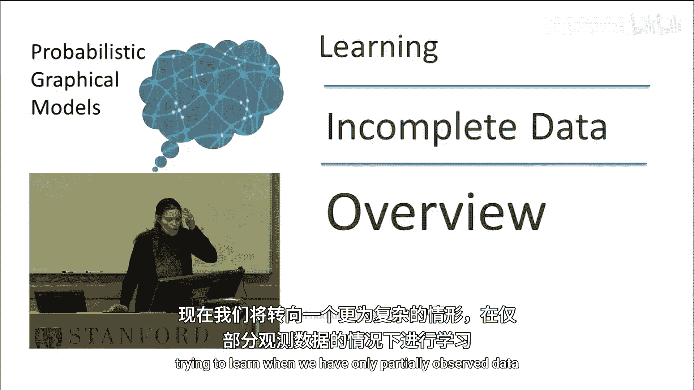
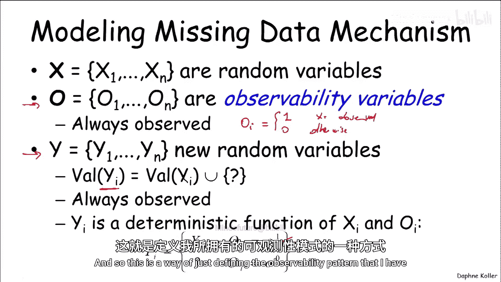
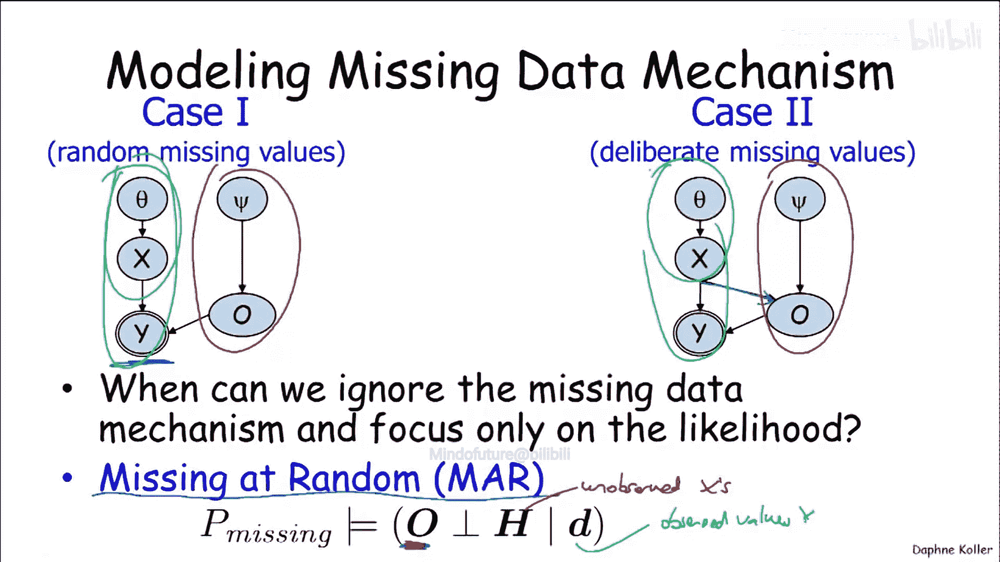
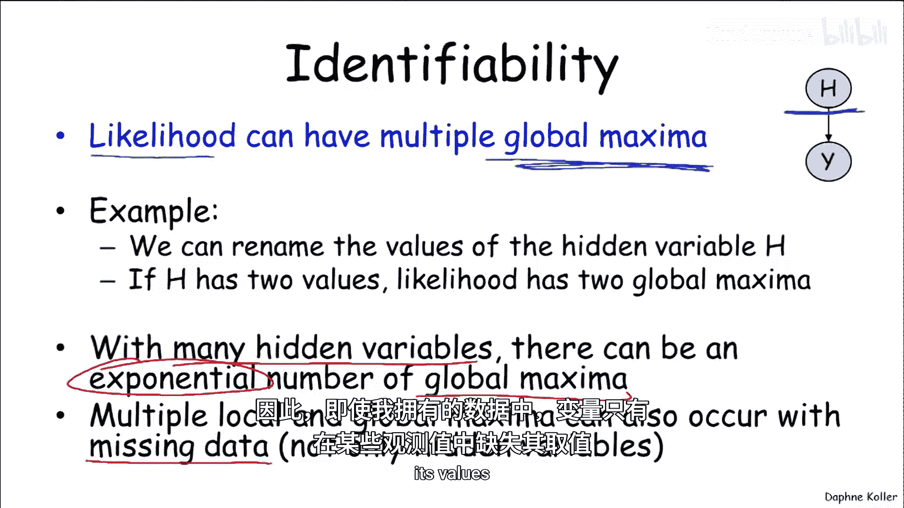
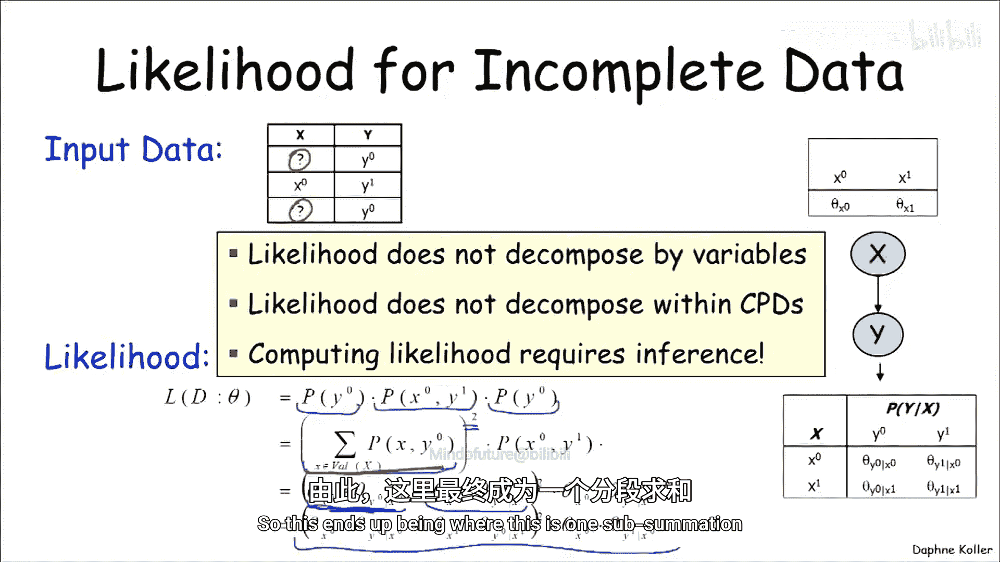
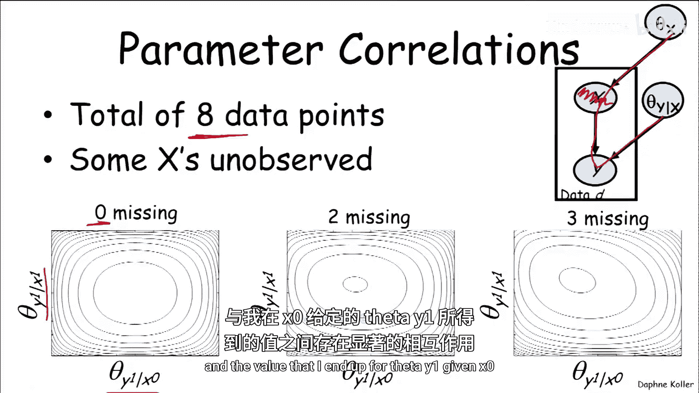

# 023：不完整数据学习概述 🧩

在本节课中，我们将要学习如何处理不完整数据下的模型学习问题。我们将探讨数据缺失的原因、如何形式化地描述缺失机制，并理解不完整数据给学习任务带来的核心挑战。

## 从完整数据到不完整数据 🔄

上一节我们介绍了从完整数据中学习模型结构和参数的方法。本节中，我们将转向一个更具挑战性的情境：当我们只有部分观测数据时，如何进行学习。

这种情况出现在多种场景中。例如，某些变量从未被观测到，它们是隐藏的或潜在的。此外，当某些测量未被执行时，也会出现数据缺失。

我们将看到，这些情境在学习任务的定义和计算层面都带来了显著挑战。

## 为何关注潜在变量？ 🤔

首先，我们来探讨为何需要关注潜在变量。

一个原因是，潜在变量通常能产生更稀疏、因而更容易学习的模型。假设我们有一个真实的网络 `G*`，其中包含一个潜在变量 `H` 和多个可观测变量 `X`、`Y`。如果 `H` 是潜在的，我们只能学习一个关于可观测变量的网络。这个新网络的结构会变得非常复杂，参数数量可能从17个激增至59个。因此，虽然学习包含潜在变量的模型本身有难度，但为了获得更简洁的模型，这种权衡可能是值得的。

另一个原因是，潜在变量本身可能具有意义，它们能帮助我们揭示数据中的有趣结构。例如，在处理人体扫描的3D点云数据时，我们希望发现点云中对应身体部位的聚类。每个点可以关联一个潜在变量，表示它属于哪个身体部位。

## 缺失数据的复杂性 🧩

理解了潜在变量的价值后，我们来看看缺失数据带来的复杂性。

假设我们得到一串数据序列，其中包含一些问号表示缺失值。如果我们不知道数据为何缺失，就无法正确处理它。

考虑两个不同的场景：
1.  实验者抛硬币，硬币偶尔掉到地上，实验者没有记录掉落时的结果。
2.  实验者抛硬币，但他不喜欢“反面”，因此有时不报告“反面”的结果。

在这两种情况下，如果我们想从数据集中学习，应该采用非常不同的估计方法。在第一种情况下，我们可以忽略问号，仅从观测到的序列（如 HTHH）中学习。在第二种情况下，我们不能忽略缺失的测量，因为它们本质上大多是“反面”，忽略它们会导致错误的估计。

因此，为了在不完整数据下正确学习，我们需要考虑数据缺失的机制。

## 如何建模缺失数据？ 📊

为了形式化地建模缺失数据，我们引入以下概念：
*   **模型变量 (X)**: 定义我们模型的随机变量集合。
*   **可观测性变量 (O)**: 总是被观测到的变量。`O_i = 1` 表示 `X_i` 被观测到，`O_i = 0` 表示未被观测到。
*   **观测值变量 (Y)**: 总是被观测到的变量。`Y_i` 的值域与 `X_i` 相同，但包含一个特殊值（如“？”）表示未观测到。

在真实场景中，我们观测到的是 `Y` 和 `O`，而 `X` 是未被观测到的。`Y` 是 `X` 和 `O` 的确定性函数：
`Y_i = X_i` （当 `O_i = 1` 时）
`Y_i = ?` （当 `O_i = 0` 时）

利用这些变量，我们可以建模之前提到的两种场景。在硬币掉落的场景中，可观测性模式 `O` 独立于硬币的真实值 `X`。而在实验者不喜欢反面的场景中，`X` 的值会影响 `O`（即是否被观测到）。

## 随机缺失假设 📉

那么，在什么情况下我们可以忽略缺失机制，只关注观测数据的似然呢？答案是当数据满足“随机缺失”假设时。

随机缺失意味着，在给定所有观测值 `Y` 的条件下，可观测性变量 `O` 与未观测到的变量 `H` 独立。也就是说，一旦你告诉我观测到了什么，某些值是否缺失这一事实本身不提供关于未观测变量的额外信息。

这个概念有些微妙。举个例子：病人去看医生，医生决定是否进行胸部X光检查。如果医生没做这个检查，这可能暗示病人没有咳嗽等症状，因此未观测到X光结果这一事实本身就提供了关于疾病（未观测变量）的信息，这不满足随机缺失。但是，如果病历中记录了病人的主诉是“腿部骨折”，那么在给定这个观测变量的条件下，是否进行X光检查的模式就不再提供关于肺结核等未观测疾病的信息，这就满足了随机缺失。

为了简化后续讨论，我们将默认假设数据是随机缺失的。

## 似然函数的挑战 🎯

不完整数据带来的下一个复杂之处在于，其似然函数可能具有多个全局最优解。

直观上，这几乎是显而易见的。如果一个潜在变量有值0和1，那么将0和1互换名称并相应地反转所有关联参数，会得到一个完全等价的模型。这意味着似然函数存在对称的“镜像”峰值。

当存在多个潜在变量时，问题会变得更糟，全局最优解的数量会随潜在变量数量呈指数级增长。即使只是部分数据点缺失某些变量的值，也可能导致多个局部和全局最优解。

为了更深入地理解，我们来比较完整数据和不完整数据情况下的似然函数。

对于一个简单的两变量模型 `X -> Y`，在完整数据情况下，其似然函数具有优美的分解形式，是各实例概率的乘积，取对数后变为参数的和，易于处理。

而在不完整数据情况下（例如 `X` 的值缺失），似然函数变为观测值 `Y` 的概率，这需要对 `X` 的所有可能取值求和。例如，`P(Y=0)` 等于 `P(X=0, Y=0) + P(X=1, Y=0)`。展开后，表达式包含了 `X` 的参数和 `Y|X` 的参数相乘再相加的形式。

这意味着：
1.  **似然函数不再按变量或CPD分解**：`X` 的参数和 `Y|X` 的参数出现在同一表达式中。
2.  **计算似然需要概率推断**：因为涉及对未观测变量的求和。
3.  **似然函数形态复杂**：不完整数据的整体似然函数是所有可能数据补全方式对应的似然函数之和。这些单独的似然函数可能是凹的，但它们的和会形成具有多个峰值的复杂形态。
4.  **参数间产生相关性**：在完整数据中，参数估计是独立的。但在不完整数据中，例如当 `X` 未观测时，选择 `P(X)` 的参数值会影响哪些数据实例被归为 `X=0` 或 `X=1`，从而影响 `P(Y|X=0)` 和 `P(Y|X=1)` 的估计，在它们之间引入了相关性。

## 总结 📝

本节课中，我们一起学习了不完整数据下的学习概述。

*   我们首先明确了不完整数据（包括潜在变量和随机缺失）在实践中非常普遍。
*   我们探讨了为何要关注潜在变量：它们可以带来更简洁的模型，并能揭示数据的内在结构。
*   我们认识到，正确处理缺失数据必须考虑其生成机制，并引入了“随机缺失”这一重要假设来简化问题。
*   最后，我们深入分析了不完整数据给似然函数带来的核心挑战：**多峰性**、**参数不可识别性**（存在多个等价最优解）以及**计算复杂性**（似然函数不再分解，且计算需要推断）。

这些挑战使得不完整数据下的学习成为一个困难但重要的问题，我们将在后续课程中探讨解决这些挑战的方法。