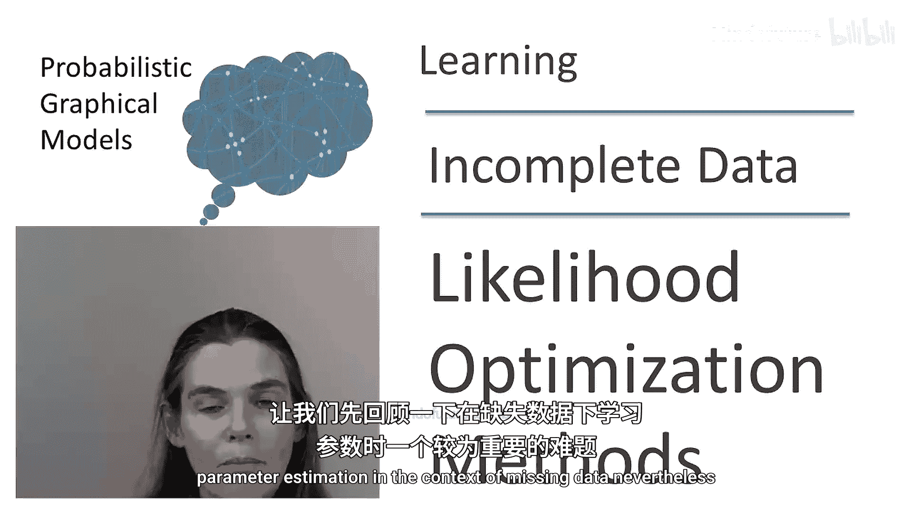
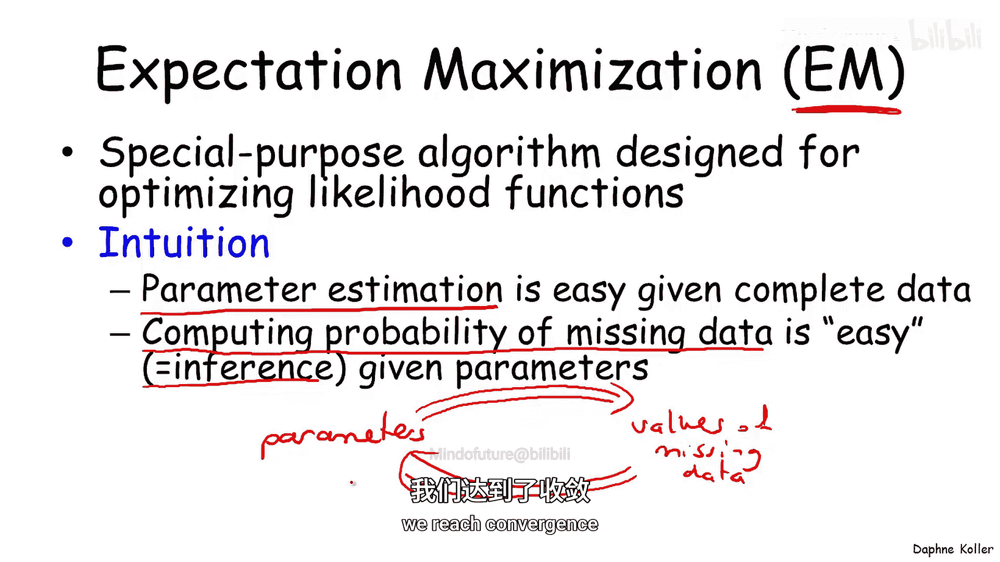
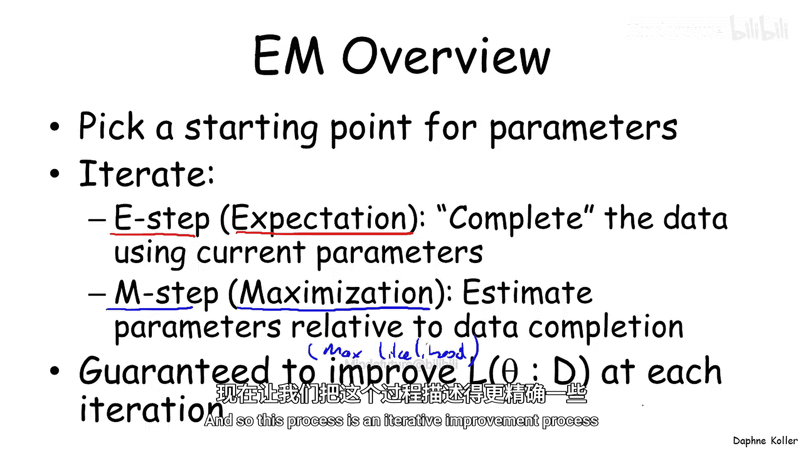
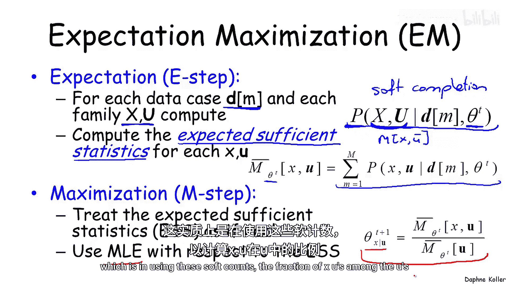
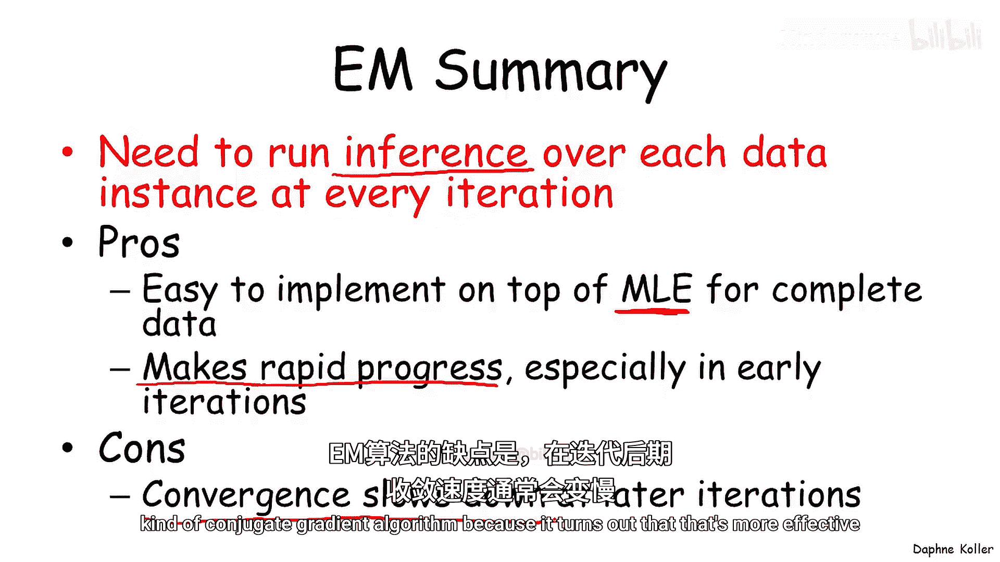

# 024：期望最大化算法简介

在本节课中，我们将要学习如何处理数据缺失情况下的模型学习问题，并重点介绍一种强大的迭代优化算法——期望最大化算法。

## 缺失数据下的学习难题

上一节我们讨论了存在缺失变量时模型学习的复杂性。本节中，我们来看看这种复杂性在参数估计中的具体表现。

缺失数据使得似然函数的形态变得非常复杂。在数据完整的情况下，似然函数通常是一个优美的对数凹函数，我们可以用简单的公式进行闭式求解。然而，当数据存在缺失时，似然函数会变成一个复杂的、多峰的函数，如下图所示，这使其无法直接优化求解。

## 优化策略一：梯度上升法 🧗

面对这种复杂的函数，一种通用的策略是使用梯度上升等优化方法。其基本思想是：从参数空间的一个初始点出发，计算该点的梯度（即函数上升最快的方向），然后沿该方向移动一小步，到达新的点。重复此过程，直到达到一个局部最优点。

为了提高收敛速度，可以使用更高效的方法，如线搜索或共轭梯度法。

在贝叶斯网络的背景下，我们可以推导出对数似然函数梯度的闭式解。对于一个特定的参数 `θ(x_i | u_i)`（例如，在多项式贝叶斯网络中，`x_i` 是节点 `X_i` 的一个取值，`u_i` 是其父节点的一个取值组合），其梯度公式如下：

**梯度公式：**
`∇θ(x_i|u_i) L(θ) = (1 / θ(x_i|u_i)) * Σ_m P_θ(X_i = x_i, U_i = u_i | o[m])`

其中，`L(θ)` 是对数似然函数，`o[m]` 是第 `m` 个数据实例中的观测值。我们需要对每个数据实例 `m` 和每个变量族 `(X_i, U_i)` 计算给定观测下该族取特定值的概率 `P_θ(X_i = x_i, U_i = u_i | o[m])`。

这意味着，在梯度上升的**每一次迭代**中，我们都需要为**每一个数据实例**运行一次概率推理，以计算这些后验概率。虽然由于族保持性质，一次校准（如团树传播）可以同时得到一个实例中所有变量族的概率，但计算成本依然很高。

以下是梯度上升法的优缺点分析：
*   **优点**：策略灵活，不仅适用于表格CPD，通过导数的链式法则也能扩展到非表格CPD。
*   **缺点**：
    1.  需要确保优化后的参数构成合法的概率分布（即所有值非负且和为1），这引入了约束优化问题。
    2.  为了获得良好的收敛性，通常不能使用简单的梯度上升，而需采用共轭梯度等更复杂的方法，进一步增加了计算成本。

## 优化策略二：期望最大化算法 🔄

第二种策略是专门为优化似然函数设计的算法，称为期望最大化算法。其核心直觉在于我们面临一个“鸡生蛋，蛋生鸡”的问题：
*   如果数据是完整的，那么参数估计很容易（我们有闭式解）。
*   如果参数是已知的，那么估计缺失数据的概率也很容易（这是一个定义明确的概率推理问题）。

EM算法通过迭代方式解决这个问题：从一组初始参数开始，交替执行以下两步，直到收敛。

### E步：计算期望

在E步中，我们利用当前参数 `θ^t` 来“补全”数据。注意，这是一种“软补全”，我们计算的是缺失变量的概率分布，而非一个硬赋值。

具体来说，对于每个数据实例 `d[m]` 和每个变量族 `(X, U)`，我们计算：
`P_θ^t (X=x, U=u | o[m])`
其中 `o[m]` 是实例 `m` 中的观测值。

然后，我们利用这些概率计算**期望充分统计量**。在数据完整时，充分统计量 `M(x,u)` 是看到组合 `(x,u)` 的次数。现在，我们使用期望计数：
**期望充分统计量公式：**
`M̂_θ^t (x, u) = Σ_m P_θ^t (X=x, U=u | o[m])`

### M步：最大化参数

在M步中，我们将上一步得到的期望充分统计量 `M̂_θ^t` 当作真实的充分统计量来使用，并据此进行最大似然估计。

例如，对于多项式贝叶斯网络，更新参数的公式为：
**参数更新公式：**
`θ^{t+1} (x|u) = M̂_θ^t (x, u) / M̂_θ^t (u)`
其中 `M̂_θ^t (u) = Σ_x M̂_θ^t (x, u)`。这实质上就是基于软计数计算条件概率。

## 实例：贝叶斯聚类 🧩

让我们通过一个简单的例子——贝叶斯聚类（或朴素贝叶斯模型）来具体说明。该模型有一个潜在的类变量 `C`（缺失）和多个观测特征 `X_i`。假设给定类别 `C` 后，所有特征相互独立。

在这个设定下，应用EM算法：
*   **E步**：计算每个数据实例属于每个类别的概率 `P_θ^t (C | x[1], ..., x[n])`，以及每个特征与类别共现的期望计数。
*   **M步**：使用这些软计数更新参数。
    *   更新类先验：`θ^{t+1}(c) = (Σ_m P_θ^t (C=c | o[m])) / M`
    *   更新特征似然：`θ^{t+1}(x_i | c) = (Σ_m P_θ^t (X_i=x_i, C=c | o[m])) / (Σ_m P_θ^t (C=c | o[m]))`

## 算法总结与对比 📊

与梯度上升法类似，EM算法在每次迭代中也需要为每个数据实例运行一次推理来计算后验概率。同样得益于族保持性质，一次校准即可获得所需的所有概率。

以下是EM算法的优缺点分析：
*   **优点**：
    1.  **易于实现**：可以在已有的完整数据最大似然估计程序基础上，增加一个计算期望统计量的E步即可实现。
    2.  **收敛迅速**：经验表明，EM算法在迭代初期能非常快速地提升似然函数值。
*   **缺点**：
    1.  **后期收敛慢**：在迭代后期，收敛速度可能会显著下降。
    2.  **可能陷入局部最优**：与梯度法一样，它找到的通常是局部最优解。

本节课中我们一起学习了处理含缺失数据参数估计的两种主要策略：通用的梯度上升法和专用的期望最大化算法。我们深入探讨了EM算法的两个步骤（E步和M步），理解了其如何通过迭代的“软补全”和参数更新来优化似然函数，并通过贝叶斯聚类的例子加深了理解。这两种算法都需要在每次迭代中进行概率推理，是解决不完全数据学习问题的核心工具。