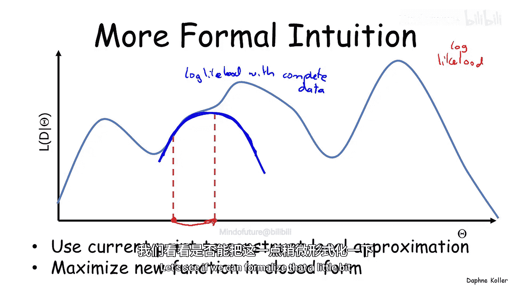
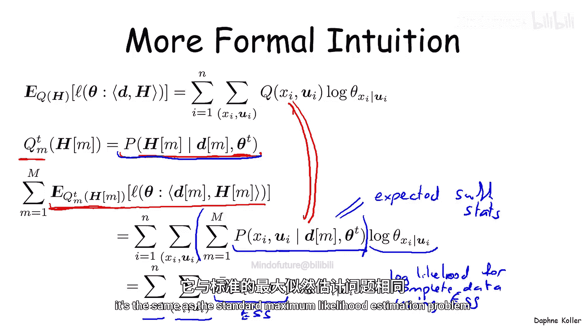
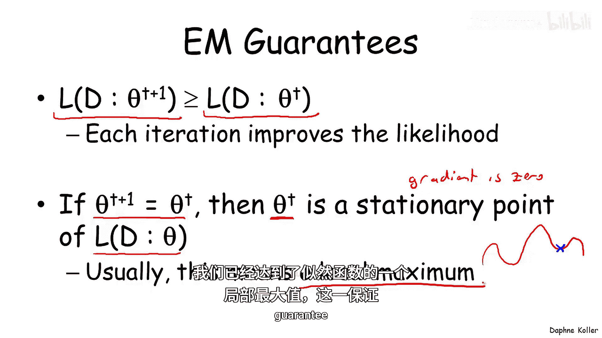

# 025：EM算法分析

在本节课中，我们将深入探讨期望最大化算法的理论基础。我们将了解EM算法为何有效，以及其背后的数学直觉。

---

上一节我们介绍了EM算法的基本流程。本节中，我们将从理论层面分析其工作原理，并理解算法中使用的公式是如何推导出来的。

EM算法与梯度上升法类似，也是一种局部搜索过程。但它使用了一种对似然函数“不那么局部”的近似。具体来说，如果我们有一个对数似然函数，梯度上升法会在当前点用一个**直线**（线性函数）来近似该函数。而EM算法则使用一个**曲线**函数来近似，这个曲线函数本身就是一个对数似然函数，更准确地说，是**完整数据**下的对数似然函数。构建了这个近似后，算法会跳转到这个近似函数的**最大值**点。由于这个近似函数是完整数据的对数似然，我们可以通过**最大似然估计**以闭式解的形式求出其最大值。这就是EM算法背后的核心直觉。

---

为了形式化这一直觉，我们从一个数据实例开始分析。设 **D** 为观测数据，**H** 为该实例中的隐变量。我们假设，通过某种方式，我们得到了隐变量 **H** 在该实例中可能取值的某个分布 **Q(H)**。

首先，让我们回顾一下当数据完整时（即观测到D和H），对数似然函数的形式。给定参数 **θ** 和数据对 **(D, H)**，对数似然函数可以分解为网络中所有变量的求和：

`L(θ; D, H) = Σ_i Σ_{x_i, u_i} 1{X_i = x_i, Pa_i = u_i} * log(θ_{x_i|u_i})`

这里，**1{...}** 是指示函数，当变量 **X_i** 及其父节点 **Pa_i** 在赋值 **(D, H)** 中分别取值为 **x_i** 和 **u_i** 时，其值为1，否则为0。我们以这种复杂形式书写，是为了后续推导的便利。

现在，我们考虑隐变量 **H** 的分布 **Q(H)**。我们来看这个对数似然函数相对于分布 **Q** 的**期望值**。由于期望的线性性质，我们可以将期望运算推进到求和内部：

`E_{H~Q}[L(θ; D, H)] = Σ_i Σ_{x_i, u_i} E_{H~Q}[1{X_i = x_i, Pa_i = u_i}] * log(θ_{x_i|u_i})`

关键的一步是简化这个期望。**指示函数的期望等于该事件发生的概率**。因此：

`E_{H~Q}[1{X_i = x_i, Pa_i = u_i}] = Q(X_i = x_i, Pa_i = u_i)`

于是，期望对数似然函数变为：

`E_{H~Q}[L(θ; D, H)] = Σ_i Σ_{x_i, u_i} Q(X_i = x_i, Pa_i = u_i) * log(θ_{x_i|u_i})`

---

接下来，我们考虑有多个数据实例的情况。对于第 **m** 个数据实例，我们使用**当前参数 θ^t** 来定义隐变量的分布，即后验概率 **Q_m^t(H) = P(H | D_m, θ^t)**。

我们对所有数据实例的期望对数似然进行求和：

`Σ_m E_{H~Q_m^t}[L(θ; D_m, H)] = Σ_i Σ_{x_i, u_i} [ Σ_m P(X_i = x_i, Pa_i = u_i | D_m, θ^t) ] * log(θ_{x_i|u_i})`

观察方括号内的求和项 `Σ_m P(X_i = x_i, Pa_i = u_i | D_m, θ^t)`，这正是我们在EM算法的E步中计算的**期望充分统计量**，记作 **\bar{M}[x_i, u_i]**。

因此，总期望对数似然函数可以重写为：

`Σ_m E_{H~Q_m^t}[L(θ; D_m, H)] = Σ_i Σ_{x_i, u_i} \bar{M}[x_i, u_i] * log(θ_{x_i|u_i})`

这个形式非常重要。它**完全等同于一个完整数据下的对数似然函数**，只不过使用的是**期望充分统计量** 而非实际计数。我们知道如何最大化这种形式的函数——其最优解就是标准的最大似然估计解：

`θ_{x_i|u_i}^{t+1} = \bar{M}[x_i, u_i] / Σ_{x_i'} \bar{M}[x_i', u_i]`

这正是EM算法的M步。

---

回到最初的图示，那个蓝色的近似曲线就是**期望对数似然函数**。E步通过计算期望充分统计量来构建这个函数，而M步则通过最大化它来得到新的参数估计 **θ^{t+1}**，从而进入下一次迭代。

基于这种理解，我们可以证明关于EM算法的两个重要性质：

以下是EM算法的两个关键性质：
1.  **单调性**：在每次迭代中，似然函数（或对数似然函数）都不会下降。即 `L(θ^{t+1}) ≥ L(θ^t)`。
2.  **收敛性**：当算法收敛时，即参数不再变化（`θ^{t+1} = θ^t`），那么 **θ^t** 是似然函数的一个**驻点**（梯度为零的点）。虽然理论上驻点可能是局部极小值、局部极大值或鞍点，但在实践中，由于EM算法是一种爬山过程，几乎不可能恰好收敛到一个局部极小值。因此，当算法收敛时，我们通常可以认为找到了一个**局部极大值**。这与梯度下降法所能提供的保证是类似的。

---

本节课中我们一起学习了EM算法的理论分析。我们了解到，EM算法通过构建并最大化一个期望对数似然函数（即完整数据似然的近似）来迭代优化参数。E步负责计算期望充分统计量以构建这个函数，而M步则通过闭式解最大化它。我们还证明了算法具有单调收敛到局部最优解的良好性质。