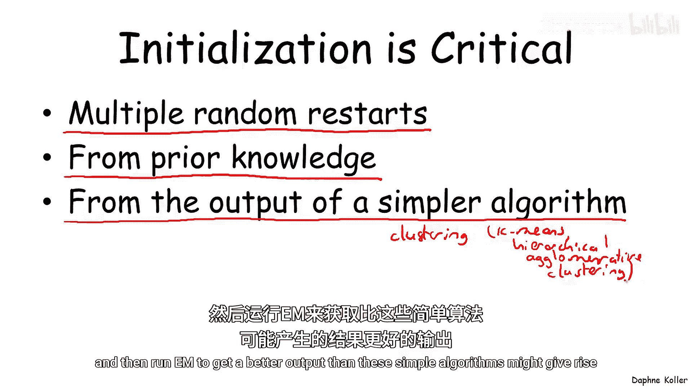
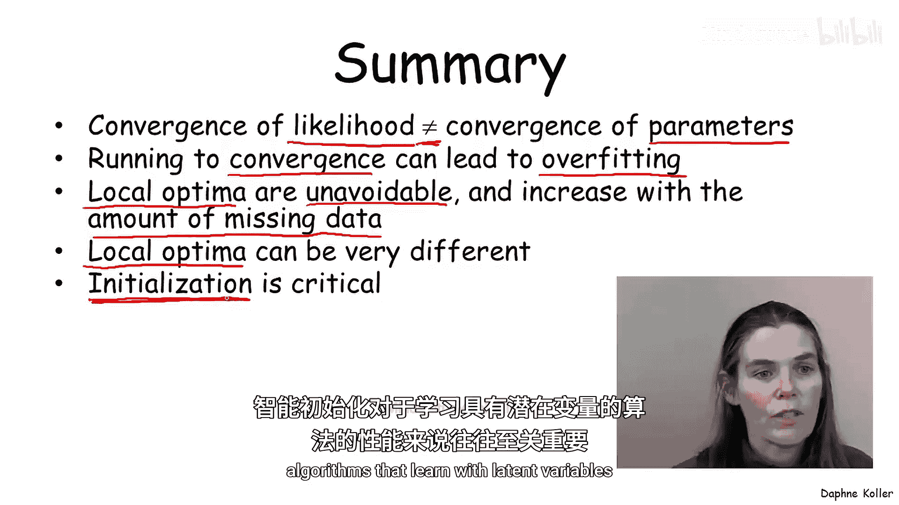

# 概率图形模型3：学习：P26：实践中的EM算法

在本节课中，我们将探讨期望最大化（EM）算法在实际应用中的表现。我们将分析其收敛行为、可能遇到的问题以及相应的解决策略。

上一节我们介绍了EM算法的公式，本节中我们来看看它在实践中的具体表现。

## 收敛行为分析

首先，让我们观察EM算法在迭代过程中的行为。下图展示了迭代次数（横轴）与平均训练实例的对数似然（纵轴）之间的关系。

观察发现，对数似然值随着迭代次数单调递增，这验证了EM算法的理论性质。然而，在迭代初期（如前8-10次），对数似然值提升非常迅速，之后增速则显著放缓。

我们可能会认为，当迭代到第10次左右，对数似然不再显著增加时，算法就已收敛，可以停止。但实际情况并非如此简单。

## 参数空间与似然空间

下图展示了同一模型下，迭代次数与不同模型参数值的变化关系。

可以看到，尽管在第10次迭代后，对数似然（左图）不再明显改善，但参数空间（右图）中的多个参数值却发生了剧烈变化。例如，蓝色参数值显著下降，而黑色参数值显著上升。

这表明，**似然空间的收敛并不等同于参数空间的收敛**。因此，在评估算法收敛时，我们可能需要同时关注参数空间的变化。

## 过拟合问题

继续运行EM算法直至完全收敛并不总是最佳选择。下图左侧再次展示了训练集上的对数似然，右侧则展示了在未参与训练的测试集上的对数似然。

测试集的对数似然在迭代初期（约10次前）也快速上升，但之后便开始逐渐下降。这意味着，当算法继续微调参数以略微提升训练集似然时，实际上可能对训练数据中的噪声进行了过拟合，导致模型在未见数据上的性能下降。

为了避免这种数值过拟合，主要有两种策略：

以下是两种主要的解决策略：
1.  **使用验证集或交叉验证**：通过监测验证集上的对数似然来确定最佳停止迭代次数 `T`。当验证集性能开始下降时便停止迭代。这种方法计算成本较高，因为需要在测试实例上运行推断。
2.  **使用MAP估计而非MLE**：与完整数据情况下的估计类似，引入先验可以平滑参数估计，使其对训练数据中的噪声不那么敏感。公式表示为：`θ_MAP = argmax_θ P(θ|D) = argmax_θ P(D|θ)P(θ)`。

## 局部最优问题

EM算法和梯度上升法一样，通常只能找到对数似然函数的局部最优解。

下图展示了在不同训练样本量 `m`（横轴）下，算法从25个不同随机起点运行后找到的 distinct 局部最优解的数量（纵轴）。

*   蓝线代表25%数据随机缺失的情况。
*   红线代表50%数据随机缺失的情况。
*   黑线代表存在一个完全不可观测的隐变量的情况。

观察发现：
*   在数据缺失的情况下（蓝、红线），初始时局部最优解数量很多，几乎每次运行都找到一个不同的解。但随着训练数据量增加，算法能更好地识别出全局结构，主导的局部最优解数量减少。
*   **缺失数据越多**（比较红线和蓝线），减少局部最优解数量的过程就越慢。
*   当存在**隐变量**时（黑线），无论有多少数据，局部最优解问题始终存在。

## 局部最优的影响

局部最优并非无关紧要。下图展示了不同EM运行最终达到的训练集对数似然值的分布。

可以看到，不同运行最终达到的对数似然值差异巨大。这意味着，**算法收敛到哪个局部最优解，会显著影响其最终性能**。

因此，**初始化策略对EM这类算法的性能至关重要**。

以下是几种常见的初始化策略：
1.  **多重随机重启**：从多个随机初始参数点开始运行EM，选择最终训练对数似然最高的那次运行。
2.  **利用先验知识**：如果有关于参数或变量赋值（例如，实例到聚类的分配）的先验知识，可以用来初始化算法。
3.  **使用更简单的算法初始化**：EM算法功能强大，但也更容易陷入某些局部最优。可以先使用更简单、对局部最优不那么敏感的算法进行初始化，例如在聚类问题中使用K-means或层次凝聚聚类算法，然后再运行EM进行优化。

## 总结

本节课中我们一起学习了EM算法在实际应用中的关键问题：
1.  对数似然函数的收敛不等同于参数空间的收敛，评估收敛需谨慎。
2.  运行至完全收敛可能导致数值过拟合，可采用早停或MAP估计来缓解。
3.  局部最优问题无法避免，且**缺失数据越多，局部最优越多**；但增加数据量有助于缓解此问题（隐变量情况除外）。
4.  不同的局部最优解会导致性能差异显著，因此**智能的初始化策略**对于学习含隐变量或缺失数据的模型至关重要。

