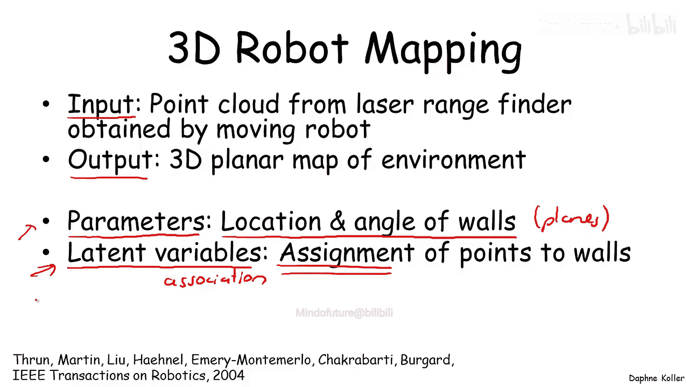
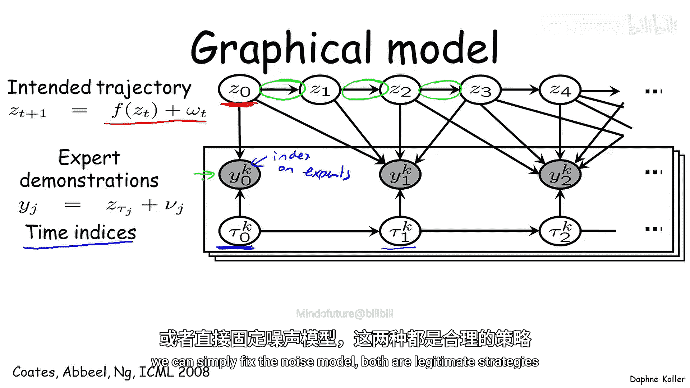
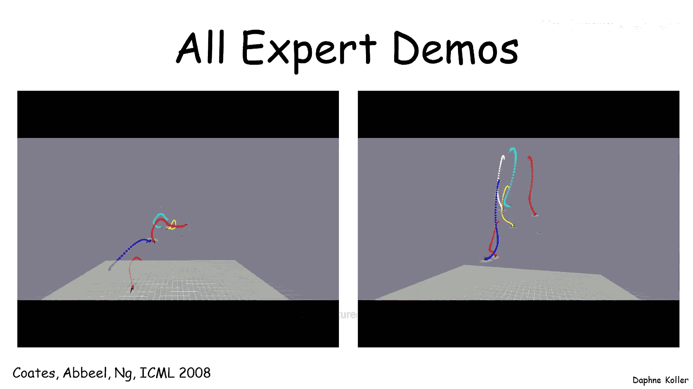
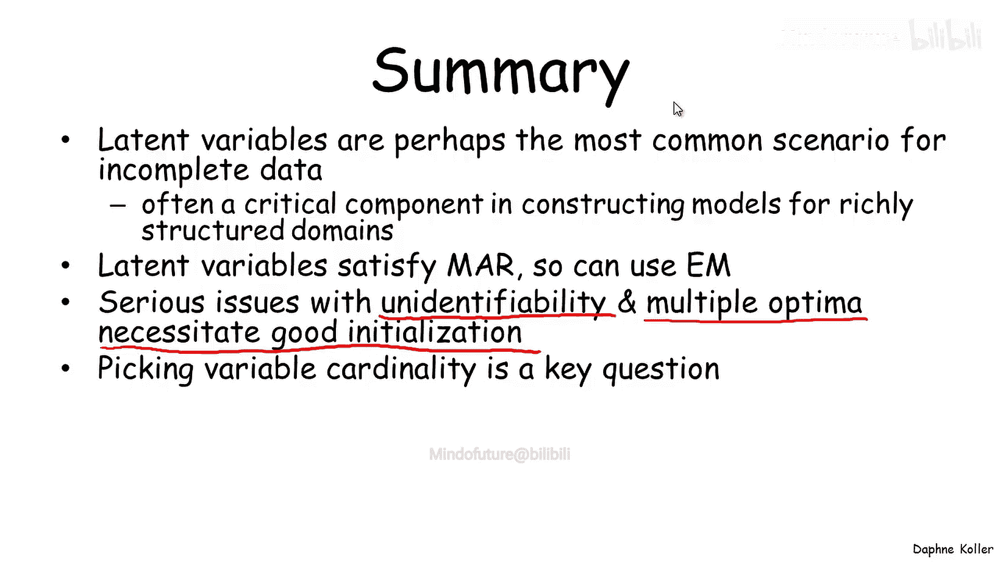

# 斯坦福概率图模型3：学习：P27：潜在变量应用与挑战 🎯

在本节课中，我们将学习期望最大化算法最常见的应用场景：处理包含潜在变量的学习问题。潜在变量是指那些我们永远无法直接观测到，但对于捕捉数据分布中重要潜在结构至关重要的变量。我们将通过多个具体例子，探讨EM算法如何在这些场景中应用，并讨论相关的挑战。

## 潜在变量应用实例 📊

上一节我们介绍了EM算法的基本原理，本节中我们来看看它在不同领域的实际应用。以下是几个典型的例子，展示了潜在变量模型如何帮助我们理解复杂数据。

### 贝叶斯聚类

一个最简单的例子是贝叶斯聚类。在这个场景中，我们有一个潜在的类别变量和一组可观测的特征。我们的目标是将数据实例分割成不同的类别，并假设每个类别内的观测特征具有相似的分布。在许多应用中，这个分布采用朴素贝叶斯模型的形式，即**给定类别后，特征之间相互独立**。

一个具体的应用是用户分群。例如，微软研究院的Jack Breze及其同事对MSNBC网站用户进行了分群，依据是用户点击了网站上的哪些新闻故事。以下是分析得到的四个用户群：

*   **商业与技术读者群**：这个群体的用户最可能点击关于商业和技术的文章，例如关于电子邮件投递或DVD播放器购买的新闻。
*   **体育新闻读者群**：这个群体的用户主要点击体育类故事。
*   **头条新闻读者群**：占用户总数的29%，主要点击网站首页推广的头条新闻。
*   **全站浏览读者群**：这个群体令人意外，他们会在整个网站浏览，寻找各种“软新闻”。这个发现对网站重新设计以更好地服务这类用户具有启示意义。

### 语音识别

一个非常不同的应用是语音识别。我们之前讨论过，语音识别的标准表示是隐马尔可夫模型。在HMM中，我们有隐藏变量和参数。

*   **参数**：HMM的参数，例如音素间的转移概率，或对应于不同音素或其内部状态的声学观测概率。
*   **潜在变量**：将连续的声学信号分割成属于哪个音素、以及音素内哪个状态的部分。这些是隐藏变量，并且数量巨大。

为了训练一个良好的语音识别HMM，标准策略是自底向上的引导训练：首先使用音素数据库为每个音素单独训练音素HMM。这一步同样需要使用EM算法，因为音素内部到其构成部分的分解是没有标签的。训练好单个音素模型后，可以用它们来初始化更高级别的词模型训练，并在整个词训练的过程中继续优化音素HMM参数。这种良好的参数初始化能让E步中的分割相对正确，从而在语音识别问题中找到更好的局部最优解。

### 3D机器人地图构建

另一个应用是3D机器人地图构建。这个问题的输入是由移动机器人上的激光测距仪收集的一系列点云数据，目标输出是环境的一组平面构成的3D地图。

*   **模型参数**：环境中墙壁或平面的位置和角度。
*   **潜在变量**：将每个数据点关联到特定墙壁的分配变量。

EM算法在此有效工作：在E步，它确定哪些点属于哪面墙；在M步，它调整墙的位置以更好地拟合分配给它的点。通过处理原始嘈杂的点云数据，EM算法能构建出比原始数据合理得多、真实得多的环境平面地图。

### 人体姿态与骨架重建

还有一个应用是在3D激光扫描的背景下，从不同姿态的人体扫描数据中重建3D骨架。这里的一个关键问题是，将每次扫描中的点聚类分配到不同的身体部位。

*   **聚类（部位）**：每个部位在多次扫描（同一人的不同姿态）中都有一个变换。如果我们知道点的部位分配（这是一个潜在的未观测变量），我们就可以预测这个点在两次扫描间如何变换。
*   **挑战与改进**：如果仅基于点本身进行聚类，效果很差，因为肌肉变形会引入噪声。但如果在模型中**加入空间邻接性的软约束**（这实际上是一个关联性的马尔可夫随机场约束），让相邻的点更可能被分配到同一个部位，那么聚类效果会显著提升。EM算法能很好地收敛，将点清晰地划分到不同部位，从而易于重建骨架。

### 直升机特技轨迹对齐

最后一个使用不同EM模型的应用是直升机特技演示轨迹对齐。输入是不同飞行员尝试完成的同一特技动作的不同轨迹，目标是**对齐这些轨迹**，并同时学习目标或模板轨迹的概率模型。

这可以表示为一个图模型：有一个潜在的意图轨迹（Z），以及模型参数（状态转移概率）。专家演示的观测是意图轨迹的噪声版本。但我们不知道每个观测点对应意图轨迹中的哪个时间点，因此引入了另一组潜在变量——时间索引（τ），它表示在某个演示时间点，专家处于意图轨迹的哪个状态。

这个问题可以用EM算法求解，其中有两组潜在变量（τ和Z）和一组模型参数。通过EM对齐，原本发散的不同飞行员轨迹能够很好地对齐，从而更容易学习到一个统一的模型，用于控制直升机飞出正确的轨迹。

## 潜在变量基数选择 🤔

关于潜在变量的一个重要问题是其取值数量（基数）的选择。这在前面提到的许多应用中都是隐含存在的，例如，我们应该有多少个用户群？一个音素应该分成多少段？

如果我们用似然度来评估模型，那么拥有更多潜在变量取值的模型总是会得到更高的似然度，因为它是一个表达能力更强的模型，这会导致过拟合。我们可以像在其他结构学习算法中一样，通过使用惩罚复杂度的评分函数来规避这个问题，例如BIC评分。不过BIC倾向于欠拟合，因此人们为不完备数据背景下的贝叶斯评分提出了多种扩展（通常是近似方法），这些方法在实践中往往比BIC效果更好。

还有其他策略：
*   使用**聚类一致性度量**的启发式探索算法：如果某个聚类内部不一致，则分裂它；如果两个聚类非常相似，则合并它们。
*   基于**贝叶斯技术**的方法：近年来非常流行，例如狄利克雷过程。这类方法不是为潜在变量选择一个固定的基数，而是**维护一个关于基数的分布**，然后使用像马尔可夫链蒙特卡洛这样的采样技术对不同基数进行平均。处理潜在变量基数选择问题通常是学习潜在变量模型时需要应对的较棘手问题之一。

## 总结 📝

本节课中我们一起学习了潜在变量在概率图模型学习中的关键作用。潜在变量是学习不完备数据时最常见的场景之一。当我们想要为结构丰富的领域构建模型时，引入这些潜在变量对于模型的成功至关重要。

我们了解到，潜在变量满足“随机缺失”的假设，因此期望最大化算法在此适用，并且被广泛用于优化潜在变量模型。然而，我们也再次认识到，在学习潜在变量模型时，我们会面临模型不可识别性以及存在多个最优解（通常甚至是彼此对称的）的严重问题，这凸显了良好初始化策略的重要性。最后，我们探讨了为潜在变量选择合适基数这一关键问题，以及近年来为解决该问题所发展的多种方法。