# 概率图模型：3.7.1：学习算法综述与实用指南 🧠

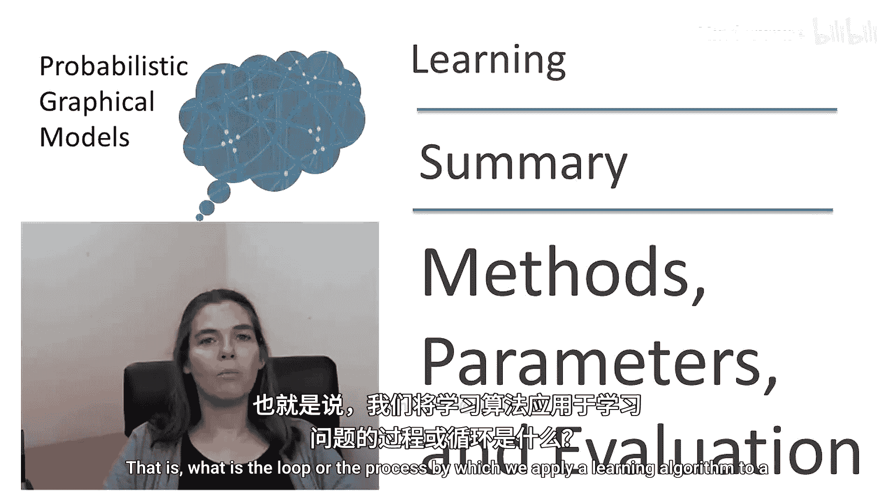

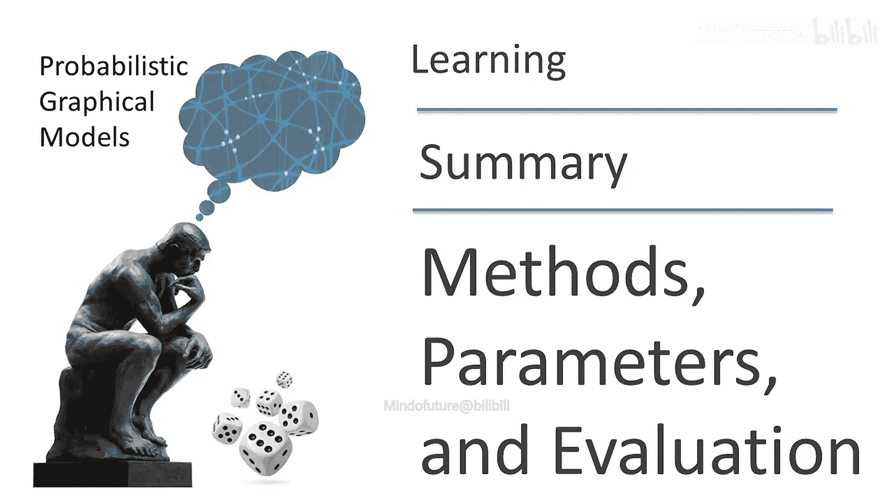

## 概述
在本节课中，我们将回顾并整合之前讨论过的多种学习算法，理解它们如何构成一个完整的机器学习流程。我们将从假设空间、目标函数和优化算法三个核心组件出发，探讨如何在实际问题中应用这些方法，并学习如何诊断和解决常见的模型错误。

---

## 假设空间：我们搜索什么 🔍

上一节我们回顾了学习算法的整体框架，本节中我们来看看第一个核心组件——假设空间。假设空间定义了我们要搜索的模型类别。

它主要包含两个可搜索的部分：
1.  **参数**：模型的连续数值部分。
2.  **结构**：模型的离散部分，例如图模型中的边。

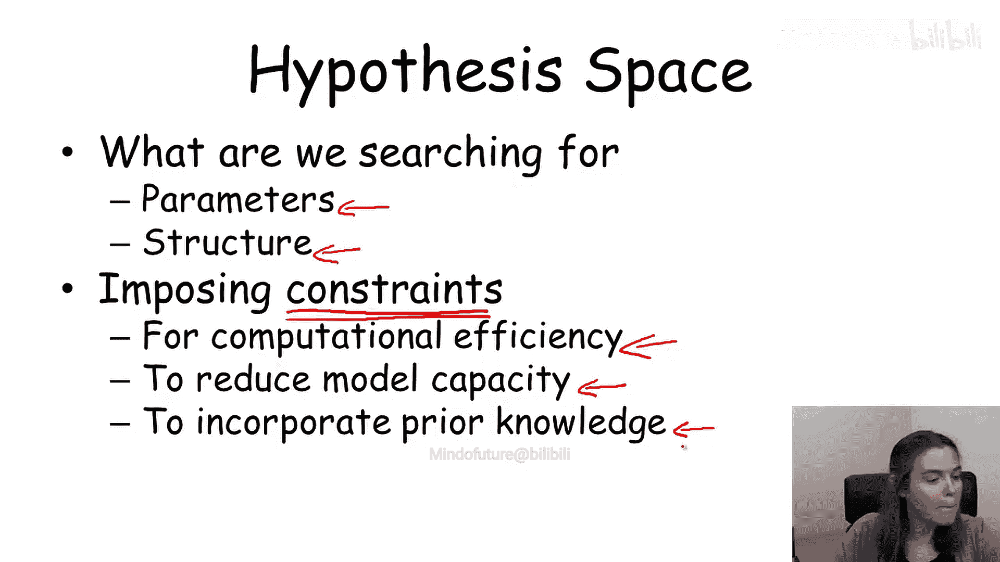

根据搜索对象的不同，学习问题性质也不同：
*   搜索参数是**连续**优化问题。
*   搜索结构是**离散**优化问题。
*   同时搜索两者是**混合**优化问题。

此外，我们通常会对假设空间施加约束，原因有三：
*   **计算效率**：更小的搜索空间通常更容易处理。
*   **降低模型容量**：限制模型复杂度，以**减少过拟合风险**。
*   **融入先验知识**：引导学习算法找到更合理的模型。

---

## 目标函数：我们优化什么 📈

上一节我们定义了搜索空间，本节中我们来看看指导搜索的目标函数。最常用的目标函数是**惩罚似然**。

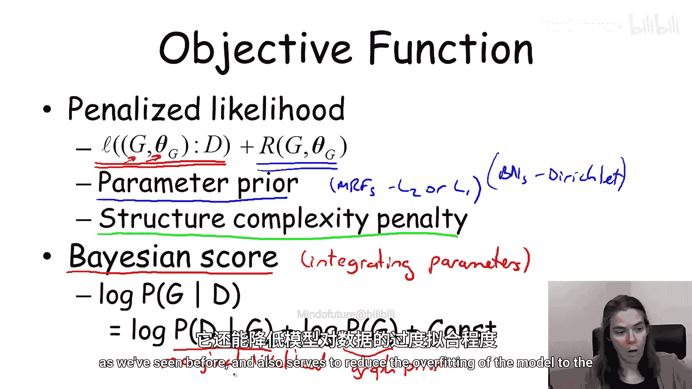

其公式为：
`目标函数 = 对数似然 + 正则化项`

*   **对数似然**：衡量模型（结构和参数）对训练数据的拟合程度。
*   **正则化项**：引导模型选择更简单、不易过拟合的配置。它包含两种形式：
    1.  **参数先验**：例如，在马尔可夫随机场中使用L2或L1正则，在贝叶斯网络中使用狄利克雷先验。它们的作用是平滑参数。
    2.  **结构复杂度惩罚**：当搜索结构时，惩罚具有更多边或参数的复杂模型。

另一种范式是**贝叶斯评分**，适用于仅搜索图结构并对参数积分的情况。

其公式为：
`log P(G | D) = log P(D | G) + log P(G)`

其中：
*   `log P(D | G)` 是**边际似然**，其内部已包含对参数的规则化。
*   `log P(G)` 是图先验，作为对结构的正则化项。

---

## 优化算法：如何找到最优解 ⚙️

确定了搜索空间和目标后，我们需要合适的优化算法。算法的选择取决于搜索空间（连续/离散）和目标函数的性质。

以下是针对不同情况的优化方法：

**连续空间优化**
*   **闭式解**：对于具有多项式条件概率分布的贝叶斯网络，参数的最大似然估计有闭式解。
*   **梯度上升**：当无法获得闭式解时（如MRF学习、含缺失数据的学习），使用梯度上升或其变体（如共轭梯度、LBFGS）进行迭代优化。
*   **期望最大化**：专门用于处理含缺失数据时，对数似然函数存在多峰情况的优化。

**离散空间优化**
*   **精确高效算法**：对于树结构，最大权重生成树算法能在多项式时间内找到最优解。
*   **局部爬山法**：对于更复杂的结构空间，通常采用添加、删除、反转边等局部操作进行启发式搜索。

**混合空间优化**
同时优化参数和结构通常计算代价高昂，因为每次结构变动都需要重新优化参数来评估该变动的好坏。

---

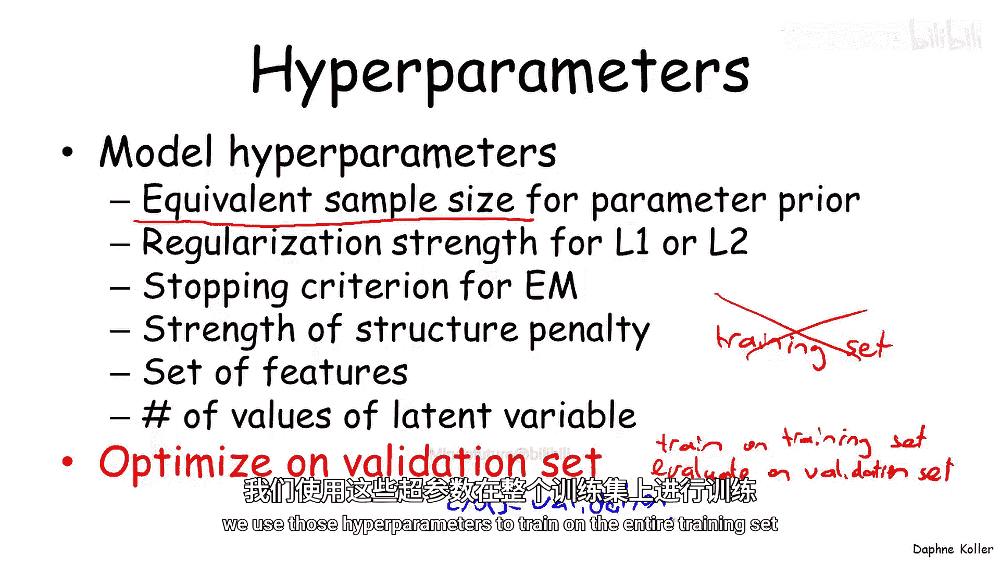

## 超参数选择与模型评估 🎯

每个学习算法都有一组需要预先设定的**超参数**。例如：
*   狄利克雷先验的等效样本量。
*   正则化强度（L1/L2）。
*   EM算法的停止准则。
*   结构惩罚的强度。
*   隐变量的取值数量（如聚类数）。

**重要原则**：**不应**在训练集上选择超参数，这会导致过拟合。

以下是正确的超参数选择与模型评估流程：

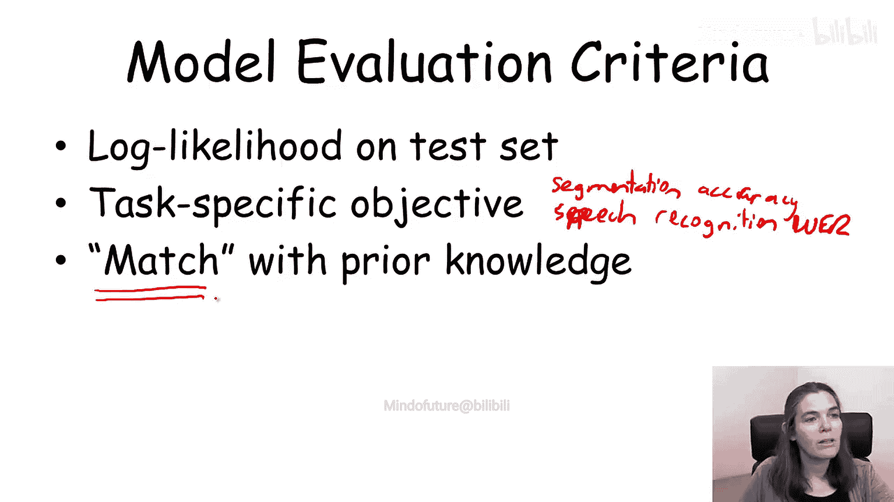

**超参数选择方法**
1.  将数据分为**训练集**、**验证集**和**测试集**。
2.  在训练集上用不同超参数训练模型。
3.  在验证集上评估模型性能。
4.  选择在验证集上性能最佳的超参数组合。
5.  为更稳健，可使用**交叉验证**：多次划分训练/验证集，选取平均性能最好的超参数，最后用全部训练数据重新训练。

**模型评估标准**
*   **测试集对数似然**：衡量模型对未知数据的预测能力。
*   **任务特定指标**：如图像分割的准确率、语音识别的词错误率。优化最终任务指标通常能获得更好性能。
*   **知识发现一致性**：检查学习到的模型（如聚类结果、网络结构）是否与领域先验知识相符，可作为合理性检验。

---

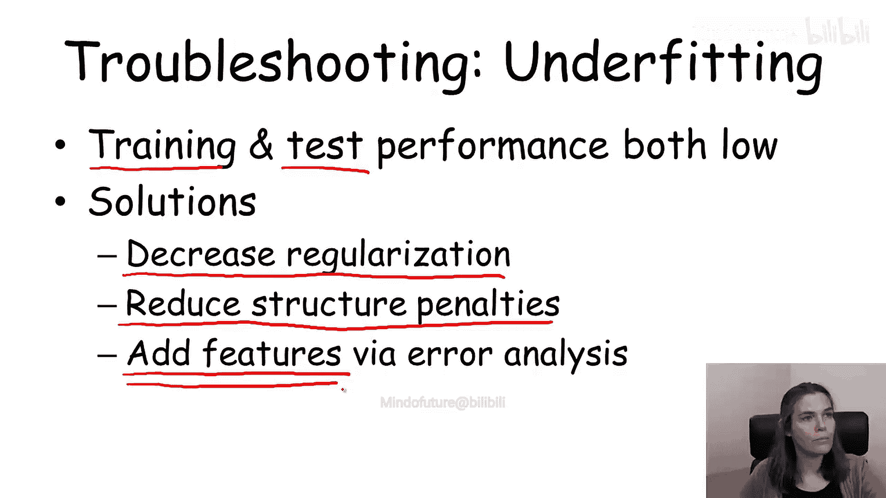

## 常见错误模式诊断与修复 🩺

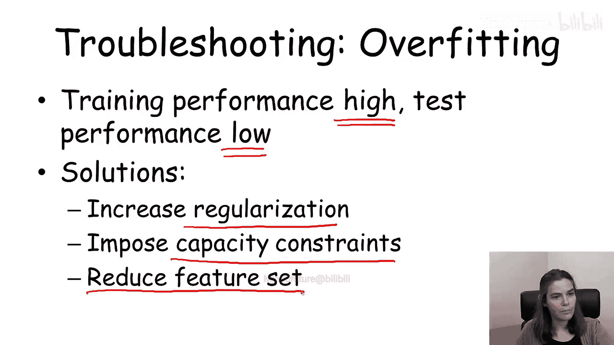

在模型开发过程中，识别和修复错误模式至关重要。以下是几种典型情况：

**欠拟合**
*   **诊断**：训练性能和测试性能都**低**。表明模型表达能力不足，无法捕捉数据中的模式。
*   **修复方案**：
    *   减少正则化强度。
    *   降低结构惩罚，允许学习更多边和交互。
    *   **增加特征**：通过误差分析，针对模型出错的实例添加能改进预测的特征。

**过拟合**
*   **诊断**：训练性能**高**，但测试性能**低**。表明模型拟合了训练数据中的噪声。
*   **修复方案**：
    *   增加正则化强度。
    *   施加模型容量约束（如限制模型类别）。
    *   减少特征数量，降低模型复杂度。

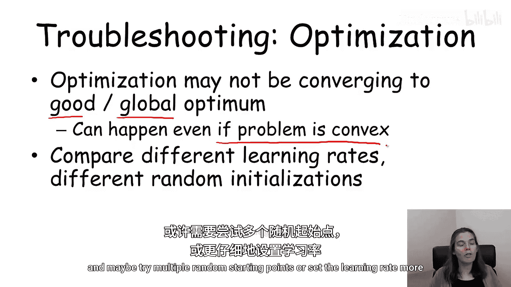

**优化失败**
*   **诊断**：优化算法未找到目标函数的良好解。可能由于多峰问题陷入局部最优，或学习率设置不当无法收敛。
*   **修复方案**：尝试不同的学习率、不同的随机初始化，比较目标函数值。若结果差异大，需尝试多个起始点或更仔细地设置优化参数。

**目标函数失配**
*   **诊断**：模型A的目标函数值优于模型B，但模型A在真正关心的性能指标（如分割准确率）上却差于模型B。
*   **修复方案**：**重新设计目标函数**，使其更好地匹配最终的性能评价指标。切勿试图通过“破坏”优化算法来弥补目标函数的缺陷。

---

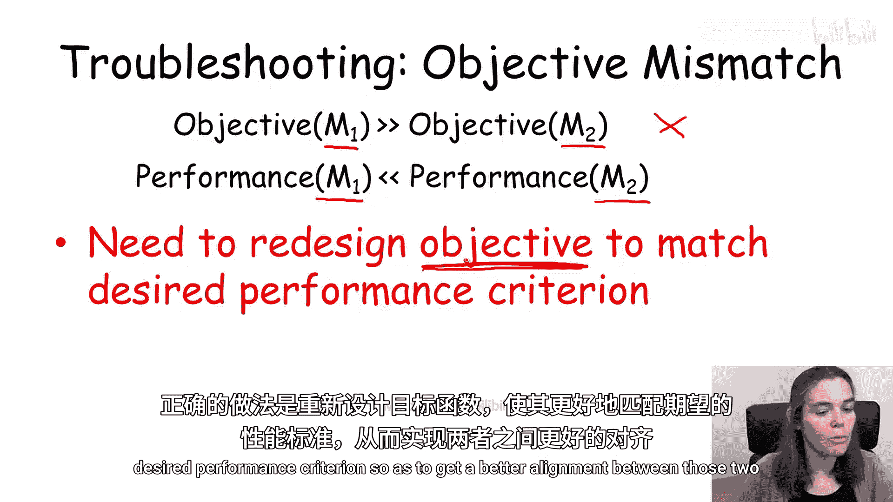

## 总结：实践中的机器学习流程 🔄

本节课中，我们一起学习了如何将概率图模型的学习算法整合到一个完整的实践流程中。

一个典型的机器学习循环如下：
1.  **设计模型模板**：确定变量、模型类型（有向/无向）、特征类型等。
2.  **通过交叉验证选择超参数**：在训练集上进行。
3.  **用选定超参数训练模型**：在完整训练集上进行。
4.  **在保留集上评估性能**：诊断是否存在欠拟合、过拟合等错误模式。
5.  **进行误差分析并迭代**：根据错误类型，重新设计模型、目标函数或优化算法，然后回到步骤1。
6.  **在独立测试集上报告最终结果**：**仅当**模型开发完成后，才在从未参与过任何调整的独立测试集上评估性能，以获得对模型泛化能力的无偏估计。

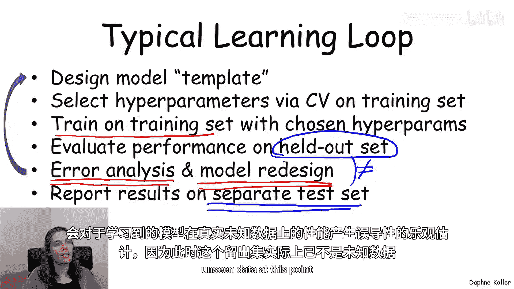

记住，保留集在流程中已被用于指导模型选择，因此不能代表真正的“未见数据”。