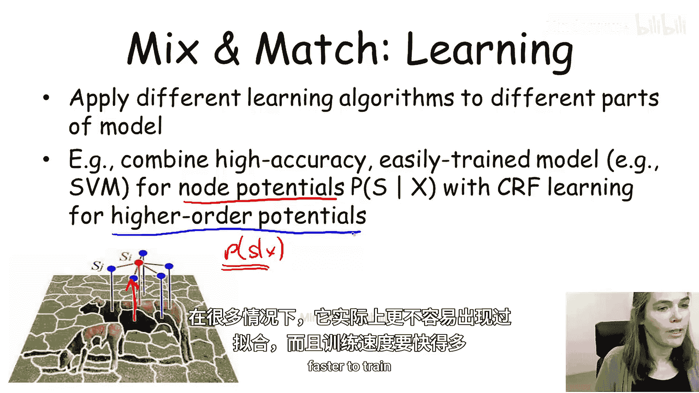
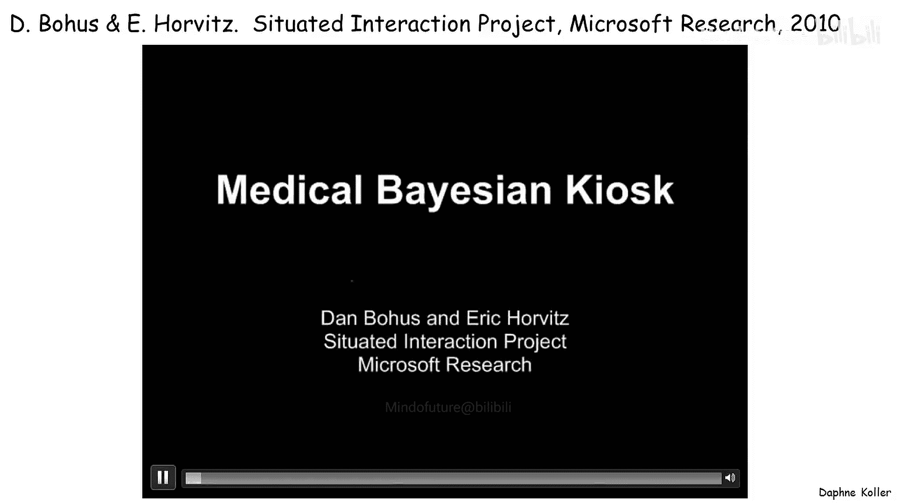
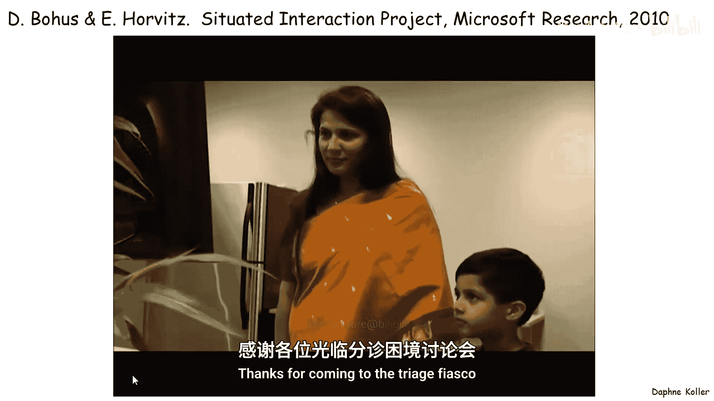
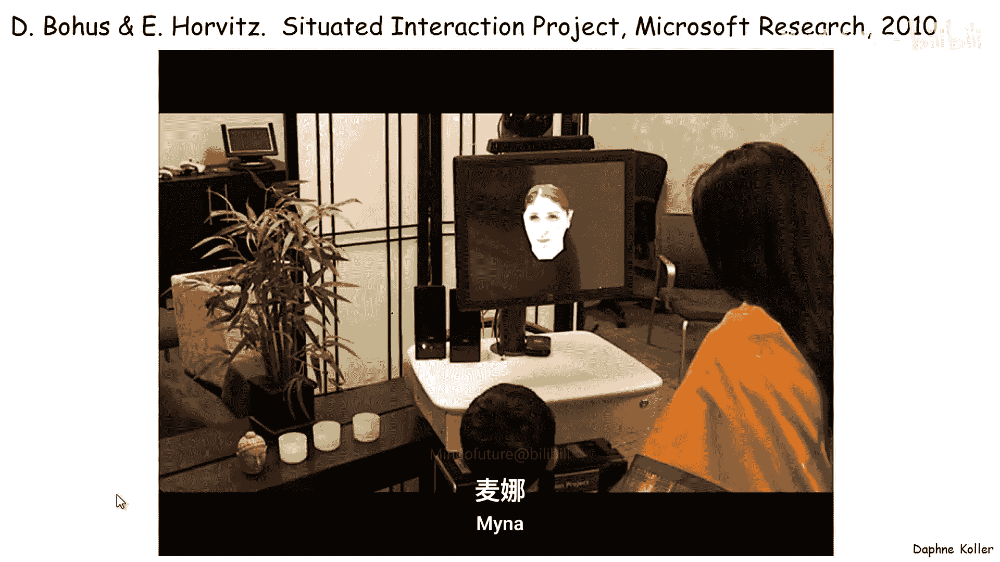
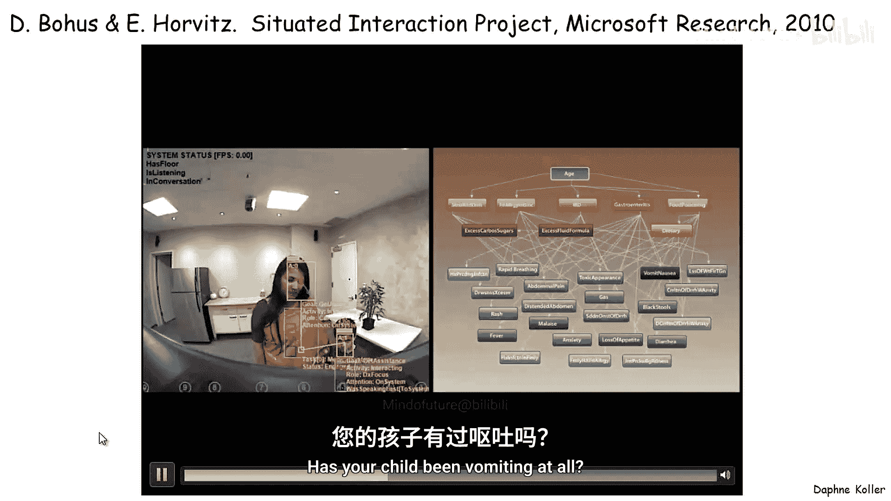
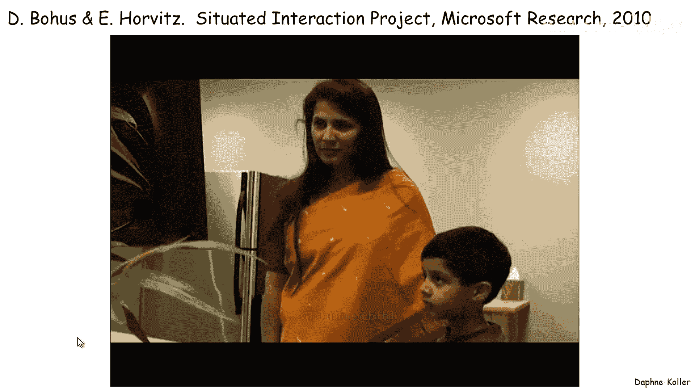
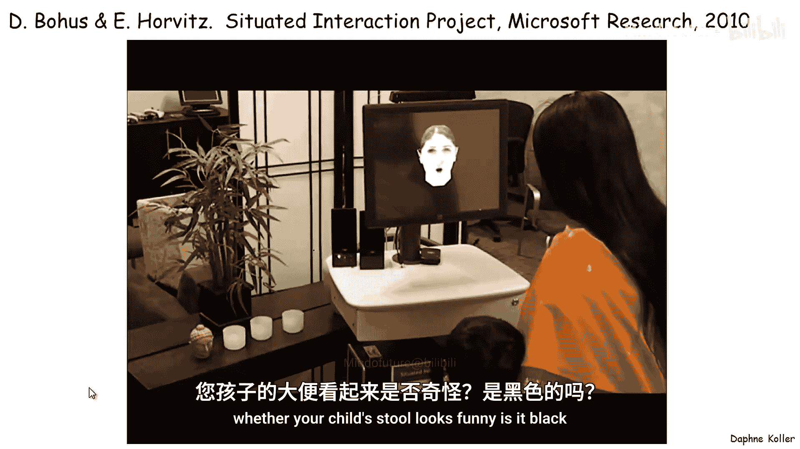
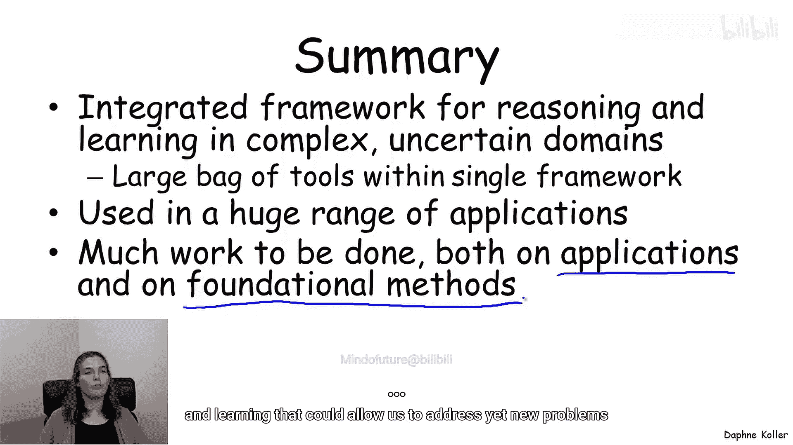

# 029：总结与展望 🎯

在本节课中，我们将回顾整个概率图模型课程的核心内容，探讨其价值、应用场景以及不同设计选择之间的权衡。我们将看到，概率图模型是一个强大的统一框架，它融合了统计学与计算机科学的精华，使我们能够对复杂的不确定性问题进行建模、推理和学习。

---

## 为什么选择概率图模型？🤔

我们花费了整个课程来讨论概率图模型。我们讨论了表示层面的不同变体、可用于回答关于概率图模型各类问题的推理算法，以及可以从数据中学习概率图模型的算法。

现在，让我们退一步，思考概率图模型及其可能为我们带来的价值。

概率图模型在某种意义上，是统计学的基础思想与计算机科学重要技术的结合或联姻。

*   **从统计学中**，我们获得了坚实的概率论基础。它告诉我们什么是概率分布，以及如何利用它们来思考不确定性，并对概率分布进行各种操作，例如**条件化**。此外，还有基于概率分布进行决策的技术，如**信息价值**或**决策制定**。
*   **从计算机科学中**，我们获得了将高维空间上的概率分布视为一个对象，并利用**图作为一种数据结构**的思想。这使得我们能够设计算法，高效地操作这些高维对象。正是这些来自计算机科学的思想，使我们能够将这些坚实的概率论基础，应用到如今在许多场景下面临的复杂现实问题中。

## 声明式表示的价值 📝

能够将高维概率分布视为一个对象的关键在于，我们现在获得了关于世界知识的**声明式表示**。

这种声明式表示，即概率图模型，是一个独立的单元。我们可以将其与随后用于操作它的任何算法分开考虑。这一点很重要，因为它允许我们独立于算法来改进模型。我们可以开发模型，并考虑它是否适合我们的应用，然后应用一种或多种不同的算法来尝试回答关于该模型的问题。

它还允许我们将**模型构建阶段**与**推理阶段**分离开来。模型构建可以涉及从领域专家获取知识，或从数据中学习，或两者兼有。我们广泛讨论了学习方法，也在一定程度上讨论了知识获取方法。

## 何时应用概率图模型？🚀

在以下情况下，我们会应用概率图模型：

*   **当数据存在噪声和不确定性时**。这在任何应用中几乎都是成立的。
*   **当我们有大量先验知识需要嵌入模型时**。在概率图模型的背景下，这通常比在其他多种方法（例如许多传统的机器学习设置）中更容易实现。在这里，以一种自然的方式融入先验知识要简单得多。
*   **当我们希望对多个相互关联的变量进行推理时**。如果你只试图预测单个变量，概率图模型可能不是最理想的解决方案，可能有一系列其他方法（例如传统机器学习）同样或更具竞争力。但当你试图同时对多个变量进行推理时，纳入它们之间相互关系的能力通常非常强大，概率图模型在此可以大放异彩。
*   **当我们希望构建由模块化构建块组成的、结构丰富的模型时**。例如，在进行故障诊断或医疗诊断时，我们通常拥有这些小的模型构建块，它们可以在不同诊断问题的不同模型中重复出现。这种架构允许我们获取这些构建块，并通过重用组件快速构建出非常丰富的模型。

## 设计选择之间的相互作用 ⚙️

我们已经从一系列设计选择的角度讨论了概率图模型：表示侧的选择、我们选择使用的推理算法，以及我们可能采用的学习算法（如果需要学习的话）。

事实证明，尽管声明式表示允许我们将这些设计选择分开，孤立地考虑每一个，并分别开发每一个，但它们实际上并非完全独立。考虑它们之间的相互作用非常重要。

以下是这些设计选择相互关联的方式：

*   **表示的影响**：我们选择的表示方式显然会影响推理和学习的成本。我们讨论了不同类型图模型在推理成本上的差异，并且也展示了在学习设置中，学习有向模型或无向模型时，可学习性和复杂性问题是截然不同的。
*   **推理算法的关联**：推理算法与其他所有方面都相互关联。例如，在我们展示的许多学习算法中，推理算法被用作子程序。无论是在完全数据情况下的MRF或CRF学习，还是在任何不完全数据的学习设置中，思考推理算法的复杂性和特性对于设计良好的学习算法至关重要。此外，我们知道某些推理算法仅适用于特定类型的模型。因此，如果我们瞄准特定的推理算法，那会影响我们对表示的选择。
*   **学习算法的约束**：学习算法也对建模施加了重大约束。我们从数据中正确识别模式的能力，对我们的模型表达能力施加了重大约束。例如，只有某些类型的模式可能根据我们拥有的数据量（例如，完全数据或不完全数据）是可识别的。

## 权衡示例：图像分割 🖼️

让我们通过图像分割的例子，来看看其中一些权衡。

这里，我们需要做出的第一个设计决策是：是将其建模为贝叶斯网络（有向图模型）、MRF，还是CRF（我们试图根据特征X预测分割标签S_i，即建模P(S|X)，而非联合分布）。

以下是我们可能为此类决策考虑的一些权衡：

*   **建模的自然性**：最初考虑时，一个有向模型（其中超像素之间存在有向边）似乎不是一个特别自然的选择。因为我们会选择哪个方向？例如，如果我们使用从图像左上角到右下角的有向边，这似乎没有意义。因此，这里更自然的建模范式似乎是MRF或CRF。
*   **特征表示的丰富性**：我们可能希望使用非常丰富的特征表示。这些特征X应该是结构丰富的，例如计算图像中不同的梯度、纹理和颜色的梯度、不同的直方图等。这些丰富的特征通常彼此高度相关，而我们知道相关特征在正确捕捉其相关结构方面很难建模。在这种情况下，CRF似乎是更好的选择，因为它避免了如何建模这些丰富特征之间相关结构的问题，允许我们使用丰富特征，而不会陷入错误建模相关性的陷阱，从而降低性能。
*   **推理成本**：我们需要考虑此类模型中的推理成本，这反过来又会影响建模。例如，对于某些类型的模型，当MRF或CRF中的势函数是**关联的**或**规则的**时，我们可以应用非常高效的推理算法（利用最小割等组合图算法），这比应用消息传递方案要快得多。但这给我们施加了约束：必须确保我们的势函数确实是关联的。这确实会影响我们的模型正确捕捉分布结构的能力。例如，使用关联势函数很容易捕捉“相邻像素倾向于具有相同标签”这一事实，但很难捕捉“牛倾向于在草地上，而不是在水上、路上或天空中”这类涉及不同类别之间关系的模式。
*   **训练成本**：MRF和CRF的训练成本比贝叶斯网络高。在这种情况下，我们可能仍然愿意承受这个代价，因为它在建模方面有好处。但在完全数据训练的情况下，训练贝叶斯网络在计算上比训练MRF或CRF要高效得多。因此，这是我们在表示侧做出的设计决策所付出的代价。
*   **不完全数据学习**：如果我们必须在数据缺失的情况下学习，这又设置了一个需要考虑的约束。假设我们有一个场景，其中分割标签未被观察到，即我们试图以无监督的方式学习分割。在这种情况下，S是未观察到的潜在变量。这意味着优化P(S|X)甚至没有意义，因为S从未被观察到。因此，在这种情况下，我们根本无法学习CRF。此时，我们必须转而使用不同的表示方案进行学习。这是另一个例子，说明了我们做出的不同选择与我们拥有的不同约束之间的交织：在这种情况下，不完全数据学习以可能意想不到的方式与表示选择相互作用。

## 混合与匹配策略 🔄

概率图模型及其模块化的一个重要好处是，它们允许我们在建模框架内混合和匹配不同的思想。

这之所以重要，是因为它为我们提供了比单独考虑每个主题作为解决方案更丰富的选择。我们通常可以以有趣的方式组合它们。

### 表示侧的混合：混合有向与无向边

让我们回到刚才讨论的图像分割，思考那些实际上混合了有向边和无向边的模型。

例如，如果我们试图从无监督数据中学习图像分割，我们可能在标签S上使用无向边（作为MRF），正如我们在图中看到的，这是我们之前讨论过的自然（或无方向性）选择。但我们有从S到特征X的**有向边**。这是一个半无向的模型：在这一层是无向的，但从S到X是有向的。

这为什么好？
1.  它为我们提供了一个有意义的优化目标：我们试图使用模型参数和模型结构来优化**解释我们所见图像**的能力。
2.  在这方面，它是一个生成模型，通过迫使我们以某种方式生成观测数据，可以让我们学习分布中的统计信息或模式。
3.  通过使这个模型是有向的（而不是无向的，我们本可以通过在整个集合上做MRF来实现，那也会是一个生成模型），它实际上极大地促进了学习。因为每个势函数P(X_i | S_i)都可以单独学习，而无需尝试优化整个模型，因此效率要高得多。这是一个混合匹配策略优于完全有向或完全无向的统一模型的案例。

### 推理侧的混合：应用不同算法于不同部分

我们学习了各种不同的推理算法，可能会倾向于直接将模型扔进这些推理算法之一的“黑箱”中。但在某些情况下，考虑对模型的不同部分应用不同的推理算法会更有益。

例如，我们可能对某些变量子集使用信念传播或马尔可夫链蒙特卡洛方法，但对某些变量集可以进行精确推理，这在这些子集上产生更准确的结果，并可能使我们算法的收敛性和准确性都变得更好。

让我们看一个例子。这是一个我们之前见过的二分MRF，一侧有一组变量A，另一侧有变量B。假设变量之间存在相当密集的连接，甚至A和B之间可能是全连接的。

现在，想想我们可能想对这类模型使用哪种算法。
*   如果A或B的集合非常小，我们可以使用精确推理，但这通常不是情况。
*   一种可能是应用信念传播。但如果你看这个图，你会发现它有大量相当紧密的环。我们知道紧环对信念传播是个问题，因此我们可能会担心收敛质量和答案质量。
*   另一种方法是使用马尔可夫链蒙特卡洛方法，如吉布斯采样。但如果有很多A和B，那么我们是在一个非常大的高维空间上采样，我们知道高维空间中的采样方法在收敛速度和答案质量方面也有局限性。

这里我们可能考虑的一种可能性是马尔可夫链蒙特卡洛的变体：我们只对A进行采样（假设A比B少）。对于A的每个赋值（即我们每个粒子维护的赋值a_1^m, ..., a_K^m），我们以闭式形式维护B上的分布。因此，我们实际上对B进行精确推理，只对A进行采样。这将显著提高收敛速度以及我们估计量的统计特性。这只是众多例子中的一个，我们可以在信念传播中构造更大的团簇，在每个团簇内运行精确推理。混合不同的推理算法可以带来巨大好处。

### 学习侧的混合：应用不同算法于不同部分

学习侧的混合同样有用。我们可以将不同的学习算法应用于模型的不同部分。

再次回到我们的图像分割例子，现在我们假设回到了从完全观测数据中学习的情况。我们将考虑一个CRF。一种非常常见的做法是，为P(S|X)训练一个高质量、易于训练的模型（如支持向量机或某种逻辑回归）。我们可以非常高效地训练它，可以使用复杂的机器学习技巧（如核方法）来获得高精度的节点势函数。然后固定这些，使用CRF学习来学习高阶（例如成对甚至更高阶）的势函数。事实证明，这样做在许多情况下对过拟合的敏感性较低，并且训练速度要快得多。

## 综合应用示例：医疗分诊系统 🏥

通过将不同的功能片段、不同的思想组合在一起，我们可以构建一些非常棒的集成应用。我想以一个很酷的应用示例来结束本次讨论，它将一系列不同的思想整合到一个单一的框架中。

这是来自微软研究院的一项工作，他们在概率图模型的应用方面有着悠久的传统。它融合了来自语音识别、诊断和不确定性下决策制定的思想。

在该系统中：
1.  **价值信息**被用来确定应该问哪些问题，以最大程度地提高诊断质量和在此贝叶斯网络（显示在右侧）中做出决策的能力。
2.  **当前模型和场景**被用来指导语音识别系统，从而从语音识别中获得更高质量的结果。系统利用当前理解的情境来指导用户可能说什么的先验，而不是进行完全无引导的语音识别。

## 总结 📚

在本节课中，我们一起回顾并展望了概率图模型的广阔世界。

概率图模型为我们提供了一个在复杂、不确定领域中进行推理和学习的**集成、连贯的框架**。

多年来，人们已经开发了庞大的工具套件，可用于在此框架内完成不同的任务。我们可以将它们放在这个单一的统一框架中，解决比任何单一工具单独所能解决的更难的问题。

我们在本课程的不同例子中看到，这个框架被用于**极其广泛的应用**中，并且还有更多可以应用的领域。总的来说，我们可以看到，在这个范式下还有许多可以继续工作的地方，无论是将其用于可能感兴趣的新应用，还是改进表示、推理和学习的基础方法，以解决尚未遇到的新问题。