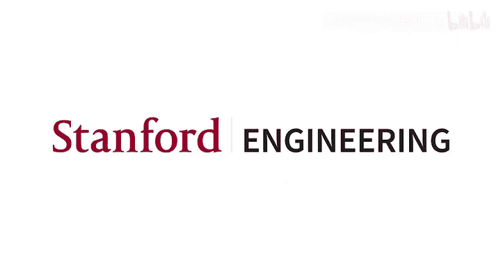
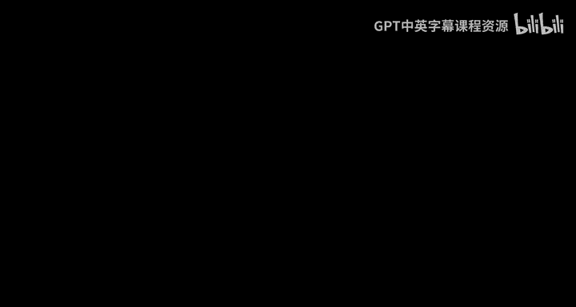
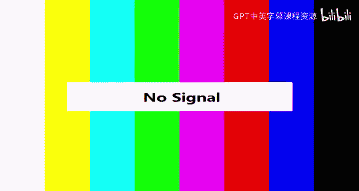
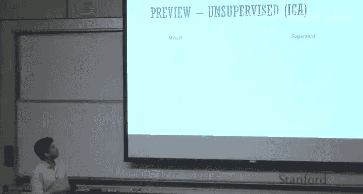
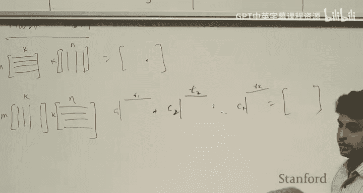
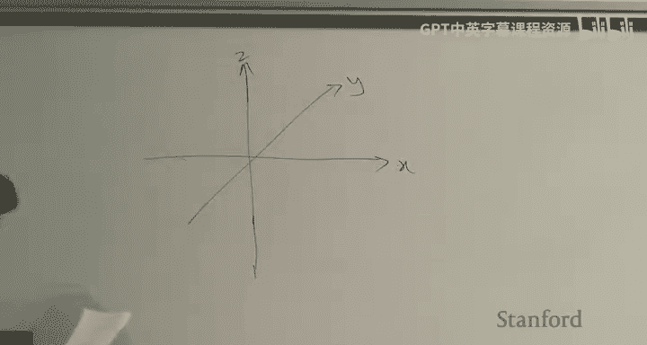

# 机器学习 1：引言与线性代数回顾 📚

在本节课中，我们将学习机器学习课程的基本介绍，并回顾线性代数的核心概念，为后续的机器学习算法学习打下坚实的数学基础。

## 课程概述与目标 🎯

我是Anand Avati，是计算机科学专业的四年级博士生。我与Andrew Ng教授合作，主要研究机器学习及其在医疗健康等领域的应用。我们还有一个优秀的助教团队。

本课程有三个主要目标：
1.  使大家成为机器学习的专家，这意味着不仅要会使用算法，更要理解算法内部的运作原理。
2.  使大家能够构建机器学习应用，这意味着要理解在何种场景下使用何种算法，以及如何判断一个问题是否适合用机器学习解决。
3.  使大家能够开始进行机器学习研究，这意味着让大家熟悉阅读机器学习研究论文时会遇到的大量术语和概念。

## 先修要求与课程守则 📝

机器学习是数学和计算机科学的结合。因此，你需要具备以下基础：
*   **计算机科学基础**：了解大O表示法等基本概念，并能熟练使用Python和NumPy编写非平凡的程序。
*   **概率论基础**：熟悉随机变量、分布、期望等概念。
*   **线性代数与多元微积分**：熟悉梯度、海森矩阵、特征值、特征向量等概念。

关于学术诚信守则：
*   强烈鼓励组建学习小组讨论问题，这对成功完成课程至关重要。
*   但作业和代码必须独立完成。讨论后，请放下所有讨论材料，独立从头开始撰写作业。
*   严禁参考往年作业的官方答案或其他学生上传的解决方案，这是严重违反学术诚信的行为。

## 课程结构与后勤 📅

课程结构如下：
*   共有三次作业，每次作业持续约两周，各占总成绩的20%。
*   有一次期末考试，将是开卷考试（需使用电脑），很可能为24小时制。

课程后勤信息：
*   **课程网站**：cs229.stanford.edu。包含教学大纲、日历和Piazza链接。
*   **Piazza论坛**：所有课程公告、作业发布和考试安排都将在此发布，请务必注册并关注。
*   **GradeScope**：所有作业提交和评分都在此平台进行。

如有问题，请按以下优先级处理：
1.  课程内容或后勤问题：在Piazza上公开提问。
2.  个人事务（如申请延期、提交OAE信）：在Piazza上私信我。
3.  其他仅需我知晓的事宜：直接发送邮件给我，主题请包含“CS229”。

## 什么是机器学习？🤖

“机器学习”一词由Arthur Samuel于1959年提出。他编写了一个跳棋程序，该程序通过自我对弈学习，在没有明确编程策略的情况下，其游戏水平最终超过了Samuel本人。这激发了人们对机器学习的广泛兴趣。

Tom Mitchell教授给出了一个更通用的定义：**机器学习是研究能够通过经验自动改进的计算机算法的领域**。这里的“经验”通常指过去的数据或示例。机器学习算法是一个通用模板，你向其输入过去的训练数据，算法通过分析数据、寻找模式，从而提高其在特定任务上的性能。

机器学习是人工智能的一个子领域。人工智能的目标是构建性能达到人类认知水平的程序，而机器学习是实现此类程序的一种方法，其核心在于利用数据。近年来，深度学习的进展极大地推动了机器学习乃至整个AI领域的发展。

## 机器学习应用实例 🌟

机器学习已在多个领域取得显著进展：
*   **计算机视觉与图像识别**：卷积神经网络等模型彻底改变了这一领域，也是自动驾驶中感知行人和交通标志的关键技术。
*   **语音识别**：使得Siri、Google Assistant等语音助手成为可能。
*   **语言翻译**：谷歌翻译等工具已使用深度学习，甚至出现了无需配对语料就能进行翻译的无监督学习模型。
*   **强化学习**：在游戏领域表现突出，例如DeepMind的模型能在雅达利游戏和围棋上达到超人类水平。

## 课程内容预览 📖

本季度我们将学习以下内容：
*   **监督学习**：训练数据是成对的（输入和输出）。根据输出类型，可分为**回归问题**（输出为连续值，如预测风速）和**分类问题**（输出为类别，如预测是否下雨）。
*   **无监督学习**：算法在没有明确监督（即没有标注输出）的情况下，从数据中寻找模式或结构，例如聚类或降维。
*   **深度学习**：也称为表示学习，让算法自动学习数据的有效表示，可应用于监督、无监督和强化学习场景。
*   **学习理论**：探讨机器学习为何有效的根本原理，如偏差-方差分解、泛化能力等。
*   **强化学习**：智能体通过与环境交互获得的奖励来学习策略。

以下是具体例子：
*   **监督学习示例 - 图像分类**：使用MNIST手写数字数据集，输入是像素，输出是0-9的数字类别。
*   **无监督学习示例 - 鸡尾酒会问题**：给定两个混合了两人声音的录音，算法能自动分离出两个独立的音源，无需任何监督。
*   **强化学习示例 - 倒立摆控制**：算法通过多次尝试，学习如何控制小车保持杆子平衡。

## 为什么需要线性代数？🔢

线性代数在机器学习中至关重要，主要用于：
1.  **表示数据**：例如，在监督学习中，特征可以表示为**设计矩阵**，标签可以表示为向量。
2.  **概率表示**：例如，用**协方差矩阵**表示多个随机变量之间的关系。
3.  **微积分与优化**：**梯度**是向量，**海森矩阵**是对称矩阵，用于函数优化。
4.  **核方法**：大量使用线性代数运算。

因此，熟练掌握矩阵和向量的操作（如乘法、求逆）非常重要。

## 线性代数核心概念回顾 📐

### 基本符号
*   **向量**：通常表示为列向量 `v ∈ ℝ^d`，是d维实空间中的一个点。
*   **矩阵**：表示为 `A ∈ ℝ^(m×n)`，是由实数构成的m行n列网格。特殊矩阵包括单位矩阵 `I`、对角矩阵和对称矩阵（`A = A^T`）。
*   **迹**：方阵对角线上元素的和。

### 向量运算
给定两个向量 `x ∈ ℝ^d` 和 `y ∈ ℝ^d`：
*   **内积（点积）**：`x^T y = Σ x_i * y_i`，结果是一个标量。要求两向量维度相同。
*   **外积**：`x y^T`，结果是一个矩阵（秩为1的矩阵）。两向量维度可以不同。

多个秩为1的矩阵相加，可以得到更高秩的矩阵，但矩阵的秩不会超过其行数和列数中的较小值。

### 矩阵-向量乘法
给定矩阵 `A ∈ ℝ^(m×n)` 和向量 `x ∈ ℝ^n`，乘积 `Ax ∈ ℝ^m`。
有两种理解方式：
1.  **行视角**：结果向量的每个元素是A的对应行与x的内积。
2.  **列视角**：结果向量是A的各列向量以x中对应元素为系数的线性组合。

### 矩阵-矩阵乘法
给定矩阵 `A ∈ ℝ^(m×k)` 和 `B ∈ ℝ^(k×n)`，乘积 `C = AB ∈ ℝ^(m×n)`。
有两种理解方式：
1.  **内积视角**：C的第(i, j)个元素是A的第i行与B的第j列的内积。
2.  **外积视角**：C是k个秩1矩阵的和，其中第i个秩1矩阵由A的第i列和B的第i行外积得到。

### 矩阵的几何解释与秩
我们可以将矩阵 `A ∈ ℝ^(m×n)` 视为一个函数，它将输入空间（ℝ^n）中的向量映射到输出空间（ℝ^m）中的向量。

*   **满秩矩阵**：在输入和输出空间之间存在一一映射（双射）。存在逆矩阵 `A^{-1}` 可以将输出映射回输入。
*   **秩亏缺矩阵**：矩阵的秩 `r` 小于其维度。此时存在：
    *   **行空间**：输入空间中的一个r维子空间（由矩阵的行张成），其中的向量与输出空间中的向量存在一一映射。
    *   **零空间**：输入空间中与行空间正交的子空间，其中的任何向量被A映射为零向量。
    *   **列空间**：输出空间中的一个r维子空间（由矩阵的列张成），是A所有可能输出的集合。

对于输入空间中的任意向量 `x`，它可以被唯一分解为行空间分量 `x_r` 和零空间分量 `x_n` 的和。矩阵乘法 `Ax = A(x_r + x_n) = Ax_r`。这意味着，**矩阵A的作用相当于先将输入向量投影到行空间上，然后将该投影映射到输出空间的列空间中**。

### 投影计算
如何计算一个向量 `b` 到由向量 `v` 张成的一维子空间上的投影？
投影矩阵为 `P = (v v^T) / (v^T v)`。将 `b` 乘以 `P` 即得到其投影：`Proj(b) = P b`。

更一般地，若要计算向量 `b` 到由矩阵 `X` 的列向量张成的子空间上的投影，投影矩阵为 `P = X (X^T X)^{-1} X^T`。这个公式在线性回归中会再次出现。

### 特征值与特征向量
对于方阵 `A ∈ ℝ^(n×n)`，考虑它将单位球面（所有长度为1的向量）映射为何种形状。结果通常是一个椭球体。

*   **特征向量**：那些在变换后方向保持不变（或恰好反向）的向量。即满足 `A v = λ v` 的非零向量 `v`。
*   **特征值**：缩放因子 `λ`，表示特征向量在变换后长度变化的比例。
    *   |λ| > 1 表示拉伸。
    *   0 < |λ| < 1 表示收缩。
    *   λ < 0 表示方向反转。
*   **几何意义**：椭球体的主轴方向就是特征向量的方向，主轴的长度与对应特征值的绝对值相关。
*   **与秩的关系**：**矩阵的秩等于其非零特征值的数量**。如果一个特征值为0，意味着在该方向上的映射将空间“压扁”到了更低维度。

---

本节课中，我们一起学习了机器学习课程的目标、结构和基本概念，并深入回顾了线性代数中与机器学习密切相关的核心内容，包括向量/矩阵运算、矩阵的几何解释、秩、子空间、投影以及特征值/特征向量。理解这些概念对于后续学习各种机器学习算法至关重要。下一讲，我们将回顾矩阵微积分和概率论基础知识。