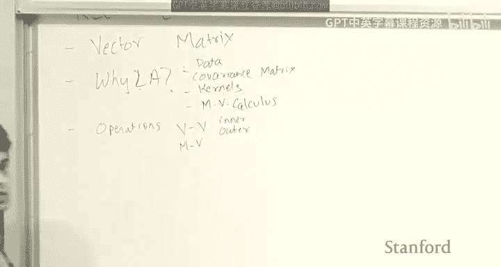
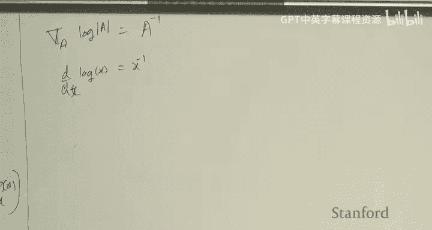
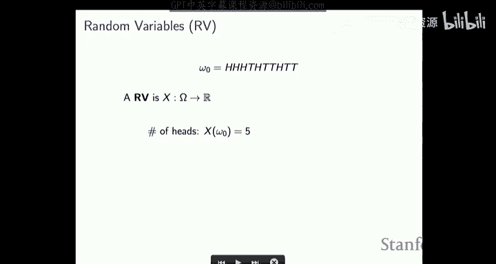
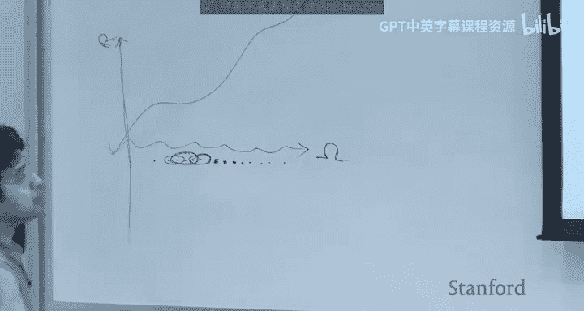
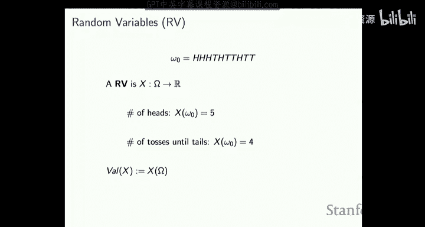
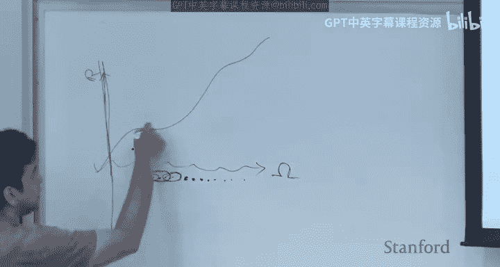
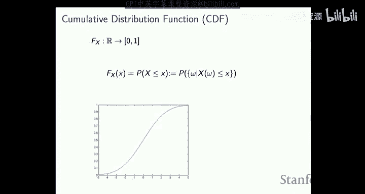
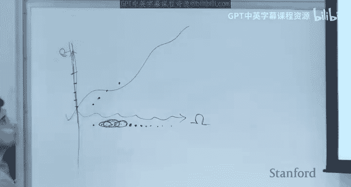
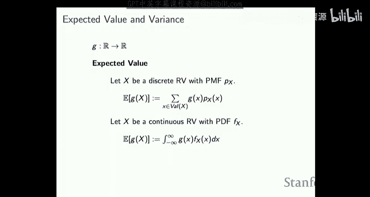

# 机器学习 2：矩阵微积分与概率论回顾 🧮🎲

在本节课中，我们将完成对线性代数的回顾，并学习矩阵微积分与概率论的核心概念。这些数学工具是理解后续机器学习算法的基础。

## 线性代数回顾（续） 🔄

上一节我们介绍了向量、矩阵、特征值与特征向量等概念。本节中，我们来看看矩阵的行列式、二次型以及两种重要的矩阵分解。

### 行列式的几何意义 📐

矩阵的行列式有一个直观的几何解释。考虑一个输入空间中的单位球体（例如三维空间中的球体）。当我们用矩阵 **A** 对这个球体进行线性变换时（即对球体上的每一个点应用矩阵乘法），球体会被变换成一个椭球体。

*   行列式的值等于**输出椭球体的体积**与**输入球体的体积**之比。
*   如果矩阵 **A** 不是满秩的（即秩亏），意味着至少有一个特征值为零。此时，变换会将三维球体“压扁”成一个二维椭圆盘，其体积为零。因此，行列式也为零，这解释了为何奇异矩阵（行列式为零）没有逆矩阵。

行列式的公式表示为：
`det(A) = λ₁ * λ₂ * ... * λₙ`
其中 `λᵢ` 是矩阵 **A** 的特征值。

### 矩阵的二次型与定性 🎯

给定一个对称方阵 **A** 和一个向量 **x**，表达式 **xᵀAx** 称为二次型。它用于定义矩阵的“定性”。

以下是基于二次型值的定义：
*   **正定矩阵**：对于所有非零向量 **x**，**xᵀAx > 0**。其所有特征值均大于零。
*   **半正定矩阵**：对于所有非零向量 **x**，**xᵀAx ≥ 0**。其所有特征值均大于或等于零。
*   **负定矩阵**：对于所有非零向量 **x**，**xᵀAx < 0**。其所有特征值均小于零。
*   **不定矩阵**：二次型的值可正可负。其特征值有正有负。

几何上，对于正定矩阵，任何输入向量 **x** 与其变换后的向量 **Ax** 之间的夹角始终小于90度（点积为正）。这在优化问题中非常重要，例如海森矩阵（二阶导数矩阵）的正定性意味着损失函数是凸的。

### 矩阵分解 🔧

将矩阵分解为更简单组成部分的乘积，有助于我们理解其作用。以下是两种核心分解：

**1. 特征值分解**
仅适用于方阵。将一个方阵 **A** 分解为：
`A = UΛU⁻¹`
其中：
*   **U** 的列是 **A** 的特征向量（通常是正交的）。
*   **Λ** 是一个对角矩阵，对角线上的元素是 **A** 的特征值。

其作用可以理解为三步：1) 用 **U⁻¹** 旋转输入，使特征向量对齐坐标轴；2) 用 **Λ** 沿坐标轴进行缩放（缩放系数即特征值）；3) 用 **U** 旋转回原空间。

**2. 奇异值分解**
适用于任意矩阵（包括非方阵）。将矩阵 **A** 分解为：
`A = UΣVᵀ`
其中：
*   **U** 和 **V** 都是正交矩阵。
*   **Σ** 是一个对角矩阵，对角线上的元素称为**奇异值**，总是非负实数。

其作用也可以理解为三步：1) 用 **Vᵀ** 旋转输入；2) 用 **Σ** 沿坐标轴进行缩放；3) 用 **U** 进行另一个旋转。
对于实对称方阵，其特征值分解与奇异值分解是相同的。

## 矩阵微积分 📈

在机器学习中，我们经常需要优化涉及多个变量的函数（如损失函数），这就需要用到多元微积分，特别是梯度。

### 函数类型与导数 📊

我们主要关心以下几类函数及其导数：
*   `f: ℝᵈ → ℝ`：向量输入，标量输出（如损失函数）。
    *   一阶导数：**梯度** (∇ₓ f ∈ ℝᵈ)，指向函数值上升最快的方向。
    *   二阶导数：**海森矩阵** (H ∈ ℝᵈˣᵈ)，是一个对称矩阵，用于判断函数的凹凸性。
*   `f: ℝᵈ → ℝᵖ`：向量输入，向量输出（如神经网络层）。
    *   一阶导数：**雅可比矩阵** (J ∈ ℝᵈˣᵖ)。

### 常用梯度公式 🧮

以下是一些在推导机器学习算法时频繁使用的梯度计算公式：
*   **线性形式**：若 `f(x) = bᵀx`，则 `∇ₓ f = b`。
*   **二次型**：若 `f(x) = xᵀAx` 且 **A** 对称，则 `∇ₓ f = 2Ax`。
*   **对数行列式**：对于矩阵 **A**，`∇ₐ log |det(A)| = A⁻ᵀ`。这个公式在处理高斯分布等模型时会非常有用。

计算梯度通常遵循定义：对每个输入变量求偏导数，然后组合成向量或矩阵。链式法则和乘积法则同样适用。

## 概率论基础 🎲

概率论为机器学习中的不确定性建模提供了框架。

### 基本概念 🧩

*   **样本空间**：所有可能随机结果的集合。
*   **事件**：样本空间的子集。概率是赋予事件的量，满足非负性、归一性和可加性。
*   **条件概率**：事件 **A** 在事件 **B** 发生下的概率，`P(A|B) = P(A∩B) / P(B)`。
*   **独立性**：若 `P(A∩B) = P(A)P(B)`，则事件 **A** 与 **B** 独立。

### 随机变量与分布 📉

*   **随机变量**：一个将样本空间中的**结果**映射到实数的**函数**。它本身不是变量，而是函数。
*   **累积分布函数**：`Fₓ(t) = P(X ≤ t)`。描述了随机变量 **X** 取值小于等于 **t** 的概率。
*   **概率质量函数**：描述离散随机变量取每个特定值的概率。
*   **概率密度函数**：描述连续随机变量在某个值附近的可能性密度，是 CDF 的导数。

### 期望与蒙特卡洛估计 ⚖️

*   **期望**：随机变量函数的“平均值”。对于函数 `g` 和随机变量 `X`，其期望定义为：
    `E[g(X)] = ∫ g(x) fₓ(x) dx` （连续）
    `E[g(X)] = Σ g(x) P(X=x)` （离散）
    其中 `fₓ(x)` 或 `P(X=x)` 是 **X** 的概率密度或质量函数。
*   **蒙特卡洛估计**：根据大数定律，我们可以通过采样来近似期望值：
    `E[g(X)] ≈ (1/n) Σᵢ g(x⁽ⁱ⁾)`
    其中 `x⁽ⁱ⁾` 是从 **X** 的分布中独立抽取的样本。当样本数 `n` 很大时，这个近似会非常准确。这是许多机器学习算法（如随机梯度下降、强化学习）的理论基础。

---

本节课中我们一起学习了线性代数中行列式与二次型的几何意义、特征值分解与奇异值分解，掌握了矩阵微积分中梯度的计算与理解，并回顾了概率论的核心概念，包括随机变量、分布以及重要的期望与蒙特卡洛估计方法。这些数学工具将贯穿我们整个机器学习课程的学习。