# 机器学习 3：概率与统计回顾 📊


在本节课中，我们将要学习概率论与统计学的基础概念，并理解它们在机器学习中的核心作用。我们将从概率的基本定义开始，逐步深入到随机变量、期望、方差、多元高斯分布以及最大似然估计。最后，我们会简要介绍统计学与机器学习的联系，并预览下一讲的核心内容——线性回归。

## 概率论基础回顾

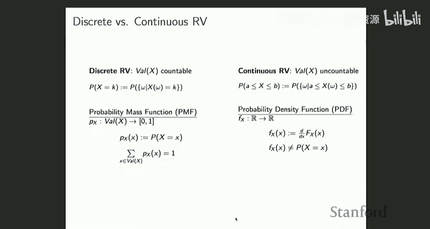

上一节我们介绍了课程的整体安排。本节中，我们来回顾概率论的核心概念。

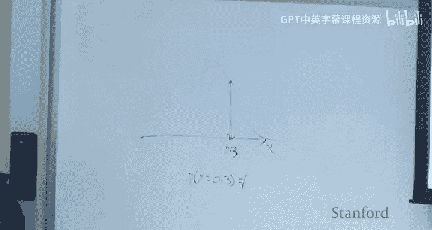

### 样本空间与事件

样本空间是所有可能随机实验结果的集合。事件是样本空间的子集。概率被分配给事件，而不是单个随机结果。


### 随机变量

随机变量是一个函数，它将样本空间中的结果映射到实数线上。这使得我们可以对随机性进行数学运算。例如，一个随机变量可以计算10次抛硬币中正面朝上的次数。

### 累积分布函数与概率密度函数

累积分布函数（CDF）定义为随机变量取值小于或等于某个阈值的概率。对于所有随机变量，无论是离散还是连续，CDF都存在。

*   **离散随机变量**：使用概率质量函数（PMF）描述，其高度表示取特定值的概率。
*   **连续随机变量**：使用概率密度函数（PDF）描述。**重要**：PDF在某点的高度**不是**该点的概率。连续随机变量取任何特定值的概率始终为0。概率仅定义在区间上，即PDF曲线下某区间的面积等于随机变量落在该区间的概率。

### 期望

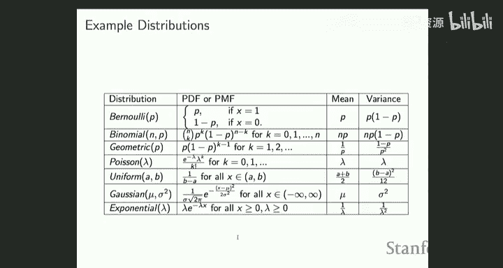

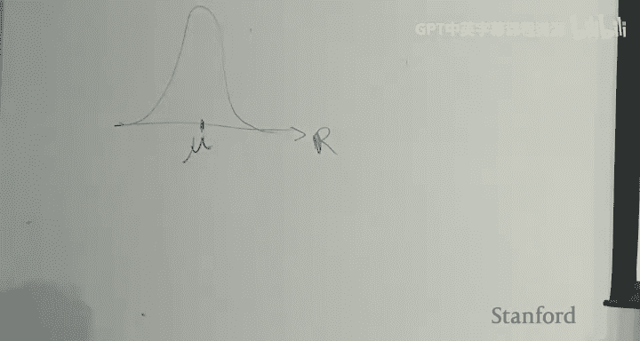

期望是随机变量的平均取值。只有定义了随机变量后，期望的概念才有意义。对于函数 `g(X)`，其期望定义为：

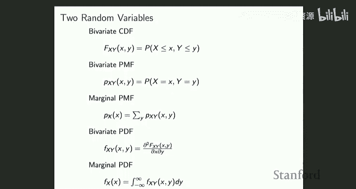

*   **离散情况**：`E[g(X)] = Σ_x g(x) * P(X=x)`
*   **连续情况**：`E[g(X)] = ∫_x g(x) * f_X(x) dx`


其中 `f_X(x)` 是概率密度函数。我们可以通过蒙特卡洛方法（即采样取平均）来近似期望值。

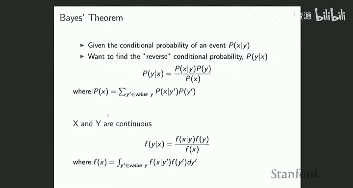

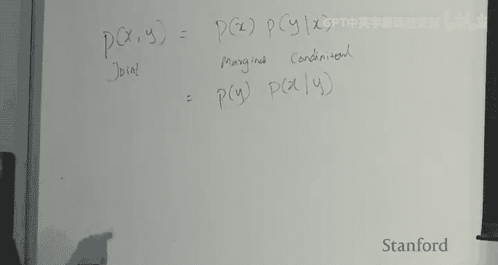

## 方差、协方差与多元分布

上一节我们介绍了期望，本节中我们来看看如何衡量随机变量的离散程度以及多个变量之间的关系。

### 方差

方差衡量随机变量围绕其均值的分散程度。定义为：
`Var(X) = E[(X - E[X])^2] = E[X^2] - (E[X])^2`

### 协方差

协方差衡量两个随机变量之间的线性相关程度。定义为：
`Cov(X, Y) = E[XY] - E[X]E[Y]`
注意，`Cov(X, X) = Var(X)`。

### 多元高斯分布

多元高斯分布是机器学习中最常用的分布之一。对于一个 `n` 维随机向量 `X`，其概率密度函数为：

```
p(x; μ, Σ) = (1/((2π)^{n/2} |Σ|^{1/2})) * exp(-1/2 (x-μ)^T Σ^{-1} (x-μ))
```

其中：
*   `μ` 是均值向量，决定分布的中心位置。
*   `Σ` 是协方差矩阵，是一个对称正定矩阵。它决定分布的形态（分散程度）和方向（变量间的相关性）。
*   `(x-μ)^T Σ^{-1} (x-μ)` 是一个二次型。
*   前面的常数项是为了确保整个密度函数的积分为1。

协方差矩阵的对角线元素是各个变量的方差，非对角线元素是变量间的协方差。

## 条件概率、贝叶斯定理与独立性

理解了联合分布后，我们来看看变量间的条件关系。

### 联合分布与边缘分布

对于随机变量 `X` 和 `Y`，`p(x, y)` 是联合分布。通过对另一个变量积分（或求和），可以得到边缘分布：
`p(x) = ∫_y p(x, y) dy`

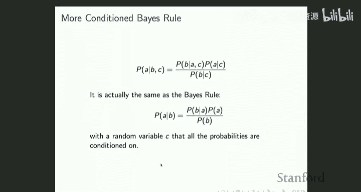

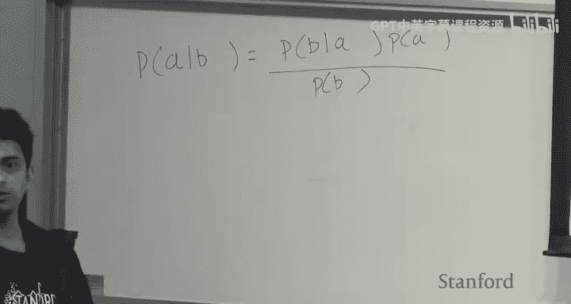

### 链式法则与贝叶斯定理

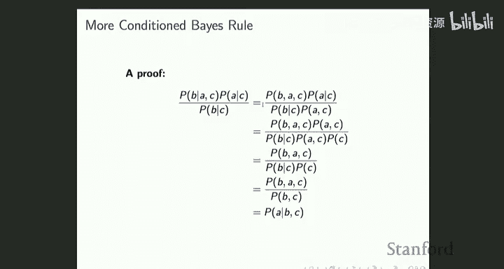

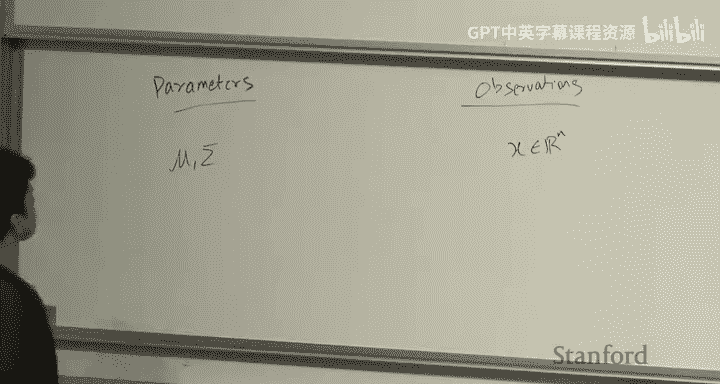

链式法则将联合分布分解为边缘分布和条件分布的乘积：
`p(x, y) = p(x) * p(y|x) = p(y) * p(x|y)`

由此可以直接推导出贝叶斯定理：
`p(y|x) = (p(x|y) * p(y)) / p(x)`
其中 `p(x) = Σ_{y'} p(x|y') * p(y')` （离散情况）。

贝叶斯定理是概率论中最重要的定理之一，在机器学习中无处不在。

### 独立性

如果两个随机变量独立，则联合分布等于边缘分布的乘积：
`p(x, y) = p(x) * p(y)`
这也意味着条件分布等于边缘分布：`p(y|x) = p(y)`。训练样本通常被假设为独立同分布（IID），这个假设简化了许多机器学习理论。

## 统计学与机器学习

上一节我们回顾了概率论，本节中我们来看看统计学如何与机器学习结合。

概率与统计是相辅相成的两个领域：
*   **概率**：在**参数已知**的情况下，对**数据/观测值**做出陈述（例如，计算概率）。
*   **统计**：在**数据已知**的情况下，对**参数**做出推断（例如，估计参数值、计算置信区间）。

机器学习利用统计工具（如最大似然估计）从训练数据中学习模型参数。然而，机器学习的目标与经典统计不同：
*   **经典统计**：关注对参数本身做出正确的推断。
*   **机器学习**：参数只是中间产物，最终目标是利用学到的模型对**未来未见过的数据**做出准确的预测。模型的好坏由预测性能决定。

## 最大似然估计

最大似然估计是连接数据和参数的核心统计方法。

### 似然函数

给定数据 `X = {x^(1), ..., x^(m)}` 和参数 `θ`，似然函数 `L(θ; X)` 在数值上等于概率密度函数 `p(X; θ)`，但解释不同：
*   **概率密度**：将 `θ` 视为固定，`X` 视为变量。
*   **似然函数**：将 `X` （数据）视为固定，`θ` 视为变量。

### MLE 步骤

最大似然估计的目标是找到使似然函数最大化的参数值 `θ_MLE`：
`θ_MLE = argmax_θ L(θ; X) = argmax_θ Π_{i=1}^m p(x^(i); θ)`

由于对数函数是单调递增的，最大化似然函数等价于最大化对数似然函数，这通常更简单：
`θ_MLE = argmax_θ Σ_{i=1}^m log p(x^(i); θ)`

### 高斯分布的 MLE 示例

假设数据 `{x^(i)}` 独立同分布于多元高斯分布 `N(μ, Σ)`。其对数似然函数为：
`l(μ, Σ) = Σ_{i=1}^m [ - (n/2)log(2π) - (1/2)log|Σ| - (1/2)(x^(i)-μ)^T Σ^{-1} (x^(i)-μ) ]`

通过对 `μ` 和 `Σ` 分别求导并令导数为零，可以解得：
*   `μ_MLE = (1/m) Σ_{i=1}^m x^(i)` （样本均值）
*   `Σ_MLE = (1/m) Σ_{i=1}^m (x^(i) - μ_MLE)(x^(i) - μ_MLE)^T` （样本协方差矩阵）

这个推导过程用到了之前线性代数复习中的矩阵求导知识。


## 总结与下节预告

本节课中我们一起学习了概率论与统计学的基础知识，包括随机变量、期望方差、重要的多元高斯分布以及核心的参数估计方法——最大似然估计。我们明确了统计学（通过数据推断参数）与机器学习（通过参数模型预测未来数据）的联系与区别。


在下一讲中，我们将正式进入第一个机器学习算法：**线性回归**。我们将看到如何将本节的概率框架应用于监督学习问题，即从给定的 `(x, y)` 数据对中学习一个从输入 `x` 预测输出 `y` 的函数 `h_θ(x)`。