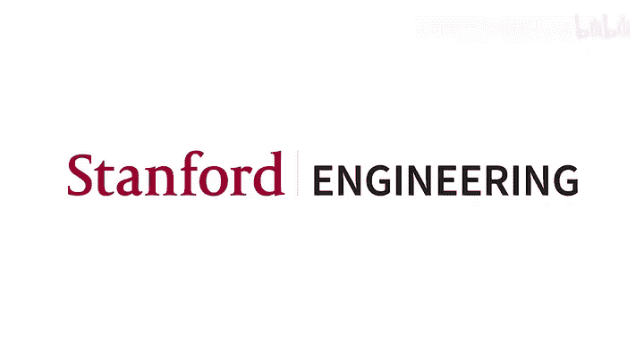
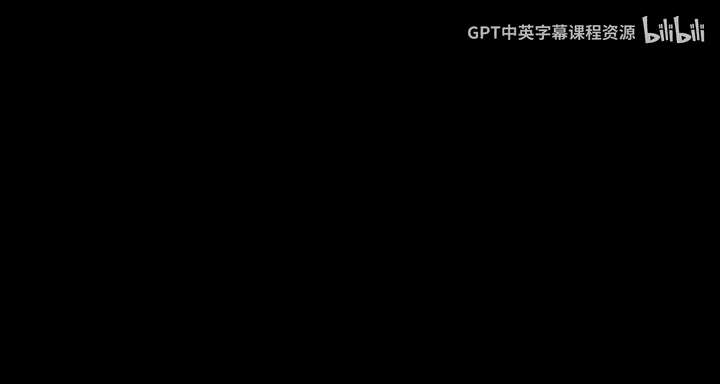
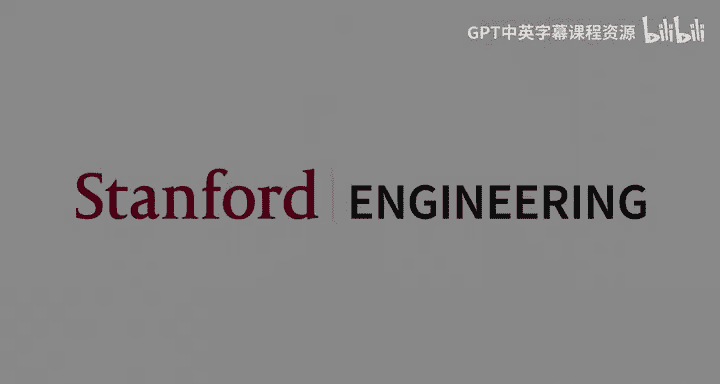

# 机器学习 4：线性回归 📈

在本节课中，我们将要学习监督学习中的第一个核心算法：线性回归。我们将从基本概念、术语开始，逐步深入到其数学原理、优化方法以及多种不同的理解视角。

---

## 1. 监督学习概述与术语 📚

上一节我们回顾了课程所需的数学基础。本节中，我们来看看监督学习的基本框架。

监督学习的目标是学习一个从输入 `x` 到输出 `y` 的映射关系。我们通常处理两类问题：**回归**（输出 `y` 是连续值）和**分类**（输出 `y` 是离散值）。

为了建立统一的讨论基础，我们首先定义以下术语：
*   **输入**：记作 `x`，是一个 `D` 维向量。
*   **输出/标签**：记作 `y`，在回归中是实数，在分类中是离散值（如0或1）。
*   **训练集**：由 `n` 个样本组成，第 `i` 个样本记作 `(x⁽ⁱ⁾, y⁽ⁱ⁾)`。
*   **假设函数**：记作 `h(x)`，是我们从数据中学到的模型，用于预测新的 `x` 对应的 `y`。

监督学习的通用流程是：给定训练集，通过某种学习算法得到一个假设函数 `h(x)`，然后用它来预测未见过的测试数据。

---

## 2. 线性回归模型 🧱

现在，我们聚焦于回归问题，并引入第一个具体的模型家族：线性假设。

我们限制假设函数 `h(x)` 必须是输入 `x` 的线性组合。具体形式如下：

**公式**：
`h_θ(x) = θ₀ + θ₁x₁ + θ₂x₂ + ... + θ_D x_D`

为了书写方便，我们引入一个额外的特征 `x₀ = 1`。这样，假设函数可以写成向量点积的形式：

**公式**：
`h_θ(x) = θᵀx`，其中 `θ = [θ₀, θ₁, ..., θ_D]ᵀ`，`x = [1, x₁, ..., x_D]ᵀ`

这里的 `θ` 称为**参数**或**权重**，线性回归的目标就是找到一组最优的 `θ`。

---

## 3. 成本函数与优化目标 🎯

如何衡量一个假设函数 `h_θ(x)` 的好坏？我们需要定义一个**成本函数** `J(θ)`。

对于回归问题，最常用的成本函数是**平方误差成本函数**：

**公式**：
`J(θ) = (1/2) * Σᵢ₌₁ⁿ (h_θ(x⁽ⁱ⁾) - y⁽ⁱ⁾)²`

这个函数计算了模型在所有训练样本上预测值与真实值差距的平方和。乘以 `1/2` 是为了后续求导时形式更简洁。我们的目标就是找到能使 `J(θ)` 最小化的参数 `θ̂`：

**公式**：
`θ̂ = arg min_θ J(θ)`

---

## 4. 梯度下降算法 ⬇️

如何求解 `min_θ J(θ)`？我们介绍第一个优化算法：**梯度下降**。

梯度下降是一种迭代算法，它从参数的某个初始猜测（如全零向量）开始，反复朝使成本函数下降最快的方向（即负梯度方向）前进一小步。

**算法步骤（向量形式）**：
1.  初始化参数 `θ`（例如 `θ = 0`）。
2.  重复直到收敛：
    `θ := θ - α * ∇_θ J(θ)`

其中 `α` 是一个正数，称为**学习率**，它控制着每一步的步长。`∇_θ J(θ)` 是成本函数 `J` 关于参数 `θ` 的梯度。

将线性回归的成本函数代入，可以得到具体的更新规则：

**公式**：
`θ := θ - α * Σᵢ₌₁ⁿ (h_θ(x⁽ⁱ⁾) - y⁽ⁱ⁾) * x⁽ⁱ⁾`

在实践中，我们通过检查参数变化量 `||θ_new - θ_old||` 或成本函数值变化量 `|J(θ_new) - J(θ_old)|` 是否小于某个阈值来判断是否收敛。

---

## 5. 随机梯度下降 🔄

标准梯度下降在每次更新时需要计算整个训练集（`n` 个样本）的梯度，当 `n` 很大时计算代价高昂。

**随机梯度下降** 是它的一个高效变体。在每次迭代中，SGD 随机均匀地抽取一个样本 `(x⁽ⁱ⁾, y⁽ⁱ⁾)`，并仅基于这个样本计算梯度来更新参数：

**公式**：
`θ := θ - α * (h_θ(x⁽ⁱ⁾) - y⁽ⁱ⁾) * x⁽ⁱ⁾`

虽然每次更新的方向“嘈杂”且不稳定，但平均来看，SGD 最终也能在最优解附近震荡，且每次迭代的计算成本极低。**小批量梯度下降** 是折中方案，每次使用一小批（如64个）样本计算梯度。

---

## 6. 正规方程法 📐

对于线性回归，我们幸运地存在一个不需要迭代的精确解析解，称为**正规方程**。

首先，我们将所有训练样本的输入堆叠成 **设计矩阵** `X`（`n` 行 `D+1` 列，包含 `x₀=1`），输出堆叠成向量 `y`。成本函数可以重写为：

**公式**：
`J(θ) = (1/2)(Xθ - y)ᵀ(Xθ - y)`

通过对 `J(θ)` 关于 `θ` 求导并令其为零，我们可以直接解出最优参数 `θ̂`：

**公式（正规方程）**：
`θ̂ = (XᵀX)⁻¹ Xᵀy`

这个解要求矩阵 `XᵀX` 是可逆的。正规方程提供了线性回归的闭式解，而梯度下降则是一种更通用、可用于其他复杂模型的数值方法。

---

## 7. 概率解释 🎲

线性回归的平方误差最小化，可以从概率论的角度进行解释。

我们假设输出 `y` 与输入 `x` 的关系为：`y = θᵀx + ε`，其中 `ε` 是服从均值为0、方差为 `σ²` 的高斯分布的噪声项，即 `ε ~ N(0, σ²)`。

这意味着在给定 `x` 的条件下，`y` 也服从高斯分布：

**公式**：
`y | x; θ ~ N(θᵀx, σ²)`

基于这个概率模型，我们可以写出数据的**似然函数**，并计算其对数似然。最大化对数似然函数等价于最小化之前的平方误差成本函数 `J(θ)`。

**结论**：在误差服从高斯分布的假设下，线性回归的**最小二乘估计**等价于模型的**最大似然估计**。这为最小化平方误差提供了一个坚实的概率论基础。

---

## 8. 几何解释 📐

线性回归还有另一种优美的几何解释。

考虑方程 `Xθ = y`。设计矩阵 `X` 的列向量张成了一个 `D+1` 维的子空间（列空间）。向量 `y` 位于更高的 `n` 维空间中，并且很可能不在这个子空间内。

线性回归的目标是找到一个 `θ`，使得 `Xθ` 是这个子空间中最接近 `y` 的点。根据线性代数知识，这个点正是 `y` 在列空间上的**正交投影**。

投影矩阵为 `P = X(XᵀX)⁻¹Xᵀ`，因此投影后的向量为 `Xθ̂ = Py`。这直接导出了我们之前的正规方程解。从几何上看，线性回归就是在寻找能使预测向量 `Xθ` 与真实标签向量 `y` 之间欧氏距离最短的参数 `θ`。

---

## 总结 ✨

本节课中我们一起学习了监督学习的基石——线性回归。
1.  我们建立了监督学习的基本术语和框架。
2.  定义了线性模型和平方误差成本函数。
3.  介绍了**梯度下降**及其变体**随机梯度下降**这两种优化算法来最小化成本函数。
4.  推导了线性回归的解析解——**正规方程**。
5.  从**概率视角**（最大似然估计）和**几何视角**（向量投影）重新审视了线性回归，深化了对算法本质的理解。

线性回归虽然简单，但其蕴含的思想（定义模型、成本函数、通过优化求解）是贯穿整个机器学习课程的核心模式。下一节，我们将开始学习分类问题。