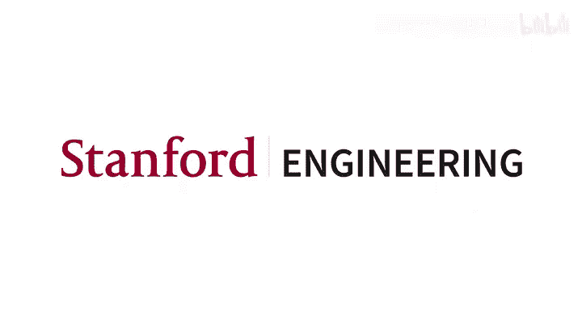
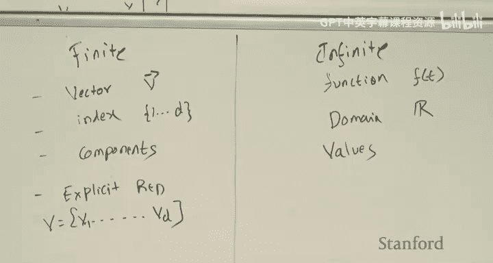
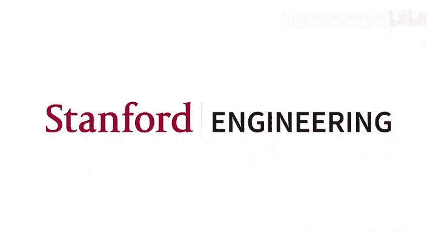

# 机器学习 5：感知机与逻辑回归 🧠




在本节课中，我们将学习两种经典的分类算法：感知机和逻辑回归。我们将从感知机这一历史性的简单算法开始，建立分类问题的基本直觉，然后深入探讨实践中广泛使用的逻辑回归模型。最后，我们会简要介绍牛顿法这一优化算法，并拓展一个关于函数分析的有趣视角。

---

## 课程回顾 📚

上一讲我们介绍了监督学习，并重点学习了线性回归。监督学习的目标是学习从输入 `x` 到输出 `y` 的映射。

我们首先学习了线性回归，其假设函数为 `h_θ(x) = θᵀx`，其中 `θ` 是参数向量。我们的目标是使预测值 `Xθ` 尽可能接近真实值 `y`。为此，我们定义了平方误差损失函数 `J(θ) = ½||Xθ - y||²`，并寻求最小化该损失。

我们看到了两种求解方法：
*   **数值解**：包括梯度下降和随机梯度下降。其核心更新规则为 `θ := θ - α∇_θ J(θ)`。
*   **解析解（闭式解）**：通过矩阵求导得到正规方程 `θ = (XᵀX)⁻¹Xᵀy`。

我们还探讨了线性回归的两种解释：
1.  **概率解释**：假设观测值 `y` 由真实信号 `θᵀx` 加上高斯噪声 `ε ~ N(0, σ²)` 生成。在此假设下，最大化数据的似然函数等价于最小化平方误差损失。
2.  **投影解释**：目标 `y` 通常不在 `X` 的列空间内。线性回归的解 `θ` 对应于将 `y` 投影到 `X` 的列空间上得到的 `ŷ`，然后求解 `Xθ = ŷ`。

---

## 感知机算法 🤖

现在，我们将从回归问题转向分类问题。本节中，我们来看看一个简单而经典的分类算法——感知机。它主要因其历史意义和易于分析的特性而被研究，有助于我们建立分类算法的基本直觉。

在感知机算法中，我们有以下设定：
*   输入 `x ∈ ℝᵈ`
*   输出（标签）`y ∈ {0, 1}`
*   假设函数为 `h_θ(x) = g(θᵀx)`，其中 `g(z)` 是一个阶跃函数：
    ```python
    def g(z):
        return 1 if z >= 0 else 0
    ```

感知机是一种**流式算法**，它一次处理一个样本，并即时更新模型参数。其训练算法如下：

1.  初始化参数 `θ` 为零向量。
2.  对于每一个到来的样本 `(x⁽ⁱ⁾, y⁽ⁱ⁾)`：
    *   计算预测值 `h_θ(x⁽ⁱ⁾) = g(θᵀx⁽ⁱ⁾)`。
    *   按以下规则更新参数：
        ```
        θ := θ + α (y⁽ⁱ⁾ - h_θ(x⁽ⁱ⁾)) x⁽ⁱ⁾
        ```
        其中 `α` 是学习率。

**算法直观理解**：
参数向量 `θ` 定义了一个决策超平面 `θᵀx = 0`，该平面垂直于 `θ`。`θᵀx > 0` 的点被预测为正类，反之则为负类。更新规则的核心思想是：如果当前样本被错误分类，就通过加上或减去该样本向量的一部分来调整 `θ`，使得 `θ` 与该样本向量的点积朝着正确的方向变化。

**关键点**：
*   感知机更新规则与线性回归的随机梯度下降更新规则在形式上相似，但假设函数 `g(z)` 不同。
*   理论上，如果数据是线性可分的，感知机算法最终会找到一个能够完美分类所有样本的超平面。
*   在实践中，感知机已很少使用，但它的更新思想为理解更复杂的算法奠定了基础。

---

## 逻辑回归算法 📈

理解了感知机之后，我们来看一个在实践中极其重要且常用的算法——逻辑回归。可以说，逻辑回归是机器学习的“主力军”，通常是解决分类问题时首先尝试的算法。

逻辑回归的设定与感知机类似：
*   输入 `x ∈ ℝᵈ`
*   输出 `y ∈ {0, 1}`（`y=1` 称为正例，`y=0` 称为负例）

其假设函数为 `h_θ(x) = g(θᵀx)`，但这里的 `g(z)` 是**逻辑函数（或Sigmoid函数）**：
```
g(z) = 1 / (1 + e^{-z})
```
这个函数的输出范围在 `(0, 1)` 之间，可以解释为概率。因此，逻辑回归本质上是一个**概率模型**：
*   `P(y=1 | x; θ) = h_θ(x)`
*   `P(y=0 | x; θ) = 1 - h_θ(x)`

我们可以将这两个公式合并写成一个紧凑的形式：
```
P(y | x; θ) = (h_θ(x))^y * (1 - h_θ(x))^(1-y)
```

### 训练逻辑回归模型

与线性回归类似，我们采用**最大似然估计**来训练模型。假设有 `m` 个独立同分布的样本，其对数似然函数为：
```
ℓ(θ) = Σ_{i=1}^m [ y⁽ⁱ⁾ log(h_θ(x⁽ⁱ⁾)) + (1 - y⁽ⁱ⁾) log(1 - h_θ(x⁽ⁱ⁾)) ]
```
我们的目标是最大化 `ℓ(θ)`，这等价于最小化负对数似然损失 `J(θ) = -ℓ(θ)`。

为了优化，我们需要计算梯度。经过推导（利用逻辑函数导数 `g'(z) = g(z)(1 - g(z))`），得到单个样本的梯度为：
```
∇_θ ℓ(θ) = (y - h_θ(x)) x
```
因此，参数更新规则（使用梯度上升）为：
```
θ := θ + α (y - h_θ(x)) x
```

**与感知机的比较**：
这个更新规则在形式上与感知机**完全一样**！唯一的区别在于 `h_θ(x)` 的定义：
*   感知机：`h_θ(x)` 是阶跃函数，输出非0即1。**仅对错误分类的样本进行更新**。
*   逻辑回归：`h_θ(x)` 是Sigmoid函数，输出连续概率。**对每个样本都进行更新**，更新幅度取决于预测概率与真实标签的差距 (`y - h_θ(x)`)。因此，逻辑回归可以看作感知机的一个“软化”版本。

在实际训练中，我们可以使用批量梯度下降（对所有样本求和）或随机梯度下降（逐样本更新）。

---

## 牛顿法 ⚡

在逻辑回归的优化中，除了梯度下降，我们还有另一种高效的优化算法——牛顿法。本节中，我们来看看牛顿法如何工作，以及它与梯度下降的区别。

牛顿法本质上是一种**求根算法**。对于我们要最小化的损失函数 `J(θ)`，其最小值点满足梯度为零，即 `∇J(θ) = 0`。因此，我们可以将牛顿法应用于梯度函数 `∇J(θ)`，寻找其根。

**算法直观（单变量情况）**：
1.  从初始点 `θ₀` 开始。
2.  在当前点 `θ_t`，用 `∇J(θ)` 的线性近似（切线）来逼近该函数。
3.  求解该线性近似等于零的点，作为下一个迭代点 `θ_{t+1}`。
4.  重复步骤2-3直至收敛。

更新公式为：
```
θ_{t+1} = θ_t - (∇J(θ_t)) / (∇²J(θ_t))
```
其中 `∇²J(θ)` 是二阶导数（海森矩阵在单变量情况下的形式）。

**推广到多变量（向量）情况**：
当 `θ` 是向量时，更新规则变为：
```
θ_{t+1} = θ_t - H⁻¹ ∇_θ J(θ_t)
```
其中 `H` 是损失函数 `J(θ)` 的海森矩阵（二阶偏导数矩阵）。

**牛顿法与梯度下降的对比**：
*   **收敛速度**：牛顿法通常收敛得更快（二次收敛），因为它利用了曲率信息（海森矩阵）。
*   **计算成本**：每次迭代，牛顿法需要计算并求逆海森矩阵，时间复杂度为 `O(d³)`，其中 `d` 是参数维度。对于高维问题，这可能非常昂贵。梯度下降只需计算梯度，成本为 `O(d)`。
*   **适用性**：牛顿法是一个求根算法，会收敛到最近的**驻点**（梯度为零的点），可能是极小值、极大值或鞍点。因此，它最常用于**凸函数**，其中驻点就是全局最优解。梯度下降总是朝着下降方向移动，但可能陷入局部极小值。

在实践中，对于逻辑回归这类问题，当特征维度不是极高时，牛顿法（或拟牛顿法，如L-BFGS）通常是更优的选择。

---

## 函数分析视角 🌌

最后，我们花一点时间，从一个更抽象的视角——函数分析——来理解机器学习中的模型。这个视角将帮助我们为后续学习核方法、高斯过程等主题做好准备。

核心思想是：**函数可以看作是无限维空间中的向量**。

**有限维 vs 无限维**：
*   **有限维向量** `v ∈ ℝᵈ`：可以看作一个定义在有限索引集 `{1, 2, ..., d}` 上的函数，即 `v(i) = v_i`。
*   **函数** `f: ℝ → ℝ`：可以看作一个定义在连续域 `ℝ` 上的“向量”，它在每个输入点 `t` 上的函数值 `f(t)` 就是该“向量”在第 `t` 个（无限维）坐标轴上的分量。

基于这个类比，许多线性代数中的概念可以推广到函数空间：
*   **内积**：向量的点积 `⟨u, v⟩ = Σ_i u_i v_i` 对应函数的内积 `⟨f, g⟩ = ∫ f(t)g(t) dt`。
*   **线性算子**：矩阵 `A` 作用于向量 `x` 得到 `y = Ax`，对应线性算子（如微分、积分变换）作用于函数 `f` 得到新函数 `g`。例如，微分算子 `D = d/dt` 就是一个线性算子。
*   **特征向量/特征函数**：矩阵满足 `Av = λv`，微分算子满足 `Df = λf`。例如，`f(t) = e^{kt}` 是微分算子的特征函数，因为 `Df = k e^{kt} = k f`。
*   **基变换**：矩阵乘法 `y_i = Σ_j A_{ij} x_j` 对应积分变换 `g(s) = ∫ K(s, t) f(t) dt`。傅里叶变换和拉普拉斯变换都是这种积分变换的例子。

**这个视角的意义**：
将函数视为无限维空间中的点，允许我们运用许多线性代数的工具和直觉来思考和学习函数。这对于理解核方法（将数据隐式映射到高维特征空间）以及高斯过程（在函数空间上定义分布）等高级主题非常有帮助。

---



## 总结 🎯

本节课中我们一起学习了以下内容：

1.  **感知机**：一个简单的线性分类算法，使用阶跃函数作为假设。其更新规则仅对误分类样本进行调整。它是理解分类更新机制的良好起点。
2.  **逻辑回归**：一个极其重要的概率分类模型，使用Sigmoid函数将线性组合映射到 `(0,1)` 区间，输出可解释为概率。其训练通过最大似然估计进行，更新规则与感知机形式相同但含义不同（基于概率误差进行连续调整）。
3.  **牛顿法**：一种利用二阶导数（海森矩阵）信息的优化算法，收敛速度快，但每次迭代计算成本高，且通常要求目标函数是凸的以找到全局最优。
4.  **函数分析视角**：建立了函数与无限维向量的类比，为我们提供了用线性代数工具思考复杂函数空间的新视角，为后续学习更高级的机器学习模型奠定了基础。



从简单的感知机到强大的逻辑回归，我们看到了分类算法如何从硬决策边界演变为概率输出，也了解了不同优化算法的权衡。这些概念构成了监督学习中分类任务的核心工具箱。