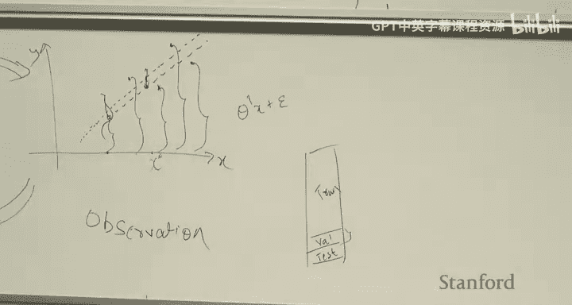
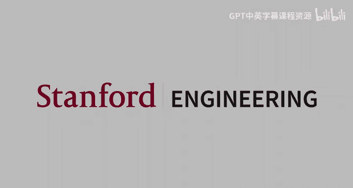

# 机器学习 6：指数族与广义线性模型 🧮

在本节课中，我们将要学习两个紧密相关的核心概念：**指数族** 和 **广义线性模型**。我们将看到，之前学过的线性回归和逻辑回归，实际上都是广义线性模型这个统一框架下的特例。通过理解这个框架，我们可以系统地构建适用于各种数据类型（如实值、计数、分类）的模型。

---

## 指数族分布 📊

上一节我们回顾了线性回归和逻辑回归的概率解释，本节中我们来看看一个能统一描述多种概率分布的数学形式——指数族。

指数族分布是一类可以用特定形式表示的概率分布。其概率密度函数（或概率质量函数）可以写成如下形式：

\[
p(y; \eta) = b(y) \exp(\eta^T T(y) - a(\eta))
\]

其中：
*   \( y \) 是数据（例如模型的输出）。
*   \( \eta \) 是分布的**自然参数**。
*   \( T(y) \) 是**充分统计量**，在许多常见情况下 \( T(y) = y \)。
*   \( b(y) \) 是**基测度**，仅是 \( y \) 的函数。
*   \( a(\eta) \) 是**对数配分函数**，仅是 \( \eta \) 的函数，确保概率归一化为1。

指数族的一个直观理解是：从一个基础的分布 \( b(y) \) 出发，通过引入参数 \( \eta \) 和指数函数进行“倾斜”，然后重新归一化，就得到了一个新的分布。

### 常见分布属于指数族

以下是两个关键例子，说明常见分布如何表示为指数族形式。

**1. 伯努利分布**
伯努利分布描述二元（0/1）变量，其概率质量函数为 \( p(y; \phi) = \phi^y (1-\phi)^{1-y} \)。通过代数变换，我们可以将其重写为指数族形式：
\[
p(y; \eta) = \exp(y \log(\frac{\phi}{1-\phi}) + \log(1-\phi))
\]
通过模式匹配，我们可以得到：
*   自然参数 \( \eta = \log(\frac{\phi}{1-\phi}) \)。
*   充分统计量 \( T(y) = y \)。
*   对数配分函数 \( a(\eta) = \log(1 + e^{\eta}) \)。
*   基测度 \( b(y) = 1 \)。
*   均值参数 \( \phi \) 与自然参数的关系为 \( \phi = \frac{1}{1 + e^{-\eta}} \)，这正是逻辑函数。

**2. 高斯分布（方差固定为1）**
一元高斯分布 \( p(y; \mu) = \frac{1}{\sqrt{2\pi}} \exp(-\frac{1}{2}(y-\mu)^2) \) 也可以改写为指数族形式。通过展开平方项和整理，我们可以得到：
*   自然参数 \( \eta = \mu \)。
*   充分统计量 \( T(y) = y \)。
*   对数配分函数 \( a(\eta) = \frac{\eta^2}{2} \)。
*   基测度 \( b(y) = \frac{1}{\sqrt{2\pi}} \exp(-\frac{y^2}{2}) \)。

### 指数族的优良性质

指数族分布具有一些非常好的数学性质，这些性质简化了后续的建模和计算：
1.  **对数似然的凹性**：\( \log p(y; \eta) \) 关于 \( \eta \) 是凹函数，这意味着负对数似然是凸函数，便于优化。
2.  **矩的易计算性**：分布的均值可以通过对数配分函数的一阶导数求得，方差可以通过二阶导数求得。
    \[
    \mathbb{E}[Y] = \frac{d}{d\eta} a(\eta)
    \]
    \[
    \text{Var}[Y] = \frac{d^2}{d\eta^2} a(\eta)
    \]
    这避免了复杂的积分运算。

---

## 广义线性模型 🧠

上一节我们介绍了指数族分布，本节中我们来看看如何将其与输入特征 \( x \) 联系起来，从而构建**广义线性模型**。

GLM通过以下三个核心假设/步骤构建：

1.  **响应变量假设**：给定 \( x \) 和参数 \( \theta \)，输出变量 \( y \) 服从某个以 \( \eta \) 为自然参数的指数族分布。即 \( y \mid x; \theta \sim \text{ExponentialFamily}(\eta) \)。
2.  **预测目标假设**：我们的模型目标是预测给定 \( x \) 时 \( y \) 的条件期望，即假设 \( h_\theta(x) = \mathbb{E}[y \mid x; \theta] \)。
3.  **线性预测假设**：自然参数 \( \eta \) 与输入特征 \( x \) 通过线性关系关联：\( \eta = \theta^T x \)。

数据生成过程可以直观理解为：对于每个输入 \( x_i \)，计算线性预测值 \( \eta_i = \theta^T x_i \)，将其作为指数族分布的参数，然后从这个分布中采样得到观测值 \( y_i \)。

### 连接函数与响应函数

在GLM框架中，有几个关键参数和函数：
*   **模型参数 \( \theta \)**：这是我们通过训练学习的权重向量。
*   **自然参数 \( \eta \)**：由 \( \eta = \theta^T x \) 计算得到，每个样本不同。
*   **均值参数 \( \mu \)**：指数族分布的均值（如高斯分布的 \( \mu \)，伯努利分布的 \( \phi \)）。

连接 \( \eta \) 和 \( \mu \) 的函数至关重要：
*   **规范响应函数 \( g \)**：将自然参数映射到均值参数，\( \mu = g(\eta) \)。这也是我们的假设函数：\( h_\theta(x) = g(\theta^T x) \)。
*   **规范链接函数 \( g^{-1} \)**：响应函数的逆，将均值参数映射回自然参数，\( \eta = g^{-1}(\mu) \)。

### GLM的统一视角

基于输出变量 \( y \) 的数据类型，我们可以选择相应的指数族分布，从而得到不同的模型：

以下是常见数据类型及其对应的GLM选择：
*   **实值（整个实数轴）**：例如选择**高斯分布**，得到**线性回归**。此时响应函数 \( g(\eta) = \eta \)。
*   **二元值（0或1）**：例如选择**伯努利分布**，得到**逻辑回归**。此时响应函数 \( g(\eta) = 1/(1+e^{-\eta}) \)。
*   **计数值（非负整数）**：例如选择**泊松分布**，得到**泊松回归**。
*   **多类离散值（K个类别）**：例如选择**分类分布**，得到**Softmax回归**（多类分类）。
*   **正实值（如生存时间）**：例如选择**指数分布**或**伽马分布**，常用于生存分析。

使用GLM框架的主要好处是：
*   **统一的更新规则**：对于任何GLM，使用梯度上升法进行最大似然估计时，参数更新规则都具有相同的形式：
    \[
    \theta := \theta + \alpha \sum_{i=1}^m (y^{(i)} - h_\theta(x^{(i)})) x^{(i)}
    \]
*   **系统化的建模流程**：只需根据 \( y \) 的类型选择分布，推导出响应函数 \( g \)，即可定义模型 \( h_\theta(x) = g(\theta^T x) \) 并使用上述更新规则进行训练。

---

## Softmax回归简介 🍦

作为GLM的一个具体例子，我们简要介绍用于多类分类的**Softmax回归**。

当输出 \( y \) 有 \( K \) 个可能的类别时，我们为每个类别 \( k \) 设置一个参数向量 \( \theta_k \)。对于输入 \( x \)，我们计算 \( K \) 个“得分”：\( \eta_k = \theta_k^T x \)。

为了将这些得分转化为属于各个类别的概率分布（满足非负且和为1），我们使用 **Softmax函数**：
\[
p(y=k \mid x; \theta) = \frac{\exp(\theta_k^T x)}{\sum_{j=1}^K \exp(\theta_j^T x)}
\]
Softmax函数对得分进行指数运算（确保为正），然后归一化。得分最高的类别将获得最大的预测概率。这可以看作是从伯努利分布（二类）到分类分布（多类）的自然推广。

---

## 总结 🎯

本节课中我们一起学习了：
1.  **指数族分布**：一个统一表示多种概率分布的数学形式，具有优良的解析性质。
2.  **广义线性模型**：一个强大的建模框架，通过三个假设将指数族分布与线性预测器结合。线性回归和逻辑回归都是其特例。
3.  **GLM的工作流程**：根据响应变量 \( y \) 的类型选择指数族分布，确定规范响应函数 \( g \)，模型即为 \( h_\theta(x) = g(\theta^T x) \)，并使用统一的梯度更新规则进行训练。
4.  **Softmax回归**：作为GLM应用于多类分类的例子，使用Softmax函数将多个线性预测得分转化为概率分布。

理解GLM框架为我们提供了一套系统化的工具，可以超越简单的回归和分类，去构建适用于各种数据类型的概率模型。