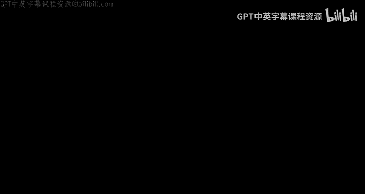
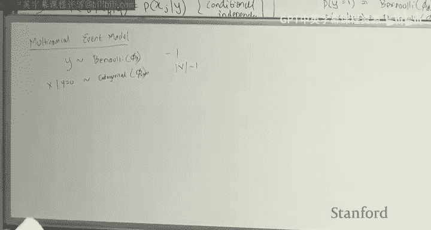

# 机器学习 7：生成学习算法、高斯判别分析、朴素贝叶斯与拉普拉斯平滑 📚

## 概述

在本节课中，我们将要学习**生成学习算法**。我们将从**判别式算法**与**生成式算法**的区别讲起，然后深入探讨两种经典的生成式模型：**高斯判别分析** 和 **朴素贝叶斯**。我们还将学习处理数据稀疏性问题的重要技巧——**拉普拉斯平滑**。

---

## 判别式算法回顾

上一节我们介绍了广义线性模型。在此之前，我们学习的线性回归、逻辑回归和广义线性模型都属于**判别式算法**。

判别式算法的核心是直接对条件概率 **`P(y|x)`** 进行建模。在监督学习中，我们关注的是从输入 `x` 到输出 `y` 的映射关系。

*   **当 `y|x` 服从正态分布时**，我们得到**线性回归**。
*   **当 `y|x` 服从伯努利分布时**，我们得到**逻辑回归**。
*   **当 `y|x` 属于指数族分布时**，我们得到**广义线性模型**。

可以看到，线性回归和逻辑回归都是广义线性模型的特例。

---

## 生成式算法简介

本节中，我们将目光转向**生成式算法**。与判别式算法不同，生成式算法不直接建模 `P(y|x)`，而是对**联合概率分布 `P(x, y)`** 进行建模。

我们可以利用概率链式法则将联合分布分解：
**`P(x, y) = P(x|y) * P(y)`**

其中：
*   **`P(y)`** 被称为**类先验**，表示在观察任何特征之前，一个样本属于某个类别的总体概率。
*   **`P(x|y)`** 是给定类别后，特征 `x` 出现的概率。由于 `x` 通常是高维向量，建模 `P(x|y)` 本身就是一个复杂的问题。

在预测时，对于一个新样本 `x_test`，我们利用贝叶斯规则计算后验概率：
**`P(y|x) = P(x|y) * P(y) / P(x)`**

如果我们只想做出分类决策（例如，判断 `y=0` 还是 `y=1`），我们可以计算使后验概率最大的 `y`：
**`y_hat = argmax_y P(y|x) = argmax_y P(x|y) * P(y)`**

因为分母 `P(x)` 对于所有 `y` 是相同的常数，所以在比较时无需计算。

---

## 高斯判别分析

现在，我们来看第一种生成式算法：**高斯判别分析**。在这个模型中，我们假设特征 `x` 是**连续值**的。

### 模型定义与数据生成过程

GDA 将数据生成过程描述为一个分层步骤，这与我们对联合概率的分解方式一一对应：

1.  首先，从参数为 `φ` 的**伯努利分布**中采样类别标签 `y`。
    *   **`y ~ Bernoulli(φ)`**
2.  然后，根据 `y` 的取值，从不同的**多元高斯分布**中采样特征 `x`。
    *   如果 `y=0`，则 **`x|y=0 ~ N(μ_0, Σ)`**
    *   如果 `y=1`，则 **`x|y=1 ~ N(μ_1, Σ)`**

**注意**：这里我们做了一个关键假设——两个类别的高斯分布**共享同一个协方差矩阵 `Σ`**，但拥有不同的均值向量 `μ_0` 和 `μ_1`。

对应的概率密度函数为：
*   **`P(y) = φ^y * (1-φ)^(1-y)`** （伯努利分布）
*   **`P(x|y=0) = (1/((2π)^(d/2)|Σ|^(1/2))) * exp(-1/2 (x-μ_0)^T Σ^(-1) (x-μ_0))`**
*   **`P(x|y=1) = (1/((2π)^(d/2)|Σ|^(1/2))) * exp(-1/2 (x-μ_1)^T Σ^(-1) (x-μ_1))`**

### 参数估计：最大似然

模型的参数是 `θ = {φ, μ_0, μ_1, Σ}`。给定训练数据 `{(x_i, y_i)}`，我们通过最大化**联合似然**来估计参数。

生成式模型的似然函数使用联合概率：
**`L(θ) = ∏_i P(x_i, y_i)`**

将其分解并代入上述概率密度，然后对 `log L(θ)` 求导并令导数为零，我们可以得到参数的**最大似然估计闭式解**：

以下是参数的估计公式：
*   **`φ_hat = (1/n) * Σ_i 1{y_i = 1}`** （标签为1的样本比例）
*   **`μ_0_hat = (Σ_i 1{y_i=0} * x_i) / (Σ_i 1{y_i=0})`** （标签为0的样本特征均值）
*   **`μ_1_hat = (Σ_i 1{y_i=1} * x_i) / (Σ_i 1{y_i=1})`** （标签为1的样本特征均值）
*   **`Σ_hat = (1/n) * Σ_i (x_i - μ_{y_i}) (x_i - μ_{y_i})^T`** （整体协方差矩阵，按类别中心化后计算）

### GDA 与逻辑回归的联系

一个有趣且重要的结论是：**在共享协方差矩阵的GDA假设下，其后验分布 `P(y=1|x)` 的形式恰好是一个逻辑函数**。

**`P(y=1|x) = 1 / (1 + exp(-θ^T x))`**

其中参数 `θ` 是 `{φ, μ_0, μ_1, Σ}` 的函数。这意味着，**任何共享协方差的GDA模型，其后验分类边界都是一个线性决策边界**，与逻辑回归相同。

### 对比：GDA vs. 逻辑回归

*   **GDA** 做出了更强的建模假设（数据来自高斯分布，且各类别协方差相同）。如果这个假设**成立**，GDA是更**高效**的，通常需要更少的数据就能达到较好的效果。
*   **逻辑回归** 的假设更弱，因此更**稳健**。即使数据不严格服从高斯分布，它通常也能工作得很好。在实践中，逻辑回归往往是首选的尝试算法。

---

## 朴素贝叶斯

接下来，我们看看当特征 `x` 是**离散值**时使用的生成式算法：**朴素贝叶斯**。它在文本分类（如垃圾邮件过滤）中应用广泛。

### 条件独立性假设

朴素贝叶斯的核心是**条件独立性假设**：在给定类别标签 `y` 的条件下，特征 `x` 的各个维度（例如，文本中的每个词）是相互独立的。
即：**`P(x_j | x_k, y) = P(x_j | y)`**

这是一个很强的假设（例如，“buy”和“lottery”这两个词在垃圾邮件中很可能同时出现），但能极大地简化模型，且在实践中往往效果不错。

### 伯努利事件模型

我们首先介绍**伯努利事件模型**。在这个模型中，我们将一篇文档（如邮件）表示为一个**多热编码向量**，其长度等于词汇表大小 `d`。

*   向量中每个位置对应词汇表中的一个词。
*   如果该词在文档中出现**至少一次**，对应位置为1，否则为0。
*   因此，**`x ∈ {0, 1}^d`**。

模型的生成过程如下：
1.  **`y ~ Bernoulli(φ_y)`**
2.  对于每个特征 `j` (每个词)，其出现概率依赖于 `y`：
    *   **`x_j | y=0 ~ Bernoulli(φ_{j|y=0})`**
    *   **`x_j | y=1 ~ Bernoulli(φ_{j|y=1})`**

模型参数包括：一个类先验 `φ_y`，以及 `d` 个针对 `y=0` 的词出现概率 `φ_{j|y=0}` 和 `d` 个针对 `y=1` 的词出现概率 `φ_{j|y=1}`，共 `2d+1` 个参数。

利用条件独立性假设，联合似然可以分解：
**`L(φ) = ∏_i P(y_i) * ∏_j P(x_j_i | y_i)`**

最大似然估计为：
*   **`φ_y_hat = (Σ_i 1{y_i=1}) / n`**
*   **`φ_{j|y=1}_hat = (Σ_i 1{x_j_i=1 and y_i=1}) / (Σ_i 1{y_i=1})`** （在垃圾邮件中，词j出现的文档比例）
*   **`φ_{j|y=0}_hat = (Σ_i 1{x_j_i=1 and y_i=0}) / (Σ_i 1{y_i=0})`** （在正常邮件中，词j出现的文档比例）

### 拉普拉斯平滑

上述最大似然估计存在一个问题：**如果某个词在训练集的某个类别中从未出现，其概率估计为0**。那么，在预测时，任何包含该词的文档都会使得整个类的似然变为0，导致无法做出预测或得到 `0/0` 的不定式。

为了解决这个问题，我们引入**拉普拉斯平滑**。其思想是：在开始计数之前，为每个可能的计数“预先”添加一些虚拟的观测值。

对于伯努利事件模型，平滑后的估计变为：
*   **`φ_{j|y=1}_hat_smoothed = (1 + Σ_i 1{x_j_i=1 and y_i=1}) / (2 + Σ_i 1{y_i=1})`**
*   **`φ_{j|y=0}_hat_smoothed = (1 + Σ_i 1{x_j_i=1 and y_i=0}) / (2 + Σ_i 1{y_i=0})`**

直观上，这相当于我们假设在观察数据前，已经看到了两类邮件各一封：一封包含了所有词（分子+1），一封不包含任何词（分母+2，因为有两种可能：词出现或不出现）。这样，即使一个词从未出现，其概率也不会是0。

### 多项式事件模型

朴素贝叶斯还有另一种形式：**多项式事件模型**。它与伯努利事件模型的主要区别在于对文档的表示：

*   **伯努利模型**：文档是词袋的**多热编码**，关注“词是否出现”。
*   **多项式模型**：文档是**词序列**，关注“词出现的次数”。它将一篇文档视为从多项分布（或范畴分布）中多次抽样产生的。

在多项式模型中，参数 `φ_{k|y}` 表示在类别 `y` 的文档中，抽样到词汇表中第 `k` 个词的概率。其最大似然估计是：在类别 `y` 的所有文档中，词 `k` 出现的总次数，除以该类所有文档的总词数。

拉普拉斯平滑版本为：
**`φ_{k|y}_hat_smoothed = (1 + count(k, y)) / (|Vocabulary| + total_words(y))`**

相当于在数据前添加了一篇虚拟文档，其中每个词都恰好出现一次。

---

## 总结

本节课中我们一起学习了生成学习算法的核心思想与两种经典模型。

1.  **生成式 vs. 判别式**：生成式算法建模联合分布 `P(x, y)`，而判别式算法直接建模条件分布 `P(y|x)`。生成式建模通常更难，但能提供数据本身的生成规律。
2.  **高斯判别分析**：用于连续特征。假设各类别数据来自不同均值、相同协方差的高斯分布。其后验分布形式与逻辑回归相同，但在其假设成立时更高效。
3.  **朴素贝叶斯**：用于离散特征（尤其是文本）。基于强大的条件独立性假设，极大地简化了建模。我们学习了两种事件模型：
    *   **伯努利事件模型**：将文档表示为词是否出现的二值向量。
    *   **多项式事件模型**：将文档表示为词频向量。
4.  **拉普拉斯平滑**：处理最大似然估计中零概率问题的关键技术，通过添加虚拟计数来避免过拟合和预测失败。

理解这些算法及其背后的假设，能帮助我们在实际问题中根据数据特性选择合适的模型。