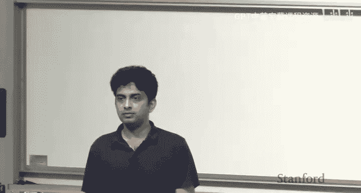
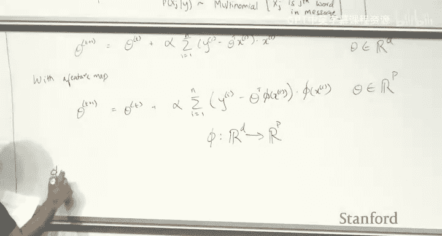
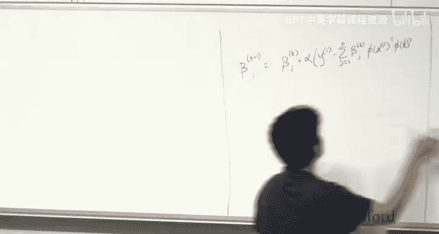
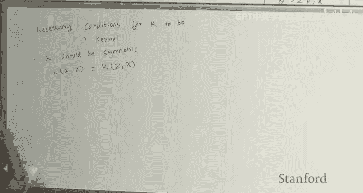
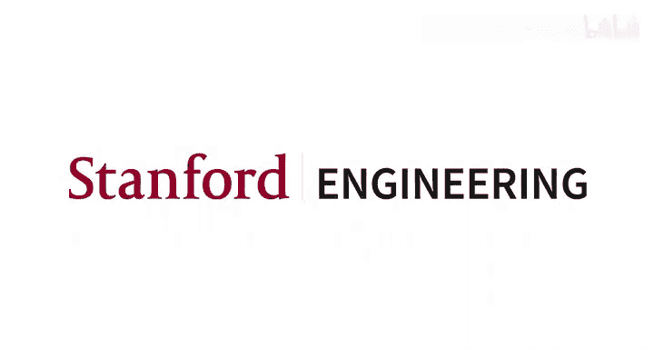

# 机器学习 8：核方法与支持向量机 🧠

在本节课中，我们将要学习核方法（Kernel Methods）和支持向量机（Support Vector Machines，SVM）。核方法是一种强大的技巧，它允许我们在高维甚至无限维的特征空间中高效地运行线性算法。支持向量机则是一种经典的分类算法，它通过最大化分类间隔来寻找最优的决策边界。

---

## 回顾：生成式算法

上一节我们介绍了生成式算法。在训练时，我们最大化输入 `x` 和输出 `y` 的联合似然概率 `p(x, y)`，并使用最大似然估计（MLE）来训练参数。这通常可以分解为两部分：类别先验 `p(y)` 和条件概率 `p(x|y)`。

在预测时，我们使用贝叶斯规则来构建后验分布 `p(y|x)`。根据对 `p(x|y)` 的不同假设（例如高斯分布、伯努利分布等），我们会得到不同的后验分布。

我们看到了两种不同类型的生成式模型：
*   **高斯判别分析（GDA）**：假设 `x` 是连续的，且 `p(x|y)` 服从一个均值与 `y` 相关、协方差共享的正态分布。其对应的后验形式与逻辑回归的函数形式相同。
*   **朴素贝叶斯（Naive Bayes）**：假设 `x` 是离散的（如文本中的单词），并做出了**条件独立性**的关键假设。这意味着 `p(x_j | y, x_k) = p(x_j | y)`。我们构建了两种事件模型：
    *   **伯努利事件模型**：`p(x_j | y)` 服从伯努利分布。
    *   **多项式事件模型**：`p(x_j | y)` 服从多项式分布。

我们还介绍了**拉普拉斯平滑**，其核心思想是避免因训练数据中未出现的罕见词而对预测产生严重影响。

---

## 引入核方法

到目前为止，我们在课程中看到的所有模型都是**线性模型**。例如，线性回归给出的是 `x` 的线性假设，逻辑回归给出的是数据空间中的线性分类边界。

然而，我们可以通过引入**特征映射（Feature Map）** 来构建非线性模型。特征映射 `φ(x)` 将原始属性（Attributes）`x` 转换到新的特征（Features）空间。例如，我们可以将一维的 `x` 映射到包含高阶多项式项的特征空间：`φ(x) = [1, x, x^2, x^3, x^4]^T`。在这个高维空间中进行线性回归或逻辑回归，就能在原始空间中产生非线性的假设或决策边界。

但问题随之而来：我们应该映射到多少维？为什么不是10维、1000维，甚至是无限维？核方法允许我们做到这一点。

---

## 线性回归的核化

让我们以线性回归为例，看看如何将其“核化”。在线性回归的梯度下降更新规则中，参数 `θ` 的更新依赖于输入 `x` 的点积。

当我们使用特征映射 `φ(x)` 时，更新规则变为对高维特征向量 `φ(x)` 进行操作。此时，参数 `θ` 也存在于高维特征空间中。

一个关键的观察是：**如果我们从零向量 `θ=0` 开始梯度下降，那么在任意迭代步骤 `t`，参数向量 `θ_t` 都可以表示为训练样本特征向量的线性组合**。

具体来说，可以证明 `θ_t = Σ_{i=1}^{n} β_i^{(t)} φ(x_i)`，其中 `β_i^{(t)}` 是标量系数。这意味着我们无需直接维护高维的 `θ` 向量，只需维护一个与训练样本数 `n` 等长的系数向量 `β` 即可。

将 `θ` 的这种表示代入梯度下降更新公式，我们可以得到完全用系数 `β` 和特征向量点积 `φ(x_i)^T φ(x_j)` 表示的更新规则。

---

## 核函数（Kernel Function）

直接计算高维特征空间中的点积 `φ(x_i)^T φ(x_j)` 可能非常昂贵，甚至不可能（当维度无限时）。**核函数** 正是为了解决这个问题而引入的。

一个核函数 `K` 是一个函数，它接受两个输入 `x` 和 `z`，并返回一个实数。它满足以下性质：存在某个特征映射 `φ`，使得 `K(x, z) = φ(x)^T φ(z)`。

**核函数的妙处在于**：我们无需知道或计算具体的 `φ(x)` 和 `φ(z)`，只需通过 `K(x, z)` 就能高效地计算出它们在高维空间中的点积结果。

例如，对于特征映射 `φ(x)` 包含所有阶数 ≤3 的单项式，其对应的核函数是：
`K(x, z) = 1 + (x^T z) + (x^T z)^2 + (x^T z)^3`
直接计算 `φ(x)^T φ(z)` 需要 `O(d^3)` 的时间，而计算核函数 `K(x, z)` 仅需 `O(d)` 的时间。

---

## 核化算法流程

基于以上观察，我们可以重写线性回归的算法，使其完全依赖于核函数，而不显式出现 `φ(x)`。

以下是核化线性回归的步骤：

1.  **预计算核矩阵（Kernel Matrix）**：对于所有训练样本对 `(x_i, x_j)`，计算 `K_{ij} = K(x_i, x_j)`，形成一个 `n×n` 的对称矩阵 `K`。
2.  **在系数空间进行梯度下降**：初始化系数向量 `β = 0`。重复以下更新直到收敛：
    `β := β + α (y - Kβ)`
    其中 `α` 是学习率，`y` 是目标值向量。
3.  **进行预测**：对于新的测试点 `x`，预测值为：
    `h_θ(x) = Σ_{i=1}^{n} β_i K(x_i, x)`

**核方法的重要特性**：
*   **隐式高维计算**：算法中完全不出现 `φ(x)`，所有高维空间的计算都通过核函数隐式完成。
*   **需要存储训练数据**：与标准线性回归不同，核方法在预测时需要使用所有训练样本 `{x_i}` 和学到的系数 `β` 来计算核函数值。这被称为“基于实例的学习”。

---

## 核函数的性质与构建

如何判断一个函数是否是有效的核函数？ Mercer 定理给出了答案。

一个函数 `K: R^d × R^d -> R` 是有效核函数的**充要条件**是：对于任意有限的样本集合 `{x_1, ..., x_m}`，由这些样本构成的**核矩阵 `K`（其中 `K_{ij} = K(x_i, x_j)`）是半正定（Positive Semi-Definite）且对称的**。

常见的核函数示例包括：
*   多项式核：`K(x, z) = (x^T z + c)^d`
*   高斯核（径向基函数核 RBF）：`K(x, z) = exp(-||x - z||^2 / (2σ^2))`
    *   高斯核对应于一个**无限维**的特征空间。
*   核函数可以看作是**相似性度量**：相似的点对核函数值高，不相似的点对核函数值低。

---

## 支持向量机（SVM）简介

支持向量机是一种**判别式分类算法**。其核心思想是：在众多能够将数据分开的超平面中，选择那个到所有类别最近样本点的**距离（即间隔，Margin）** 最大的超平面。

首先，我们需要定义**函数间隔（Functional Margin）**：对于样本 `(x_i, y_i)`（这里令 `y_i ∈ {+1, -1}`）和分类超平面 `w^T x + b = 0`，其函数间隔为 `γ_i = y_i (w^T x_i + b)`。我们希望所有样本的函数间隔都尽可能大。

然而，函数间隔有一个问题：我们可以通过缩放 `w` 和 `b` 来任意增大它，而不改变超平面本身。因此，SVM 优化的是**几何间隔（Geometric Margin）**，它对于缩放是不变的。

支持向量机的标准（软间隔）形式化表述为以下优化问题：
`min_{w,b} (1/2)||w||^2 + C Σ_{i=1}^{n} max(0, 1 - y_i(w^T x_i + b))`
其中：
*   `(1/2)||w||^2` 项用于最大化几何间隔（等价于最小化 `||w||`）。
*   `max(0, 1 - y_i(w^T x_i + b))` 被称为**合页损失（Hinge Loss）**。它惩罚那些函数间隔小于1的样本（即被误分类或离边界太近的样本）。
*   `C` 是一个正则化参数，控制对误分类的惩罚力度。

---

## SVM 的核化与对偶形式

上述 SVM 的原问题（Primal Problem）可以通过拉格朗日乘子法转化为**对偶问题（Dual Problem）**。对偶形式为：
`max_{α} Σ_{i=1}^{n} α_i - (1/2) Σ_{i=1}^{n} Σ_{j=1}^{n} α_i α_j y_i y_j (x_i^T x_j)`
约束条件为：`0 ≤ α_i ≤ C` 且 `Σ_{i=1}^{n} α_i y_i = 0`。

在对偶形式中，关键观察是：
1.  优化变量变成了拉格朗日乘子 `α_i`，每个 `α_i` 对应一个训练样本。
2.  目标函数和决策函数都只依赖于训练样本之间的**点积 `x_i^T x_j`**。

这正是核方法可以大显身手的地方！我们可以将点积 `x_i^T x_j` 替换为核函数 `K(x_i, x_j)`，从而在不对特征映射 `φ` 进行显式计算的情况下，在非常高维的特征空间中运行 SVM。

**SVM 的一个重要性质**：在最优解下，大多数 `α_i` 会等于0。那些 `α_i > 0` 所对应的训练样本被称为**支持向量（Support Vectors）**，它们通常位于间隔边界上或被误分类。决策边界完全由这些支持向量决定，这使得 SVM 的预测效率很高。

---

## 总结

本节课中我们一起学习了：
1.  **核方法的核心思想**：通过核函数 `K(x, z)` 隐式地在高维特征空间中进行计算，避免了显式特征映射 `φ(x)` 带来的计算负担。
2.  **核方法的流程**：以线性回归为例，我们看到了如何将算法“核化”，使其依赖于预计算的核矩阵和样本系数。
3.  **核函数的性质**：通过 Mercer 定理判断一个函数是否为有效核函数，并了解了几种常见的核函数。
4.  **支持向量机的基本原理**：SVM 旨在最大化分类间隔，其优化问题同时考虑了间隔最大化和分类误差。
5.  **SVM 的核化**：通过对偶形式，SVM 的优化和预测可以完全用样本间的点积表示，从而自然地引入核函数，实现非线性分类。

核方法是一种通用技巧，可应用于回归、分类（如 SVM）、聚类等多种机器学习算法，使其能够处理复杂的非线性模式。