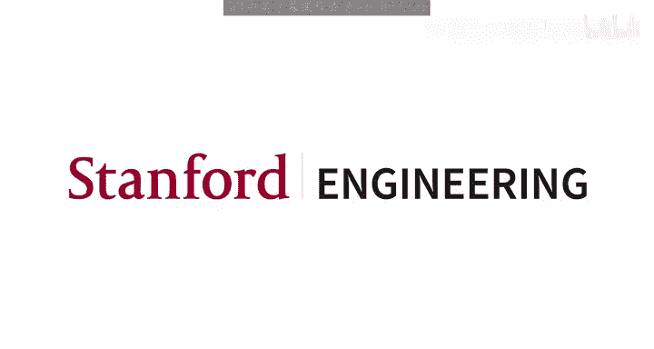
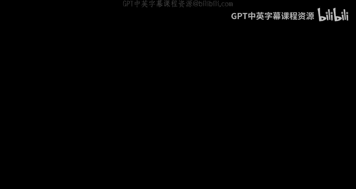
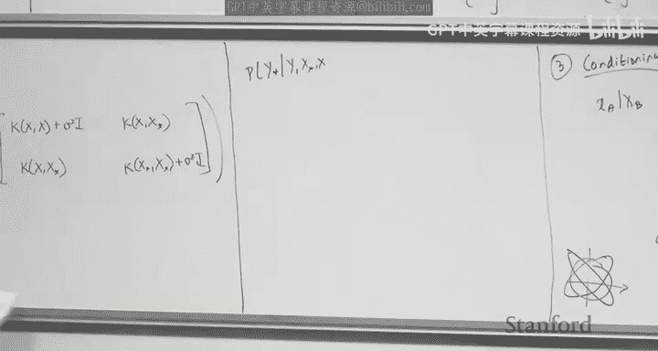
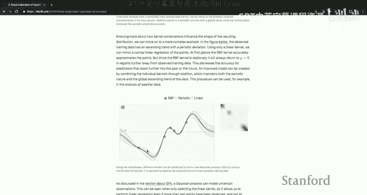
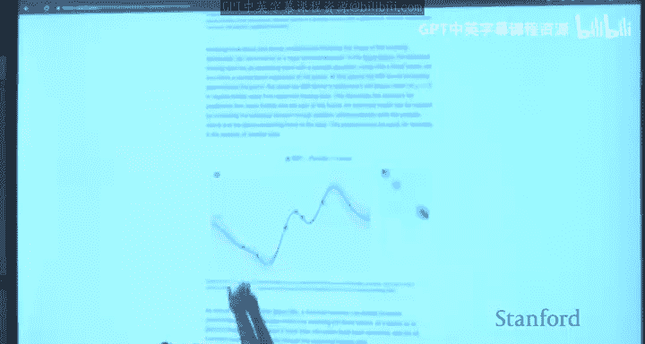
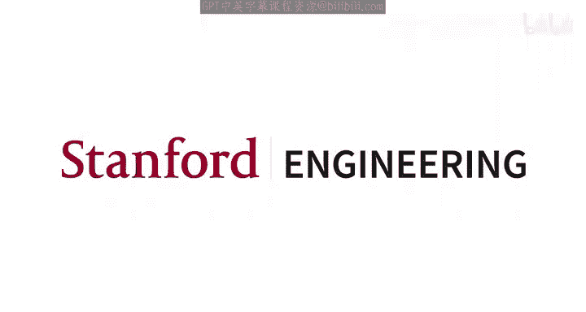

# 机器学习 9：贝叶斯方法 🧠

在本节课中，我们将要学习贝叶斯方法。我们将介绍两种不同的贝叶斯方法：参数化方法和非参数化方法。作为参数化方法的例子，我们将探讨贝叶斯线性回归；作为非参数化方法的例子，我们将学习高斯过程。

---

## 回顾：第8讲 - 核方法

上一节我们介绍了核方法。核是一个函数 **K(x, z)**，其中 **x** 和 **z** 通常是训练集或测试集中的样本。如果存在一个映射函数 **φ**，将样本映射到 **P** 维实空间（**P** 可以是无穷大），使得 **K(x, z) = φ(x)^T φ(z)**，那么 **K** 就被称为核函数。

核函数需要满足两个关键性质：
1.  对称性：**K(x, z) = K(z, x)**。
2.  对于任何有限样本集，由这些样本构成的核矩阵是半正定的。

默瑟定理指出，性质2是 **K** 成为核函数的充要条件。这意味着核矩阵可以看作是由隐式特征映射 **φ** 的特征基构成的。

我们还讨论了支持向量机（SVM），它是一种与核方法结合良好的分类算法。SVM的系数具有稀疏性，这使得它在处理大量样本时依然高效。

---

## 贝叶斯方法简介

到目前为止，我们学习的方法通常被称为频率主义方法。在这些方法中，我们假设未知参数 **θ** 是一个未知的常数向量。我们通过定义似然函数 **L(θ) = log P(数据 | θ)**，并最大化它来估计 **θ**，这被称为最大似然估计。

本节中，我们将看看一种不同的方法——贝叶斯方法。在贝叶斯方法中，我们将参数 **θ** 视为一个未被观测的随机变量。这个看似微小的改变，是贝叶斯方法与频率主义方法的根本区别。

一旦我们将 **θ** 视为随机变量，就需要为其关联一个概率分布。在贝叶斯方法中，我们首先为 **θ** 指定一个**先验概率分布 P(θ)**。然后，我们观察到数据 **x**，并假设数据来自分布 **P(x | θ)**。这个分布与似然函数在数学形式上相同，但哲学解释不同：我们明确地相信 **θ** 有一个先验分布。

与频率主义方法进行最大似然估计不同，贝叶斯方法应用贝叶斯规则来计算**后验分布**：
**P(θ | x) = [P(x | θ) * P(θ)] / P(x)**
其中，**P(x) = ∫ P(x | θ) P(θ) dθ**。

在监督式机器学习中，我们的数据是 **(x, y)**。我们假设 **θ** 有一个先验分布，并且 **y** 在给定 **x** 和 **θ** 的条件下服从某个分布。我们计算后验分布 **P(θ | x, y)**。然后，为了对新的测试样本 **x*** 进行预测，我们计算**后验预测分布**：
**P(y* | x*, x, y) = ∫ P(y* | x*, θ) P(θ | x, y) dθ**

这个公式有一个很好的解释：我们考虑所有可能的模型（即所有可能的 **θ** 值），每个模型都会对 **y*** 做出一个预测。然后，我们根据后验分布 **P(θ | x, y)** 给出的权重，对所有模型的预测进行加权平均。后验分布反映了我们在观察到数据后，对哪个 **θ** 是“正确”模型的信念强度。

贝叶斯方法的一个关键特点是其主观性：先验分布 **P(θ)** 的选择会影响后验分布和最终的预测。同时，贝叶斯方法自然地提供了不确定性估计，因为后验分布本身就是一个完整的概率分布。

---

## 参数化方法示例：贝叶斯线性回归 📈

现在，让我们通过贝叶斯线性回归来具体感受贝叶斯方法在回归问题中的应用。

在线性回归中，我们有一个训练集 **{(x_i, y_i)}**，并假设：
**y_i = θ^T x_i + ε_i**
其中，噪声 **ε_i ~ N(0, σ²)**。

在贝叶斯框架下，我们额外为参数 **θ** 指定一个先验分布。一个常见的选择是高斯先验：
**θ ~ N(0, τ² I)**

在频率主义的线性回归中，我们通过最小化平方损失（等价于最大化似然）来估计 **θ**。而在贝叶斯线性回归中，我们直接应用贝叶斯规则计算后验分布 **P(θ | S)**，其中 **S** 代表整个训练集。

经过推导，后验分布 **θ | S** 也是一个多元高斯分布：
**θ | S ~ N( μ, Σ )**
其中：
*   **μ = (X^T X / σ² + I / τ²)^{-1} (X^T y / σ²)**
*   **Σ = (X^T X / σ² + I / τ²)^{-1}**

这里的均值 **μ** 看起来很像标准正态方程的解 **θ_MLE = (X^T X)^{-1} X^T y**，但多了一项 **I / τ²**。这项起到了**正则化**的作用，即使 **X^T X** 不可逆，加上这项后也总是可逆的。

接下来，我们计算后验预测分布 **P(y* | x*, S)**。对于给定的测试点 **x***，预测分布也是高斯分布：
**y* | x*, S ~ N( x*^T μ, x*^T Σ x* + σ² )**

这个分布的均值是我们的点预测，方差则包含了模型参数的不确定性（通过 **Σ**）和观测噪声（**σ²**）。当训练数据充足且测试点靠近训练数据区域时，预测方差较小，表示模型置信度高；反之，方差较大，表示模型不确定性高。

---

## 非参数化方法示例：高斯过程 🌌

上一节我们介绍了参数化的贝叶斯线性回归，本节中我们来看看非参数化方法——高斯过程。参数化模型的局限性在于其假设的函数形式（如线性）可能无法捕捉数据中复杂的模式。非参数化方法则考虑所有可能的函数，让数据来决定函数的具体形态。

高斯过程可以看作是多元高斯分布在函数空间上的推广。为了理解高斯过程，我们先回顾多元高斯的几个关键性质：

1.  **归一化**：概率密度在全空间积分为1。
2.  **边缘化**：从联合高斯分布中边缘化掉部分变量，得到的边缘分布仍是高斯分布。
3.  **条件化**：已知部分变量的值，其余变量的条件分布仍是高斯分布。
4.  **求和**：两个独立高斯随机变量之和仍是高斯分布。

在高斯过程中，我们不再定义参数向量 **θ**，而是直接定义在函数 **f** 上的分布。一个高斯过程由**均值函数 m(x)** 和**协方差函数（核函数）k(x, x')** 完全定义，记作：
**f ~ GP( m(x), k(x, x') )**

我们可以把函数 **f** 在任意一组输入点 **{x_1, ..., x_N}** 上的取值 **[f(x_1), ..., f(x_N)]** 看作一个向量。这个向量的联合分布就是一个多元高斯分布，其均值向量为 **[m(x_1), ..., m(x_N)]**，协方差矩阵的第 **(i, j)** 项为 **k(x_i, x_j)**。

在回归任务中，我们假设观测到的 **y** 是函数值 **f(x)** 加上高斯噪声：
**y = f(x) + ε, ε ~ N(0, σ²)**

现在，考虑训练输入 **X**、训练输出 **y** 和测试输入 **X***。根据高斯过程的定义和噪声假设，联合分布 **P(f, f*, y)** 是高斯分布。我们关心的是在观察到训练数据 **y** 后，测试输出 **f*** 的后验预测分布。

通过应用多元高斯的**条件化**性质，我们可以推导出后验预测分布 **P(f* | X*, X, y)** 也是一个高斯分布：
**f* | X*, X, y ~ N( μ*, Σ* )**
其中：
*   **μ* = K(X*, X) [K(X, X) + σ² I]^{-1} y**
*   **Σ* = K(X*, X*) + σ² I - K(X*, X) [K(X, X) + σ² I]^{-1} K(X, X*)**

这里，**K(A, B)** 表示通过核函数 **k** 计算矩阵 **A** 中所有行和矩阵 **B** 中所有行之间的协方差所得到的矩阵。

高斯过程的核心在于**核函数 k** 的选择，它定义了函数之间的相似性，从而决定了函数的先验平滑度、周期性等性质。常见的核函数包括径向基函数（RBF）核、周期核、线性核等，它们还可以组合成更复杂的核。

高斯过程是一种非参数化模型，因为它没有对函数 **f** 的形式做任何参数化假设。在预测时，我们需要在内存中保留整个训练集 **{X, y}** 来计算核矩阵。可视化显示，高斯过程的后验预测分布会给出一个均值函数以及围绕它的置信区间。在训练数据密集的区域，置信区间很窄（预测确定）；在数据稀疏的区域，置信区间很宽（预测不确定）。

---

## 总结

本节课中我们一起学习了贝叶斯方法的核心思想及其两种实现方式。

我们首先了解了贝叶斯方法与频率主义方法的根本区别：将模型参数视为随机变量并引入先验分布。通过贝叶斯规则，我们将先验与似然结合，得到后验分布，并进一步计算后验预测分布来进行决策。

接着，我们深入探讨了**贝叶斯线性回归**这一参数化方法的实例。我们看到，通过为权重引入高斯先验，后验分布也具有高斯形式，其解类似于带L2正则化的最小二乘解，并且自然地给出了预测的不确定性。

最后，我们学习了**高斯过程**这一强大的非参数化方法。它将多元高斯分布推广到函数空间，通过核函数定义函数的先验。在回归问题中，高斯过程能够提供完整的预测分布（均值和方差），其预测的灵活性完全由核函数控制，并且能优雅地处理不确定性。

贝叶斯方法为我们提供了强大的框架，不仅能够进行预测，还能量化预测中的不确定性，这在许多实际应用中至关重要。