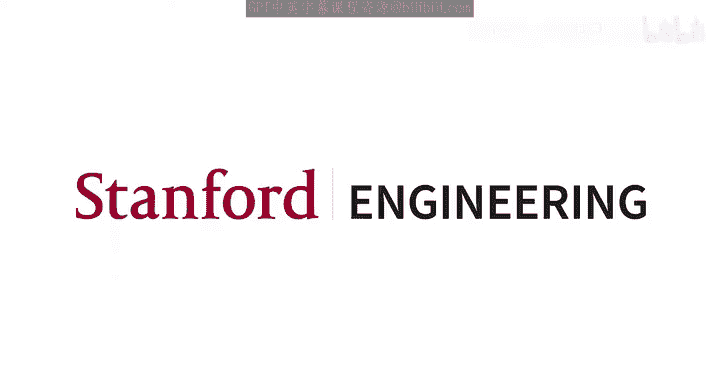
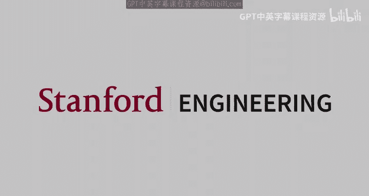

# 机器学习 14：强化学习 I 🎮




在本节课中，我们将要学习强化学习的基础知识，特别是马尔可夫决策过程、价值迭代和策略迭代。这些概念构成了强化学习的核心。

---

## 课程概述与反馈 📢

大家好，欢迎来到CS229第14讲。今天的主题是开始新的一章——强化学习。我们将涵盖马尔可夫决策过程、价值迭代和策略迭代，这些内容构成了强化学习的核心。在周五的讲座中，我们将看到更复杂的扩展。

在进入今天的主题之前，先做一些公告。感谢大家通过我们提交的谷歌表单发送反馈，我们收到了很多好的建议和改进点。以下是一些反馈的简要总结以及我们将采取的改进措施：

*   关于办公时间：有反馈提到办公时间有太多最后一刻的更改。我们将尽力保持办公时间表的稳定，除非有个人紧急情况或助教无法控制的情况。
*   关于讲座形式：有同学希望使用幻灯片格式进行讲座。然而，考虑到这是一门数学性很强的课程，使用白板可能比幻灯片更能清晰地解释数学内容。
*   关于书写：有反馈希望书写更大一些。我会注意写大一些，如果看不清请随时提醒我。
*   关于讲座节奏：有同学觉得太快，有同学觉得太慢。一个好的折衷方案可能是将观众的问题推迟到完成某个章节后再统一回答，如果问题与讲座内容不直接相关，可能会建议在Piazza上提问。
*   关于作业难度：有反馈认为作业中的数学或编程部分太难。机器学习本身就是一个横跨计算机科学和统计学的领域，因此作业在数学和编程上都有一定难度是正常的。编程作业可能感觉有点长，但这是课程结构的一部分。
*   关于编程帮助：在办公时间，我们通常不专注于帮助学生调试代码，我们期望学生具备基本的编程能力。但如果队列中没有积压的问题，助教可能会提供一些帮助。建议在作业阶段的早期参加办公时间以获取帮助。

反馈表单仍然开放，欢迎大家继续提供反馈，我们会尽力改进以满足大家的需求。

---

## 课程回顾与偏差-方差权衡 🔄

上一节我们介绍了课程的整体进度，现在让我们快速回顾一下上一讲的内容，并对整个课程目前的位置做一个总结。

在上一讲或前两讲中，我们深入讨论了偏差-方差权衡。深刻理解偏差-方差权衡应该是你从这门课程中带走的最重要的收获之一。偏差-方差权衡是如此基础，对其有直观而深刻的理解将在你未来的机器学习职业生涯中带来最大的回报。

总结一下偏差-方差权衡。在机器学习中，我们关心的是泛化误差，即我们的模型在未见数据上的表现，而不是在训练数据上的表现。测试误差或泛化误差可以分解为三个可加的部分：

1.  **不可约误差**：这只是测试示例中的噪声。我们的训练数据和测试数据都是有噪声的，测试数据中的噪声贡献了不可约误差，我们对此无能为力，只能接受。
2.  **偏差**：可以将其视为模型的系统误差。这意味着如果你在所有可能的训练集上取平均，你的模型所犯的系统性误差（例如，对某些示例预测不足或过度预测，或者参数比应有的更接近0）被称为偏差。
3.  **方差**：衡量我们的模型对训练数据中噪声的敏感程度。这就是测试数据噪声和训练数据噪声之间的区别所在：测试数据中的噪声导致不可约误差，而训练数据中的噪声导致模型的方差。

我们可以采取许多步骤来减少测试误差，例如尝试更大的模型、获取更多训练数据等。然而，并非所有步骤在所有情况下都有效。为了确定对你当前面临的问题最有效的步骤，理解这种偏差-方差权衡至关重要。

减少训练误差很简单，你总是可以通过使用更大、更复杂的模型来减少训练误差。但我们的目标是提高测试误差。我们所采取的步骤将取决于当前面临的问题主要是偏差问题还是方差问题。偏差-方差权衡基本上告诉你，通过采取某些步骤，你可能会减少偏差或方差之一，但也可能增加另一个。因此，我们能够判断当前哪个问题是主要问题，并有针对性地采取措施来解决该问题（偏差或方差）就变得非常重要。

例如，我们看到如果增加模型容量（即使用更复杂的模型），这将减少模型的偏差，但同时可能增加模型的方差。因此，如果你当前面临的问题是**高方差**，那么你几乎肯定不应该使用更大的模型，因为这会使你的问题恶化。

同样地，对于正则化，如果我们增加正则化，这将减少模型的方差，但也会增加模型的偏差。这意味着如果你当前的问题是**高偏差**，那么增加正则化会使情况变得更糟，而如果问题是高方差，增加正则化则会有所帮助。

因此，对你来说，表征并启发式地估计偏差和方差对当前测试误差的贡献是极其重要的。不幸的是，在实践中没有原则性的方法来分解和获得这些估计，这就是我们使用启发式方法的原因。

启发式方法是：你可以将训练误差本身视为偏差，将交叉验证误差与训练误差之间的差距视为方差。这就是交叉验证发挥作用的地方。交叉验证最重要的用途是我们可以从当前模型中获得这种偏差和方差的分解。

一旦我们得到了这种分解，我们就可以判断模型当前面临的是较大的偏差问题还是较大的方差问题，并根据哪个问题更大来采取一些补救措施。

总结是：每当你进行模型开发并希望提高模型性能时，你应该始终同时查看训练误差和交叉验证误差。我们关心的是提高交叉验证误差或测试误差，但仅仅查看这些误差本身并不能提供可操作的见解。为了获得可操作的见解，你需要同时查看训练误差和交叉验证误差，判断当前情况是高偏差还是高方差，然后相应地采取行动来补救高偏差或高方差。这可能是对你整个机器学习职业生涯最有帮助的事情。

---

## 课程整体概览 📚

现在让我们从整体上看看我们在课程中的位置。以下是我们迄今为止涵盖内容的快速概述：

*   **第1-4周：监督学习**。监督学习是学习一个我们称之为假设的函数 `h`，它将输入 `x` 映射到输出 `y`。在监督学习中，输入和输出的概念非常清晰，而在无监督学习中则不然。我们有一个大小为 `n` 的训练集，包含这些 `(x, y)` 对，我们的目标是从这个训练集中学习这个假设函数，使其能够很好地泛化到未见数据。我们看到了两种主要算法：**分类**与**回归**。这种分类是基于 `y` 变量的数据类型。如果 `y` 是二元的（0或1），我们称之为分类；如果 `y` 是连续的，我们称之为回归。
*   **广义线性模型**：在了解了线性和逻辑回归之后，我们将其推广为**广义线性模型**，其中 `y|x` 属于指数族分布。GLM不仅适用于分类或回归，它概括了 `y` 的数据类型。
*   **判别式与生成式模型**：我们还看到了构建模型的两种不同方法：判别式与生成式。在判别式模型中，我们直接学习 `y|x`，广义线性模型就是一个例子。另一种方法是生成式模型，我们想要学习如何生成新的示例，即生成完整的 `(x, y)` 对。
*   **非线性模型**：之后我们转向了非线性模型。我们实际上已经在第一次作业中通过使用特征映射探索了非线性。我们看到的更正式的特征映射方法是**核方法**。核是具有隐式特征映射的对称正定函数。使用核，我们可以构建基于核的方法，例如用于分类问题的支持向量机和用于回归问题的高斯过程。
*   **神经网络**：我们看到的另一种非线性方法是**可学习的特征**，即神经网络。你可以将神经网络视为最后一层的广义线性模型，而在此之前的所有层都是某种可学习的特征映射。
*   **学习理论**：之后我们转向了学习理论，主要涉及正则化及其贝叶斯解释（正则化对应于贝叶斯设置中的MAP估计）。我们研究了偏差和方差以及偏差-方差权衡，还研究了**一致收敛**，这是课程中更理论的部分。

以上就是直到上一讲的内容。今天和下一讲我们将涵盖强化学习，这将是对强化学习的一个非常快速的概述。强化学习是一个超级广阔的领域，有多门专门的课程，我们只会涵盖基础知识，并为你提供一个关于不同强化学习算法如何组合在一起的整体图景。

从下周开始，我们将开始学习无监督学习。最后，在第8周，我们将在周一和周三进行两次讲座，对整个课程进行全面复习，希望能为期末考试做好充分准备。

---

## 强化学习介绍 🤖

在迄今为止我们涵盖的主题（主要是监督学习）中，我们总是被告知对于给定的输入或给定情况，正确答案是什么。对于每个 `x`，我们都有一个对应的 `y`，这是正确答案或我们的模型应该学会预测的答案，并且这是直接给我们的。这就是为什么我们称之为监督学习。

而在强化学习中，这种监督有点弱。我们不是被告知在给定情况下该做什么，而是被给予某种**奖励**。你可以将其视为用奖励 `R` 代替监督 `y`。奖励总是一个实数值，可以是正的也可以是负的。你可以将奖励视为你工作做得有多好。没有所谓的“正确”奖励，强化学习的目标是最大化我们的**长期奖励**。

这意味着我们处理的是随时间变化的情况。在监督学习中，我们处理的是固定情况，每个示例都是独立同分布的。而在强化学习中，我们试图编程一个在环境或现实世界或模拟器中生活的智能体，使其随着时间的推移表现良好。

这种智能体的例子可以是学习如何行走的机器人、下棋或围棋的游戏智能体，甚至是你在金融市场中使用的自动交易代理。在这些场景中，你随着时间的推移做出多个决策，每次采取行动后都会获得某种奖励。

强化学习的目标是最大化随时间累积的奖励。这意味着我们需要从长远角度来优化我们将要累积的奖励量，从现在开始一直到未来。这与监督学习设置非常不同，在监督学习中，我们被给予一个示例，我们只关心在该示例上表现良好，而下一个示例是完全独立的。

正是这种**时间概念**使强化学习不同于一般的监督学习。在强化学习中，我们一次做一个决策，每个决策都会获得一些奖励，我们的目标是最大化这种累积到未来的奖励。

---

## 马尔可夫决策过程 🧩

我们形式化强化学习的方式是通过称为**MDP**或**马尔可夫决策过程**的形式体系。

一个MDP是一个五元组 `(S, A, P, γ, R)`，其中：

*   `S` 是**状态**的集合，即我们的智能体当前可能处于的所有可能状态的集合。
*   `A` 是**动作**的集合。
*   `P` 是**转移概率**，即 `P(s'|s, a)`，表示在状态 `s` 下采取动作 `a` 后转移到状态 `s'` 的概率。
*   `γ` 是**折扣因子**，一个介于0和1之间的标量。
*   `R` 是**奖励函数**，`R: S × A → ℝ` 或有时只是 `R: S → ℝ`。

让我们看一个例子。假设有一个智能体生活在一个网格世界中。智能体在任何给定时间可以位于这些网格中的一个。我们的目标是到达右上角的格子（奖励+1），并避免左下角的格子（奖励-1）。在其他所有格子中，我们假设有一个小的负奖励（例如-0.02）。

*   `S` 是所有可能格子的集合（例如 `(1,1)`, `(1,2)`, ...）。
*   `A` 是我们可以采取的动作集合：向北、向南、向西、向东移动。
*   `P` 是转移概率。例如，如果我们在状态 `(1,3)` 并采取动作“向北”，由于环境的不确定性（例如机器人打滑），我们可能以0.8的概率到达 `(2,3)`，以0.1的概率到达 `(1,2)`，以0.1的概率到达 `(1,4)`。
*   `R` 是奖励函数。例如，`R((4,3)) = +1`，`R((4,2)) = -1`，其他状态 `R(s) = -0.02`。
*   `γ` 是折扣因子，例如 `γ = 0.99`。

当智能体启动时，我们假设它从某个初始状态 `s₀` 开始。然后我们采取一个动作 `a₀`，根据转移概率 `P(s₁|s₀, a₀)` 进入一个新状态 `s₁`。在状态 `s₁`，我们获得奖励 `R(s₁)`，然后采取动作 `a₁`，进入状态 `s₂`，依此类推。这个状态和动作的序列通常被称为一个**试验**、**回合**或**轨迹**。

当智能体经历一个特定的轨迹时，它在每个状态 `s` 都会获得一些奖励。随着时间的推移，智能体会累积奖励。这就是折扣因子 `γ` 发挥作用的地方。折扣因子基本上是一个系数，我们用它来乘以所有未来的奖励。在状态 `s₁` 获得的奖励将乘以因子 `γ`，在状态 `s₂` 获得的奖励将乘以 `γ²`，依此类推。智能体在未来累积的是这些**折扣奖励的总和**，而我们的目标就是最大化这个总和。

折扣因子的一个思考方式是：任何我们获得的正面奖励，越早获得越好。因此，折扣因子激励模型尽早获得更大的奖励，并激励模型将任何负面奖励推迟到未来。另一个常见的解释（尤其是在金融环境中）是，你可以将折扣因子视为利率，这意味着你希望尽早赚钱，并将损失推迟到未来。

---

## 策略与价值函数 ⚖️

给定这个MDP设置，我们可以定义两个核心概念：**策略**和**价值函数**。

**策略** `π` 是一个从状态到动作的映射：`π: S → A`。它告诉你在给定状态下应该采取什么动作。策略是智能体可以灵活学习的东西，我们的目标是学习一个策略，即学习这个从状态映射到动作的函数。

**价值函数** `V^π` 与策略 `π` 相关联。它是一个从状态到实值的函数：`V^π: S → ℝ`。`V^π(s)` 定义为从状态 `s` 开始，然后永远遵循策略 `π` 所获得的**期望折扣奖励总和**：

```
V^π(s) = 𝔼 [ R(s₀) + γR(s₁) + γ²R(s₂) + ... | s₀ = s, a_t ∼ π(s_t) ]
```

其中，期望是因为转移是随机的。奖励是短视的、即时的满足感，而价值是长期的、远见的，是遵循特定策略将获得的总折扣奖励总和。

为了最大化价值，你可能需要牺牲即时奖励，如果长期来看有做得非常好的前景。这就是奖励和价值之间的关键区别。

给定一个策略 `π`，我们可以计算相应的价值函数 `V^π`。反之，给定一个价值函数 `V`，我们可以构造一个相应的策略 `π`，其中在每个状态 `s` 采取的动作是选择那个能让你以最高概率到达具有最高价值的下一状态的动作。

因此，策略和价值函数在某种意义上是相互对偶的。`π` 隐含地定义了每个状态的价值函数，而 `V` 也隐含地定义了一个策略。

---

## 贝尔曼方程与策略评估 🔄

从策略 `π` 到价值 `V^π` 的关系可以通过**贝尔曼方程**来表达：

```
V^π(s) = R(s) + γ * Σ_{s'∈S} P(s' | s, π(s)) * V^π(s')
```

这个方程是递归的：一个状态的价值等于即时奖励加上所有可能下一状态的折扣价值的期望。

假设我们有有限个状态，`V^π` 是一个向量（每个状态一个值）。`R` 也是一个向量（每个状态的即时奖励）。我们可以定义一个矩阵 `P^π`，其中第 `i` 行第 `j` 列的元素是 `P(s_j | s_i, π(s_i))`，即从状态 `s_i` 遵循策略 `π` 采取动作后转移到状态 `s_j` 的概率。

利用这个矩阵，贝尔曼方程可以写成向量形式：

```
V^π = R + γ P^π V^π
```

解这个线性方程组，我们可以得到：

```
V^π = (I - γ P^π)^{-1} R
```

这为我们提供了一种方法：**给定一个策略 `π`，计算遵循该策略时每个状态的长期价值**。这个过程称为**策略评估**。

---

## 最优价值函数与最优策略 🏆

我们定义**最优价值函数** `V^*` 为所有可能策略中能获得的最大价值：

```
V^*(s) = max_π V^π(s)
```

`V^*(s)` 告诉我们，从状态 `s` 开始，通过选择最佳可能策略，我们能获得的最高期望折扣奖励总和是多少。

`V^*` 也必须满足一个贝尔曼方程，称为**贝尔曼最优性方程**：

```
V^*(s) = R(s) + max_{a∈A} [ γ * Σ_{s'∈S} P(s' | s, a) * V^*(s') ]
```

与之前的贝尔曼方程不同，这里有一个 `max` 操作符，因此不能直接线性求解。

给定最优价值函数 `V^*`，我们可以定义**最优策略** `π^*`：

```
π^*(s) = argmax_{a∈A} [ Σ_{s'∈S} P(s' | s, a) * V^*(s') ]
```

最优策略告诉我们，在状态 `s` 下，应该采取哪个动作以最大化期望的长期价值。

---

## 价值迭代算法 🔄

上一节我们定义了最优价值函数和最优策略，本节我们来看看如何计算它们。价值迭代是一种算法，用于计算最优价值函数 `V^*`。

**算法步骤**：
1.  对于所有状态 `s`，初始化 `V(s) = 0`。
2.  重复直到收敛：
    *   对于每个状态 `s`，更新：
        ```
        V(s) ← R(s) + max_{a∈A} [ γ * Σ_{s'∈S} P(s' | s, a) * V(s') ]
        ```

这个更新规则正是贝尔曼最优性方程，但我们将其用作迭代更新。我们从一个初始估计（全零）开始，反复应用这个“贝尔曼备份”操作符。

**为什么这会收敛？**
贝尔曼备份操作符在数学上被证明是一个**压缩映射**。这意味着对于任何两个价值函数估计 `V1` 和 `V2`，应用操作符后得到的两个新估计之间的距离会比原来的两个估计之间的距离更小。压缩映射有一个**不动点**，反复应用操作符会收敛到这个不动点，而这个不动点正是最优价值函数 `V^*`。

因此，无论从哪里开始，价值迭代最终都会收敛到 `V^*`。收敛后，我们可以使用 `V^*` 通过之前的最优策略公式来提取最优策略 `π^*`。

---

## 策略迭代算法 🔄

另一种计算最优策略的算法是**策略迭代**。它直接在策略空间中进行操作。



**算法步骤**：
1.  随机初始化一个策略 `π`。
2.