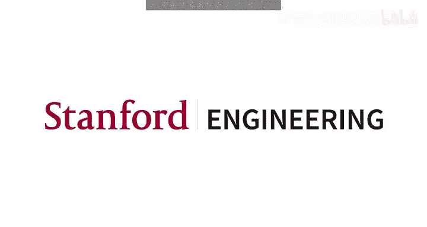
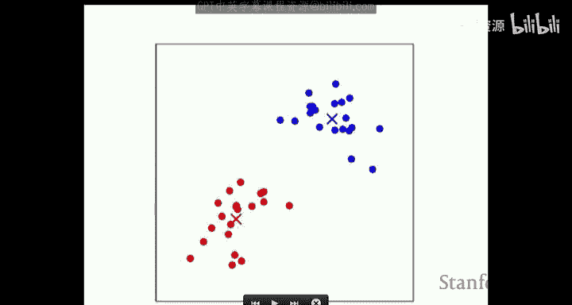
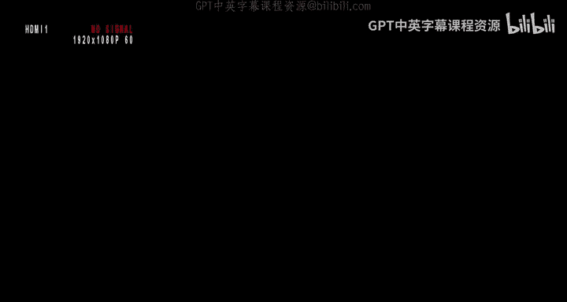
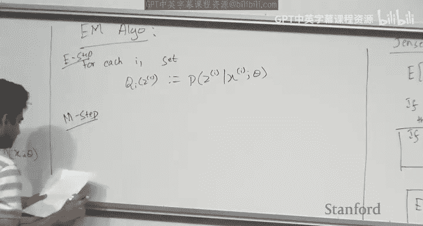
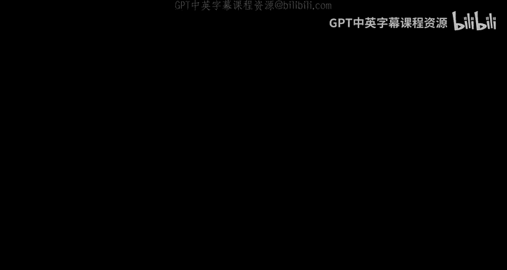
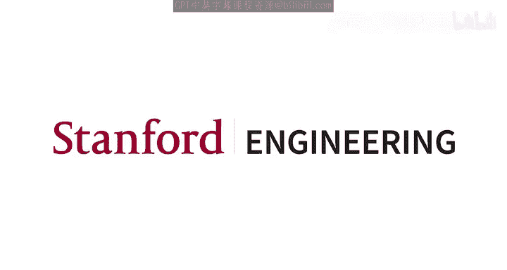

# 机器学习 16：K-means、GMM与EM算法 🎯

在本节课中，我们将开始学习无监督学习的新篇章。具体来说，我们将探讨K-means聚类算法、高斯混合模型以及期望最大化算法。这些算法旨在从没有标签的数据中发现潜在的结构和模式。

## 概述

到目前为止，我们已经学习了监督学习，即通过给定的输入-输出对来学习一个映射函数。之后，我们探讨了学习理论，包括偏差-方差权衡和泛化能力。上周，我们学习了强化学习，其目标是最大化长期累积奖励。从今天开始，我们将进入无监督学习领域。

在无监督学习中，我们只获得一组数据点 \( \{x^{(1)}, x^{(2)}, ..., x^{(n)}\} \)，其中每个 \( x^{(i)} \in \mathbb{R}^d \)，但没有对应的标签 \( y \)。我们的目标是发现这些数据中的某种有趣结构，例如聚类或密度分布。

## 从监督学习到无监督学习

在监督学习中，例如逻辑回归，我们被给予带有标签的数据点，目标是找到一个分离超平面。而在无监督学习中，我们只获得数据点本身，目标是发现其中的聚类结构。例如，给定一组二维点，我们可能希望将它们分为两个簇。

然而，无监督学习的问题定义通常不如监督学习明确。例如，对于同一组数据点，可能存在多种合理的聚类方式。因此，我们的目标是在存在这种模糊性的情况下，学习到一种有意义的结构。

## K-means聚类算法

K-means算法是最简单的无监督学习算法之一。它旨在将数据点划分为 \( K \) 个簇。

### 算法步骤

以下是K-means算法的具体步骤：

1.  **初始化**：随机选择 \( K \) 个簇中心 \( \mu_1, \mu_2, ..., \mu_K \)，每个 \( \mu_j \in \mathbb{R}^d \)。
2.  **重复直到收敛**：
    *   **分配步骤**：对于每个数据点 \( x^{(i)} \)，将其分配到最近的簇中心。
        \[
        c^{(i)} := \arg\min_j \| x^{(i)} - \mu_j \|^2
        \]
    *   **更新步骤**：对于每个簇 \( j \)，重新计算其中心为该簇中所有点的均值。
        \[
        \mu_j := \frac{\sum_{i=1}^{n} \mathbb{1}\{c^{(i)} = j\} x^{(i)}}{\sum_{i=1}^{n} \mathbb{1}\{c^{(i)} = j\}}
        \]

### 算法直观解释

K-means算法可以直观地理解为坐标下降法，用于最小化一个称为**失真函数**的目标：
\[
J(c, \mu) = \sum_{i=1}^{n} \| x^{(i)} - \mu_{c^{(i)}} \|^2
\]
在分配步骤中，我们固定 \( \mu \) 优化 \( c \)；在更新步骤中，我们固定 \( c \) 优化 \( \mu \)。这个函数是非凸的，因此算法可能收敛到不同的局部最优解，具体取决于初始化的簇中心。

## 密度估计与高斯混合模型

上一节我们介绍了用于发现离散簇结构的K-means算法。本节中，我们来看看一个相关但更一般的问题：**密度估计**。密度估计的目标是，给定一组来自某个未知连续概率分布的数据点，估计出这个分布的概率密度函数。

这是一个困难的问题，因为存在无数种可能的密度函数可以解释观测到的数据。一个常见的方法是使用**高斯混合模型**。GMM假设数据是由 \( K \) 个不同的高斯分布混合生成的。每个高斯分布对应一个潜在的“成分”，数据点以一定的概率从这些成分中生成。

### GMM的生成过程

GMM的生成过程如下：

1.  首先，从一个多项分布中采样一个潜在变量 \( z^{(i)} \)，该分布参数为 \( \phi \)，其中 \( \phi_j = P(z^{(i)} = j) \)，且 \( \sum_{j=1}^{K} \phi_j = 1 \)。
2.  然后，根据采样到的 \( z^{(i)} = j \)，从对应的高斯分布 \( \mathcal{N}(\mu_j, \Sigma_j) \) 中生成观测数据 \( x^{(i)} \)。

这里，\( z^{(i)} \) 是**隐变量**，因为我们没有观测到它。我们的目标是在只给定 \( x^{(i)} \) 的情况下，估计所有参数 \( \phi, \mu, \Sigma \)。

### 直观的GMM算法（软K-means）

受K-means启发，我们可以为GMM设计一个直观的迭代算法：

1.  **E步（期望步）**：对于每个数据点 \( i \) 和每个簇 \( j \)，计算点 \( i \) 属于簇 \( j \) 的后验概率（权重）。
    \[
    w_{ij} := P(z^{(i)} = j | x^{(i)}; \phi, \mu, \Sigma)
    \]
2.  **M步（最大化步）**：使用这些权重作为“软分配”，重新估计参数。
    *   \( \phi_j := \frac{1}{n} \sum_{i=1}^{n} w_{ij} \)
    *   \( \mu_j := \frac{\sum_{i=1}^{n} w_{ij} x^{(i)}}{\sum_{i=1}^{n} w_{ij}} \)
    *   \( \Sigma_j := \frac{\sum_{i=1}^{n} w_{ij} (x^{(i)} - \mu_j)(x^{(i)} - \mu_j)^T}{\sum_{i=1}^{n} w_{ij}} \)

这个算法可以看作是K-means的“软”版本，其中数据点以概率形式属于所有簇，而不是硬性分配到一个簇。

## 期望最大化算法框架

上一节我们基于直觉给出了GMM的迭代算法。本节中，我们将介绍一个更通用、更原则性的框架——**期望最大化算法**，它能推导出与直觉算法相同的更新规则。EM算法为在存在隐变量的模型中进行最大似然估计提供了一个通用框架。

### Jensen不等式

在推导EM算法之前，我们需要一个重要的数学工具：**Jensen不等式**。

*   如果 \( f \) 是一个凸函数，那么对于任意随机变量 \( X \)，有：
    \[
    \mathbb{E}[f(X)] \ge f(\mathbb{E}[X])
    \]
*   如果 \( f \) 是严格凸函数，那么等号成立当且仅当 \( X \) 是常数（以概率1）。
*   对于凹函数（如 \( \log \)），不等式方向反转：
    \[
    \mathbb{E}[\log X] \le \log(\mathbb{E}[X])
    \]

### EM算法推导

我们的目标是最大化观测数据的对数似然 \( \log p(x; \theta) \)，其中 \( \theta \) 代表所有参数。由于涉及隐变量 \( z \)，直接最大化很困难。

1.  我们引入一个关于 \( z \) 的任意分布 \( q(z) \)（满足 \( q(z) > 0 \)），将对数似然重写为：
    \[
    \log p(x; \theta) = \log \sum_z q(z) \frac{p(x, z; \theta)}{q(z)} = \log \mathbb{E}_{z \sim q} \left[ \frac{p(x, z; \theta)}{q(z)} \right]
    \]
2.  应用Jensen不等式（因为 \( \log \) 是凹函数）：
    \[
    \log p(x; \theta) \ge \mathbb{E}_{z \sim q} \left[ \log \frac{p(x, z; \theta)}{q(z)} \right] \triangleq \mathcal{L}(q, \theta)
    \]
    我们称 \( \mathcal{L}(q, \theta) \) 为**证据下界**。
3.  Jensen不等式告诉我们，当 \( \frac{p(x, z; \theta)}{q(z)} \) 为常数（与 \( z \) 无关）时，等号成立。这等价于：
    \[
    q(z) = p(z | x; \theta)
    \]
    即 \( q(z) \) 等于给定当前参数 \( \theta \) 下隐变量的后验分布。

基于此，EM算法迭代执行以下两步：

*   **E步**：固定参数 \( \theta \)，令 \( q(z) := p(z | x; \theta) \)。这使得下界 \( \mathcal{L} \) 在当前的 \( \theta \) 处紧贴于对数似然。
*   **M步**：固定分布 \( q(z) \)，更新参数 \( \theta := \arg\max_{\theta} \mathcal{L}(q, \theta) \)。这提升了下界，同时也提升了对数似然（因为下界是它的下界）。

通过交替执行E步和M步，我们不断优化证据下界，从而间接地最大化观测数据的对数似然，最终收敛到一个局部最优解。

## 总结

本节课中，我们一起学习了无监督学习的入门知识。我们首先介绍了**K-means聚类算法**，它是一种通过迭代分配和更新来发现数据中离散簇结构的简单方法。接着，我们探讨了**密度估计**问题，并引入了**高斯混合模型**作为解决方案，它假设数据来自多个高斯分布的混合。我们基于K-means的直觉为GMM设计了一个迭代算法。最后，我们介绍了更通用的**期望最大化算法框架**，它通过交替执行E步（计算隐变量后验）和M步（最大化证据下界）来解决存在隐变量的模型的最大似然估计问题。EM算法为理解包括GMM在内的许多现代生成模型提供了重要的理论基础。