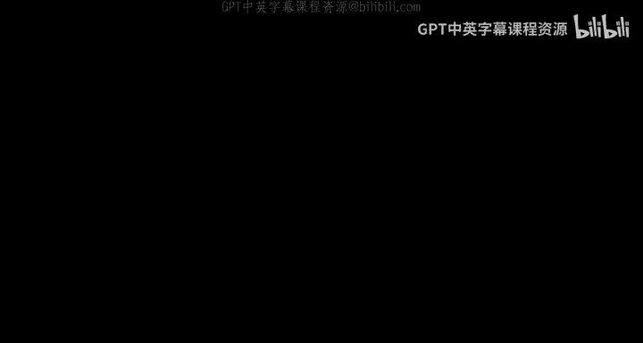
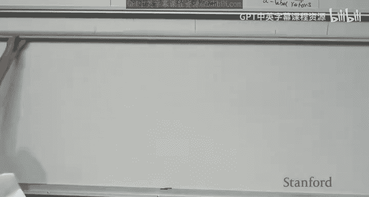
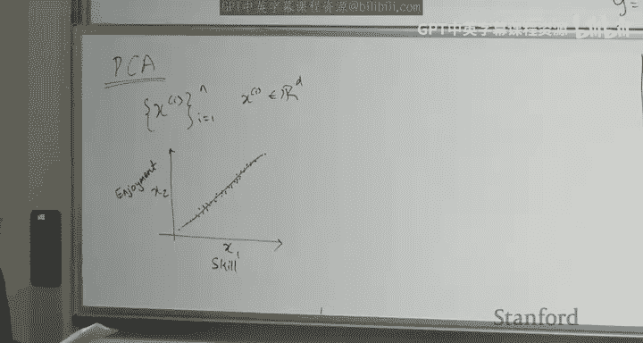
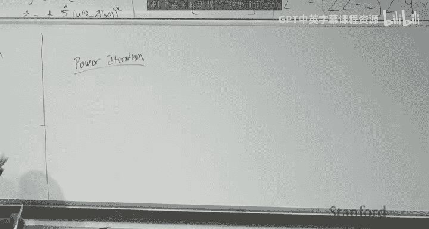
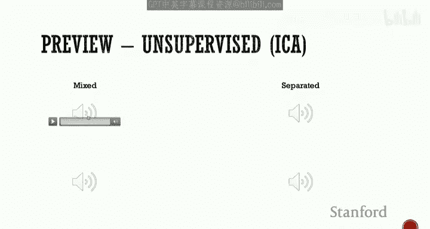
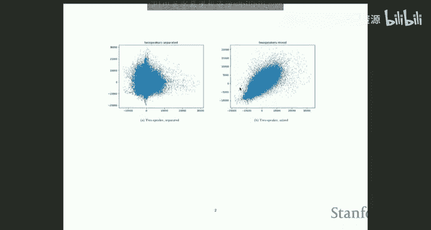
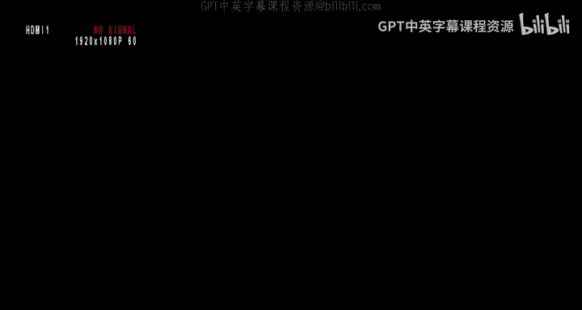
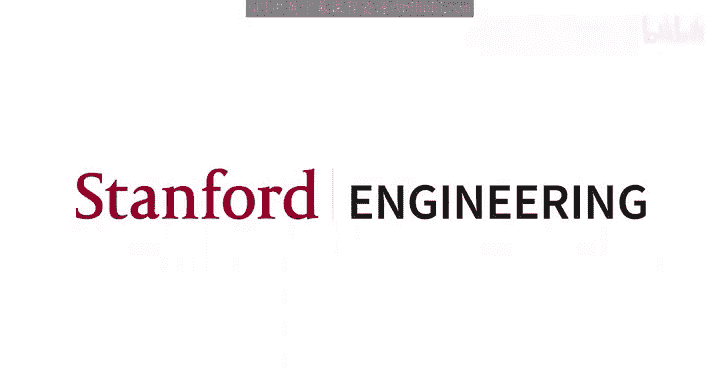

# 机器学习 18：主成分分析与独立成分分析 🎯

在本节课中，我们将继续学习无监督学习。主要内容包括：回顾并深入理解因子分析，完成主成分分析的学习，并开始介绍独立成分分析。

## 1. 回顾：期望最大化算法与因子分析 📚

上一讲我们证明了期望最大化算法的收敛性。证明的核心思想是，算法在每次迭代中都能保证增加观测数据的似然值。我们通过詹森不等式和M步的优化过程展示了这一点。

接着，我们学习了因子分析。因子分析旨在解决当数据维度 `d` 远大于样本数量 `n` 时，简单高斯模型会导致协方差矩阵奇异的问题。其核心思想是引入一个低维的隐变量 `z`（维度 `k`，且 `k < d`），通过一个映射矩阵 `L` 和噪声项 `Ψ` 来生成高维观测数据 `x`。

**模型公式**：
`z ~ N(0, I)`， `x|z ~ N(μ + Lz, Ψ)`
其中 `Ψ` 是对角矩阵。

在E步，我们计算隐变量 `z` 的后验分布 `Q_i`。在M步，我们更新参数 `μ`、`L` 和 `Ψ`。虽然更新公式看起来复杂，但可以直观理解：
*   `μ` 的更新就是 `x` 的样本均值。
*   `L` 的更新类似于在多个线性回归问题上同时进行参数估计，其中隐变量 `z` 的估计值 `ẑ` 充当了设计矩阵的角色。
*   `Ψ` 的更新则类似于估计每个维度上线性回归的残差噪声。

因子分析通过模型 `x ~ N(μ, LL^T + Ψ)` 确保了协方差矩阵 `LL^T + Ψ` 是非奇异的，从而解决了高维小样本的问题。

## 2. 主成分分析 🧩

上一节我们介绍了因子分析，它是一种概率性的子空间发现方法。本节中，我们来看看另一种更常用的非概率性方法——主成分分析。

PCA的目标是发现数据实际所在的低维子空间。我们通常假设样本数 `n` 大于维度 `d`。

### 2.1 核心思想与步骤

PCA的核心思想是：找到一个 `k` 维子空间（`k < d`），使得将原始数据投影到这个子空间后，投影点的方差最大化。这意味着我们希望在降维的同时，尽可能保留数据中的变异信息。

**以下是PCA的实施步骤：**

1.  **数据标准化**：首先，对数据的每个特征（列）进行标准化，使其均值为0，方差为1。这消除了不同特征量纲的影响。
    *   **公式**：对于第 `j` 个特征，计算 `μ_j = (1/n) Σ x_{ji}`， `σ_j^2 = (1/n) Σ (x_{ji} - μ_j)^2`，然后令 `x_{ji}^{(std)} = (x_{ji} - μ_j) / σ_j`。

2.  **计算样本协方差矩阵**：标准化后，计算数据的样本协方差矩阵。对于已中心化（均值为0）的数据 `X`，协方差矩阵为 `(1/n) X^T X`。

3.  **特征分解**：对协方差矩阵 `(1/n) X^T X` 进行特征分解，得到特征值 `λ_1 ≥ λ_2 ≥ ... ≥ λ_d` 和对应的特征向量 `u_1, u_2, ..., u_d`。

4.  **选择主成分**：选择前 `k` 个最大的特征值对应的特征向量 `u_1, ..., u_k` 作为新子空间的标准正交基。这 `k` 个向量被称为“主成分”。

5.  **数据投影**：将原始数据 `X` 投影到选定的 `k` 维子空间上，得到降维后的数据表示 `Z`。
    *   **公式**：`Z = X U_k`，其中 `U_k` 是由前 `k` 个特征向量组成的 `d × k` 矩阵。

### 2.2 方差解释与K值选择

如何确定降维后的维度 `k`？一个常用的方法是根据保留的方差比例来选择。

**公式**：选择最小的 `k`，使得 `(Σ_{i=1}^k λ_i) / (Σ_{i=1}^d λ_i) ≥ t`，其中 `t` 是预设的阈值（例如0.95，代表保留95%的方差）。

### 2.3 与因子分析的区别

*   **方向**：PCA中的矩阵 `U` 将数据从高维 `x` 映射到低维 `z`（投影），而因子分析中的矩阵 `L` 将隐变量从低维 `z` 映射到高维 `x`（生成）。
*   **概率性**：PCA是非概率的，直接基于方差最大化；因子分析是概率性的，假设了生成模型。
*   **顺序**：PCA可以先进行全部分解，再根据方差比例选择 `k`；因子分析需要预先指定 `k`。
*   **适用场景**：PCA更通用、计算简单（特征分解），在实践中更常用；因子分析在高维小样本 (`d >> n`) 且需要概率解释时可能更有优势。

对于大规模矩阵的特征分解，可以使用**幂迭代法**等数值方法高效地计算主特征向量。

## 3. 独立成分分析 🎧

前面我们学习了用于降维和发现子空间的PCA与因子分析。ICA要解决的是一个完全不同的问题——盲源分离。

### 3.1 问题动机：鸡尾酒会问题

ICA最经典的例子是“鸡尾酒会问题”：在一个房间里有 `d` 个人同时说话，房间不同位置放置了 `d` 个麦克风。每个麦克风录制到的都是所有人声音的混合。我们的目标是，仅根据这些混合录音，分离出每个说话者独立的原始声音信号。

**模型假设**：
1.  有 `d` 个独立的源信号 `s`（例如，每个说话者的声音波形）。
2.  有 `d` 个观测信号 `x`（麦克风录音）。
3.  观测信号是源信号的线性混合：`x = A s`，其中 `A` 是一个 `d × d` 的混合矩阵。
4.  目标：找到解混矩阵 `W ≈ A^{-1}`，使得 `s = W x` 恢复出源信号。

### 3.2 关键假设

仅凭线性混合假设无法唯一确定解。ICA引入以下关键假设：
1.  **独立性**：源信号 `s_1, s_2, ..., s_d` 彼此统计独立。
2.  **非高斯性**：源信号具有非高斯的分布。这是至关重要的假设，因为高斯分布的线性混合后，其独立性无法被区分，会导致无法恢复源信号。

直观上，非高斯分布（如拉普拉斯分布、逻辑分布）的密度函数具有“尖峰”或“重尾”特性，在混合后会产生特定的“角状”或“菱形”散点图结构。ICA算法通过寻找一个投影方向，使得投影后的信号尽可能非高斯（例如，峰度最大），从而恢复出独立的源信号。

### 3.3 ICA算法推导

我们假设每个源信号 `s_j` 的分布为某个已知的非高斯密度函数，例如逻辑斯蒂密度：`p_s(s) = g'(s) = g(s)(1 - g(s))`，其中 `g(s)` 是逻辑斯蒂函数 `1/(1+e^{-s})`。

给定观测数据 `x` 和解混矩阵 `W`，恢复的源信号为 `s = Wx`。根据概率密度变换的雅可比行列式，观测数据 `x` 的似然函数为：

**公式**：
`L(W) = Σ_{i=1}^n ( Σ_{j=1}^d log p_s(w_j^T x^{(i)}) + log |det(W)| )`
其中 `w_j^T` 是 `W` 的第 `j` 行。

我们的目标是最大化这个似然函数 `L(W)` 以找到 `W`。通过对 `W` 求梯度并利用梯度上升法进行优化。

**更新规则（对于逻辑斯蒂源分布）**：
`W := W + α * ( [1 - 2g(w_1^T x^{(i)}); ...; 1 - 2g(w_d^T x^{(i)}) ] * (x^{(i)})^T + (W^T)^{-1} )`
其中 `α` 是学习率。

优化收敛后，用得到的 `W` 乘以观测数据 `x`，即可得到分离的源信号估计 `s`。

### 3.4 注意事项

ICA恢复的信号存在固有的模糊性：
1.  **排列模糊性**：恢复出的信号顺序可能与原始源信号顺序不同。
2.  **缩放模糊性**：恢复出的信号幅度可能与原始信号成比例关系（包括符号可能相反）。
在音频分离等应用中，这些模糊性通常是可接受的。

## 总结 📝

本节课中我们一起学习了无监督学习中的三个重要模型：
1.  **因子分析**：一种概率性生成模型，通过引入低维隐变量解决高维小样本数据的建模问题，使用EM算法求解。
2.  **主成分分析**：一种非概率的降维技术，通过最大化投影方差来找到数据的主成分子空间，核心是计算协方差矩阵的特征分解。
3.  **独立成分分析**：用于解决盲源分离问题，在源信号独立且非高斯的假设下，通过最大化似然函数来寻找解混矩阵，从而分离混合信号。

PCA和因子分析都用于发现数据的低维结构，而ICA则用于分离混合信号中的独立成分。理解它们各自的假设、目标和应用场景，对于解决不同的无监督学习问题至关重要。