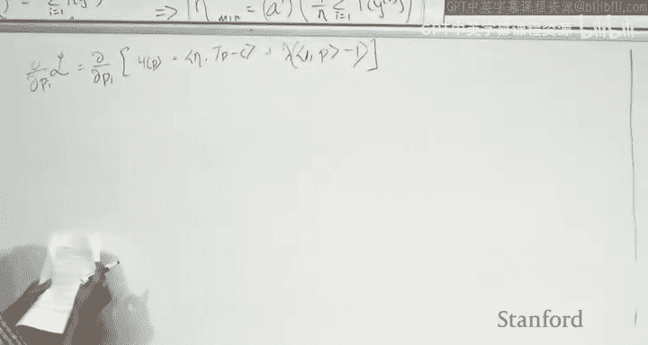
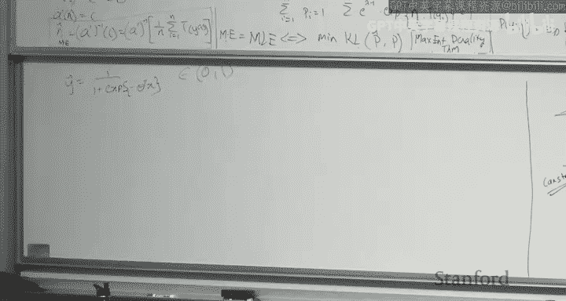
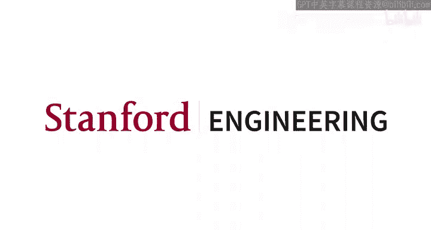

# 机器学习 19：最大熵与校准 📊

在本节课中，我们将要学习最大熵原理，并了解我们之前课程中见过的指数族分布是如何从该原理推导出来的。我们将展示在什么条件下，最大化熵等同于最大化似然估计（MLE）。这还将引导我们探讨一些有趣的主题，例如校准。我们将简要讨论校准的含义及其与最大化熵的关系。最后，如果时间允许，我们将讨论期望最大化算法的几个变体，以及这些变体如何引向无监督学习中的一些最新进展，如变分推断和变分自编码器。

---

## 上节课回顾 🔄

上一节我们介绍了主成分分析和独立成分分析。在PCA中，我们的目标是找到一个低维子空间。而在ICA中，我们的目标是找到解释数据的独立源。我们假设存在D个独立的源，它们通过一个混合矩阵混合成观测数据，我们的目标是从观测数据中恢复这些独立源。

---

## 指数族分布的最大似然估计 📈

首先，我们来推导给定观测数据y时，指数族分布的自然参数η的最大似然估计。

我们有一个指数族分布：
`p(y | η) = b(y) * exp(η^T * T(y) - a(η))`

给定数据 `S = {y_1, ..., y_n}`，我们想要找到 `η_hat_ML`：
`η_hat_ML = argmax_η Σ_{i=1}^n log p(y_i | η)`

通过对η求导并令其为零，我们可以得到：
`a'(η) = (1/n) Σ_{i=1}^n T(y_i)`

因此，最大似然估计为：
`η_hat_ML = a'^{-1}( (1/n) Σ_{i=1}^n T(y_i) )`

这意味着，对于指数族中的任何概率分布，其自然参数的最大似然估计可以通过将观测充分统计量的样本均值通过正则响应函数（即a'的逆函数）来获得。

---

## 最大熵原理 ⚖️

现在，让我们切换视角，探讨最大熵原理。当我们想要根据一些观测数据估计一个概率分布时，最大熵原理提供了一种方法。

假设我们有一个在实数域上的概率分布 `p(x)`，我们观察到了一些来自该分布的样本点。我们的目标是根据这些有限的样本点估计整个密度函数 `p(x)`。

最大熵原理告诉我们，应该首先将这些数据点转化为约束条件。例如，样本的均值和方差可以构成约束。然后，在所有满足这些约束条件的可行概率分布中，选择熵最高的那一个。

更形式化地，我们想要找到概率分布 `p*`：
`p* = argmax_p H(p)`
使得满足一系列线性约束：
`Σ_i T_j(y_i) * p(y_i) = c_j`，对于 `j = 1, ..., m`

这里，`T_j` 是充分统计量函数，`c_j` 是从数据中计算出的约束值（例如样本均值）。

---

## 从最大熵推导指数族分布 🔗

为了求解这个约束优化问题，我们构建拉格朗日函数：
`L(p, η, λ) = H(p) + η^T (Tp - c) + λ (1^T p - 1)`

其中，`H(p)` 是熵，`η` 和 `λ` 是拉格朗日乘子。

通过对 `p_i` 求导并令其为零，我们得到：
`p_i = exp(λ - 1) * exp(η^T T(y_i))`

利用概率和为1的约束，我们可以解出 `λ`，最终得到：
`p(y) = exp(η^T T(y)) / Z(η) = exp(η^T T(y) - a(η))`

其中，`a(η) = log Z(η)` 是对数配分函数。

**结论**：通过最大化熵并满足从数据中得出的线性约束，我们自然地得到了指数族分布的形式。约束中的 `T_j` 成为了充分统计量，拉格朗日乘子 `η` 成为了自然参数。

---

## 最大熵与最大似然的等价性 🤝

接下来，我们求解关于 `η` 的优化。对拉格朗日函数关于 `η` 求导并设为零，我们得到：
`a'(η) = c`

由于约束值 `c` 通常是从数据中估计的样本均值 `(1/n) Σ T(y_i)`，因此我们有：
`η_hat_ME = a'^{-1}( (1/n) Σ_{i=1}^n T(y_i) )`

这与我们之前得到的最大似然估计 `η_hat_ML` 完全相同。

**核心结论**：在指数族分布的背景下，**最大化熵（在满足数据约束下）等价于执行最大似然估计**。

---

## 校准的概念 📉

现在，让我们探讨一个相关的话题：校准。当我们使用逻辑回归等模型时，模型会输出一个介于0和1之间的值，表面上看起来像概率。但什么才使得它成为一个真正的概率估计呢？

校准是指**模型预测的概率值与实际观测频率相匹配**的性质。例如，在所有模型预测下雨概率为80%的日子里，实际上下雨的天数比例应该接近80%。

为了评估校准，我们可以绘制校准图：
*   **x轴**：预测的概率（例如，分成10个区间）。
*   **y轴**：每个区间内真实标签的平均值（即观测频率）。

理想情况下，校准图应该是一条对角线 `y = x`，这意味着预测是完美校准的。

---

## 校准与准确性的区别 🎯

需要明确的是，**校准和准确性是两个独立的概念**：
*   一个模型可以非常准确（分类正确率高）但校准很差（预测概率不反映真实频率）。
*   一个模型可以完美校准（预测概率完全匹配长期频率）但准确性为零（例如，总是预测0.5）。

在实践中，我们通常同时关注模型的区分能力（准确性）和校准程度。

---

## 最大熵、评分规则与校准 🔗

那么，校准与最大熵有何关系呢？这需要通过**评分规则**的概念来连接。

评分规则 `S(P, y)` 用于评估一个预测的概率分布 `P` 相对于实际观测结果 `y` 的好坏。一个**严格适当评分规则**满足以下性质：当数据真实分布为 `Q` 时，预测 `Q` 本身所获得的期望评分是最优的（对于损失函数，则是最小的）。

可以证明，**负对数似然损失是一个严格适当评分规则**。因为：
`E_{y~Q}[-log Q(y)] ≤ E_{y~Q}[-log P(y)]` 对于所有 `P` 成立，当且仅当 `P = Q` 时取等号。这个不等式本质上就是KL散度的非负性。

由于最大熵等价于最大似然估计，而最大似然使用了负对数似然这个适当评分规则作为损失函数，因此：
1.  适当评分规则鼓励模型预测真实的分布 `Q`。
2.  如果模型预测了真实分布，那么它的预测自然是校准的。
3.  因此，**遵循最大熵原理（或等价地，进行最大似然估计）有助于模型产生校准良好的概率预测**。

---

## 总结 📝

本节课我们一起学习了：
1.  **指数族分布的最大似然估计**：其解为充分统计量样本均值通过正则响应函数的逆。
2.  **最大熵原理**：在满足数据约束（通常是矩约束）的所有分布中，选择熵最高的分布。
3.  **最大熵与最大似然的等价性**：对于指数族，两者导出了相同的参数估计。
4.  **校准的概念**：评估预测概率是否与实际观测频率一致。
5.  **评分规则**：特别是严格适当评分规则（如负对数似然），它鼓励模型预测真实的分布。
6.  **内在联系**：最大熵原理 → 最大似然估计 → 使用适当评分规则 → 促进模型校准。

理解这些概念有助于我们构建不仅在分类上准确，而且在概率估计上可靠、可解释的机器学习模型。