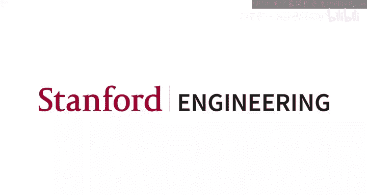
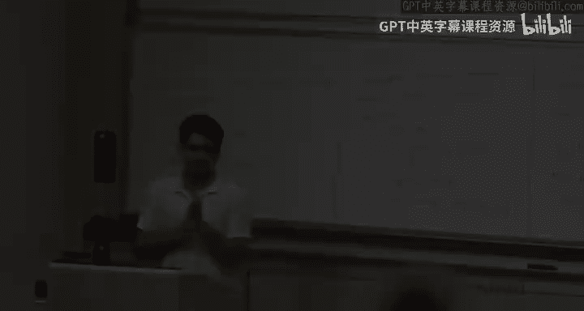

# 机器学习 20：变分自编码器 (VAE) 🧠

## 概述

在本节课中，我们将学习变分自编码器。变分自编码器是深度学习生成模型领域的一个重要基础模型，它结合了神经网络、概率建模和变分推断的思想。我们将从简单的自编码器开始，回顾期望最大化算法，并逐步引入变分推断和变分自编码器的核心概念。

---

## 1. 自编码器 (Autoencoders) 🔄

上一节我们回顾了最大熵原理和校准。本节中，我们来看看一种无监督学习模型——自编码器。

自编码器是一种神经网络，其目标是学习数据的低维表示。它通过一个“瓶颈”结构，将输入数据压缩成一个低维的潜在表示，然后再尝试从这个表示中重建原始输入。

### 模型结构

自编码器由两部分组成：
*   **编码器 (Encoder)**: 将高维输入数据 `x` 映射到低维潜在表示 `z`。
*   **解码器 (Decoder)**: 将潜在表示 `z` 映射回原始数据空间，得到重建数据 `x̂`。

模型的目标是最小化原始输入 `x` 与重建输出 `x̂` 之间的差异。损失函数通常使用均方误差：

**公式：** `L(θ, φ) = Σ_i || x_i - x̂_i ||^2`

其中，`x̂_i = decoder_θ( encoder_φ(x_i) )`。`φ` 是编码器的参数，`θ` 是解码器的参数。

### 与PCA的区别

自编码器可以看作是PCA的非线性推广。PCA使用线性变换进行降维和重建，而自编码器通过具有非线性激活函数的神经网络层，可以学习更复杂、非线性的数据表示。

---

## 2. 期望最大化 (EM) 算法的变体 🔄

为了理解变分自编码器的动机，我们需要回顾期望最大化算法及其在处理复杂后验分布时遇到的挑战。

在标准EM算法中，E步需要计算后验分布 `p(z|x; θ)`。然而，当模型复杂（例如，`p(x|z)` 是一个神经网络）时，这个后验分布通常难以直接计算。

以下是两种处理难解后验的常用方法：

### 2.1 MCMC-EM (马尔可夫链蒙特卡洛 EM)

当无法解析计算后验时，我们可以使用采样方法来近似E步中的期望。

**核心思想：** 在M步中，我们需要计算关于后验分布 `q(z) = p(z|x)` 的期望。我们可以用蒙特卡洛估计来近似这个期望：

**公式：** `E_{z~q}[f(z)] ≈ (1/M) Σ_{m=1}^M f(z^{(m)})`

其中，`z^{(m)}` 是从后验分布 `q(z)` 中采样的样本（使用MCMC方法，如吉布斯采样）。随着样本数 `M` 增大，这个估计会收敛到真实期望。

### 2.2 变分推断 (Variational Inference)

与采样方法不同，变分推断使用优化来近似后验分布。

**核心思想：** 我们引入一个由参数 `φ` 控制的分布族 `q_φ(z)`（称为变分分布），并通过优化 `φ` 来使 `q_φ(z)` 尽可能接近真实后验 `p(z|x)`。

衡量两个分布接近程度的常用指标是KL散度。我们可以证明，对数证据 `log p(x)` 可以分解为：

**公式：** `log p(x) = ELBO(φ; θ) + KL( q_φ(z) || p(z|x; θ) )`

其中，`ELBO`（证据下界）是一个关于 `φ` 和 `θ` 的函数。由于KL散度非负，`ELBO` 是 `log p(x)` 的下界。最大化 `ELBO` 等价于最小化 `KL( q_φ(z) || p(z|x) )`，从而使变分分布 `q` 逼近真实后验。

**均值场假设 (Mean-field Assumption):** 为了简化优化，变分推断常假设 `q_φ(z)` 可以分解为各分量独立的乘积形式：`q(z) = Π_j q_j(z_j)`。这被称为均值场变分推断。

---

## 3. 变分自编码器 (Variational Autoencoder, VAE) 🧩

现在，我们将自编码器、EM算法和变分推断的思想结合起来，构建变分自编码器。

### 3.1 模型设定

VAE是一个概率生成模型，它假设数据生成过程如下：
1.  从一个简单的先验分布（如标准正态分布）中采样潜在变量 `z`：`z ~ p(z) = N(0, I)`
2.  给定 `z`，数据 `x` 由一个条件分布生成，其参数由解码器神经网络 `g_θ` 给出：`x|z ~ p(x|z; θ) = N( g_θ(z), σ^2 I )`

我们的目标是学习模型参数 `θ`，以及对于每个数据点 `x_i`，近似其后验分布 `p(z|x_i)`。

### 3.2 摊销推断 (Amortized Inference)

在标准变分推断中，我们需要为**每个**数据点 `x_i` 单独优化一个变分参数 `φ_i`。这在大数据集上效率很低。

VAE的关键创新是**摊销推断**：我们使用一个编码器神经网络 `h_φ(x)` 来**一次性**为所有数据点计算变分参数。对于输入 `x`，编码器输出变分分布 `q_φ(z|x)` 的参数（例如，高斯分布的均值和方差）：
*   `μ = h_φ^μ(x)`
*   `log σ^2 = h_φ^σ(x)` （输出对数方差以保证正值）

这样，我们不再为每个数据点存储一组变分参数，而是学习一个共享的神经网络参数 `φ`，从而“摊销”了推断成本。

### 3.3 重参数化技巧 (Reparameterization Trick)

为了通过随机梯度下降优化ELBO，我们需要计算关于编码器参数 `φ` 的梯度。然而，ELBO的期望项依赖于从 `q_φ(z|x)` 中采样 `z`，这使得梯度无法直接反向传播。

重参数化技巧解决了这个问题。对于高斯分布 `z ~ N(μ_φ, σ_φ^2)`，我们可以将其重写为：
**公式：** `z = μ_φ + σ_φ ⊙ ε`，其中 `ε ~ N(0, I)`

这样，随机性被转移到了与参数 `φ` 无关的变量 `ε` 上。采样过程现在是一个确定性计算（`μ_φ + σ_φ ⊙ ε`）加上一个固定噪声。梯度现在可以顺利地通过确定性部分反向传播到参数 `φ`。

### 3.4 VAE的训练目标

VAE的最终训练目标是最大化所有数据点的ELBO之和：

**公式：** `L(θ, φ) = Σ_i [ E_{z~q_φ(z|x_i)}[ log p_θ(x_i|z) ] - KL( q_φ(z|x_i) || p(z) ) ]`

这个目标包含两部分：
1.  **重建损失 (Reconstruction Loss):** 期望项鼓励解码器从潜在变量 `z` 很好地重建输入 `x`。
2.  **正则化项 (Regularization Term):** KL散度项鼓励变分后验 `q_φ(z|x)` 接近先验 `p(z)`（通常为标准正态分布），这起到了正则化的作用，使得潜在空间具有良好结构（如连续性、完整性）。

训练时，我们使用蒙特卡洛采样（通常只采一个样本）来近似期望，并利用重参数化技巧，通过随机梯度下降同时优化编码器参数 `φ` 和解码器参数 `θ`。

---

## 总结

本节课我们一起学习了变分自编码器。我们从简单的自编码器出发，回顾了EM算法在处理难解后验时的局限。接着，我们介绍了两种解决方案：基于采样的MCMC-EM和基于优化的变分推断。最后，我们结合了摊销推断和重参数化技巧，构建了变分自编码器模型。VAE通过一个编码器网络近似后验分布，一个解码器网络定义数据似然，并通过最大化证据下界进行联合训练，从而能够学习有意义的数据潜在表示并生成新数据。这为后续更复杂的深度生成模型（如生成对抗网络）奠定了基础。