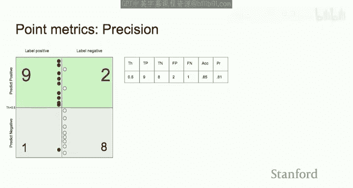

# 机器学习 21：评估指标 🎯

在本节课中，我们将要学习机器学习中至关重要的评估指标。我们将探讨为什么需要评估指标，深入研究二分类器的各种评估方法，并了解在类别不平衡等特定场景下如何选择合适的指标。最后，我们将总结一些在实际应用中选择和使用评估指标的一般性建议。

## 为什么评估指标很重要？🤔

在之前课程的所有算法中，我们定义了某种损失函数，并通过最小化训练数据上的损失来优化参数。然而，这些损失函数并不总是能反映真实世界的使用目标。例如，损失函数可能无法完全捕捉你的业务目标，如提高收入或利润。

因此，评估指标作为衡量模型性能的次级标准变得极其重要。评估指标还有助于将团队的努力组织起来，朝着某个业务目标前进。通常的做法是定义一个开发集，团队致力于提高模型在该开发集上的评估指标。

你需要开始将评估指标视为与损失函数本身不同的东西。评估指标也有助于量化期望性能与基线性能之间的差距。基线通常是你最初尝试的简单模型，它能让你了解整个项目的难度。如果期望性能与基线差距很大，这可能是一个具有挑战性的任务。同样，你也可以衡量期望性能与当前性能之间的差距，这能让你了解还需要取得多少进展。此外，跟踪性能随时间如何改进也很有用。

评估指标对于调试等较低级别的任务也很有用。例如，你想对模型进行偏差-方差分析以改进模型性能，评估指标在那里也很有用。

理想情况下，你的训练目标（损失函数）应该反映你的业务目标，但这并不总是可能的。例如，如果你关心准确率，使用准确率作为损失函数来训练模型是非常困难的，因为准确率甚至不可微分，最终会变成一个非常困难的组合优化问题。因此，通常无法将准确率直接用作损失函数。理想情况下，我们希望评估指标本身就是损失函数，但这并不总是可行的。这使得在开发模型时，除了损失函数之外，并行地测量评估指标变得必要。

## 二分类问题设定 🔍

在本节的大部分内容中，我们将局限于监督学习中的二分类问题。将 **X** 视为输入（例如图像或电子邮件），**y** 是二元输出（例如，图像中是否有行人，或文本是否为垃圾邮件）。模型输出是 **ŷ**。

**ŷ** 可以是不同类型。对于某些算法（如 k 最近邻或决策树），算法的输出直接是类别预测本身。而其他算法（如支持向量机或逻辑回归）的输出是某种实值分数。在逻辑回归中，输出是 **y=1** 的概率，这是一个实数值，而不是直接的类别。对于支持向量机，你会输出间隔（即样本距离分隔超平面的远近）。这些是基于分数的算法，我们需要选择一个阈值，一旦选择了阈值，就可以将模型转换为分类器。

在本节中，我们将主要关注这些基于分数的模型。想象一下这样的心理图景：从 0 到 1 的线代表概率，即模型可以输出的概率范围。绿点代表正例，点的位置是模型为该样本分配的概率。灰点代表负例。通过将它们放在这样一条线上，我们为预测定义了一个自然的顺序。

在开始调试模型之前，先查看开发集中样本的这种排序是很有帮助的，这能让你从宏观上了解模型在做什么。

## 核心概念与术语 📚

以下是几个有用的术语：

*   **流行率**：指正例样本所占的比例。这是一个标准术语。例如，如果你的数据中正例和负例数量相等，则流行率为 50%。如果有 10 个正例和 90 个负例，则流行率为 10%（10/(10+90)）。流行率完全是数据的属性，它计算的是真实标签（ground truth）中的正例，而不是预测概率。流行率这个术语让我们能够判断是否存在类别不平衡问题。

*   **类别不平衡问题**：当一个类别的样本数量相对于另一个类别过多或过少时，就存在类别不平衡问题。例如，在 100 个样本的数据集中，如果有 2 个正例和 98 个负例，通常就认为存在类别不平衡问题。虽然没有公认的阈值来决定是否存在类别不平衡，但经验法则是，如果流行率低于 5% 或 10%，或者高于 90% 或 95%，那么可以合理地认为该问题存在低流行率。例如，在检测信用卡欺诈的问题中，非欺诈交易的数量可能非常高，因此流行率会非常小，远低于 1%。

## 从分数到分类器：阈值的作用 ⚖️

我们从这个基于分数的视图开始，将所有样本根据模型预测的概率进行排序。绿点和灰点是数据的属性，而它们的位置是模型的属性（模型为每个样本分配了概率）。这本身并不是一个分类器，但一旦我们决定一个阈值，它就成为分类器。

假设我们设定阈值等于 0.5。现在我们有了一个分类器：每个高于阈值线的样本都被分类为正例，无论它实际上是否为正例；每个低于阈值的样本都被分类为负例。垂直轴是我们的预测，任何高于 0.5 阈值的都被预测为正例，任何低于的都被预测为负例。真实标签则水平分开：左边是真正为正的样本，右边是真正为负的样本。

这里我们任意选择了阈值为 0.5。只有在我们选择阈值之后，基于分数的模型才成为分类器；在此之前，它只是分配分数或概率。

## 混淆矩阵 📊

我们在这里所做的是计算每个区块中的样本数量。左上角是实际为正且被预测为正的样本，右上角是被预测为正但实际为负的样本。这种矩阵被称为**混淆矩阵**，这是一个标准术语。

混淆矩阵有几个属性：
1.  所有四个方格的总和是固定的，因为我们拥有的样本数量是固定的。
2.  列的总和也是固定的（例如，本例中的 9+1 和 2+8 总是固定的），因为它们是正例和负例的数量。
3.  混淆矩阵中可以改变的是基于我们选择的阈值以及样本被模型排序的方式，左列被分割到上方和下方的比例以及右列被分割到上方和下方的比例可以改变。

通过观察混淆矩阵，你可以判断模型的质量。你希望对角线上的值（正确预测）尽可能大，非对角线上的值（错误预测）尽可能小。

另一个观察是，混淆矩阵不给出标量值，它是一组四个数字。给定同一模型在同一数据集上的两个不同混淆矩阵，很难比较它们并明确地说哪个更好，因为它们不是标量，而是无法直接比较的四元组。

因此，我们开始从这个矩阵中提取可比较的指标。

## 从混淆矩阵中提取的指标 📈

以下是基于混淆矩阵计算的关键指标：

*   **真正例**：指实际为正且被预测为正的样本数量。这里的“真”指的是我们的预测是正确的。
*   **真负例**：指实际为负且被预测为负的样本数量。
*   **假正例**：指被预测为正但预测错误的样本，即实际为负但被预测为正的样本。
*   **假负例**：指实际为正但被预测为负的样本。

假正例和假负例是两种非常不同的错误，根据你正在处理的实际应用，它们可能产生非常不同的影响。通常，你希望分配给假正例和假负例的权重是不对称的。假正例和假负例也有其他术语，例如**类型 I 错误**和**类型 II 错误**。

根据所犯错误的类型，假正例和假负例的影响可能非常不同。例如，如果要根据一个人是否患有疾病来开具某种药物，而该药物对普通人没有不良副作用，那么你可能会更担心假负例，因为你不想错过给患者用药的机会。因此，你希望所有患有该病的患者都能被预测出来，以便给予药物治疗。

## 准确率、精确率与召回率 🎯

以下是几个核心的评估指标：

*   **准确率**：指所有样本中，我们预测正确的样本所占的比例。准确率通常是对角线之和除以所有元素之和。如果你想优化模型的准确率，那实际上对应于使用所谓的 **0-1 损失**（如果答案正确则损失为 0，错误则损失为 1）。在实践中优化 0-1 损失非常困难，因为它不是可微分的损失。

*   **精确率**：在我们预测为正的样本中，实际为正的样本所占的比例。精确率关注的是混淆矩阵的上半部分（所有被预测为正的样本）。精确率也称为**阳性预测值**。

*   **召回率**：也称为**灵敏度**。召回率衡量的是，在所有实际为正的样本中，有多少被我们的模型预测为正。召回率只关注混淆矩阵的左半部分（所有实际为正的样本），完全忽略右半部分（实际为负的样本）。

如果你想获得 100% 的召回率，无论模型好坏，只需将阈值设置为 0 即可。同样，如果你想获得 100% 的精确率，只需将阈值设置得足够高，只将最顶部的一个样本分类为正例即可。孤立地看待这些指标通常无法捕捉模型的真实性能。大多数时候，我们试图以某种方式平衡精确率和召回率。

*   **负例召回率**：也称为**特异度**。它计算在所有实际为负的样本中，模型正确分类为负的样本所占的比例。负例召回率只关注混淆矩阵的右半部分。

## 组合指标：F1 分数与 G 分数 ⚖️

你可以开始以某种方式将这些单独的分数组合起来。例如，**F1 分数** 是精确率和召回率的调和平均数。公式为：
`1/F1 = 1/2 * (1/Precision + 1/Recall)` 或 `F1 = 2 * (Precision * Recall) / (Precision + Recall)`

类似地，**G 分数** 是精确率和召回率的几何平均数。公式为：
`G = sqrt(Precision * Recall)`

这些分数是平衡精确率和召回率的不同方式。调和平均数和几何平均数都是如果其中一个值很低，整体平均值就会很低，这与算术平均数不同。几何平均数在某种程度上类似于取精确率和召回率的最小值。

## 阈值敏感性与 ROC 曲线 📉

到目前为止我们看到的所有指标都依赖于我们选择的阈值。这些是**阈值敏感指标**。如果我们改变阈值，这些数字中的一些会改变。

我们可以通过尝试尽可能多的不同阈值来重复这个练习。在这个例子中，有意义的有效阈值数量是样本数加一。对于每个特定的阈值，对应右边表格中的一行。随着我们改变阈值，我们会得到真正例、真负例、准确率、精确率、召回率等的不同值。

现在，整个表格是做出预测的模型的属性，但表格中的每一行取决于我们选择的阈值。

从表格中可以做出更多观察：
*   许多列是单调的。例如，真正例从 0 开始单调增加到 10，真负例单调减少，假正例单调增加，假负例单调减少，召回率单调增加（从 0 到 1），特异度单调减少（从 1 到 0）。
*   然而，其他一些指标，如 F1 分数和准确率，没有严格的单调性，它们会在某个阈值（例如 0.4 或 0.45 附近）达到最大值，然后在极端情况下减少。
*   精确率则上下波动。

我们想要做的是以某种方式捕捉这些列之间的权衡。正如我们之前看到的，如果你只想最大化召回率，只需将阈值设置为 0；如果你想最大化精确率，也许将其设置为 1 或略低于 1。但我们想要做的不是只看模型在某个指定阈值下的表现，而是以某种方式总结这些整个列。

这就是问题所在：我们如何总结精确率与召回率或特异度与灵敏度之间的权衡？这就是 **ROC 曲线** 等工具发挥作用的地方。

## ROC 曲线与 AUC 📈

ROC 曲线称为**接收者操作特征曲线**，它展示了灵敏度和特异度之间的权衡。有时你可能会看到 ROC 曲线在某些书籍或文章中被翻转，x 轴是 1 减去灵敏度，这基本上是相同的。

ROC 曲线是通过扫描阈值得到的图。当我们从 0 到 1 扫描阈值时，对于每个阈值，我们读取灵敏度和特异度，并将该点绘制在灵敏度与特异度的图表上。通过连接不同阈值对应的点，我们得到这条 ROC 曲线。

ROC 曲线给出了随着阈值扫描，灵敏度与特异度之间的权衡。例如，当阈值设置为 1.0 时，灵敏度为 0，但特异度最大，这对应于左上角。随着你将阈值向下扫描到 0，你开始探索所有其他点。

另一种思考 ROC 曲线的方式是：创建一个网格，将水平轴切成与正例数量相等的段，将垂直轴切成与负例数量相等的段。你的模型会给出某种排序。从左上角开始，一次检查一个样本：如果遇到正例，向右移动；如果遇到负例，向下移动。因为你只能进行固定次数的右移和固定次数的下移，所以无论顺序如何，你总是从这里开始，在这里结束。如果你的所有正例都在顶部，那么曲线将趋向于右上角。

这种直觉产生了从 ROC 曲线导出的一个指标，称为 **ROC 曲线下面积**。如果在你开始向下扫描时，大多数或所有正例都是你先遇到的，那么 AUC 就会很高，因为正例只会让你不断向右移动。

另一个观察是，ROC 曲线总是可以分解为这些水平线段和垂直线段。每个块对应连续出现的正例组或负例组。

AUC 通常是一个有用的指标，用于检查模型在分类方面做得如何。如果它能很好地将所有正例放在上面，负例放在下面，那么 AUC 就会很高。

关于 ROC 曲线的更多观察：
*   如果一个模型随机分配概率，那么 ROC 曲线将沿着对角线分布。随机猜测器的 AUC 为 0.5。这是你应该为 AUC 设定的低标准。
*   如果你的模型 AUC 低于 0.5，那么你的模型基本上比随机猜测还差。然而，如果它非常低（例如 0.1），这某种程度上是个好消息，因为你只需翻转标签就可以获得非常高的 AUC。当然，这仍然令人不安，你应该调查为什么预测值很低，也许某处有错误。
*   因此，0.5 应该是你查看 AUC 时的低标准。当你读到某篇论文说 AUC 为 0.65 时，你不应该认为模型在 0 到 1 的范围内得了 0.65，而应该认为 0.65 是从 0.5 到 1 的比例。AUC 为 0.6 的模型相当接近随机猜测。

AUC 的另一种解释是：假设你随机选择一个正例，再随机选择一个负例。那么，在这个随机正负例对中，正例排名高于负例的概率恰好等于 AUC。这是思考 AUC 的另一种方式：随机正例排名高于随机负例的概率是多少？

另一个需要注意的点是，ROC 曲线对数据的流行率不敏感。这意味着，如果你有 130 个样本而不是 13 个，每个垂直下降的粒度会更小，但曲线下面积大致相同。因此，AUC 对数据的流行率不敏感。这是评估模型时需要记住的一点，因为这是 ROC 曲线的优点也是缺点。如果报告给你的 ROC 曲线是在流行率相等的数据集上测量的，但在现实世界中真实流行率非常不同，那么现实世界中的 ROC 性能仍然相同。这是它好的一面，但不好的一面可能是 ROC 曲线测量的是错误的东西。如果它报告的内容对流行率不敏感，那么也许 ROC 测量的不是正确的指标。

## 精确率-召回率曲线 📊

精确率-召回率曲线展示了精确率和召回率之间的权衡。它的绘制方式与 ROC 曲线类似：从阈值 0.1 开始，读取精确率和召回率值，得到一个点；然后稍微降低阈值，读取新的精确率和召回率值，这是下一个点，用线连接；继续降低阈值，得到新的精确率-召回率值，绘制并连接，最终得到一条完整的曲线。

这里需要注意几点：
*   ROC 曲线在某种意义上是单调的，它永远不会回升，它只会向右或向下移动。而精确率-召回率曲线有时可以回升。
*   原因是，我们测量的是精确率和召回率之间的权衡。想象一下，如果我们从这里开始，降低阈值，得到一个样本，该样本是正例，那么精确率是 100%，但召回率是 0.1。然后我们再降低一个阈值，精确率仍然是 100%，召回率增加到 0.2。接着，假设我们遇到第三个样本，是负例，那么召回率根本没有提高，因为我们仍然只恢复了 10 个样本中的 2 个，但精确率从 2/2 下降到 2/3。因此，下降总是垂直的，因为我们遇到了负例，精确率下降，但召回率保持不变。一旦我们在这里，假设我们又开始遇到正例，那么我们从 2/3 到 3/4 到 4/5，这是一个逐渐增加的过程。因此，精确率-召回率曲线将具有这种垂直下降和缓慢爬升的标准模式，而 ROC 曲线将具有水平-垂直-水平-垂直的运动。
*   就像 ROC 曲线一样，你也可以测量**精确率-召回率曲线下面积**。
*   另一个观察是，ROC 曲线总是从左上角开始，到右下角结束。而精确率-召回率曲线，当你将阈值一直降到 0 时，你实际上预测所有样本为正，此时精确率将恰好等于流行率。因此，精确率-召回率曲线将在右侧终止于流行率水平。这也意味着，无论你的模型对样本的排序有多糟糕，在最坏的情况下，精确率-召回率曲线都无法进入某个区域。因此，在精确率-召回率曲线下面积中，有一部分面积是“免费”获得的。有一些 AUC-PR 的变体考虑了这一点，它们会扣除这部分免费面积，只测量模型真正赢得的面积。如果你的流行率很高，那么你的精确率-召回率曲线下面积可能看起来很好，仅仅是因为你免费获得了大量面积。

## 对数损失与校准 📉

让我们看这两个模型。假设有某个数据集，我们有两个模型 A 和 B。模型 A 和 B 为每个样本分配概率值。仅通过观察这个图，是否有理由偏好一个模型胜过另一个？B 看起来更好，因为它在这个区域和那个区域做得很好。在我们目前看到的所有指标中，哪个指标会将 B 排名高于 A？正确答案是：没有一个指标会将 B 排名高于 A，因为所有点的排名顺序是相同的。尽管它们聚集在一起，但如果你只看所有样本的排名位置，我们遇到正例和负例的顺序是相同的。我们目前看到的所有指标都只关心排名。例如，对于精确率-召回率曲线下面积，我们扫描阈值，但我们只关心遇到下一个正例或负例时的移动，我们并不关心阈值是多少。因此，我们目前看到的所有指标都是基于排名的指标。

正如我们在这里看到的，有两种情况在质量上看起来非常不同，但从我们目前看到的所有指标的角度来看，它们完全相同。这引出了**对数损失**的概念。

对数损失实际上就是我们在