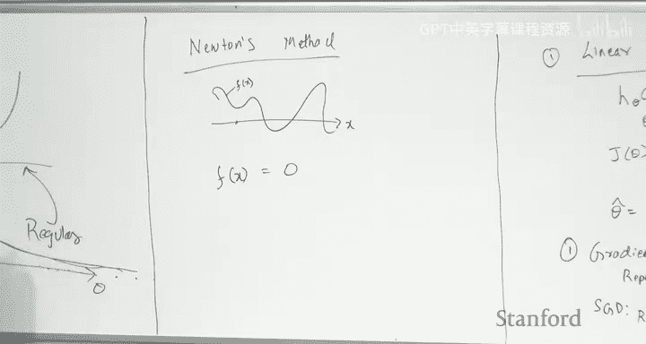
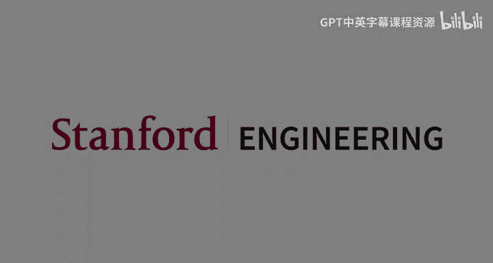

# 机器学习 22：实用技巧与课程回顾 🎓

## 概述

在本节课中，我们将学习如何将机器学习应用于实际生产环境，并回顾整个课程的核心内容。我们将首先探讨构建可部署机器学习模型的一系列实用技巧，然后简要介绍期末考试的形式，最后对整个课程的知识点进行系统性回顾。

---

## 第一部分：生产环境中的机器学习实践 🛠️

上一节我们讨论了评估指标，本节我们将延续这个话题，探讨在实际应用中部署机器学习模型的一些实用建议。

### 构建生产模型的流程

以下是构建一个面向真实世界部署的机器学习模型的关键步骤。

#### 1. 收集开发集

构建模型的第一步是开始收集一个**开发集**。开发集是指模型在生产环境中部署后将会遇到的数据。

*   **匹配生产场景**：开发集的分布应尽可能接近真实的生产场景。例如，如果你的目标用户是通过手机拍照，那么开发集就应该包含来自手机的照片。
*   **尽早开始**：在考虑训练数据之前，就应该先定义和收集开发集。尽可能多花时间收集能精确反映真实世界分布的数据。
*   **亲自标注**：建议你和你的团队亲自标注开发集，这能让你对数据的真实面貌有很好的感觉。

#### 2. 定义评估指标

在收集数据集之后，需要定义一个**评估指标**。

*   **设定目标**：这个指标应该能捕捉产品中最重要的方面。定义好开发集和评估指标，就等于为你的团队设定了一个明确的目标。
*   **首要任务**：这两项任务应该是项目开始时首先要完成的工作。

#### 3. 收集训练数据

接下来是收集训练数据。理想情况下，训练数据应尽可能接近开发集。

*   **成本考量**：然而，精确标注数据通常非常昂贵。因此，训练数据往往来自与开发集不完全相同的分布。
*   **自动化标注**：为了降低成本，通常会使用**自动化或带噪声的标注**。虽然质量可能下降，但可以通过大量数据来弥补。例如，可以基于文件名等简单规则进行初步标注，然后进行抽样检查以评估准确率。

#### 4. 性能分解与诊断

目标是构建一个在生产环境中表现良好的模型。为了诊断和改进模型，我们需要分解性能指标。

以下是需要测量的五个关键性能指标及其意义：

1.  **人类水平性能**：可以作为**不可约误差**的代理。
2.  **训练集性能**：在训练集上模型的表现。
3.  **训练-开发集性能**：从训练数据中留出的一部分数据（训练-开发集）上的表现，用于检查过拟合。
4.  **开发集性能**：在手动收集和标注的开发集上的表现，用于评估模型在目标场景下的泛化能力。
5.  **部署性能**：模型在实际生产环境中面对真实用户时的表现。

通过分析这些性能之间的**差距**，可以诊断问题的根源：

*   **训练性能 vs. 人类水平性能**：差距大表示模型**偏差高**。
*   **训练性能 vs. 训练-开发集性能**：差距大表示模型**方差高**。
*   **训练-开发集性能 vs. 开发集性能**：差距大表示存在**分布不匹配**。
*   **开发集性能 vs. 部署性能**：差距大表示可能对开发集**过拟合**。

#### 5. 针对不同问题的行动方案

根据诊断结果，可以采取相应的行动：

*   **高偏差问题**：增加模型灵活性。
    *   **行动**：添加更多特征、增加神经网络深度/宽度、减少正则化、使用更复杂的内核。
*   **高方差问题**：降低模型复杂度或获取更多数据。
    *   **行动**：使用更小的模型、减少特征、增加正则化、使用更简单的内核、**收集更多数据**。
*   **分布不匹配问题**：使训练数据分布更接近开发集。
    *   **行动**：花费资源收集更多真实数据并加入训练集，或对训练数据进行变换（如滤镜）以接近开发集分布。
*   **开发集过拟合问题**：重新收集新的开发集。
    *   **行动**：当多次在开发集上评估并调整模型后，开发集可能“腐化”，需要收集新的、未见过的数据作为开发集。

#### 6. 学习曲线：判断是否需要更多数据

为了判断“收集更多数据”是否有助于解决高方差问题，可以绘制**学习曲线**。

*   **方法**：用训练数据的不同子集（如10%， 20%， ...， 100%）训练模型，并分别绘制训练误差和开发集误差随数据量变化的曲线。
*   **解读**：
    *   如果两条曲线已经非常接近且趋于平缓，说明增加数据**帮助不大**，可能是高偏差问题。
    *   如果两条曲线之间仍有较大差距，且开发集误差有下降空间，说明增加数据**可能有效**，属于高方差问题。

### 核心建议总结

*   **始终以部署性能为目标**：所有中间测量（训练误差、开发集误差）都只是辅助诊断的工具，最终目标是提升模型在真实生产环境中的表现。
*   **进行偏差-方差分析**：在采取相互矛盾的行动（如增加特征 vs. 减少特征）之前，必须通过分析确定当前问题是高偏差还是高方差。
*   **不要重复造轮子**：在实际生产中，**永远不要自己实现梯度下降等基础算法**。应使用经过充分测试的成熟软件包。

---

## 第二部分：期末考试格式说明 📝

接下来，我们将简要介绍期末考试的预期格式。

期末考试将采用开卷形式，预计结构如下：

1.  **判断题**：约10道。
2.  **简答题**：约5道。
3.  **理论证明题**：包含子问题，引导你完成一个较长的推导或证明。
4.  **理论/应用题**：包含一个新颖的场景，需要你运用课程知识进行拓展。通常包括：
    *   两个理论部分（推导更新规则、预测规则等）。
    *   一个编程部分（在提供的初始代码中实现规则，生成图表并解释）。

**考试须知**：
*   可以查阅课程资料、笔记、作业答案甚至互联网，但**严禁与他人交流**。
*   考试期间Piazza将禁用公开提问，仅可发送私信给教学团队。如果问题涉及题目歧义，我们会公开澄清。
*   重点复习**矩阵微积分、概率论和线性代数**等先修知识，以及课程核心概念（如偏差-方差）。

---

## 第三部分：课程核心内容回顾（第一部分）📚

最后，我们将对整个课程内容进行回顾，并关联相关的作业问题。

### 监督学习概述

监督学习的目标是学习一个从输入 `x` 到输出 `y` 的映射函数 `h`。给定训练集 `S = {(x_i, y_i)}_{i=1}^n`。
*   `y_i` 为实数：**回归**问题。
*   `y_i` ∈ {0, 1}：**二分类**问题。
*   `y_i` 为整数：**计数**或泊松回归等问题。

工作流程：训练集 → 学习算法 → 假设模型 `h` → 对新输入 `x` 做出预测 `y`。

### 线性回归

我们假设假设函数属于参数族：`h_θ(x) = θ^T x`。

**1. 通过梯度下降求解**
定义成本函数（平方误差）：`J(θ) = Σ (h_θ(x_i) - y_i)^2`。
梯度下降更新规则：`θ := θ - α * Σ (h_θ(x_i) - y_i) * x_i`。
随机梯度下降：每次迭代随机选取一个样本 `k` 进行更新：`θ := θ - α * (h_θ(x_k) - y_k) * x_k`。

**2. 正规方程（闭式解）**
假设 `X^T X` 可逆，可得：`θ = (X^T X)^{-1} X^T y`。

**3. 投影解释**
将输出向量 `y` 投影到设计矩阵 `X` 的列空间上，投影矩阵为 `X (X^T X)^{-1} X^T`。求解 `Xθ` 等于该投影的问题，同样得到正规方程。

**4. 概率解释**
假设 `y = θ^T x + ε`，其中 `ε ~ N(0, σ^2)`。
则 `P(y | x; θ) = (1/√(2πσ^2)) exp(-(y - θ^T x)^2 / (2σ^2))`。
通过**最大似然估计**最大化该概率，等价于最小化平方误差成本函数 `J(θ)`。这表明高斯噪声假设天然导向平方误差损失。

### 逻辑回归

用于二分类问题，`y_i ∈ {0, 1}`。

**1. 模型假设**
假设 `y_i | x_i` 服从伯努利分布，其中：`P(y_i = 1 | x_i; θ) = 1 / (1 + exp(-θ^T x_i))`。

**2. 最大似然估计**
似然函数：`L(θ) = Π [ (h_θ(x_i))^{y_i} * (1 - h_θ(x_i))^{1-y_i} ]`。
取对数得到对数似然：`l(θ) = Σ [ y_i log(h_θ(x_i)) + (1 - y_i) log(1 - h_θ(x_i)) ]`。
通过**梯度上升**最大化 `l(θ)` 来求解 `θ`。逻辑回归没有闭式解。

**3. 注意点**
*   逻辑回归输出的是概率，需要后续设定阈值来做出分类决策。
*   当数据**完全线性可分**时，最大似然估计可能无法收敛（`θ` 会趋于无穷大）。这时通常需要引入**正则化**来使问题良定义。

### 牛顿法

牛顿法是一种**求根方法**，用于寻找函数 `f` 的零点（即 `f(x)=0`）。

*   **应用于优化**：在优化中，我们令 `f` 等于成本函数 `J` 的梯度 `∇J(θ)`。牛顿法找到梯度为零的点，即驻点。
*   **更新规则（标量）**：`θ := θ - f(θ) / f'(θ)`。
*   **更新规则（向量，牛顿-拉弗森方法）**：`θ := θ - H^{-1} ∇J(θ)`，其中 `H` 是海森矩阵。
*   **关键点**：牛顿法本身不区分最大化或最小化，它只寻找最近的驻点。因此，只有当成本函数是凸函数（或凹函数）时，它才能保证找到全局最优解。对于像神经网络这样的非凸问题，通常不使用牛顿法。

---

## 总结

本节课我们一起学习了将机器学习模型投入生产环境的完整流程和实用技巧，包括从定义开发集和评估指标开始，到收集训练数据、进行性能分解与诊断，并针对高偏差、高方差等问题采取具体行动。我们还了解了期末考试的格式，并回顾了监督学习的基础——线性回归和逻辑回归的模型假设、求解方法及其概率解释，以及牛顿法这一优化工具的原理与局限。在下一讲中，我们将继续回顾课程的其他重要主题。