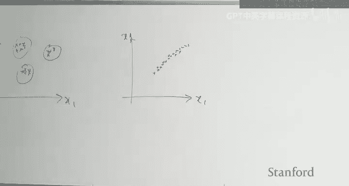
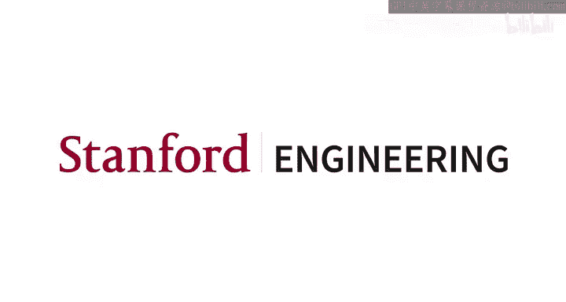

# 机器学习 23：课程回顾与总结 🎓


在本节课中，我们将对CS229机器学习课程的核心内容进行一次全面的回顾与总结。我们将梳理从监督学习到无监督学习，再到强化学习等各个模块的关键概念、算法和思想，帮助你构建完整的知识体系。

---

## 1. 监督学习回顾 📈

上一讲我们开始了期末考试复习，并回顾了监督学习。本节我们将继续深入，并完成整个课程的总结。

### 1.1 线性回归
线性回归是我们学习的第一个模型，它可以从多个角度进行理解：
*   **最小化平方损失**：通过最小化预测值与真实值之间的平方差来拟合模型。
*   **概率解释**：假设误差服从高斯分布，线性回归等价于最大化数据的似然函数。
*   **投影解释**：在特征空间中，预测结果是目标向量在由特征张成的子空间上的投影。
*   **正规方程**：通过求解 `θ = (X^T X)^{-1} X^T y` 直接得到最优参数。

### 1.2 逻辑回归
逻辑回归是用于分类的模型。
*   它为每个样本输出类别为1的概率：`P(y=1|x; θ) = 1 / (1 + exp(-θ^T x))`。
*   通过设定一个阈值（如0.5），可以将概率输出转换为分类器。

### 1.3 牛顿法
牛顿法是另一种优化算法，特别适用于凸或凹问题。
*   **核心总结**：牛顿法收敛速度可能很快，并且是“即插即用”的。
*   它自动进行优化，无需指定是最大化还是最小化函数。它通过找到最近的驻点来优化函数。如果函数是凸的，则自动最小化；如果是凹的，则自动最大化。

### 1.4 感知机算法
感知机算法是一种流式算法，每次处理一个样本，类似于随机梯度下降。

以下是其更新规则：
```python
# 感知机更新规则
if y_i * (θ^T x_i) <= 0:  # 如果预测错误
    θ := θ + α * y_i * x_i
```
其中，`g(z)` 是指示函数，当 `z >= 0` 时返回1，否则返回0。

**直观理解**：我们希望参数向量 `θ` 的方向更接近正类样本的方向。当分类正确时，参数不变。当分类错误时，我们将误分类样本向量 `x` 的一个小倍数加到 `θ` 上，使 `θ` 的方向更接近 `x`，从而修正决策边界。

**重要性质**：如果存在一个分离超平面，那么无论以何种顺序向算法呈现样本，感知机最终都会找到一个分离超平面。一旦找到，后续所有更新都将为0，算法收敛。

---

## 2. 指数族与广义线性模型 🔗

接下来，我们学习了指数族分布。

### 2.1 指数族
指数族是一类概率分布，其一般形式为：
`P(y; η) = b(y) * exp(η^T T(y) - a(η))`
其中：
*   `y` 是变量。
*   `T(y)` 是充分统计量（在本课程中通常 `T(y) = y`）。
*   `η` 是自然参数。
*   `b(y)` 是基测度。
*   `a(η)` 是对数配分函数。

指数族非常灵活，可以涵盖离散、连续、仅取正值、整数等多种类型的随机变量。

### 2.2 广义线性模型
GLM将指数族与输入特征联系起来。我们设定自然参数 `η = θ^T x`，其中 `θ` 是可学习参数，`x` 是对应于 `y` 的输入。

通过这种联系，GLM成为了回归、分类等模型的更一般形式。例如：
*   当 `y` 为实数值时，得到回归模型。
*   当 `y` 为0/1二值时，得到分类模型（如逻辑回归）。

**重要性质**：
*   期望：`E[y|x; θ] = a'(θ^T x)`
*   方差：`Var[y|x; θ] = a''(θ^T x)`
*   GLM的对数似然的Hessian矩阵总是半正定的，因此优化问题是凸的。

### 2.3 最大熵与最大似然
对于给定的数据集，在指数族上执行最大似然估计，等价于在满足“充分统计量的期望等于样本均值”这一约束下，执行最大熵优化。这是一个对偶结果。

---

## 3. 生成模型 🧬

之前学习的算法都是对 `P(y|x)` 建模，即判别式模型。生成模型则尝试对 `x` 和 `y` 的联合分布 `P(x, y) = P(x|y)P(y)` 进行建模。

### 3.1 高斯判别分析
GDA假设：
*   `P(y)` 服从伯努利分布（参数为 `φ`）。
*   `P(x|y)` 服从高斯分布，对于每个类别 `y` 有其自己的均值 `μ_y`，但所有类别共享同一个协方差矩阵 `Σ`。

**直观图像**：在特征空间中，每个类别的数据都像一个高斯“云团”，这些云团形状相同（因为Σ相同），但中心位置(`μ_y`)不同。由于协方差相等，后验概率 `P(y|x)` 会呈现逻辑回归的形式，即决策边界是线性的。如果协方差不相等，决策边界将是二次的。

### 3.2 朴素贝叶斯
朴素贝叶斯常用于文本分类，其中输入 `x` 是离散的（如单词）。
*   它做出了**条件独立性假设**：在给定类别 `y` 的条件下，特征 `x_i` 和 `x_j` 是独立的。这并不意味着 `x_i` 和 `x_j` 无条件独立。
*   我们学习了两种事件模型：
    *   **伯努利事件模型**：`x_j` 表示词汇表中第 `j` 个词是否在文档中出现（0或1）。我们估计每个词在每个类别中出现的文档比例。
    *   **多项式事件模型**：`x_j` 表示文档中第 `j` 个位置的词是什么。我们估计每个词在每个类别的所有文档中出现的次数比例，形成一个多项式分布。
*   **拉普拉斯平滑**：用于处理罕见词。我们不是从计数0开始，而是为每个事件预设一个先验计数（如1），然后再从数据中增加计数。这可以防止概率估计为0。

### 3.3 生成式 vs 判别式模型
*   **生成式模型（如GDA）**：引入了更多关于数据分布的假设（先验知识）。如果这些假设正确，模型会更具样本效率，即用更少的数据就能学好。
*   **判别式模型（如逻辑回归）**：对数据做出的假设更少，因此更稳健。但如果假设成立，判别式模型通常需要更多数据来达到相同的性能。
*   **核心思想**：你可以通过**假设**或**数据**向模型提供信息。正确的假设是有益的，可以减少对数据量的需求。

---

## 4. 核方法 ⚙️

核方法提供了一种高效引入特征映射的方式。

### 4.1 核的定义
我们从特征映射 `φ(x): R^D -> R^P` 开始（`P` 可以是无穷大）。核 `K` 是一个对应于该特征映射的函数，满足：
`K(x, z) = φ(x)^T φ(z)`
核函数直接在原始输入空间上计算，但其结果等于将输入映射到高维特征空间后再做内积。核技巧的关键在于，`K(x, z)` 的计算通常比显式构造 `φ(x)` 再做内积要高效得多。

### 4.2 核的性质与Mercer定理
函数 `K` 是一个核的**必要条件**是：对于任意一组点 `{x_1, ..., x_m}`，由此构造的**核矩阵**（第 `i, j` 元素为 `K(x_i, x_j)`）是对称且半正定的。
**Mercer定理**指出，上述条件同时也是**充分条件**。任何满足该条件的函数都是某个特征映射对应的核。

### 4.3 核技巧
如果我们能将一个算法完全用输入向量之间的内积 `〈x_i, x_j〉` 来表示，那么我们就可以用核函数 `K(x_i, x_j)` 替换这些内积。这相当于隐式地将数据映射到了高维（甚至无限维）特征空间，而无需显式计算 `φ(x)`。
*   在原始参数化中，我们学习一个参数向量 `θ ∈ R^P`。
*   在核化版本中，我们转而学习一个对偶系数向量 `β ∈ R^n`（每个样本一个系数）。
这使得我们能够使用无限维的特征映射，因为只需维护与样本数 `n` 同维的 `β` 向量，而不是无限维的 `θ` 向量。

### 4.4 支持向量机
SVM是一种基于核的分类算法，它专注于最大化**几何间隔**。
*   **与逻辑回归的区别**：逻辑回归试图最大化函数间隔，这可能导致参数无限增大。SVM最大化几何间隔，避免了这个问题。
*   **支持向量**：SVM的解具有稀疏性。最终的对偶系数 `β` 中，大部分为0，只有少数对应样本（即“支持向量”）的系数非零。这些支持向量是离决策边界最近的样本，决定了边界的位置。
*   **优势**：SVM结合了核方法的优点（可处理高维特征），同时由于解是稀疏的，在预测时只需存储支持向量，而不是整个训练集，提高了效率。

### 4.5 高斯过程
高斯过程是用于回归的核方法。它将多元高斯分布推广到无限维。
*   我们可以将其视为一个无限维的随机向量，具有均值函数和协方差函数（即核函数）。
*   在处理数据集时，我们实际上是从这个无限维过程中，边缘化掉训练集和测试集之外的所有点，得到一个关于训练点和测试点的有限维联合高斯分布。
*   然后，利用高斯分布的条件规则，基于训练数据对测试点进行预测，得到的是一个预测分布（而不仅仅是点估计）。

**核的选择**：使用哪种核函数是一个需要调整的超参数，类似于在线性回归中选择哪种特征映射。

---

## 5. 神经网络与反向传播 🧠

神经网络可以看作是复杂的、可微分的、分层复合函数，每层都有参数和非线性激活。

### 5.1 前向传播
对于一个全连接网络，第 `l` 层的计算为：
`a^{[l]} = g^{[l]}(W^{[l]} a^{[l-1]} + b^{[l]})`
其中 `g` 是激活函数（如Sigmoid, ReLU）。

### 5.2 反向传播
反向传播本质上是多元微积分链式法则的应用，用于计算标量损失 `L` 对网络中每个标量参数（如 `W_{ij}^{[l]}`）的梯度。
*   计算过程涉及一系列雅可比矩阵的乘法。
*   对于非线性层，其雅可比矩阵是对角阵，计算时可简化为元素乘法。
*   计算出所有梯度后，就可以使用梯度下降等优化算法同时更新所有参数。

---

## 6. 学习理论：偏差-方差分析 ⚖️

偏差-方差分析可能是本课程中最重要的概念，它将机器学习与纯粹的优化区分开来。

### 6.1 分解
我们的终极目标不是最小化训练误差，而是最小化在未知数据上的测试误差。以平方误差损失为例，测试误差可以分解为：
`E[(y - ŷ)^2] = (不可减少的误差) + (偏差)^2 + 方差`
*   **不可减少的误差**：源于数据本身的噪声。即使使用最完美的模型，也无法避免。
*   **偏差**：源于模型本身的局限性（不够灵活）。例如，用线性模型去拟合具有二次关系的数据。
*   **方差**：源于模型对训练数据中随机噪声的敏感度。如果换一组训练数据，模型参数变化很大，则方差高。

### 6.2 诊断与应对
*   **近似诊断**：
    *   **高偏差**：训练误差高。
    *   **高方差**：训练误差与验证误差之间的差距大。
*   **应对策略**：
    *   **对抗高偏差**：使用更复杂的模型、减少正则化、增加特征等。
    *   **对抗高方差**：获取更多数据、增加正则化、使用更简单的模型等。
在采取任何行动前，都应先分析问题是高偏差还是高方差主导，然后有针对性地采取措施。

---

## 7. 正则化 🛡️

正则化通过在损失函数中添加对参数大小的惩罚项，来防止模型过拟合（控制方差）。
*   **L2正则化**：惩罚参数的平方和 `λ||θ||_2^2`。这等价于在最大后验估计中使用了高斯先验。
*   **L1正则化**：惩罚参数的绝对值之和 `λ||θ||_1`。这等价于使用了拉普拉斯先验，并能产生稀疏解。

---

## 8. 强化学习 🎮

强化学习处理的是序列决策问题，样本之间不再独立同分布。

### 8.1 马尔可夫决策过程
MDP由以下要素定义：状态集合 `S`、动作集合 `A`、转移概率 `P(s'|s, a)`、折扣因子 `γ`、奖励函数 `R(s)`。

### 8.2 策略与价值函数
*   **策略 π**：一个从状态到动作的映射规则。
*   **价值函数 V^π(s)**：从状态 `s` 开始，始终遵循策略 `π` 所获得的累积折扣奖励的期望。

### 8.3 求解算法
*   **策略迭代**：
    1.  **策略评估**：给定一个策略 `π`，计算其价值函数 `V^π`。
    2.  **策略改进**：根据 `V^π` 贪婪地改进策略，得到新策略 `π'`。
    重复以上两步直到策略收敛。
*   **价值迭代**：直接寻找最优价值函数 `V*`。通过反复应用贝尔曼最优算子来更新价值函数：
    `V(s) := R(s) + γ * max_a Σ_{s'} P(s'|s, a) V(s')`
    贝尔曼算子是压缩映射，保证迭代收敛到唯一的最优价值函数 `V*`。
*   **拟合价值迭代**：当状态空间很大时，我们用一个参数化函数（如线性模型、神经网络）`V_θ(s)` 来近似价值函数。在每次迭代中，我们先应用贝尔曼算子得到目标值 `y`，然后通过最小化 `(V_θ(s) - y)^2` 来更新参数 `θ`，将目标值“投影”回函数近似空间。这种方法牺牲了精确性，但获得了泛化能力。

---

## 9. 无监督学习 🔍

在无监督学习中，我们只有输入数据 `{x}`，没有标签 `{y}`，目标是发现数据中的结构。

### 9.1 聚类 vs 降维
*   **聚类**：将数据分组到不同的簇中。代表算法：K-Means（非概率）、高斯混合模型（概率）。
*   **降维/子空间发现**：寻找数据的一个低维表示。代表算法：主成分分析（非概率）、因子分析（概率）。

### 9.2 期望最大化算法
EM算法是求解含有隐变量 `z` 的概率模型参数 `θ` 的强大工具。
*   **E步**：基于当前参数 `θ`，计算隐变量的后验分布 `Q_i(z) = P(z|x_i; θ)`。
*   **M步**：基于 `Q_i(z)`，更新参数 `θ` 以最大化数据的期望对数似然。
EM算法保证每次迭代都能提高似然函数，并最终收敛到局部最优。



### 9.3 独立成分分析
ICA用于解决盲源分离问题。它假设源信号是非高斯的，通过最大似然估计来寻找一个解混矩阵，从而从混合信号中分离出独立的源信号。

### 9.4 变分自编码器
VAE是深度生成模型。它使用一个编码器神经网络将输入 `x` 映射到隐变量 `z` 的后验分布参数，使用一个解码器神经网络从 `z` 重构 `x`。这种方法被称为“摊销推断”，因为它用一个共享的神经网络为所有样本学习后验分布，而不是像EM那样为每个样本单独计算一个后验。

---

## 10. 课程总结与寄语 🌟

本节课中，我们一起回顾了CS229机器学习课程涵盖的广阔领域：从基础的监督学习（线性/逻辑回归、GLM），到生成模型与核方法，再到神经网络、学习理论、正则化、强化学习以及无监督学习。

机器学习是一门强大的工具，它通过寻找数据中的相关性来构建预测模型。这种力量既可以用于造福社会，也可能被滥用。因此，在应用机器学习时，请务必保持审慎：
*   **警惕数据偏见**：模型会继承训练数据中的偏见和不公平性。请仔细思考数据是如何收集的。
*   **理解局限性**：相关性不等于因果性。基于相关性的预测在需要因果推断的领域可能存在风险。
*   **广阔的应用前景**：任何收集数据并需要预测的领域，都是机器学习的用武之地。

无论你是希望将机器学习应用于其他领域，还是立志于从事机器学习研究，希望本课程所传授的具体工具（各种模型算法）和通用原则（如偏差-方差分析），都能为你未来的学习和工作奠定坚实的基础。



祝大家在期末考试中取得好成绩！感谢大家参与本课程的学习。