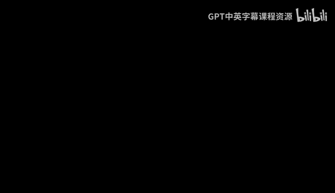

# 机器学习理论 7：深度学习理论挑战与神经网络泛化界

## 概述 📚

在本节课中，我们将要学习深度学习理论中的核心挑战，并探讨如何为神经网络建立泛化界。我们将从经典机器学习理论的框架出发，分析其在深度学习背景下遇到的困难，并介绍当前理论研究的应对思路。

---

## 经典机器学习理论框架回顾 🔄

上一节我们介绍了机器学习理论的基础概念，本节中我们来看看经典理论通常如何分解问题。经典机器学习理论主要关注三个相互关联但又相对独立的方面。

以下是经典理论关注的三个核心方面：

1.  **近似理论**：也称为表达能力或表示能力。它关心的是假设类 **H** 能否充分近似真实的数据生成函数。其核心问题是：在拥有无限数据（即总体数据）的理想情况下，假设类中的最佳模型 **h*** 的表现如何？用公式表示，即评估 **L(h*)** 是否足够小。
2.  **泛化理论**：也称为统计方面。它关心的是从有限数据中学到的模型 **ĥ** 与假设类中的最佳模型 **h*** 之间的差距。这通常通过泛化误差来度量：**L(ĥ) - L(h*)**。经典结论是，假设类越简单（复杂度低），泛化误差越小（通常以 **O(1/√n)** 的速率下降），这体现了奥卡姆剃刀原则。
3.  **优化理论**：这是一个独立的计算问题，关注如何通过数值算法（如梯度下降）有效地最小化经验损失函数，找到参数 **θ̂**，使得 **L̂(θ̂)** 接近 **min L̂(θ)**。

在经典视角下，近似理论和泛化理论之间存在权衡：更复杂的模型（高表达能力）可能降低近似误差，但会增加泛化误差（过拟合风险）。优化则被视为一个独立的后端计算任务。

---

## 深度学习带来的挑战与变化 ⚡

上一节我们回顾了经典框架，本节中我们来看看深度学习实践如何颠覆了这些经典认知。深度学习带来了两个根本性的变化。

以下是深度学习实践中观察到的两个关键现象：

1.  **使用高度过参数化的模型**：在实践中，使用参数数量远大于样本数量的模型（**d >> n**）通常效果更好。即使模型已经完美拟合训练数据（训练误差为0），继续增加参数往往还能进一步提升测试性能。这与经典理论预测的“过拟合导致测试误差上升”相悖。
2.  **仅使用弱正则化**：实践中通常只使用轻微的L2正则化，甚至不用。这意味着损失函数存在大量不同的全局（或近似全局）最优解，它们都能达到接近零的训练误差。

这些现象导致了一个核心困境：**并非所有全局最优解都能同等泛化**。不同的优化算法（如使用不同学习率）可能收敛到不同的全局最优解，而这些解在测试集上的表现差异巨大。

因此，经典的理论框架需要修正。优化算法不再仅仅是寻找“任何一个”损失函数的极小值，它还必须具备“隐式正则化”效应，即偏好于那些虽然训练误差低、但同时具有某种“低复杂度”特性的解，从而保证良好的泛化能力。

---

## 现代深度学习理论的研究范式 🧩

上一节我们看到了深度学习带来的核心挑战，本节中我们来看看当前理论界应对这些挑战的主流研究范式。新的研究范式将优化、隐式正则化和泛化三个任务紧密耦合。

以下是现代理论分析通常遵循的三步框架：

1.  **任务一：优化收敛性**：证明所使用的优化算法（如SGD）能够收敛到经验损失的一个（近似）全局最优解。即找到 **θ̂** 使得 **L̂(θ̂) ≈ min L̂(θ)**。
2.  **任务二：隐式正则化效应**：证明上述优化算法找到的解 **θ̂** 自动具有某种低复杂度性质。例如，其权重范数 **R(θ̂)** 较小。这个性质 **R** 依赖于具体的算法细节（如学习率、批量大小）。
3.  **任务三：基于复杂度的泛化界**：证明对于任何同时满足低经验损失和低复杂度 **R(θ)** 的参数 **θ**，其泛化误差 **L(θ) - L̂(θ)** 都是有界的。这步可以借助改进的经典泛化理论工具（如Rademacher复杂度）来完成。

这个范式的关键在于，**泛化能力不再仅仅由假设类决定，而是由“优化算法+假设类”共同决定**。优化算法通过其隐式偏好，从庞大的假设类中挑选出了一个泛化能力好的子集。

---

## 神经网络泛化界初探：一个基础结果 📏

上一节我们介绍了新的理论分析框架，本节中我们来看一个具体的例子：为两层神经网络推导一个基于Rademacher复杂度的泛化界。这是一个基础结果，虽然不能解释过参数化的优势，但能展示基本的分析技巧。

考虑一个两层神经网络：
**f_θ(x) = w^T φ(Ux)**
其中 **θ = (w, U)**，**U** 是 **m × d** 的矩阵（**m** 为隐藏单元数），**φ** 是ReLU激活函数（逐元素应用）。我们限制参数范围：**||w||₂ ≤ B_w**，且 **U** 的每一行 **u_i** 满足 **||u_i||₂ ≤ B_u**。假设输入数据满足 **E[||x||²] ≤ C²**。

**定理**：在上述设定下，假设类 **H** 的Rademacher复杂度满足：
**R_n(H) ≤ 2 B_w B_u C √(m / n)**

**证明思路（简述）**：
1.  根据Rademacher复杂度的定义，写出包含上确界 **sup** 的表达式。
2.  首先利用 **w** 的范数约束，通过柯西-施瓦茨不等式移除对 **w** 的上确界，将其转化为一个范数项。
3.  将得到的向量的L2范数放宽为其无穷范数乘以 **√m**。
4.  此时，对 **U** 的上确界可以转化为对单个向量 **u** 的上确界，并且由于ReLU是1-Lipschitz函数，可以应用收缩引理。
5.  最终问题转化为线性函数类的Rademacher复杂度，利用已知结果可得最终上界。

**注**：这个上界随隐藏单元数 **m** 的增加而增大，这与我们观察到的“模型越大性能可能越好”的现象不符。因此，这是一个比较宽松的界，需要更精细的复杂度度量才能解释深度学习实践。

---

## 总结与展望 🎯

本节课中我们一起学习了深度学习理论的核心挑战和当前的研究思路。

我们首先回顾了经典机器学习理论中近似、泛化和优化三足鼎立的分析框架。然后，我们深入探讨了深度学习实践（过参数化、弱正则化）对该框架提出的根本性质疑，特别是优化算法对最终泛化性能的关键性影响。

接着，我们介绍了现代理论将优化算法的隐式正则化效应纳入泛化分析的新范式。最后，我们通过为一个两层神经网络推导Rademacher复杂度上界，展示了理论分析的基本工具，同时也指出了该初步结果的局限性。

在接下来的课程中，我们将深入探讨更精细的泛化界、神经正切核理论以及各种优化算法的隐式正则化效应，以期逐步揭开深度学习卓越性能背后的理论奥秘。