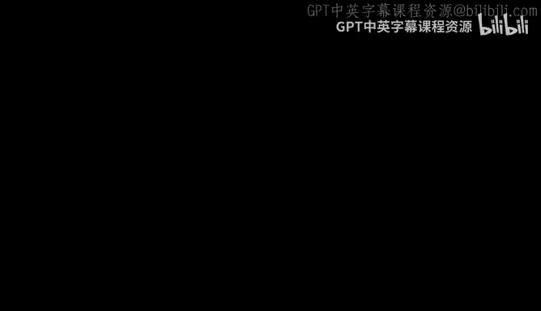

# 机器学习理论 9：覆盖数与达德利定理 📚

在本节课中，我们将学习如何利用覆盖数来界定无限假设类的拉德马赫复杂度。我们将从简单的离散化方法开始，逐步深入到更强大的技术——链式法，并最终介绍达德利定理。这个定理为我们提供了一种通过积分覆盖数来计算复杂度上界的优雅方法。

---

## 覆盖数与简单离散化方法

上一节我们讨论了如何利用Massart引理为有限函数类界定拉德马赫复杂度。本节中，我们来看看当函数类 `F` 无限时，该如何处理。核心思想是**离散化**，但这次我们是在函数的输出空间（而非参数空间）进行离散化。

我们首先回顾覆盖数的定义。对于一个函数类 `F`，其 **ε-覆盖** 是一个有限集合 `C`，使得对于 `F` 中的任意函数 `f`，在 `C` 中都存在一个函数 `f'`，满足两者在给定度量下的距离小于 `ε`。这里我们使用的度量是经验 `L2` 范数：
`ρ(f, f') = sqrt( (1/n) * Σ_{i=1}^{n} (f(z_i) - f'(z_i))^2 )`
覆盖数 `N(ε, F, L2(P_n))` 是构建这样一个覆盖所需的最小函数数量。

基于覆盖数，我们可以得到一个简单的复杂度上界定理：

**定理（简单离散化）**：设 `F` 是从空间 `Z` 映射到 `[-1, 1]` 的函数族。对于任意 `ε > 0`，其经验拉德马赫复杂度满足：
`R̂_n(F) ≤ ε + sqrt( (2 log N(ε, F, L2(P_n))) / n )`

**证明思路**：
1.  设 `C` 是 `F` 的一个 `ε-覆盖`。
2.  对于任意 `f ∈ F`，存在 `f' ∈ C` 使得 `ρ(f, f') ≤ ε`。
3.  将 `f` 在数据点上的输出向量分解为 `f'` 的输出向量加上一个误差向量 `z`。
4.  利用柯西-施瓦茨不等式，可以证明误差项 `⟨z, σ⟩` 的期望不超过 `ε`。
5.  对于覆盖 `C` 本身（一个有限集合），我们可以直接应用Massart引理来界定其复杂度。
6.  结合误差项和覆盖集的复杂度，即得到上述上界。

这个定理直观地展示了复杂度由两部分组成：**离散化误差 `ε`** 和 **覆盖集 `C` 本身的复杂度**。通过平衡这两部分，我们可以得到总体的上界。

---

## 链式法与达德利定理 🧠

上一节介绍的简单离散化方法在误差分析上采用了最坏情况下的界（柯西-施瓦茨不等式），这可能不够紧致。本节我们将介绍一种更精细的技术——**链式法**，它能通过多级离散化来获得更优的界，并最终导出**达德利定理**。

链式法的核心思想是进行多级近似，而非单级近似。我们构造一系列越来越精细的覆盖（例如，半径分别为 `ε, ε/2, ε/4, ...`）。对于一个目标函数 `f`，我们不是直接用最粗覆盖中的某个点来近似它，而是用一系列逐级逼近的点来近似：
`f ≈ f_1 + (f_2 - f_1) + (f_3 - f_2) + ...`
其中，`f_j` 是 `f` 在第 `j` 级覆盖中的最近邻点。这样，每一级的差值 `(f_j - f_{j-1})` 都具有更小的范数。

通过对每一级差值应用Massart引理（因为每一级都只涉及有限个点），并将所有级别的界求和，我们可以得到一个复杂度上界，它是关于覆盖数对数的平方根的一个级数和。

达德利定理将这个级数和表达为一个更简洁的积分形式：

**定理（达德利定理）**：设 `F` 是从 `Z` 映射到 `R` 的函数族，且函数值有界。则其经验拉德马赫复杂度满足：
`R̂_n(F) ≤ (12/√n) * ∫_0^∞ sqrt( log N(α, F, L2(P_n)) ) dα`

**直观理解**：
积分中的被积函数 `sqrt( log N(α, ...) )` 衡量了在尺度 `α` 下函数类的“有效大小”。积分从 `0` 到 `∞` 意味着我们考虑了所有尺度下的复杂度贡献。达德利定理表明，总复杂度是所有尺度上对数覆盖数平方根的加权和。

---

## 覆盖数上界的典型形式与应用

达德利定理提供了一个将覆盖数转化为复杂度上界的通用框架。为了实际应用它，我们需要知道覆盖数 `N(ε, F, L2(P_n))` 随 `ε` 衰减的速度。以下是几种典型情况及其对应的复杂度界：

以下是几种常见的覆盖数增长模式及其对应的拉德马赫复杂度上界（忽略对数因子）：

1.  **指数衰减（温和）**：`log N(ε) ~ (1/ε)^r`。积分结果为 `O( √r / √n )`。
2.  **指数平方衰减（常见）**：`log N(ε) ~ R / ε^2`。积分结果为 `O( √R / √n )`。
3.  **指数立方衰减（临界）**：`log N(ε) ~ R / ε^3`。直接积分会发散。此时需要使用**改进的达德利定理**，它只对 `ε` 从某个小的 `α` 积分到无穷，并对小于 `α` 的部分支付一个 `α` 的代价。通过巧妙选择 `α`（例如 `α = 1/poly(n)`），仍然可以得到 `~ √R / √n` 的界（可能带有额外的对数因子）。

**改进的达德利定理形式**：
`R̂_n(F) ≤ inf_{α>0} { 4α + (12/√n) ∫_α^∞ sqrt( log N(ε, F, L2(P_n)) ) dε }`
这个形式是简单离散化定理和原始达德利定理的插值。

---

## 线性模型的覆盖数

现在我们将覆盖数理论应用于具体的模型。首先考虑线性模型。

**定理（线性模型覆盖数）**：设数据点 `x_1, ..., x_n ∈ R^d` 满足 `||x_i||_p ≤ C`。考虑假设类 `F = { x -> ⟨w, x⟩ : ||w||_q ≤ B }`，其中 `1/p + 1/q = 1`。那么，其对数覆盖数满足：
`log N(ε, F, L2(P_n)) ≤ (B^2 C^2 / ε^2) * log(2d + 1)`
特别地，当 `p = q = 2` 时，可以改进为：
`log N(ε, F, L2(P_n)) ≤ (B^2 C^2 / ε^2) * log 2`

**观察**：这个上界具有 `log N(ε) ~ R / ε^2` 的形式，其中 `R = B^2 C^2`。根据达德利定理，对应的拉德马赫复杂度上界为 `O( BC / √n )`（忽略对数因子），这与我们之前用其他方法得到的界一致。

这个结果可以推广到多输出线性层（例如神经网络中的一层）。对于矩阵参数 `W`，如果约束其 `(2,1)`-范数（即各行 `L2` 范数之和），那么其覆盖数上界形式类似，只是 `B` 被替换为该范数。

---

## 利普希茨复合性质

最后，我们介绍一个在分析复杂模型（如深度网络）时非常有用的工具：覆盖数的**利普希茨复合性质**。

**引理（利普希茨复合）**：设 `φ: R -> R` 是一个 `L`-利普希茨函数。设 `F` 是一个函数类。那么，复合函数类 `φ ◦ F = {φ ◦ f : f ∈ F}` 的覆盖数满足：
`log N(ε, φ ◦ F, L2(P_n)) ≤ log N(ε/L, F, L2(P_n))`

**证明思路**：
1.  取 `F` 的一个 `(ε/L)`-覆盖 `C`。
2.  可以证明，`φ ◦ C` 构成了 `φ ◦ F` 的一个 `ε`-覆盖。
3.  这是因为对于任意 `φ ◦ f`，存在 `f' ∈ C` 使得 `ρ(f, f') ≤ ε/L`。由于 `φ` 是 `L`-利普希茨的，可以推导出 `ρ(φ ◦ f, φ ◦ f') ≤ ε`。

这个引理非常强大且直观：**利普希茨变换不会显著增加函数类的覆盖数**。这使得我们可以逐层分析神经网络的复杂度，只要每层的激活函数是利普希茨连续的。

---

## 总结

本节课中我们一起学习了：
1.  **覆盖数**的概念，以及如何用它通过简单离散化为无限函数类界定拉德马赫复杂度。
2.  **链式法**的精妙思想，它通过多级离散化得到了更紧致的界。
3.  **达德利定理**及其积分形式，它提供了一个统一框架，将覆盖数积分转化为复杂度上界。
4.  覆盖数上界的几种**典型模式**（如 `~1/ε^2`），以及它们通过达德利定理导出的复杂度阶。
5.  **线性模型**的覆盖数上界，验证了其复杂度为 `O(1/√n)`。
6.  覆盖数的**利普希茨复合性质**，这是分析复合模型（如神经网络）的关键工具。

这些工具为我们接下来分析更复杂的模型（如深度神经网络）的理论性质奠定了坚实的基础。下一讲，我们将应用这些工具来研究深度网络的泛化能力。