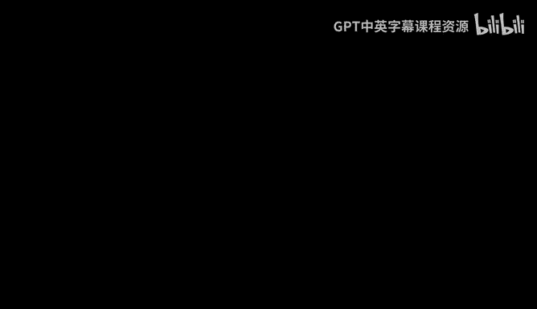
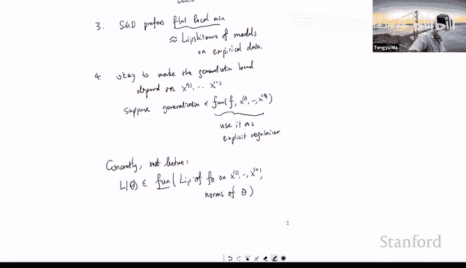
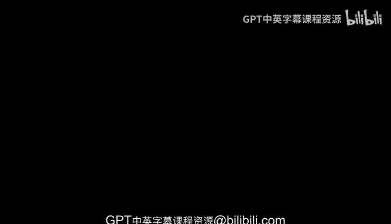

# 机器学习理论 10：深度网络的泛化界 🧠

在本节课中，我们将要学习如何为深度神经网络推导泛化误差界。我们将利用覆盖数这一工具，并通过迭代覆盖的思想，将单层网络的覆盖数界扩展到多层深度网络。最终，我们将得到一个依赖于网络权重矩阵谱范数乘积的泛化界。

---

## 课程回顾与本节目标

上一节我们介绍了覆盖数的概念，它是拉德马赫复杂度的上界。我们的目标是通过覆盖数来界定复杂度，因为这是分析拉德马赫复杂度的新工具。我们讨论了线性模型的覆盖数界，并介绍了利普希茨函数的覆盖数组合引理，该引理使得组合利普希茨函数后的覆盖数界仍然可控。

本节中，我们将把目光转向深度神经网络。深度网络本质上是由多个线性层与利普希茨激活函数（如ReLU）组合而成。因此，我们可以利用上一节的工具来分析其覆盖数与泛化界。

---

## 深度网络设定与主要定理

我们考虑一个深度神经网络 \( H_\theta \)，其中 \(\theta\) 表示所有参数。网络共有 \(R\) 层，其结构如下：
- 输入 \(x\)，满足 \(\|x\|_2 \leq C\)。
- 第 \(i\) 层进行线性变换 \(W_i\)，然后通过一个利普希茨激活函数。
- 最后一层没有激活函数。

网络的输出可以表示为：
\[
H_\theta(x) = W_R \cdot \sigma( W_{R-1} \cdot \sigma( ... \sigma(W_1 x) ... ))
\]
其中 \(\sigma\) 是1-利普希茨激活函数。

我们考虑满足以下范数约束的网络函数族：
- 权重矩阵的算子范数（谱范数）有界：\(\|W_i\|_{op} \leq \kappa_i\)。
- 权重矩阵转置的2-1范数有界：\(\|W_i^T\|_{2 \to 1} \leq B_i\)。

在这些假设下，我们有如下定理：

**定理**：在上述设定下，该深度网络函数族的拉德马赫复杂度（进而其泛化误差）的上界为：
\[
\tilde{O}\left( \frac{C}{\sqrt{n}} \cdot \left( \prod_{i=1}^{R} \kappa_i \right) \cdot \left( \sum_{i=1}^{R} \frac{B_i^{2/3}}{\kappa_i^{2/3}} \right)^{3/2} \right)
\]
其中，\(\tilde{O}\) 隐藏了常数和对数因子。

**核心概念解释**：
- **算子范数 \(\|W_i\|_{op}\)**：即矩阵的最大奇异值。它控制了线性变换 \(W_i x\) 的利普希茨常数，因为 \(\|W_i x - W_i y\|_2 \leq \|W_i\|_{op} \cdot \|x - y\|_2\)。
- **乘积项 \(\prod \kappa_i\)**：这来自于整个网络函数的利普希茨常数上界，是各层利普希茨常数上界的乘积。
- **多项式项 \(\sum \frac{B_i^{2/3}}{\kappa_i^{2/3}}\)**：这部分来自于证明过程，可以视为关于 \(B_i\) 和 \(\kappa_i\) 的多项式，其具体形式不如乘积项关键。

这个定理表明，网络的泛化能力主要受各层权重谱范数乘积的控制。如果这个乘积很大，泛化误差的上界也会很大。

---

## 证明的核心思想：迭代覆盖

证明的核心思想是**迭代地覆盖网络函数集**。我们将深度网络视为多个函数层的组合：
\[
\mathcal{F} = \mathcal{F}_R \circ \mathcal{F}_{R-1} \circ ... \circ \mathcal{F}_1
\]
其中，每个 \(\mathcal{F}_i\) 代表一个“线性层+激活函数”的函数族，并且每个 \(f_i \in \mathcal{F}_i\) 是 \(\kappa_i\)-利普希茨的。

证明分为两个主要步骤：
1. **控制单层的覆盖数**：利用线性模型的覆盖数界，结合利普希茨激活函数，得到单层函数族 \(\mathcal{F}_i\) 的覆盖数上界。
2. **组合多层覆盖数**：通过一个引理，将单层的覆盖数界组合起来，得到整个深度网络的覆盖数界。

以下是证明的关键引理：

**引理（迭代覆盖）**：假设对于每个单层函数族 \(\mathcal{F}_i\)，当输入范数有界时，其覆盖数满足 \(\log \mathcal{N}(\mathcal{F}_i, \epsilon_i, \|\cdot\|) \leq g(\epsilon_i, C_{i-1})\)。那么，对于组合函数族 \(\mathcal{F}\)，存在一个 \(\epsilon\)-覆盖，其对数规模满足：
\[
\log \mathcal{N}(\mathcal{F}, \epsilon, \|\cdot\|) \leq \sum_{i=1}^{R} g(\epsilon_i, C_{i-1})
\]
其中，覆盖半径 \(\epsilon\) 与各层选择的半径 \(\epsilon_i\) 满足关系：\(\epsilon = \sum_{i=1}^{R} \epsilon_i \cdot (\prod_{j=i+1}^{R} \kappa_j)\)。

**引理直观解释**：我们可以通过逐层构造覆盖来构建整个网络的覆盖。首先为第一层构造一个覆盖，然后对于第一层覆盖中的每个中心点，为第二层在该点上的输出集合构造一个覆盖，依此类推。最终覆盖的规模是各层覆盖规模的乘积（在对数尺度下是求和），而总覆盖半径会受到各层利普希茨常数的影响而逐层放大。

---

## 从覆盖数到泛化界

在得到深度网络的覆盖数上界后，我们可以通过以下标准步骤得到拉德马赫复杂度上界，进而得到泛化误差界：
1. 将覆盖数界代入关系式：\(\mathfrak{R}_n(\mathcal{F}) \lesssim \inf_{\epsilon > 0} \left\{ \epsilon + \frac{\sqrt{\log \mathcal{N}(\mathcal{F}, \epsilon, \|\cdot\|)}}{\sqrt{n}} \right\}\)。
2. 通过优化选择参数 \(\epsilon_i\)（通常使用霍尔德不等式等技巧），得到最紧的界。
3. 最终得到定理中所示的依赖于 \(\prod \kappa_i\) 和多项式项的复杂度上界。

---

## 当前方法的局限性与改进动机

虽然上述定理给出了一个泛化界，但它存在一些局限性，这也指明了未来的改进方向：

1.  **依赖最坏情况利普希茨常数**：定理中的 \(\prod \kappa_i\) 是网络在整个输入空间上的最坏情况利普希茨常数上界。在实践中，网络在**实际训练数据**上的利普希茨常数可能小得多。
2.  **谱范数乘积可能很大**：为了使网络各层的激活值不至于收缩至零，权重矩阵的谱范数通常不能太小（例如需要大于 \(\sqrt{2}\)），这可能导致乘积项 \(\prod \kappa_i\) 很大，从而使泛化界显得宽松。
3.  **与优化过程的联系**：有理论和实证表明，随机梯度下降（SGD）倾向于找到“平坦”的极小值，而这些点对应的模型在数据上的利普希茨常数往往更小。

因此，一个更理想的泛化界应该依赖于模型在**经验数据**（即训练集）上的利普希茨性质，而不是最坏情况下的性质。幸运的是，让泛化界依赖于经验数据是可行的，并且这样的界仍然可以作为有效的正则化器或模型选择准则。

在接下来的课程中，我们将证明一种改进的泛化界，它直接依赖于网络在训练样本 \(x_1, ..., x_n\) 上的利普希茨常数，其形式将是该利普希茨常数和权重范数的多项式函数，而不包含指数项，并且证明过程会比本节课更为简洁。

---

## 总结

本节课我们一起学习了如何为深度神经网络推导泛化误差界。
- 我们首先回顾了覆盖数这一核心工具。
- 然后，我们设定了一个具有范数约束的深度网络模型。
- 通过**迭代覆盖**的思想，我们将单层线性模型的覆盖数界组合起来，得到了整个深度网络的覆盖数上界。
- 最终，我们得到了一个泛化界，其主要项是各层权重矩阵谱范数的乘积，这反映了网络整体利普希茨常数的影响。
- 最后，我们讨论了该理论的局限性，并指出了通过依赖经验数据利普希茨常数来获得更紧泛化界的改进方向。

理解这个证明过程有助于我们洞察深度网络泛化能力的本质，并为进一步设计更好的泛化理论奠定了基础。