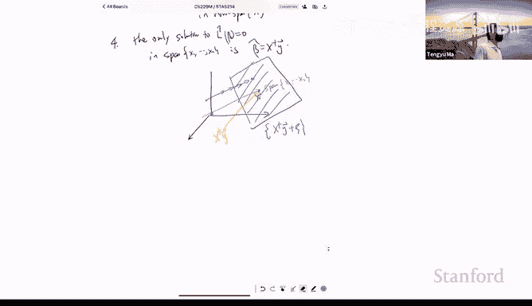

# 机器学习理论 13：神经正切核与梯度下降的隐式正则化 🧠


在本节课中，我们将学习神经正切核方法的最后一部分，并探讨梯度下降的隐式正则化效应。

## 神经正切核方法回顾

上一节我们介绍了神经正切核方法。该方法的核心在于证明，在参数空间的一个特定邻域内，神经网络的输出 `F(θ, x)` 可以准确地用一个线性模型 `G(θ, x)` 来近似。

具体而言，我们定义了邻域 `B(θ₀)`，其半径为 `√n / σ`。在该邻域内，近似误差 `ε` 满足：
```
ε ≈ β² n / σ²
```
其中，`β` 是梯度的上界，`σ` 是特征矩阵 `Φ` 的最小奇异值。当关键量 `β / σ²` 趋近于0时，近似效果会越来越好。

## 线性模型的优化分析

上一节我们介绍了近似关系，本节中我们来看看如何分析优化过程。我们的目标是证明，优化神经网络 `F(θ)` 与优化其线性近似 `G(θ)` 是相似的。

首先，我们分析线性模型 `G(θ)` 的梯度下降优化。`G(θ)` 本质上是一个线性回归问题：
```
L(Δθ) = ||y - Φ Δθ||²
```
其中，`Φ` 是 `N×P` 维的特征矩阵，每一行是 `∇F(θ₀, x_i)` 的转置。`Δθ` 是参数 `θ` 与初始点 `θ₀` 的差值。

梯度更新规则为：
```
Δθ_{t+1} = Δθ_t - η Φᵀ (y - Φ Δθ_t)
```
我们关注输出空间的变化。定义 `ŷ_t = Φ Δθ_t`，则残差 `ŷ_t - y` 的递归关系为：
```
ŷ_{t+1} - y = (I - η Φ Φᵀ) (ŷ_t - y)
```
当学习率 `η` 满足 `η < 2 / σ_max(Φ Φᵀ)` 时，矩阵 `(I - η Φ Φᵀ)` 的算子范数小于 `1 - η σ²`。这里 `σ` 是 `Φ` 的最小奇异值。因此，误差呈指数衰减：
```
||ŷ_T - y|| ≤ (1 - η σ²)^T ||ŷ₀ - y||
```
经过 `T ≈ log(1/ε) / (η σ²)` 次迭代后，经验损失可以小于任意小的 `ε`。

## 神经网络的优化分析

现在，我们将上述分析思路应用到神经网络 `F(θ)` 上。核心思想是模仿线性模型的证明，并处理其中的差异。

主要的差异在于，神经网络的“特征矩阵” `Φ_t` 会随着参数 `θ_t` 的变化而变化，而在线性模型中 `Φ` 是固定的。在时间 `t` 进行泰勒展开后，梯度下降更新为：
```
θ_{t+1} = θ_t - η ∇L(θ_t)
```
其中，梯度 `∇L(θ_t) = Φ_tᵀ (y - ŷ_t)`。对输出进行泰勒展开，并忽略二阶项（当学习率 `η` 足够小时，二阶项 `O(η²)` 可忽略），我们可以得到与线性模型形式相似的输出残差递归式，只是将固定的 `Φ` 替换为 `Φ_t`。

为了完成证明，我们需要归纳地证明在整个优化过程中，参数 `θ_t` 始终停留在初始邻域 `B(θ₀)` 内。这依赖于一个关键事实：当 `β / σ²` 足够小时，存在一个全局最优解 `θ_hat` 位于该邻域内。由于优化过程会驱使参数向这个最优解移动，因此参数不会偏离邻域太远。在此条件下，可以证明 `Φ_t` 的最小奇异值始终有下界，从而保证误差的指数衰减。

综上所述，在特定条件下，优化神经网络会收敛到一个经验损失很小的解，其行为类似于优化一个核方法。

## 神经正切核的局限性

然而，神经正切核方法有其局限性。它表明在此机制下，神经网络的表现并不优于核方法。实际上，核方法的统计效率可能受到限制，因为它使用的是固定的、非自适应的特征。

考虑一个例子：数据 `x ∈ ℝ^d`，标签 `y = x₁ * x₂`。这是一个简单的非线性函数。使用带正则化的神经网络，可以学习到一个稀疏的特征组合（例如四个特定的神经元），从而高效地解决问题。而使用NTK核方法，我们是在最小化所有特征系数 `a` 的L2范数，这会倾向于一个稠密的特征组合，无法专注于对任务最有用的少数特征，因此可能需要 `Ω(d²)` 的样本量，而神经网络可能只需要 `O(1)` 的样本量。

这个例子说明，神经网络通过隐式地寻找稀疏解，可以拥有比核方法更好的统计效率。

## 梯度下降的隐式正则化

现在，我们转向一个新的主题：梯度下降的隐式正则化效应。观察发现，优化器的选择（如初始化、学习率）会隐式地偏好某些全局最优解。

在神经正切核机制中，特定的初始化使优化器收敛到NTK解，这可能并非泛化性能最好的解。我们将探讨如何通过改变优化设置（如使用小初始化或随机性）来离开NTK区域，并可能找到泛化更好的解。

### 过参数化线性回归中的隐式正则化

我们从一个简单的过参数化线性回归模型开始分析。设定如下：
- 数据矩阵 `X ∈ ℝ^{N×d}`，`N << d` 且 `X` 满行秩。
- 参数 `β ∈ ℝ^d`。
- 损失函数 `L(β) = ½ ||y - Xβ||²`。

由于 `N < d`，该问题存在无穷多个全局最优解。所有最优解可表示为：
```
β = X⁺ y + ζ
```
其中 `X⁺` 是 `X` 的伪逆，`ζ` 是垂直于 `X` 所有行张成空间的任意向量（即 `Xζ = 0`）。

在这些全局最优解中，范数最小的解是 `ζ = 0` 对应的解，即 `β^* = X⁺ y`。

**定理**：如果使用梯度下降法，并以零向量 `β₀ = 0` 初始化，并采用足够小的学习率，那么优化过程将收敛到**最小范数解** `β^*`。

以下是证明思路：

1.  **收敛到零损失**：根据标准凸优化理论，梯度下降最终会使损失趋于零，即收敛到某个全局最优解。
2.  **参数始终位于数据张成空间内**：我们可以归纳证明，所有迭代点 `β_t` 都位于数据行向量 `{x₁, ..., x_N}` 的张成空间内。
    - 基础：`β₀ = 0` 显然在该空间内。
    - 归纳：梯度 `∇L(β_t) = Xᵀ (y - Xβ_t)` 位于 `Xᵀ` 的列空间，也就是 `X` 的行空间。因此，更新 `β_{t+1} = β_t - η ∇L(β_t)` 仍然在该空间内。
3.  **空间内的唯一解**：所有全局最优解中，只有 `β^* = X⁺ y` 位于 `X` 的行张成空间内。其他解 `β = X⁺ y + ζ` 由于 `ζ` 垂直于该空间，因此不在其中。

因此，被限制在数据行空间内进行优化的梯度下降，别无选择，只能收敛到该空间内唯一的全局最优解——也就是最小范数解。

**直观理解**：可以将解空间（紫色平面，满足 `Xβ = y`）和数据行张成空间（蓝色直线）画出来。优化目标是要到达紫色平面，但梯度下降的更新方向始终被限制在蓝色直线上。从原点（初始化点）出发，沿着蓝色直线移动，最终会到达它与紫色平面的交点，而这个交点正是离原点最近的点，即最小范数解。

这个简单的例子说明了初始化如何带来隐式的正则化效果：零初始化引导梯度下降找到最小范数解，而无需在损失函数中显式添加范数惩罚项。

## 总结




本节课中我们一起学习了：
1.  完成了神经正切核方法的分析，证明了在特定条件下优化神经网络类似于优化一个线性模型。
2.  讨论了NTK的局限性，即它可能并不比核方法更强大，而真正的神经网络可以通过特征学习的稀疏性获得更好的统计效率。
3.  引入了梯度下降的隐式正则化概念，并在过参数化线性回归模型中证明，零初始化会引导优化器收敛到最小范数解。这为理解更复杂的非线性模型中的隐式正则化效应奠定了基础。下一讲我们将把这一分析扩展到非线性模型。