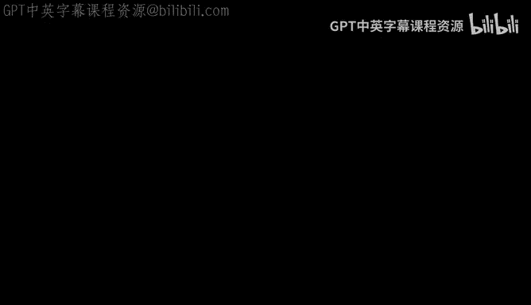

# 机器学习理论 14：初始化带来的隐式正则化效应 🧠

在本节课中，我们将探讨优化器（特别是梯度下降）在非凸模型中的隐式正则化效应。我们将聚焦于一个特定的非线性模型，并分析当使用小规模初始化时，梯度下降如何自动偏好稀疏解，从而在无需显式正则化的情况下恢复真实参数。

---

## 模型与问题设定 📝

我们考虑一个非线性模型，其参数为 **β**，输入为 **x**。模型定义为：
`f(x) = (β ⊙ β) · x`
其中 `⊙` 表示逐元素乘法（即 `β ⊙ β` 是 `β` 各分量的平方）。该模型对 **x** 是线性的，但对 **β** 是非线性的，因此损失函数关于 **β** 是非凸的。

我们假设真实数据由以下模型生成（无噪声）：
`y = (β* ⊙ β*) · x`
其中真实参数 **β*** 是 **稀疏** 的，即其非零项的数量 `||β*||₀ ≤ r`，且 `r` 远小于维度 `d`。为简化分析，我们进一步假设 **β*** 的所有非零项均为正。

我们处于**过参数化**场景：数据点数量 `n` 远小于参数维度 `d`（`n << d`），但 `n` 大于 `r²` 的量级（即 `n = Ω(r²)`）。这意味着理论上存在无数个能完美拟合训练数据的全局最小值。

我们的目标是研究在以下目标函数上运行梯度下降：
`L̂(β) = (1/(4n)) Σ (y_i - (β ⊙ β)·x_i)²`
我们使用**小规模初始化**：`β₀ = α · 1`（所有分量初始化为一个很小的正数 `α`），然后进行梯度更新：`β_{t+1} = β_t - η ∇L̂(β_t)`。

我们将证明，该优化过程能够收敛到真实参数 **β***，尽管目标函数中没有任何显式正则化项。

---

## 主要定理与解释 📜

以下是本节课的核心定理（简化版）：

**定理**：假设数据量 `n ≥ C r² log² d`（`C` 为足够大的常数），初始化规模 `α` 小于某个逆多项式量级，学习率 `η` 为常数。那么，当迭代步数 `T` 满足 `log(d/α)/η ≤ T ≤ 1/(η√d α)` 时，梯度下降的输出满足：
`||β_T ⊙ β_T - β* ⊙ β*||₂ ≤ O(α)`

**定理解读**：
1.  **过参数化与多重解**：由于 `n < d`，存在无数个能完美拟合数据的全局最小值。隐式偏置的作用是引导优化器选择其中一个特定的解。
2.  **初始化规模 `α` 的作用**：误差界与 `α` 成正比。因此，我们可以通过选择极小的 `α`（如 `α = 1/d^10`）来获得任意小的误差。同时，运行时间的下界仅与 `log(1/α)` 相关，因此选择极小的 `α` 对运行时间影响不大。
3.  **早期停止的必要性**：定理给出了迭代步数的上界。这可以理解为需要进行“早期停止”。然而，由于上界与 `1/α` 相关，当 `α` 极小时，这个上界非常宽松，在实践中可能不需要严格停止。
4.  **为何不能初始化为零**：`β = 0` 是一个鞍点（梯度为零），梯度下降会停滞于此。因此需要一个小扰动来逃离鞍点，`log(1/α)/η` 这个时间下界正是逃离鞍点所需的时间。

该定理表明，梯度下降结合小规模初始化，隐式地倾向于寻找 `L₂` 范数较小的解（在 `β` 空间），这类似于在参数 `θ = β ⊙ β` 空间中进行 `L₁` 正则化（因为 `||θ||₁ = ||β||₂²`）。这与上一讲线性回归中梯度下降收敛到最小范数解的现象有相似之处。

---

## 经典方法与隐式正则化的对比 ⚖️

如果我们只关心解决问题，经典方法是使用显式正则化。对于这个模型，有两种等价的视角：

1.  **在 `θ = β ⊙ β` 空间使用 Lasso (`L₁` 正则化)**：
    `min_θ (1/(4n)) Σ (y_i - θ·x_i)² + λ ||θ||₁`
    经典理论表明，当 `n = Ω(r log d)` 时，此方法能恢复真实的 `θ*`（即 `β* ⊙ β*`）。

2.  **在 `β` 空间使用岭回归 (`L₂` 正则化)**：
    `min_β (1/(4n)) Σ (y_i - (β ⊙ β)·x_i)² + λ ||β||₂²`
    由于 `||θ||₁ = ||β||₂²`，这本质上与 Lasso 等价。

本节课的结论是：**使用小规模初始化的梯度下降，无需任何显式正则化项，就能自动实现类似于 `L₂` 正则化的效果，并找到稀疏解 `β*`。**

---

## 证明思路与关键直觉 🔍

证明的核心在于比较**经验损失轨迹**（实际梯度下降路径）和**总体损失轨迹**（在无限数据总体上的理想梯度下降路径）。

上一节我们介绍了总体轨迹的分析。本节中，我们来看看如何将经验轨迹与总体轨迹联系起来。

### 关键定义：稀疏向量集与限制等距性质 (RIP)

我们定义稀疏向量集合：
`X_r = { β : ||β||₀ ≤ r }`
对于这个集合中的向量，经验损失和总体损失（及其梯度）会非常接近。这种性质由**限制等距性质 (RIP)** 保证。

**RIP 性质**：以高概率，对于所有满足 `||v||₀ ≤ 2r` 的向量 `v`，有：
`(1/n) Σ |v·x_i|² ≈ ||v||₂²`
这意味着，对于稀疏向量 `v`，其与数据点内积的平方均值近似等于其 `L₂` 范数平方。该性质成立的条件是 `n = Ω(r / δ²)`。

由于我们的真实参数 `β*` 是 `r`-稀疏的，并且我们期望算法找到的解 `β` 也近似稀疏，因此 RIP 性质保证了在稀疏集 `X_r` 上，经验风险 `L̂(β)` 和总体风险 `L(β)` 是均匀接近的。

### 总体轨迹分析

首先分析在总体损失 `L(β)` 上的梯度下降。计算梯度：
`∇L(β) = (β ⊙ β - β* ⊙ β*) ⊙ β`
更新公式为：
`β_{t+1} = β_t - η [ (β_t ⊙ β_t - β* ⊙ β*) ⊙ β_t ]`
由于各坐标之间没有耦合，我们可以分坐标分析：
-   对于在 `β*` 支持集内的坐标 `i` (`β*_i = 1`)：更新规则鼓励 `β_i` 增长到 1。
-   对于不在支持集内的坐标 `i` (`β*_i = 0`)：更新规则鼓励 `β_i` 衰减到 0。

通过细致分析可以证明，总体梯度下降轨迹会收敛到 `β*`，并且整个轨迹始终保持在稀疏集 `X_r` 附近（即非支持集上的坐标值始终很小）。

### 直觉图示

想象参数空间：
-   原点 `0` 附近是稀疏集 `X_r`。
-   在 `X_r` 内部，经验损失和总体损失行为相似，且唯一的全局最小值是 `β*`。
-   在 `X_r` 外部，存在无数个能完美拟合训练数据（即 `L̂(β)=0`）的过拟合解，但它们的测试损失 `L(β)` 很大。

算法从靠近原点（即 `X_r` 内部）的小初始化开始。梯度下降在经验损失 `L̂` 上运行。由于在 `X_r` 内 `L̂ ≈ L`，其行为近似于在总体损失 `L` 上运行。而总体梯度下降轨迹被证明会收敛到 `β*` 且不离开 `X_r`。因此，经验梯度下降轨迹也会被“限制”在 `X_r` 内，并跟随总体轨迹收敛到 `β*`，而不会偏离到外部那些过拟合解的区域。

**核心挑战**：需要严格证明经验轨迹不会因误差积累而偏离总体轨迹并冲出 `X_r`。这涉及到复杂的递归误差分析，通过将当前参数分解为 `β_t = R_t e_1 + ζ_t`（其中 `e_1` 方向代表 `β*` 的方向），并分别控制主分量 `R_t` 和误差分量 `ζ_t` 的增长来完成证明。

---

## 总结与思考 💡

本节课我们一起学习了梯度下降在特定非线性模型中的隐式正则化效应。通过将参数初始化为一个极小的值，梯度下降自动倾向于寻找一个稀疏的、`L₂` 范数较小的解，从而在过参数化场景中恢复真实参数，而无需任何显式正则化项。

关键要点如下：
1.  **小初始化的作用**：它作为一种隐式正则化，引导优化器偏好接近初始点的解（在本例中是最小 `L₂` 范数解）。
2.  **与经典方法的联系**：这种隐式效应与在适当参数化下使用 `L₁` 或 `L₂` 显式正则化是等价的。
3.  **证明框架**：通过分析总体梯度下降轨迹（易于分析）并证明经验轨迹在其附近，来解释隐式偏置的产生。
4.  **局限性**：目前这种严格的理论分析仅适用于高度结构化的模型（如本课的二次参数化模型）。将其扩展到如深度神经网络等复杂模型，仍然是机器学习理论中的一个重要开放问题。

这种对隐式偏置的理解，有助于我们解释为何简单的优化算法如梯度下降，在过参数化的现代机器学习模型中依然能表现出良好的泛化性能。