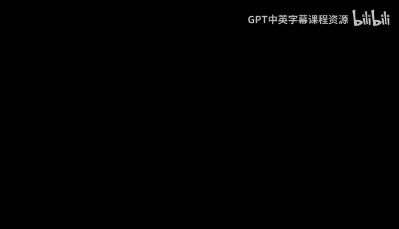
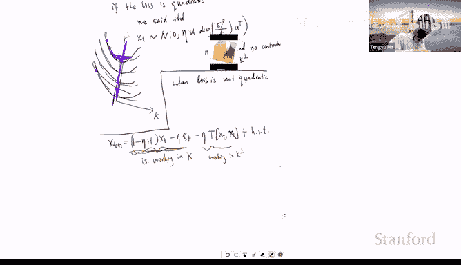
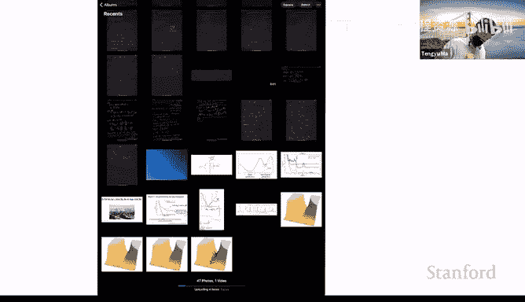
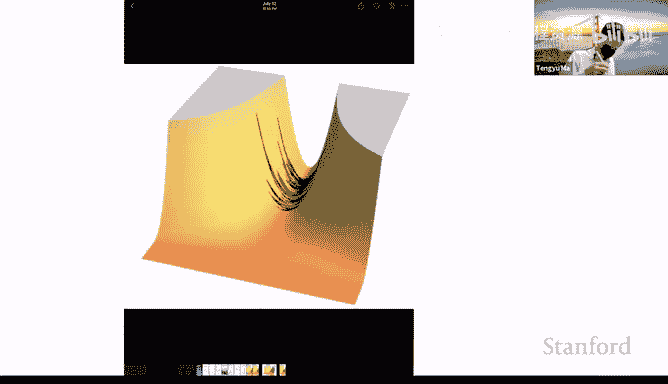
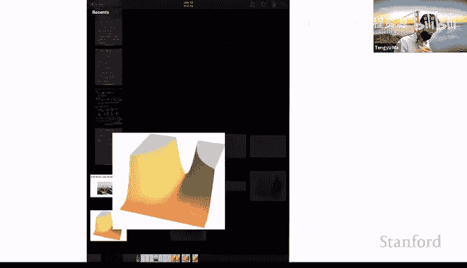

# 机器学习理论 16：噪声的隐式正则化效应 🎯




在本节课中，我们将探讨随机梯度下降（SGD）中噪声的隐式正则化效应。我们将从简单的二次损失函数开始，逐步深入到更复杂的非二次损失函数，以理解噪声如何影响优化过程，并最终引导模型趋向于更平坦的最小值。

---

## 1. 基础设定与目标

我们首先设定一个通用的损失函数 `G(θ)`，其中 `θ` 是模型参数。在本课程中，我们主要分析带有噪声的梯度下降算法，其更新规则如下：

**公式：**
```
θ_{t+1} = θ_t - η * (∇G(θ_t) + ξ_t)
```

其中：
*   `η` 是学习率。
*   `∇G(θ_t)` 是损失函数在 `θ_t` 处的梯度。
*   `ξ_t` 是一个均值为零的随机噪声项，其分布可能依赖于当前参数 `θ_t`。

这个公式可以捕捉到小批量随机梯度下降（Mini-batch SGD）的行为，其中噪声 `ξ_t` 源于使用数据子集计算梯度所带来的随机性。为了简化分析，我们通常假设噪声是高斯噪声。

---

## 2. 热身：二次损失函数（凸情况）

为了建立直觉，我们首先分析最简单的情况：一维二次损失函数。

### 2.1 一维二次损失

考虑损失函数 `G(x) = (1/2) * x^2`，其全局最小值在 `x=0`。带有噪声的梯度下降更新规则为：

**公式：**
```
x_{t+1} = x_t - η * (∇G(x_t) + σ * ζ_t) = x_t - η * (x_t + σ * ζ_t) = (1 - η) * x_t - η * σ * ζ_t
```

其中 `ζ_t` 是标准高斯噪声（均值为0，方差为1），`σ` 控制噪声的尺度。

**过程分析：**
*   当 `x_t` 较大时，收缩项 `(1 - η) * x_t` 占主导，推动参数向零点移动。
*   当 `x_t` 接近零时，噪声项 `-η * σ * ζ_t` 占主导，导致参数在零点附近随机波动。

通过递归展开，我们可以得到 `x_t` 的解析表达式：

**公式：**
```
x_t = (1 - η)^{t+1} * x_0 - η * σ * Σ_{k=0}^{t} (1 - η)^k * ζ_{t-k}
```

这个公式揭示了两个关键点：
1.  **收缩效应**：初始值 `x_0` 的影响随时间呈指数衰减。
2.  **噪声累积**：历史噪声会累积，但越早的噪声被收缩得越厉害，其影响越小。

当 `t → ∞` 时，`x_t` 的分布会收敛到一个稳态分布。我们可以计算其方差：

**公式：**
```
Var(x_∞) ≈ (η * σ^2) / 2
```

**结论：**
在经典的凸优化设定下，噪声主要带来两个影响：
1.  **降低最终解的精度**：算法无法精确收敛到全局最小点，而是在其周围波动。
2.  **加速计算**：使用小批量计算梯度比使用全批量更快。

因此，传统的观点是在精度和计算速度之间进行权衡：在优化初期使用较大的学习率以快速下降，后期衰减学习率以减少噪声影响，从而获得更精确的解。

此外，值得注意的是，尽管存在随机波动，但迭代值的期望 `E[x_t]` 仍然收敛于零。这意味着噪声引入了方差（波动），但没有引入系统性偏差。

---

## 3. 多维二次损失

将分析扩展到多维情况。考虑损失函数 `G(x) = (1/2) * x^T A x`，其中 `A` 是一个正定矩阵。更新规则为：

**公式：**
```
x_{t+1} = x_t - η * (A * x_t + ξ_t) = (I - ηA) * x_t - η * ξ_t
```

通过递归和特征分解，我们可以分析在各个特征方向上的行为。在特征向量 `v_i` 对应的方向上（特征值为 `λ_i`），迭代值的波动方差大致为：

**公式：**
```
波动方差 ∝ (η * σ_i^2) / λ_i
```

其中 `σ_i^2` 是噪声在该方向上的方差。

**关键观察：**
*   在曲率大（`λ_i` 大）的方向上，收缩强，噪声积累导致的波动小。
*   在曲率小（`λ_i` 小）的方向上，收缩弱，噪声积累导致的波动大。
*   在没有噪声（`σ_i^2 = 0`）的方向上，迭代值不会产生波动。

这为后续理解非凸情况下的隐式正则化奠定了基础。

---

## 4. 非二次损失函数与三阶项的影响

现在，我们进入更核心的部分，分析非二次损失函数。假设全局最小值仍在 `x=0`，我们在该点进行泰勒展开：

**公式：**
```
∇G(x_t) ≈ ∇G(0) + ∇²G(0) * x_t + (1/2) * ∇³G(0) [x_t, x_t]
```

由于 `∇G(0) = 0`，定义海森矩阵 `H = ∇²G(0)`，三阶张量 `T = (1/2) * ∇³G(0)`，则更新规则近似为：

**公式：**
```
x_{t+1} ≈ (I - ηH) * x_t - η * ξ_t - η * T[x_t, x_t]
```



与二次情况相比，这里多了一个三阶项 `-η * T[x_t, x_t]`。








**分析：**
*   当 `H` 是严格正定矩阵时，收缩项 `(I - ηH) * x_t` 占主导。三阶项的量级为 `O(η^2)`（因为 `x_t ~ O(√η)`），通常比主导项小，因此影响微弱，只会引入一个很小的偏差。
*   **然而**，当 `H` 在某些方向上是零（即存在平坦方向）时，情况就完全不同了。这在过参数化模型中很常见，例如存在一个全局最小值的流形。

---

## 5. 隐式正则化效应的核心机制

当海森矩阵 `H` 和噪声协方差矩阵 `Σ` 都只在一个低维子空间 `K` 中起作用时，有趣的现象发生了。

**图像化理解：**
想象一个“山谷”，`K` 方向是山谷的底部（平坦），`K^⊥` 方向是山谷的侧壁（有曲率）。
1.  在 `K` 方向（平坦）：算法主要受噪声驱动，进行随机游走（类似OU过程）。
2.  在 `K^⊥` 方向（有曲率）：存在强收缩，将参数拉向山谷底部。

**关键点：** 三阶项 `T[x_t, x_t]` 在 `K^⊥` 方向上可能具有分量。虽然它在单步更新中很小，但由于在 `K^⊥` 方向上没有收缩机制来抵消它，这个微小的偏差会随着时间不断累积！

**数学简化分析：**
我们可以定义一个“伴随过程” `u_t`，它只包含二次近似部分（即忽略三阶项）：
```
u_{t+1} = (I - ηH) * u_t - η * ξ_t
```
然后分析真实轨迹 `x_t` 与 `u_t` 的差异 `r_t = x_t - u_t`。在 `K^⊥` 子空间上投影后，`r_t` 的更新近似为：
```
Proj_{K^⊥}(r_{t+1}) ≈ Proj_{K^⊥}(r_t) - η * Proj_{K^⊥}(T[u_t, u_t])
```
由于没有收缩项，`r_t` 在 `K^⊥` 方向上的变化是 **三阶项驱动方向的累积和**。

经过复杂的分析（涉及遍历性、噪声稳态分布等），可以证明，在长时间运行后，SGD的隐式效应是沿着一个特定的方向 `d` 移动：
```
d ∝ -∇_x ( Tr( H(x) * S ) )
```
其中 `S` 是迭代值在稳态下的协方差矩阵。这意味着，算法倾向于移动到 **损失函数海森矩阵的迹更小** 的点，即 **更平坦** 的最小点。

**最终结论（启发式）：**
在某些假设下，可以证明，在原始经验损失 `L̂(θ)` 上运行SGD，会收敛到以下正则化损失的一个驻点：
```
L_reg(θ) = L̂(θ) + λ * Tr( H(θ) )
```
这里，正则项是海森矩阵的迹，它衡量了该点处的平坦度。因此，**SGD中的噪声隐式地偏好更平坦的最小值**，而平坦性通常与更好的泛化性能相关。

---

## 6. 总结

本节课我们一起学习了噪声在随机梯度下降中的隐式正则化效应。

1.  我们从简单的二次凸函数入手，理解了噪声导致迭代值在最小值附近波动，但不会引入系统性偏差。
2.  然后我们分析了非二次函数，发现三阶导数项在存在平坦方向时会变得重要。
3.  核心机制在于：在曲率方向，梯度下降的收缩效应占主导；在平坦方向，噪声驱动的随机游走占主导。而三阶项在平坦方向上的分量虽然微小，但由于缺乏收缩抵消，其效应会随时间累积。
4.  这种累积效应驱使优化轨迹朝着损失函数海森矩阵迹更小的方向移动，即趋向于更平坦的区域，从而实现了隐式的正则化。


这种对平坦最小值的偏好，为理解SGD在过参数化深度学习模型中的良好泛化表现提供了一个重要的理论视角。