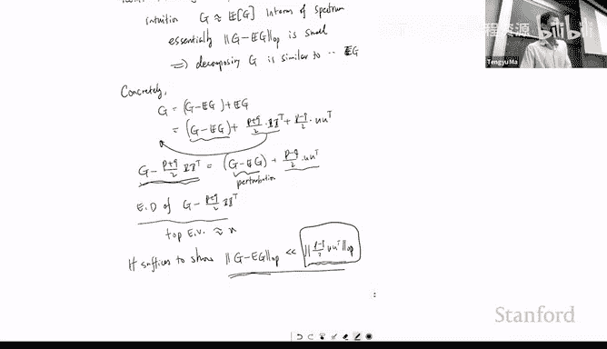
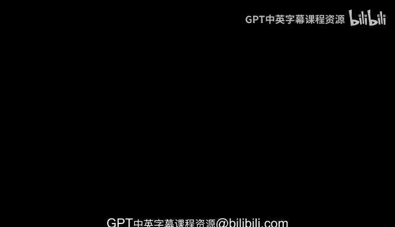

# 机器学习理论 18：高斯混合模型与谱聚类 🧮


在本节课中，我们将继续学习无监督学习。首先，我们将深入探讨矩方法，特别是高阶矩的应用。接着，我们将转向另一种无监督算法——谱聚类。

## 回顾：高斯混合模型与矩方法

上一节我们讨论了高斯混合模型。其设定是，数据点 **X** 采样自一个由 **K** 个高斯分布组成的混合模型，每个分布有其均值 **μᵢ** 和协方差 **Σᵢ**。

我们首先讨论了 **K=2** 的特殊情况，此时可以通过计算数据的二阶矩来恢复均值 **μᵢ**。然而，当 **K>2** 时，仅凭二阶矩 **E[X⊗X]** 不足以精确识别所有 **μᵢ**，因为可能存在多组不同的均值向量产生相同的二阶矩。

这促使我们考虑使用三阶矩 **E[X⊗X⊗X]**。我们的目标是证明，通过三阶矩和一阶矩，我们可以恢复出关于 **μᵢ** 的足够信息。

## 三阶矩的计算与张量分解

对于一个从高斯分布 **N(a, I)** 中采样的随机变量 **Z**，其三阶矩可以表示为：
```
E[Z⊗Z⊗Z] = a⊗a⊗a + Σ_{l=1}^{d} (a_l * e_l⊗e_l⊗e_l + e_l⊗a⊗e_l + e_l⊗e_l⊗a)
```
其中 **e_l** 是标准基向量。这个引理表明，我们可以通过 **Z** 的一阶矩和三阶矩的线性组合来得到 **a⊗a⊗a**。

将这个引理应用于高斯混合模型中的每个成分，我们可以计算出 **X** 的三阶矩，并将其表达为关于 **μᵢ** 的函数。经过整理，我们可以利用观测数据的一阶矩和三阶矩，计算出一个核心张量：
```
T = (1/K) * Σ_{i=1}^{K} μᵢ⊗μᵢ⊗μᵢ
```

于是，问题转化为一个**张量分解问题**：给定一个形如 `Σ_{i=1}^{K} aᵢ⊗aᵢ⊗aᵢ` 的低秩张量 **T**，如何恢复出未知的向量 **aᵢ**？

## 张量分解问题概述

张量分解，特别是CP分解，旨在将一个张量分解为多个秩一张量之和。这与矩阵的奇异值分解类似，但更为复杂。

以下是不同条件下张量分解的可解性概述：

*   **最坏情况**：一般情况下，该问题是计算困难的，解可能不唯一或难以高效找到。
*   **正交情况**：如果向量 **a₁, ..., a_K** 彼此正交，那么每个 **aᵢ** 都是最大化 `T(x,x,x)` 的全局极值点，可以通过类似幂迭代的方法在多项式时间内找到。
*   **线性独立情况**：如果向量组仅是线性独立的，同样可以在多项式时间内分解，例如使用“Jennrich算法”。
*   **过完备情况**：当成分数量 **K** 大于维度 **d** 时，分解更具挑战性，但仍有方法：
    *   可以使用更高阶矩（如六阶）构造张量，条件放宽为 `aᵢ⊗aᵢ` 线性独立。
    *   使用四阶张量和更精巧的算法（如“Frobenius范数”方法），在 **K < d²** 的“一般”条件下可解。
    *   如果 **aᵢ** 是随机生成的，那么即使使用三阶张量，也能处理 **K** 与 **d** 的多项式关系（如 **K ~ d^{1.5}**）。

矩方法结合张量分解的框架非常强大，可应用于许多潜变量模型，如独立成分分析、隐马尔可夫模型和主题模型。

## 谱聚类：基于数据点间关系的无监督学习

现在，我们转向另一种无监督学习方法——谱聚类。与矩方法关注数据坐标间的高阶关系不同，谱聚类关注的是**数据点之间的成对关系**。

假设我们有 **n** 个数据点 **X₁, ..., X_n**，并给定一个 **n×n** 的相似度矩阵 **G**。**G_{ij}** 衡量了数据点 **X_i** 和 **X_j** 之间的相似性。

以下是两个例子：
1.  **图像数据**：**G_{ij}** 表示两幅图像语义上的相似度。
2.  **社交网络**：用户为节点，**G_{ij}=1** 表示用户 **i** 和 **j** 是好友，这隐含了他们在兴趣、职业等方面的相似性。目标是从这个未标记的图中发现隐藏的社区（即对用户进行聚类）。

谱聚类的核心思想是：**图（或相似度矩阵）的特征分解与图的分割（聚类）问题密切相关**。通过研究矩阵的特征向量，可以揭示数据点的簇结构。

## 随机分块模型：一个理论示例

为了更具体地说明，我们考虑一个经典的随机图模型——**随机分块模型**。

假设有 **n** 个节点，属于两个隐藏的社区 **S** 和 **S̅**（假设大小相等，各为 **n/2**）。图的生成规则如下：
*   如果两个节点属于**同一社区**，它们之间以概率 **p** 存在边。
*   如果两个节点属于**不同社区**，它们之间以概率 **q** 存在边。
*   通常假设 **p > q**，即社区内部连接更紧密。

我们的目标是仅从观测到的图 **G**（邻接矩阵）中恢复出隐藏的社区 **S** 和 **S̅**。

首先，分析期望矩阵 **Ḡ = E[G]**。它是一个分块矩阵，其前 **n/2** 行/列（对应 **S**）和后 **n/2** 行/列（对应 **S̅**）构成块。
*   **Ḡ** 的**最大特征向量**是全1向量 **1**，其特征值为 `(p+q)n/2`。这反映了图的平均度。
*   **Ḡ** 的**第二特征向量**是一个指示向量 **u**：在 **S** 对应的位置为 **+1**，在 **S̅** 对应的位置为 **-1**。其特征值为 `(p-q)n/2`。

关键在于，第二特征向量 **u** 完美地揭示了社区结构：只需查看其各分量的符号，即可将节点划分到两个社区。

其直觉是，当我们从 **Ḡ** 中减去一个由常数 **q** 构成的背景矩阵（即 `q * 11^⊤`）后，剩下的矩阵 **Ḡ'** 是一个块对角矩阵。块对角矩阵的特征向量自然与块结构对齐。加上背景噪声后，全1向量成为主方向，而指示社区结构的向量成为第二方向。

## 从理论到实践：处理随机性

在实践中，我们只能观测到随机实现的矩阵 **G**，而非期望矩阵 **Ḡ**。

我们的算法是：计算矩阵 `G - ((p+q)/2) * 11^⊤` 的第二特征向量（这里我们减去了估计的背景）。我们希望这个特征向量接近于理想的指示向量 **u**。

这要求随机噪声矩阵 `G - E[G]` 的谱范数远小于信号强度 `(p-q)n/2`。如果这个条件成立，那么根据矩阵扰动理论（如Davis-Kahan定理），观测矩阵的特征向量将接近期望矩阵的特征向量。证明这个谱范数条件成立，需要用到本课程早期介绍过的集中不等式工具。

对于多于两个社区的情况，原理类似，但需要考察多个特征向量，数学分析会更为复杂，其根本思想依然是通过特征向量来捕捉图的块结构。

## 总结

本节课我们一起学习了无监督学习的两个重要方向。

首先，我们深入探讨了**矩方法**在高斯混合模型中的应用。通过计算数据的高阶矩（特别是三阶矩），我们将参数估计问题转化为一个**张量分解问题**，并概述了在不同条件下解决该问题的可能性。

接着，我们介绍了**谱聚类**的基本思想。其核心在于利用数据点间的相似度矩阵，通过**特征分解**来发现数据中隐藏的簇结构。我们以**随机分块模型**为例，从理论上解释了为什么特征向量能够揭示社区信息，并简要讨论了如何将这一理论应用于实际的随机数据。





这两种方法展示了线性代数和概率论工具在解决复杂无监督学习问题中的强大力量。