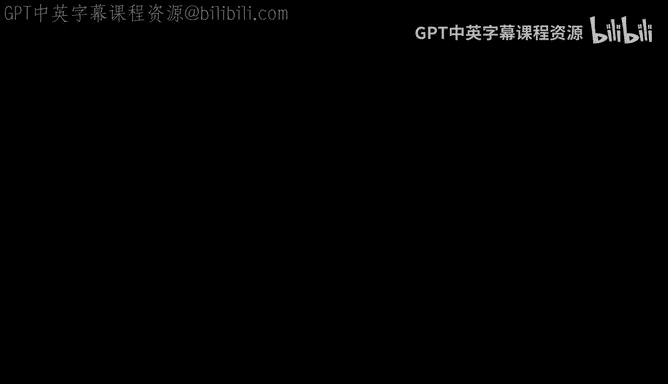
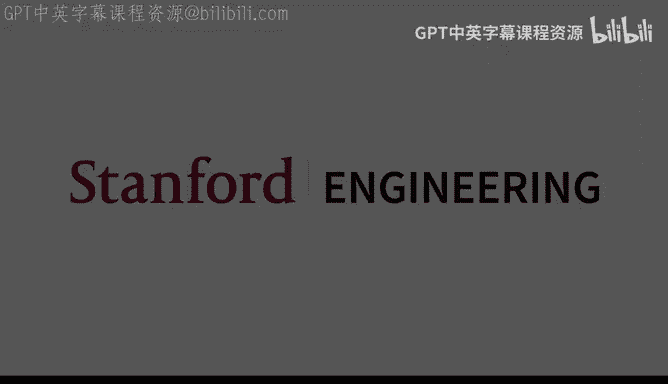

# 机器学习理论 19：谱聚类 📊

在本节课中，我们将学习谱聚类方法。我们将从随机块模型的分析开始，然后探讨如何将谱方法应用于最坏情况下的图，以找到近似的最稀疏割。最后，我们将简要介绍如何将谱思想与深度学习结合，用于无监督表示学习。

---

## 随机块模型回顾

上一节我们介绍了随机块模型。我们的目标是对从该模型生成的图 `G` 进行特征分解。

我们证明了，如果对图的期望 `E[G]` 进行特征分解，第二个特征向量 `u` 的形式类似于 `[1, 1, ..., -1, -1, ...]`，这直接揭示了隐藏的社区结构（`S` 和 `S^c`）。也就是说，取期望图的第二个特征向量就能得到隐藏社区。

我们论证过，关键在于证明随机图 `G` 与其期望 `E[G]` 在算子范数下足够接近。这是因为如果我们考虑方程 `G - λ₁v₁v₁ᵀ = (G - E[G]) + (λ₂u₂u₂ᵀ)`，那么只要扰动项 `G - E[G]` 的算子范数远小于信号项 `λ₂u₂u₂ᵀ` 的算子范数（即 `(p - q)n/2`），对等式左侧矩阵进行特征分解得到的特征向量就会接近真实的 `u`。

### 证明扰动项的上界

现在，我们来证明这个关键引理：以高概率成立，`||G - E[G]|| ≤ O(√(n log n))`。

这看起来与我们之前讨论的标量集中不等式不同，因为 `G` 是矩阵。然而，我们可以将其转化为熟悉的形式。

算子范数可以表示为：
`||G - E[G]|| = max_{||v||=1} |vᵀ(G - E[G])v|`

这等价于：
`max_{||v||=1} | Σ_{i,j} v_i v_j (G_{ij} - E[G_{ij}]) |`

现在，对于固定的单位向量 `v`，内部求和 `Σ_{i,j} v_i v_j G_{ij}` 是一组独立随机变量的和，其期望是 `Σ_{i,j} v_i v_j E[G_{ij}]`。因此，我们可以对固定的 `v` 应用霍夫丁不等式，证明其经验值与期望值接近。

挑战在于如何处理外部的 `max`。这正是均匀收敛问题。我们可以使用离散化技术来处理。

以下是步骤：
1.  首先，对于任意固定的单位向量 `v`，应用霍夫丁不等式，得到偏离概率上界为 `exp(-ε²/2)`。
2.  然后，在单位球面上选取一个 `ε`-网。这个网的大小是指数级的，但只带来对数因子损失。
3.  对所有网中的点取并集界，并利用 `ε`-网的近似性质将结论推广到所有单位向量 `v`。
4.  最终选择 `ε = O(√(n log n))`，使得失败概率足够小。

这样就证明了引理。这个证明虽然有些技术性，但思路直接，能清晰地展示各项依赖关系。

### 信号与噪声比较

得到噪声水平 `O(√(n log n))` 后，我们可以将其与信号水平 `(p - q)n/2` 进行比较。

结论是：如果 `p - q ≫ √(log n / n)`，那么我们就可以近似地恢复隐藏社区。这意味着社区间的连接概率不需要有巨大差异，只要分离度随图规模增大而缓慢衰减即可。直观上，观察的节点越多，社区结构就越清晰。

关于随机块模型部分，还有一些补充说明：
*   可以通过后处理步骤，在特定条件下从近似恢复提升到精确恢复。
*   可以扩展到多个社区块的情况。
*   文献中有更精确的阈值分析。

---

## 最坏情况图的谱聚类

现在，我们转向另一个重要主题：对最坏情况图进行聚类。我们仍然使用特征分解，但分析方式将不同，因为图不再是随机的。

首先，我们需要定义目标：在最坏情况图中，我们要恢复什么“隐藏社区”？这需要我们引入一些定义。

### 图的传导率

给定一个无向图 `G=(V, E)`，设 `S` 是顶点集 `V` 的一个子集，`S^c` 是其补集。

子集 `S` 的**传导率** `φ(S)` 定义如下：
`φ(S) = |E(S, S^c)| / vol(S)`

其中：
*   `|E(S, S^c)|` 是连接 `S` 和 `S^c` 的边的总数。
*   `vol(S) = Σ_{i∈S} d_i` 是 `S` 中所有顶点的度之和，即与 `S` 相关联的总边数（端点之一在 `S` 内）。

传导率衡量了一个割的“稀疏”程度。`φ(S)` 越小，说明 `S` 和 `S^c` 之间的连接越少，割得越好。传导率总是小于等于1。

为了避免对称性带来的混淆（`φ(S)` 和 `φ(S^c)` 通常不同），我们通常只考虑体积较小的一侧。因此，我们要求 `vol(S) ≤ vol(V)/2`。

图 `G` 的**最稀疏割传导率** `Φ(G)` 定义为所有满足体积约束的割中，最小的传导率：
`Φ(G) = min_{S: vol(S) ≤ vol(V)/2} φ(S)`

在最坏情况下，我们的目标是找到一个近似的最稀疏割 `Ŝ`，使得 `φ(Ŝ)` 接近 `Φ(G)`。

### 归一化邻接矩阵与拉普拉斯矩阵

设 `D` 为度矩阵（对角矩阵，`D_{ii} = d_i`）。我们定义**归一化邻接矩阵** `Ā`：
`Ā = D^{-1/2} A D^{-1/2}`
其中 `A` 是邻接矩阵。这意味着 `Ā_{ij} = A_{ij} / √(d_i d_j)`。

在许多情况下，为简化分析，可以假设图是 `k`-正则的（所有顶点度相同）。此时，`Ā = (1/k) A`，归一化只是缩放。

接着定义**归一化拉普拉斯矩阵** `L`：
`L = I - Ā`
其中 `I` 是单位矩阵。归一化拉普拉斯矩阵和归一化邻接矩阵的特征值与特征向量密切相关。如果 `Ā` 的特征值为 `1 - λ₁, 1 - λ₂, ...`（按递减排序），对应的特征向量为 `u₁, u₂, ...`，那么 `L` 的特征值就是 `λ₁, λ₂, ...`（按递增排序），特征向量相同。

### 切比雪夫不等式：连接谱与割

一个核心理论结果是**切比雪夫不等式**，它将图的谱（特征值）与最稀疏割联系起来。

该不等式表述如下：
`λ₂ / 2 ≤ Φ(G) ≤ √(2 λ₂)`

其中 `λ₂` 是归一化拉普拉斯矩阵 `L` 的第二小特征值（即第一非零特征值）。

这个不等式极其重要，因为它将组合优化问题（寻找最稀疏割）与线性代数问题（计算矩阵特征值）联系了起来。前者是NP难的，而后者可以高效计算。

不仅如此，我们还能高效地找到一个近似割 `Ŝ`，满足：
`φ(Ŝ) ≤ √(2 λ₂) ≤ 2√(Φ(G))`

### 通过取整特征向量寻找近似割

以下是寻找这样一个近似割 `Ŝ` 的过程：
1.  计算归一化拉普拉斯矩阵 `L` 的第二个特征向量 `u₂`。设其分量为 `β₁, β₂, ..., β_n`。
2.  根据分量值 `β_i` 对顶点进行排序。
3.  考虑所有前缀集合：`S₁ = {顶点对应最小的 β 值}`，`S₂ = {顶点对应最小的两个 β 值}`，...，`S_n = {所有顶点}`。
4.  在这些候选集合中，**至少有一个**集合 `Ŝ` 满足 `φ(Ŝ) ≤ √(2 λ₂)`。

本质上，我们对特征向量的分量设置一个阈值，将所有低于阈值的顶点归入集合 `S`。通过尝试所有可能的阈值（即所有前缀），我们保证能找到那个好的割。

### 直观理解

为什么第二特征向量与割相关？

首先，第一特征向量（对应特征值0或1）通常与顶点度相关（例如 `[√d₁, √d₂, ...]`），它捕获的是图的“背景”密度信息，而非社区结构。

第二特征向量才开始捕捉顶点间的相互关系。我们可以从瑞利商的角度理解。

对于拉普拉斯矩阵 `L`，其瑞利商为 `R(v) = (vᵀ L v) / (vᵀ v)`。
可以推导出，对于正则图，`vᵀ L v ∝ Σ_{(i,j)∈E} (v_i - v_j)²`。

如果我们限制 `v` 为二值向量（例如，`v_i ∈ {0, 1}`），那么 `v` 的支撑集就定义了一个割 `S`。此时，瑞利商 `R(v)` 正比于割 `S` 的传导率 `φ(S)`。

因此：
*   寻找最稀疏割 `Φ(G)` 等价于在**二值向量约束下**最小化瑞利商。
*   特征向量分解则是**无约束地**最小化瑞利商，得到的是实数向量。

证明的思路就是：先通过特征分解得到无约束最优解（实数特征向量），然后通过一个“取整”步骤将其转化为二值向量，并证明这个取整过程不会使瑞利商（即传导率）增加太多。

这些理论可以自然地推广到加权图和非正则图。

---

## 从理论到实践：谱聚类算法

上述理论主要来自理论计算机科学社区，研究如何分割给定的图。在机器学习中，我们面临一个额外步骤：**如何从数据构造这个图**。

经典的谱聚类算法步骤如下：
1.  **构建图**：给定 `n` 个数据点 `x₁, ..., x_n`。计算相似度矩阵 `W`，其中 `W_{ij} = exp(-||x_i - x_j||² / (2σ²))`（高斯核）。将 `W` 视为加权邻接矩阵。
2.  **计算归一化拉普拉斯矩阵** `L`。
3.  **计算特征向量**：计算 `L` 的前 `k` 个最小特征值对应的特征向量 `u₁, ..., u_k`（`k` 为期望的簇数）。
4.  **形成新特征表示**：将每个数据点 `x_i` 映射到由这些特征向量第 `i` 个分量组成的 `k` 维向量：`z_i = [u₁(i), u₂(i), ..., u_k(i)]`。这可以看作是一种降维或表示学习。
5.  **对表示进行聚类**：在新的 `k` 维空间中对点 `{z_i}` 运行聚类算法（如K-Means）。

### 存在的问题与改进思路

这种方法的一个核心问题是：图 `G` 本身可能没有意义。如果原始数据点在高维空间中彼此远离（例如，两张不同的狗图片欧氏距离可能很大），那么基于欧氏距离构建的图可能无法捕获语义相似性。

因此，理论分析只保证了“给定一个好图，能找到其近似最稀疏割”，但并未说明如何从数据中获得一个“好图”。

近期研究尝试将谱思想与深度学习结合。基本思路是：
*   考虑定义在整个数据分布（总体）上的**无限大图**，其中顶点是所有可能的数据点（如图像），边权重定义在语义相似或视觉相近的点之间。
*   这个图的特征向量是定义在全体数据点上的函数。我们无法直接计算。
*   我们用一个参数化模型（如神经网络）`f_θ(x)` 来近似这个特征函数。目标是找到参数 `θ`，使得 `f_θ(x)` 成为该无限图拉普拉斯矩阵的特征函数。
*   通过推导，可以得到一个可优化的目标函数，其经验估计形式与实践中使用的对比学习损失函数相似。这为理解对比学习提供了新的谱视角。

---

## 总结

本节课我们一起学习了谱聚类方法。
*   我们首先回顾了随机块模型，分析了谱方法如何恢复隐藏社区，关键在于证明随机图与其期望在谱范数下接近。
*   接着，我们探讨了如何将谱方法应用于最坏情况图。我们定义了传导率和最稀疏割，并介绍了切比雪夫不等式，该不等式将图的传导率与拉普拉斯矩阵的第二特征值联系起来，并提供了通过取整特征向量来寻找近似稀疏割的算法。
*   最后，我们讨论了谱聚类在机器学习中的应用，以及当前研究如何将谱理论与深度学习结合，用于设计更有效的无监督表示学习方法。

谱方法的核心在于通过线性代数（特征分解）来揭示数据中非线性的簇结构，是连接图论、线性代数和机器学习的重要桥梁。