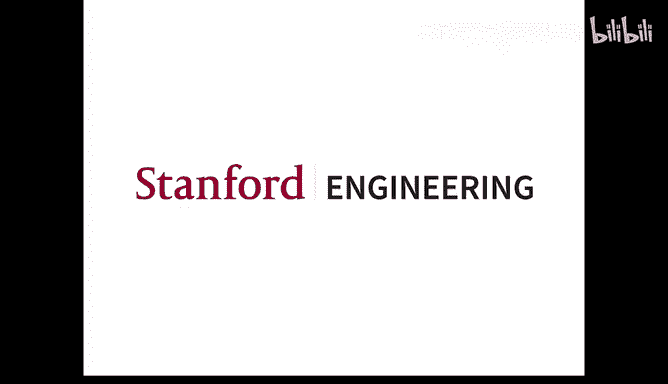

# 机器学习理论 20：非凸优化、PCA的非凸优化与矩阵补全 🎯

在本节课中，我们将要学习非凸优化在机器学习中的核心问题，特别是为什么梯度下降等为凸函数设计的算法，在非凸的深度学习目标函数上依然能够有效工作。我们将通过分析优化问题的“地貌”来理解这一点，并探讨两个具体的例子：主成分分析和矩阵补全问题。

## 概述：非凸优化的挑战与机遇

上一节我们介绍了机器学习理论中的一些宏观问题。本节中，我们来看看从优化角度理解深度学习。

“优化地貌”指的是损失函数构成的曲面。我们不会过多关注如何设计更新算法，而是重点分析我们优化的函数具有何种特性，使得我们可以使用一些标准优化算法。

你不需要深入的优化背景，但需要知道梯度下降是什么。我们将要解决的核心问题是：为什么许多为凸函数设计的优化算法，在深度学习的非凸函数上依然有效？在实践中，人们观察到梯度下降或其变种通常能很好地优化机器学习中的非凸函数。我们试图理解其原因。

以下是几个关键观察事实：

*   **观察一**：梯度下降并不总能找到全局最小值。对于连续函数，这显而易见。例如，从一个局部最小值附近的点出发，梯度下降可能会收敛到该局部最小值，即使存在更优的全局最小值。
*   **观察二**：对于一般的非凸函数，寻找全局最小值是NP难问题。这意味着存在一些函数，无法在多项式时间内通过任何算法找到其全局最小值。
*   **观察三**：在凸函数的情况下，梯度下降可以保证收敛到全局最小值。
*   **观察四**：深度学习中的目标函数是非凸的。这几乎是不言自明的，因为一旦网络超过两层，由于非线性激活函数的存在，目标函数通常是非凸的。
*   **观察五**：梯度下降或随机梯度下降在实践中确实有效，能够找到损失函数的近似（有时甚至几乎是精确的）全局最小值。例如，在图像任务中，损失函数非负，而优化后得到的损失值通常非常小，这让人相信算法找到了一个近似全局最优解。

那么，如何调和这些看似矛盾的事实呢？关键在于，NP难的结论是针对最坏情况下的函数。而我们实际优化的函数并非最坏情况。我们可以将函数家族想象成一个集合，其中包含非常难优化的函数，也包含一个易于优化的子集（凸函数）。然而，在凸函数和最难函数之间，还存在一个更大的函数子集，它们虽然非凸，但具有一些“良性”性质，使得梯度下降能够有效优化。本节课的目标就是识别这些良性性质，并证明某些机器学习损失函数具备这些性质。

## 本讲计划与核心思路

我们本讲（及下一讲第一部分）的计划如下：

1.  识别一个更大的函数集合，对于该集合中的函数，梯度下降能够收敛到全局最优解。
2.  证明某些机器学习损失函数属于这个集合。

大部分精力将放在第二部分。第一部分的结果在直觉上是清晰的，但其详细证明需要大量优化算法分析的背景知识，因此我们不会深入细节。

核心思路非常简单：
我们知道梯度下降可以找到局部最小值（这里有一个需要注意的细微之处）。此外，如果我们知道函数的所有局部最小值同时也是全局最小值，那么结合这两点就意味着梯度下降可以找到全局最小值。

因此，我们要识别的、能被梯度下降有效优化的函数集合，就是那些“所有局部最小值均为全局最小值”的函数。然后，我们需要证明实际使用的机器学习函数具有这一性质。当然，并非所有问题都具备此性质，我们将展示一些可以严格证明此性质的简单案例。

## 收敛到局部最小值：严格鞍点条件

如前所述，关于“梯度下降能收敛到局部最小值”这一说法存在细微之处。我们需要将其形式化。

首先进行一些定义。设函数 **F** 是二阶可微的（为简化起见）。点 **x** 是局部最小值的定义是：存在一个包含 **x** 的开邻域 **N**，使得在该邻域内，**F(x)** 是所有函数值中最小的。

从微积分可知，如果 **x** 是局部最小值，则梯度 **∇F(x) = 0**，且海森矩阵 **∇²F(x)** 是半正定的。然而，反之则不成立。梯度为零且海森矩阵半正定并不保证该点是局部最小值。

一个简单的例子是函数 **f(x₁, x₂) = x₁² + x₂³**。在原点 **(0,0)**，梯度为零，海森矩阵是半正定的（实际上是正定的，因为 **∂²f/∂x₁² = 2 > 0**，其他二阶导为0）。但原点不是局部最小值，因为沿着 **x₂** 方向（立方函数），在原点任意小的邻域内，我们都可以找到使函数值更小的点。

问题的根源在于，当梯度为零且海森矩阵只是半正定（而非严格正定）时，海森矩阵在某些方向上的曲率可能为零（即该方向是平坦的）。此时，高阶导数开始发挥作用。如果二阶导数在某个方向严格为正或负，那么在足够小的邻域内，二阶项将主导函数行为。但如果二阶导数为零，那么三阶甚至更高阶的导数将变得重要，这使得分析变得复杂。

事实上，存在以下定理：**在不做任何假设的情况下，验证一个点是否为局部最小值是NP难问题**。因此，寻找局部最小值本身也是NP难的。这为我们之前的计划带来了障碍，因为如果寻找局部最小值都很难，那么我们的计划就无法执行。

解决方法是排除那些需要处理高阶导数的病态情况。为此，我们引入 **严格鞍点条件**。这个条件本质上假设函数中没有那些微妙的、需要检查高阶导数才能判断是否为局部最小值的候选点。任何点是否为局部最小值，都可以仅通过检查一阶和二阶导数来确定。

以下是严格鞍点条件的定义（采用 Li et al. 的表述）：我们称函数 **F** 是 **(α, β, γ)-严格鞍** 的，如果对于每一个点 **x ∈ ℝᵈ**，都满足以下三个条件之一：

1.  **||∇F(x)|| ≥ α** （梯度很大，不可能是平稳点）。
2.  **λ_min(∇²F(x)) ≤ -β** （海森矩阵的最小特征值为负，说明是严格鞍点，不可能是局部最小值）。
3.  **x** 与某个真正的局部最小值 **x*** 在欧几里得距离上不超过 **γ**。

条件1和2排除了那些明显不是局部最小值的点。条件3则说明，如果一个点不满足1和2（即梯度很小且海森矩阵近似半正定），那么它一定非常接近一个真正的局部最小值。这就排除了之前提到的病态情况。

关于这个条件有几点说明：首先，α, β, γ 是正常数。其次，这个条件在实践中很难数值验证，它更像是一个用于理论证明的性质。

有了严格鞍点条件，我们就可以得到以下定理：**假设函数 F 满足 (α, β, γ)-严格鞍条件，那么许多优化算法（如梯度下降、随机梯度下降等），在适当的学习率下，可以在关于 (1/α, 1/β, 1/γ, 维度 D) 的多项式时间内，收敛到某个局部最小值的 ε 邻域内。**

现在，如果我们额外假设 **所有局部最小值都是全局最小值**，那么结合严格鞍点条件，就意味着优化器可以在多项式时间内收敛到全局最小值。我们可以将“局部最小即全局最小”与严格鞍点条件重新表述为以下定理形式：

假设存在常数 **ε₀ > 0, τ₀ > 0, C**，使得对于任意 **x ∈ ℝᵈ**，如果满足：
*   **||∇F(x)|| ≤ ε₀**
*   **∇²F(x) ⪰ -τ₀ I** （海森矩阵的最小特征值不小于 -τ₀）

那么 **x** 一定与某个全局最小值在欧氏距离上不超过 **ε₀^C**。

在此条件下，许多优化器可以收敛到该函数的全局最小值，误差为 **δ**，所需时间是关于 **(1/δ, 1/τ₀, 维度 D)** 的多项式。

至此，我们完成了计划的第一部分：识别了一类具有“良性”地貌（所有局部最小即全局最小，且满足严格鞍点条件）的函数，梯度下降可以在多项式时间内优化它们。接下来，我们将展示机器学习中一些具备此性质的例子。

## 示例一：主成分分析与矩阵分解

第一个例子是主成分分析，或者更广义地说，矩阵分解。我们考虑秩为1的情况。假设给定一个 **D × D** 的对称半正定矩阵 **M**。我们希望找到最好的秩1近似。从线性代数可知，最好的秩1近似是由最大特征值对应的特征向量给出的。

然而，我们感兴趣的是与之对应的非凸目标函数。我们试图寻找向量 **x**，使得以下目标函数最小化：
**g(x) = || M - x xᵀ ||_F²**
其中 **||·||_F** 表示弗罗贝尼乌斯范数。这是一个非凸函数，因为它是关于 **x** 的四次多项式。

我们的目标是证明：即使这个函数是非凸的，在矩阵 **M** 是秩1且半正定的假设下，它的所有局部最小值都是全局最小值。

在一维情况下，函数 **g(x) = (M - x²)²** 的图像有两个对称的局部最小值，它们都是全局最小值。在高维情况下，由于旋转对称性，情况类似但更复杂。

证明思路很简单：
1.  首先找到所有一阶平稳点（梯度为零的点）。
2.  然后从这些平稳点中筛选出局部最小值。
3.  证明这些局部最小值都是全局最小值。

**步骤一：求平稳点。**
计算梯度并设其为零：**∇g(x) = -4 (M x - ||x||² x) = 0**。
这意味着 **M x = ||x||² x**。这恰好是特征向量的定义：**x** 是 **M** 的特征向量，对应的特征值是 **||x||²**。

假设 **M** 有特征值 **λ₁ ≥ λ₂ ≥ ... ≥ λ_D ≥ 0**，对应的单位特征向量为 **v₁, v₂, ..., v_D**。那么所有平稳点都具有形式 **x = ±√λᵢ * vᵢ**（对于每个 **i**）。

**步骤二：利用海森矩阵筛选局部最小值。**
我们需要检查哪些平稳点是局部最小值。我们通过分析海森矩阵的二次型来做到这一点，而不直接写出庞大的海森矩阵。一个有用的技巧是计算 **vᵀ ∇²g(x) v** 对于特定方向 **v** 的值。

通过计算（具体过程略），可以得到二次型公式。我们关心的是，对于局部最小值，这个二次型对任意 **v** 都必须非负。

一个信息量很大的方向是选择 **v = v₁**，即对应最大特征值 **λ₁** 的特征向量（也就是全局最小值的方向）。将 **v₁** 代入二次型公式，并利用 **x** 是平稳点（即 **M x = λ x**，其中 **λ = ||x||²**）的性质，我们可以得到一个不等式。

现在考虑两种情况：
1.  **x** 对应最大特征值 **λ₁**（即 **x = ±√λ₁ v₁**）。那么它显然是全局最小解。
2.  **x** 对应其他特征值 **λ < λ₁**。由于不同特征值对应的特征向量正交，有 **xᵀv₁ = 0**。将这一点代入之前得到的关于 **v₁** 的二次型不等式，最终会推导出 **λ ≥ λ₁**，这与假设 **λ < λ₁** 矛盾。因此，任何对应非最大特征值的平稳点，其海森矩阵在 **v₁** 方向上的二次型必定为负，这意味着它不是局部最小值（因为存在一个方向使得二阶变化为负）。

因此，唯一的局部最小值就是那些对应最大特征值 **λ₁** 的平稳点，也就是全局最小值。这就完成了证明。

**证明概要总结**：如果一个平稳点 **x** 不是全局最优，那么在指向全局最优解的方向 **v₁** 上移动，虽然一阶变化为零（因为是平稳点），但二阶变化是负的，这说明该点不是局部最小值。因此，只有全局最优解才能是局部最小值。

## 示例二：矩阵补全问题

第二个例子是矩阵补全，这是PCA或矩阵分解的一个升级版，也是机器学习中的一个重要问题。

**问题定义**：假设存在一个未知的秩为1、对称、半正定的地面真实矩阵 **M = z zᵀ**，其中 **z ∈ ℝᵈ**， **||z|| = 1**。我们随机观测到 **M** 的一部分条目。具体来说，每个条目以概率 **p** 被独立地包含在观测集合 **Ω** 中。我们观测到的矩阵是 **P_Ω(M)**，即仅保留 **Ω** 中索引对应的条目，其余位置置零。目标是从部分观测中恢复出完整的矩阵 **M**。

这个问题在推荐系统中非常重要。例如，矩阵的行代表用户，列代表商品，条目代表评分。我们只观测到部分用户对部分商品的评分，希望预测所有缺失的评分，以便进行推荐。恢复之所以可能，是因为我们假设了矩阵具有低秩结构（这里是秩1），这意味着其自由度远小于矩阵的条目数。

**目标函数**：一个实践中常用的方法是优化以下非凸目标函数：
**F(x) = ∑_{(i,j) ∈ Ω} ( M_{ij} - x_i x_j )² = || P_Ω(M - x xᵀ) ||_F²**
其中 **x** 是我们的参数向量，**x xᵀ** 是我们对完整矩阵的估计。我们希望在观测到的条目上，估计值与真实值尽可能接近。

**不相干假设**：为了使恢复成为可能，我们需要一个额外的假设，称为“不相干假设”。它要求地面真实向量 **z** 的各个分量不能过于集中，即其无穷范数 **||z||_∞ ≤ μ / √d**，其中 **μ** 是一个常数或对数因子。这个假设排除了像 **z = e₁**（只有一个非零分量）这样的极端情况，因为那种情况下矩阵过于稀疏，除非观测到那个特定条目，否则无法恢复。

**定理陈述**：假设不相干条件成立，并且观测概率 **p** 满足 **p ≥ poly(μ, log d) / ε**（即 **p** 大致在 **1/d** 的量级，再乘以一些多项式和对数因子），那么函数 **F(x)** 的所有局部最小值都接近于 **±z**（即地面真实解），误差在 **√ε** 级别。而 **±z** 显然是全局最小值（此时损失为零）。此外，也可以证明该函数满足严格鞍点条件。

由于证明过程较长，我们将在下一讲中继续完成矩阵补全问题的证明。

## 总结

本节课中我们一起学习了非凸优化在机器学习中的核心分析思路。我们了解到，尽管优化一般非凸函数是困难的，但通过分析目标函数的“地貌”性质（如“所有局部最小即全局最小”和“严格鞍点条件”），我们可以解释为什么梯度下降等算法在实践中常常有效。我们通过主成分分析这个例子，详细演示了如何证明一个非凸函数具备这种良性地貌。最后，我们介绍了矩阵补全问题及其对应的非凸目标函数，并陈述了关于其优化地貌的定理，为下一讲的证明做好了铺垫。