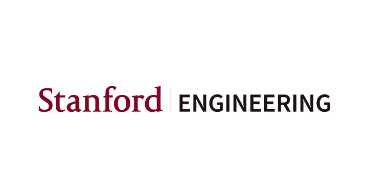
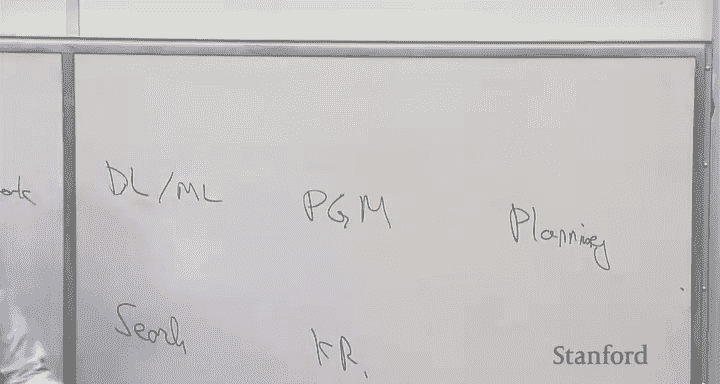
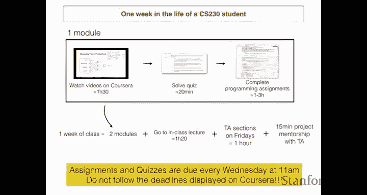
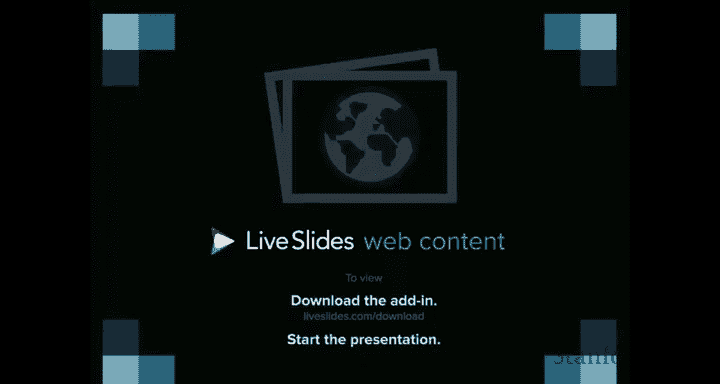
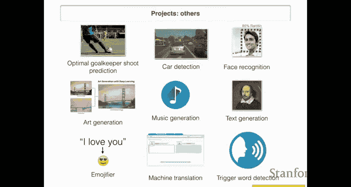
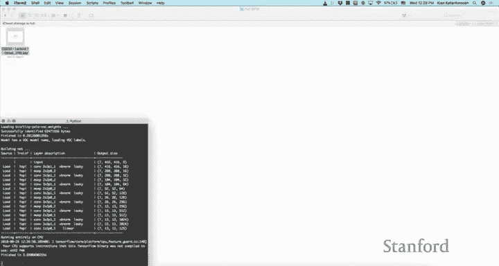
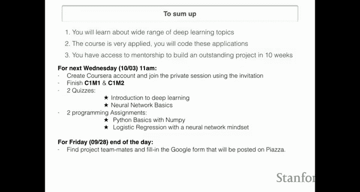
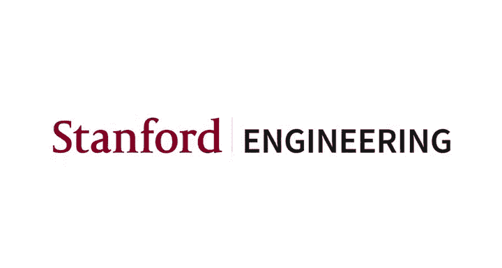

#  001：第一讲 课程介绍与安排 🎓

在本节课中，我们将学习斯坦福大学CS230深度学习课程的总体介绍、课程安排以及深度学习领域的基本概况。课程由吴恩达（Andrew Ng）和Kian Katanforoosh共同讲授，采用翻转课堂的形式，旨在帮助学生掌握深度学习的前沿知识并具备实际应用能力。

## 课程团队介绍 👥

首先，我们来认识一下教学团队。本课程的联合讲师是Kian Katanforoosh，他也是本课程所使用的Coursera深度学习专项课程的联合创建者之一。课程协调员是Swati Dube，她负责协调CS230以及其他相关课程，确保课程顺利进行。联合顾问是Euns Mauri，他与Kian共同创建了大量在线课程内容，同时也是CS229课程的助教负责人。此外，我们还有两位联合助教Abagu以及一个庞大的助教团队，其中约一半的助教曾担任过CS229课程的助教，他们的专业领域涵盖医疗健康、机器人学、计算生物学等多个方向。希望在本季度的项目工作中，大家能从助教团队那里获得宝贵的建议、帮助和指导。

## 深度学习为何兴起？ 📈

上一节我们介绍了课程团队，本节中我们来看看深度学习为何在近期迅速兴起。深度学习的基本思想已经存在了几十年，那么它为何现在才开始爆发呢？

主要原因在于数据规模和计算能力的增长。过去几十年，随着社会的数字化，我们收集的数据越来越多。例如，智能手机和电脑的普及、医疗影像的数字化、供应链记录的电子化等都产生了海量数据。然而，传统的机器学习算法（如逻辑回归、支持向量机、决策树等）的性能在数据量达到一定程度后会趋于平缓。

相比之下，神经网络的性能会随着网络规模和数据的增长而持续提升。最初，我们只能训练小型神经网络，性能有限。随着计算能力，特别是GPU计算的发展，我们现在能够训练非常庞大的神经网络，从而在许多应用上达到很高的准确率。GPU计算能力的普及，使得曾经只有大型研究实验室才能负担的计算资源，现在可以通过云服务以较低成本获得。

此外，深度学习的兴起还得益于算法创新和大量的研发投入。早期由数据和计算规模驱动，现在则形成了由算法创新和大量投资共同推动的良性循环。

## 课程目标与独特之处 🎯

在了解了深度学习兴起的背景后，我们来看看CS230课程的具体目标。本课程主要有两个目标：

1.  使学生成为深度学习算法的专家，掌握前沿技术并具备深厚的理论知识。
2.  使学生掌握将这些算法应用于实际问题的能力。

与传统学术课程不同，本课程不仅教授技术工具，更注重传授如何使这些算法真正有效的实践知识。在软件工程中，资深工程师与初级工程师的区别不仅在于语法知识，更在于系统架构、抽象定义等高层次判断。同样，在机器学习领域，除了理解算法原理，高效地决策（例如，是应该收集更多数据还是调整超参数）能极大地提升团队效率。本课程旨在系统性地传授这类知识，帮助学生未来领导团队时能更高效地指导工作。

为了帮助大家更好地掌握这些实践原则，吴恩达撰写了一本名为《Machine Learning Yearning》的手册，旨在将机器学习从一门“黑科技”转变为系统的工程学科。感兴趣的同学可以通过指定网站获取草稿。

## 课程形式与行业影响 💡

接下来，我们了解一下本课程独特的教学形式及其希望带来的行业影响。CS230采用“翻转课堂”模式。这意味着学生需要在家观看由DeepLearning.ai制作并托管在Coursera平台上的高质量视频，完成在线练习和测验。这样，宝贵的课堂时间（每周三的讲座和周五的助教讨论课）就可以用于更深度的互动、讨论和进阶内容的学习。这种模式旨在提供比单纯在线学习更深入的知识和实践机会。

深度学习正在像一百年前的电力一样，变革着几乎所有行业。它不仅是大型科技公司的核心，更在医疗健康、土木工程、机械、宇宙学等传统非CS领域展现出巨大潜力。本课程希望学生毕业后，不仅能加入拥有成熟AI团队的公司，更能将AI技术带入那些尚未被AI触及的领域，创造更大的价值。

要成为一个真正的“AI公司”，仅仅在现有业务中添加几个神经网络是远远不够的。这就像购物中心拥有网站并不等于它就是互联网公司一样。真正的互联网公司会围绕互联网的优势来组织团队和工作方式，例如进行广泛的A/B测试、拥有快速的迭代周期、将决策权下放给工程师和产品经理。同样，未来的顶尖AI团队需要擅长战略性的数据获取、构建统一的数据仓库、敏锐地发现自动化机会，并定义新的岗位角色（如机器学习工程师、AI产品经理）。本课程将探讨如何有效地在AI时代组织团队，这些原则将帮助大家在未来开展更有价值的工作。

## 斯坦福机器学习课程体系 🔄

在斯坦福，有多门机器学习课程可供选择，学生常常会问应该选哪一门。CS229（机器学习）是其中最数学化的课程，深入探讨算法的数学推导。CS229A（应用机器学习）数学内容较少，更侧重于实践，是机器学习最易上手的入门课程。CS230则介于两者之间，它专注于深度学习这一当前最热门的机器学习子集，在数学深度上比CS229浅，但比CS229A深，并且最侧重于实践应用和“如何实现”的知识。这三门课程内容各有侧重，重叠不多，学生甚至可以同时选修两门。通常，学生会先学习CS229或CS230作为基础，然后再深入学习计算机视觉、自然语言处理等更专精的领域。

## 课程结构与每周安排 📅

现在，让我们跟随Kian来详细了解CS230课程的具体结构和安排。在线课程内容分为五个部分（对应Coursera上的五个子课程）：

1.  **神经网络基础**：从神经元、层到深度网络。
2.  **优化深度神经网络**：学习调优网络、提升性能的方法。
3.  ​**机器学习项目策略**：学习AI团队的工作方式，如何诊断和改进算法。
4.  **卷积神经网络**：专注于图像和视频处理。
5.  **序列模型**：专注于自然语言处理、语音识别等。

课程将使用“C2M3”这样的记号，代表“课程2，模块3”。详细的课程大纲和日程（包括期中考试和期末海报展示日期）已发布在课程网站上。

以下是CS230学生典型一周的学习生活：
*   **在线学习**：学习两个模块的内容，包括观看约3小时的视频、完成测验和编程作业（使用Jupyter Notebook）。
*   **课堂讲座**：参加一次1.5小时的线下讲座，内容是在线课程没有的进阶主题。
*   **助教讨论课**：参加一次约1小时的周五讨论课，与助教和其他同学交流，并为项目组队。
*   **个性化指导**：每周与助教进行15分钟的一对一会议，跟进项目进展。

编程作业和测验的截止时间是每周三上午11点（上课前30分钟）。请注意，**务必遵循CS230课程网站公布的截止日期**，而非Coursera平台显示的日期，因为课程网站上的日期为同学们预留了迟交日。

从课程二开始，我们将使用Mentimeter工具进行课堂互动和签到。

## 评分标准与课程项目 🏆

课程的评分比例如下：
*   课堂参与：2%
*   在线测验：8%
*   编程作业：25%
*   期中考试：30%
*   期末项目：35%

积极参与Piazza论坛讨论可以帮助其他同学，也可能获得额外加分。

本课程的核心之一是实践项目。在整个学期中，所有学生都将通过编程作业完成一系列有趣的应用，例如：
*   手语识别
*   “快乐小屋”人脸情绪识别门禁
*   实时目标检测（使用YOLO算法）
*   足球守门员射门预测
*   自动驾驶中的汽车检测
*   人脸识别
*   艺术风格迁移
*   爵士音乐生成
*   莎士比亚风格文本生成
*   智能输入法下一个词预测
*   日期格式标准化（机器翻译的简化版）
*   触发词检测

除了这些规定的编程作业，学生还需要组建团队，在10周内完成一个自选的深度学期项目。过去学生的项目非常出色，例如：
*   黑白图像上色
*   根据图片预测自行车价格
*   使用序列模型检测地震前兆信号
*   根据原子结构预测原子能量
*   医疗领域的脑瘤图像分割

我们期待在本季度末，大家能对自己的项目成果感到自豪，并在期末海报展示会上精彩呈现。

## 本周任务清单 ✅

最后，以下是大家在本周需要完成的任务：
*   **创建Coursera账户**：根据发送到斯坦福邮箱的邀请完成注册。如果未收到，请在Piazza上私信助教。
*   **完成在线课程**：在**下周三上午11点前**，完成课程一（C1）的前两个模块（C1M1和C1M2），包括所有视频、测验和编程作业。
*   **组建项目团队**：在**本周五结束前**，找到1-3名项目队友（特殊情况下可4人），并填写团队信息表单，以便助教分配指导老师。
*   **参加助教讨论课**：本周五将举行第一次助教讨论课（项目指导将从下周开始）。

---

本节课中我们一起学习了CS230深度学习课程的总体框架、深度学习兴起的原因、课程独特的实践导向教学目标以及翻转课堂的形式。我们还了解了课程的具体结构、评分方式、丰富的实践项目以及本周需要完成的任务。希望大家能充分利用课程资源，在接下来的十周里深入学习，并最终完成令人骄傲的实践项目。