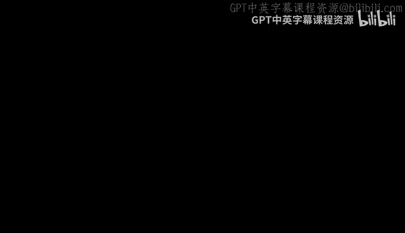
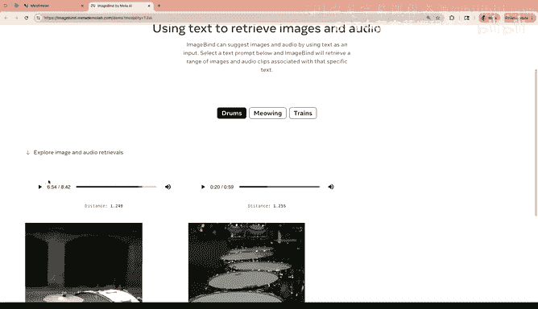
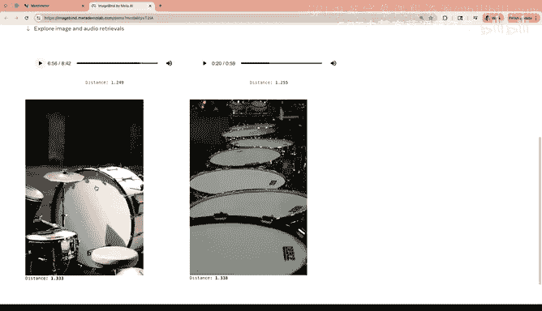

#  002：监督学习、自监督学习与弱监督学习 🧠

在本节课中，我们将学习三种核心的机器学习范式：监督学习、自监督学习和弱监督学习。我们将通过具体的案例研究，探讨如何为不同任务设计模型架构、损失函数和数据策略。课程将涵盖从简单的图像分类到复杂的多模态嵌入系统，帮助你理解现代AI系统背后的决策过程。

---

## 第一部分：课程回顾与核心概念 🔄

上一节我们介绍了神经网络的基础。本节中，我们来看看如何将这些基础概念应用到实际项目中。

### 模型、架构与参数

一个AI模型可以看作是两个核心部分的组合：
*   **架构**：模型的蓝图或骨架。
*   **参数**：架构中需要学习的数值，可能从几个到数十亿个不等。

在部署时，你通常调用两个文件：一个描述架构，另一个存储参数。

### 学习过程：梯度下降

模型通过**梯度下降优化**进行学习。其过程可以概括为以下步骤：
1.  输入数据（如图片）通过未训练的模型，得到初始预测。
2.  使用**损失函数**比较预测值与真实标签（ground truth）。
3.  损失函数计算出的误差（惩罚）通过反向传播，指导参数更新。
4.  参数根据梯度方向进行微小调整（例如，向左或向右移动）。
5.  在大量数据批次上重复此过程，直到模型预测准确。

### 神经网络的内部运作

在一个训练良好的神经网络中，不同层学习不同复杂度的特征：
*   **浅层神经元**：擅长编码低复杂度特征，如边缘和角落（例如，对角线、垂直线）。
*   **中层神经元**：组合低级特征，检测更复杂的模式（例如，眼睛、鼻子、耳朵等部件）。
*   **深层神经元**：接近最终任务，检测高级语义特征（例如，整张脸或特定物体）。

这种分层特征提取的过程称为**编码**。当编码具有语义意义，即向量空间中的距离反映概念相似性时，我们称之为**嵌入**。嵌入是许多现代AI系统的“结缔组织”，对于搜索、推荐等任务至关重要。

### 特征工程 vs. 特征学习

*   **特征工程**：深度学习之前的主流方法，需要手动设计和提取特征（例如，专门检测眼睛的算法）。
*   **特征学习**：深度学习的核心，模型通过端到端训练，直接从数据中自动学习有用的特征。

### 标签表示：独热编码与多热编码

*   **独热编码**：用于单标签分类。例如，在猫、狗、长颈鹿三分类中，“猫”的标签是 `[1, 0, 0]`。
*   **多热编码**：用于多标签分类。例如，图片中同时有猫和狗，则标签为 `[1, 1, 0]`。

一个常见的项目错误是增加了数据类别，却忘记相应调整标签格式。

---

## 第二部分：监督学习案例研究 📊

现在，让我们将上述概念应用到具体的监督学习项目中。

### 案例1：昼夜图像分类 🌇🌃

**任务**：给定一张图像，判断它是白天还是夜晚拍摄的。

#### 项目启动决策

以下是启动此类项目时需要考虑的关键问题：

*   **数据收集**：需要多少图像？从哪里获取？任务定义（如特定地点 vs. 全球通用）直接影响数据需求和复杂度。
*   **输入分辨率**：选择 `64x64x3`（RGB）是一个不错的起点。可以通过“人类代理实验”确定最低有效分辨率，即让人在不同分辨率下判断昼夜，找到其性能开始下降的阈值。
*   **模型输出**：二分类，输出0（夜晚）或1（白天）。最后一层使用 **Sigmoid** 激活函数，将输出压缩到0-1之间，代表概率。
*   **模型架构**：对于此简单任务，一个较浅的卷积神经网络可能就足够了。
*   **损失函数**：使用**二元交叉熵损失**。

**核心收获**：
1.  建立“代理项目”经验库，有助于未来快速决策。
2.  在项目初期，利用“人类实验”验证假设（如分辨率、颜色重要性）是高效的方法。

### 案例2：触发词检测 🎤

**任务**：给定一段10秒的音频，检测其中是否出现特定触发词（如“激活”）。

#### 关键挑战与策略

这是一个序列任务，比图像分类更复杂。

*   **数据策略**：关键在于数据收集和标注策略。
    *   **合成数据**：可以创建三个数据库——正面词（“激活”）、负面词（其他词）、背景噪音。通过脚本随机混合生成训练数据，并自动生成标签。
    *   **真实测试集**：测试集需使用真实场景下人工标注的数据。
*   **标注方案**：简单的“整个音频段一个标签”会导致正负样本极不平衡。更好的方案是在音频时间序列上标注，在触发词出现的时间步标记为1，其余为0。这为模型提供了更清晰的信号。
*   **模型与损失**：通常使用循环神经网络。在每一时间步使用Sigmoid激活，并计算序列化的二元交叉熵损失。

**核心收获**：
1.  **数据策略**（收集、合成、标注）对项目成功至关重要。
2.  通过人类实验快速验证不同标注方案的优劣。
3.  积极寻求领域专家（如语音处理专家）的建议，可以避免走弯路。

### 案例3：人脸验证与识别 👤

**任务**：
*   **验证**：判断两张人脸图片是否属于同一个人（1:1比对）。
*   **识别**：从数据库中找出给定人脸图片的身份（1:N搜索）。
*   **聚类**：将未标注的人脸图片按身份分组。

#### 从像素比对到编码比对

直接进行像素比对会受光照、姿态、背景、遮挡等因素影响。解决方案是使用**编码网络**。

1.  将两张图片输入同一个深度神经网络。
2.  从网络中间层（如128维）提取特征向量（编码）。
3.  计算两个编码之间的距离（如欧氏距离）。
4.  若距离小于阈值，则判定为同一人。

#### 如何训练编码网络？三元组损失

目标是：**同一个人的编码应接近，不同人的编码应远离**。

**三元组损失**是实现此目标的经典方法：
*   **数据**：构建三元组 `(锚点图片A, 正样本P, 负样本N)`。`P`与`A`是同一人，`N`是不同人。
*   **损失函数**：最小化 `A` 与 `P` 的距离，同时最大化 `A` 与 `N` 的距离。公式如下：

`L(A, P, N) = max(||f(A) - f(P)||² - ||f(A) - f(N)||² + α, 0)`

其中 `f()` 是编码函数，`α` 是间隔参数，确保正负样本对之间保持一定距离。

#### 扩展到识别与聚类

*   **识别**：将数据库中人脸图片预先编码并存储。查询时，计算查询图片的编码，在数据库中进行**K近邻搜索**，找到最相似的编码。
*   **聚类**：获得所有人脸图片的编码后，使用**K均值**等聚类算法自动分组。

**核心收获**：
1.  理解了**编码网络**和**三元组损失**的设计思想。
2.  掌握了人脸**验证、识别、聚类**任务之间的区别与联系。

---

## 第三部分：自监督学习与弱监督学习 🚀

上一节我们探讨了需要大量标注数据的监督学习。本节中我们来看看如何利用未标注或弱标注数据进行学习。

### 自监督学习：让数据自己教自己

核心思想：**通过设计辅助任务，从无标签数据本身生成监督信号**。

#### 对比学习（图像领域）

例如，**SimCLR** 方法：
1.  对同一张图片进行两次不同的数据增强（如裁剪、旋转、颜色抖动），得到两个视图。
2.  通过编码网络将两个视图映射为向量。
3.  设计损失函数，使同一图片产生的两个向量相似，而不同图片的向量不相似。

这样，模型无需人工标签，就能学习到有意义的图像表示。

#### 下一词预测（文本领域）

例如，**GPT** 系列模型：
*   **任务**：给定一段文本，预测下一个词/标记是什么。
*   **为什么是自监督的**？训练数据来自海量无标注文本。通过滑动窗口，上下文作为输入，下一个词作为预测目标，自动构成了数万亿个训练样本。

#### 涌现行为

通过简单的自监督目标（如对比学习、下一词预测）在大规模数据上训练，模型会展现出**涌现行为**——即未被明确编程或标注的能力。
*   **例子**：在“我给自己倒了杯___”的预测中，模型学会了“液体”、“可饮用”、“容器”等概念及其关系。

### 弱监督学习：利用自然存在的配对

有些任务需要连接不同模态的数据（如图像-文本），但获得精确的配对标注成本高昂。

**弱监督学习**利用**自然发生的配对数据**：
*   **图像-文本**：互联网上大量图片附带的描述、标题、ALT文本。
*   **视频-音频**：电影、视频自然包含的音轨。
*   **视频-字幕**：电影的内嵌字幕。
*   **蛋白质结构-功能**：科学文献中自然关联的描述。

#### 多模态嵌入：共享的向量空间

通过在海量的弱配对数据上训练，我们可以将不同模态（图像、文本、音频、视频等）映射到同一个**共享的向量空间**。
*   **例如**：在 **ImageBind** 等模型中，“狗”的文本向量、狗叫的音频向量、狗的照片向量在空间中会非常接近。
*   **意义**：这使得跨模态检索、生成和理解成为可能（例如，用文字搜索图片或声音）。

---

## 总结 🎯

本节课中我们一起学习了：

1.  **监督学习**：通过带有明确标签的数据训练模型。我们深入研究了三个案例（昼夜分类、触发词检测、人脸验证），探讨了数据策略、标注方案、损失函数（如三元组损失）和模型选择的关键决策点。
2.  **自监督学习**：通过设计辅助任务（如对比学习、下一词预测），让模型从无标签数据中自行学习有意义的表示。这催生了强大的预训练模型和涌现能力。
3.  **弱监督学习**：利用自然界中已存在的弱配对数据（如图文配对）来训练模型，特别是用于构建连接不同模态的**共享嵌入空间**，这是实现多模态AI的基石。

理解这些范式及其应用场景，将帮助你在未来的AI项目中做出更明智的技术选型和架构设计决策。