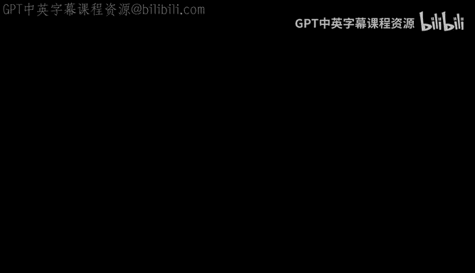
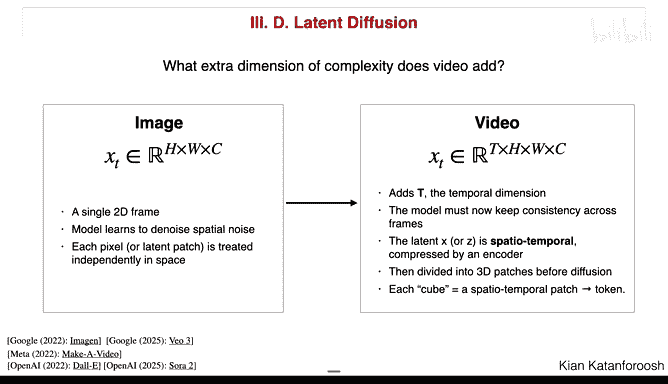
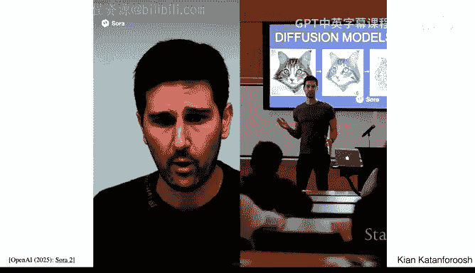
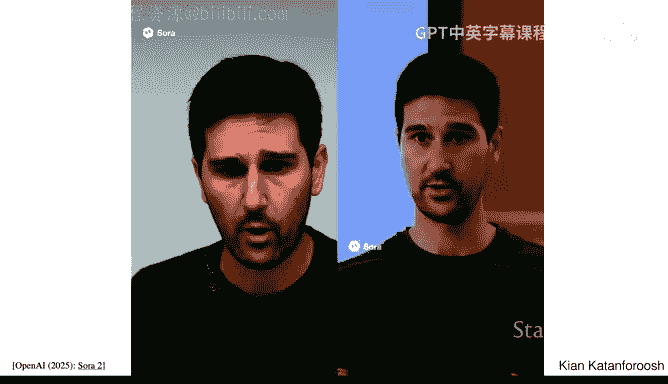
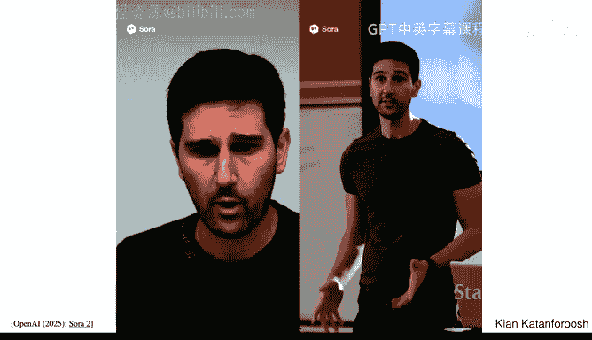

#  004：对抗鲁棒性与生成模型 🛡️🎨

在本节课中，我们将要学习两个核心主题：对抗鲁棒性与生成模型。对抗鲁棒性研究如何防御针对AI模型的恶意攻击，而生成模型则探讨如何让AI创造新的内容，如图像、视频和文本。我们将从基础概念出发，逐步深入，确保初学者也能跟上。

## 对抗鲁棒性 🛡️

上一节我们介绍了课程的两个核心主题。本节中，我们来看看对抗鲁棒性。随着AI模型在日常生活中的应用越来越广泛，它们也更容易受到攻击。因此，主动构建防御机制变得至关重要，这使得对抗攻击与防御成为一个非常活跃的研究领域。

### 什么是对抗攻击？

对抗攻击是指通过精心设计的微小扰动来“欺骗”AI模型，使其做出错误预测。例如，在图像分类任务中，一个肉眼几乎无法察觉的微小改动，就可能导致模型将“猫”误判为“蜥蜴”。这就像是神经网络的“视觉错觉”。

### 如何构造对抗样本？

我们可以将构造对抗样本的过程视为一个优化问题。给定一个预训练好的模型，我们的目标是找到一个输入图像 **x**，使得模型的预测输出 **ŷ(x)** 尽可能接近我们想要的目标标签（例如“蜥蜴”）。

以下是构造对抗样本的基本步骤：

1.  **定义损失函数**：我们希望最小化模型预测与目标标签之间的差异。一个常见的选择是均方误差（MSE）：
    `L = (ŷ(x) - y_target)²`
2.  **固定模型参数**：与训练模型时不同，我们**不更新**模型的权重和偏置。模型是预训练好且固定的。
3.  **优化输入像素**：我们计算损失函数 **L** 相对于输入图像 **x** 的像素的梯度。然后，我们使用梯度下降法来更新 **x** 的像素值，而不是模型参数。
    `x_new = x_old - α * ∇ₓL`
4.  **迭代**：重复步骤3，直到模型的预测接近目标标签。

通过这个过程，我们最终会得到一张新的图像 **x***。对于人类来说，**x*** 可能看起来像随机噪声或与原图（如猫）略有不同，但对于模型来说，它会被坚定地分类为“蜥蜴”。

### 更隐蔽的攻击：保持视觉真实性

一个更聪明且危险的攻击者，会希望生成的对抗样本在欺骗模型的同时，对人类来说仍然看起来是正常的。例如，一张看起来明明是“猫”的图片，却被模型识别为“蜥蜴”。

为了实现这一点，我们需要修改优化目标：

1.  **从真实图像开始**：我们不再从随机噪声开始优化，而是从一张真实的“猫”图片 **x_cat** 开始。
2.  **修改损失函数**：新的损失函数包含两个部分：
    *   **攻击目标**：让预测接近“蜥蜴”标签。
    *   **真实性约束**：让生成的图像 **x** 与原始猫图 **x_cat** 保持接近（例如，使用L2距离）。
    `L_total = (ŷ(x) - y_iguana)² + λ * (x - x_cat)²`
    其中 **λ** 是一个超参数，用于平衡攻击强度和视觉相似度。

通过优化这个组合损失函数，我们可以得到一张看起来仍然是猫，但模型会将其分类为蜥蜴的图像。

### 为什么神经网络容易受到攻击？

一个关键原因是输入数据的高维性。对于一张图片，其像素空间极其巨大。神经网络本质上在高维空间中学习决策边界。攻击者可以精心设计一个扰动向量，该向量在每个像素维度上的改动都很微小（人眼难以察觉），但这些微小的改动在高维空间中会累积起来，对模型的输出产生巨大的、非线性的影响。

一种著名且高效的单步攻击方法是 **快速梯度符号法（FGSM）**：
`x_adv = x + ε * sign(∇ₓ J(θ, x, y))`
其中：
*   `x_adv` 是对抗样本。
*   `x` 是原始输入。
*   `ε` 是一个小常数，控制扰动大小。
*   `sign(...)` 是符号函数。
*   `∇ₓ J` 是损失函数 **J** 相对于输入 **x** 的梯度。

这个方法的核心思想是，沿着使损失函数增大的梯度方向，对每个像素施加一个微小的扰动（`ε` 乘以梯度的符号），从而高效地制造出对抗样本。

### 如何防御对抗攻击？

研究人员提出了多种防御策略：

以下是几种主要的防御方法：

*   **对抗训练**：在训练过程中，主动将对抗样本（例如用FGSM生成的）加入到训练集中，并赋予其正确的标签。这迫使模型学习对这些扰动不敏感。
*   **输入净化/安全网**：在模型处理输入之前，先对输入进行检查和预处理，例如检测异常的像素模式或进行平滑处理，以滤除可能的对抗性扰动。
*   **输出过滤**：对模型的输出进行后处理，例如隐藏或混淆某些输出信息，增加攻击者计算有效梯度的难度。
*   **红队测试**：组建专门的团队，持续尝试以各种方法攻击自己的模型，从而发现漏洞并加以修复。
*   **使用人类反馈的强化学习（RLHF）**：通过人类对模型输出的偏好进行训练，使模型的行为与人类价值观对齐，这可以在一定程度上抵御某些诱导模型输出有害内容的攻击。

### 后门攻击与提示注入

除了针对输入的扰动攻击，还有其他类型的攻击：

*   **后门攻击**：攻击者在训练数据中植入“触发器”（如特定的图案或文本），并将带有触发器的样本错误标注。模型训练后，会学习到“看到触发器就输出特定错误结果”的关联。在部署时，攻击者只需出示触发器，即可激活后门。
*   **提示注入**：主要针对大语言模型（LLMs）。攻击者通过精心设计的输入提示，试图覆盖或绕过系统预设的指令，从而诱导模型执行非预期的操作（如泄露信息、生成有害内容）。

---

## 生成模型 🎨

上一节我们探讨了如何攻击和防御模型。本节中，我们来看看生成模型，它让AI具备了创造力。生成模型的目标是学习真实数据的潜在分布，从而能够生成新的、类似的数据样本，如图像、视频、文本等。

### 生成对抗网络（GANs）

GANs的核心思想是让两个神经网络——**生成器（G）** 和 **判别器（D）**——通过对抗竞争进行学习。

*   **生成器（G）**：接收一个随机噪声向量 **z**，并尝试生成一张逼真的图像 **G(z)**。它的目标是“欺骗”判别器。
*   **判别器（D）**：接收一张图像，判断它是来自真实数据集还是生成器生成的假图像。它的目标是准确区分真假。

训练过程是一个“极小极大博弈”：
1.  固定G，训练D更好地区分真假。
2.  固定D，训练G生成更逼真的图像来欺骗D。
3.  交替进行，直到判别器无法可靠地区分真假图像，此时生成器已能生成高质量样本。

**生成器的损失函数**（非饱和形式，有助于解决训练初期梯度消失问题）可以表示为：
`L_G = - E[log(D(G(z)))]`
这鼓励生成器生成让判别器给出高分（认为是真）的图像。

**判别器的损失函数**是一个标准的二元交叉熵：
`L_D = - E[log(D(x_real))] - E[log(1 - D(G(z)))]`
这鼓励判别器对真实图像给出高分，对生成图像给出低分。

GANs训练不稳定，且可能遇到**模式崩溃**问题，即生成器只学会生成少数几种样本，无法覆盖全部数据分布。

### 扩散模型

扩散模型是当前图像和视频生成领域的主流方法。其核心思想是通过一个“去噪”过程来生成数据。

**训练过程（前向扩散与去噪学习）**：
1.  **前向扩散**：对一张真实图像 **x₀**，逐步添加高斯噪声，经过 **T** 步后得到几乎完全是噪声的图像 **x_T**。这个过程是固定的、已知的。
    `x_t = √(1-β_t) * x_{t-1} + √β_t * ε_t`, 其中 `ε_t ~ N(0, I)`
2.  **训练去噪模型**：我们训练一个神经网络（通常是U-Net），它接收在时间步 **t** 的噪声图像 **x_t** 和时间步 **t** 作为输入，目标是预测出添加到 **x₀** 上的噪声 **ε**。
    `L = E[|| ε - ε_θ(x_t, t) ||²]`
    由于我们在前向扩散中保存了每一步添加的真实噪声 `ε`，因此这是一个有监督学习任务。

**采样/生成过程（反向扩散）**：
1.  从纯高斯噪声 **x_T** 开始。
2.  对于从 **T** 到 **1** 的每一步 **t**：
    *   用训练好的去噪模型预测噪声：`ε_θ(x_t, t)`
    *   根据预测的噪声和噪声调度参数，计算 `x_{t-1}`（一个比 `x_t` 更清晰的图像）。
3.  重复步骤2，最终得到清晰的高质量图像 **x₀**。

为了降低计算成本，现代扩散模型（如Stable Diffusion）通常在**潜空间**中进行操作：
1.  使用一个编码器将图像压缩到低维潜变量 **z**。
2.  在潜空间 **z** 中进行上述扩散和去噪过程。
3.  最后使用解码器将去噪后的潜变量 **z₀** 重建为图像。

**条件生成**：通过在对噪声图像 **x_t** 和时间步 **t** 输入的基础上，额外输入文本提示的嵌入向量，模型可以学会根据文字描述生成对应的图像。视频生成模型（如Sora）则进一步扩展了这一点，将视频帧在时空维度上 patch 化并编码到潜空间，同时结合文本条件进行训练，从而生成连贯的视频。

---

## 总结 📚

本节课我们一起学习了对抗鲁棒性与生成模型两大主题。

在对抗鲁棒性部分，我们了解了：
*   对抗攻击如何通过微小扰动欺骗模型。
*   攻击方法如基于优化的攻击和快速梯度符号法（FGSM）。
*   防御策略包括对抗训练、输入净化和红队测试等。
*   其他攻击形式如后门攻击和提示注入。

在生成模型部分，我们探讨了：
*   **GANs** 通过生成器与判别器的对抗博弈来学习数据分布，但存在训练不稳定和模式崩溃的问题。
*   **扩散模型** 通过学习和逆转一个逐步加噪的过程来生成数据，其训练更稳定，生成的多样性更好。
*   现代扩散模型通过在**潜空间**操作来提升效率，并通过**条件控制**实现基于文本描述的生成。

理解这些原理，将帮助你更好地应用现有的强大生成工具，并为未来构建更安全、更强大的AI系统打下基础。