#  005：深度强化学习 🎮

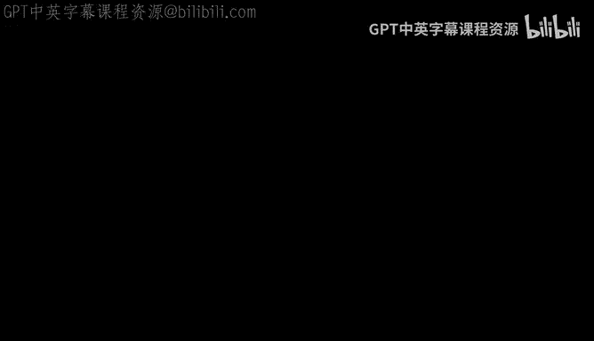

在本节课中，我们将学习深度强化学习。我们将首先了解强化学习的基本概念，然后探讨如何将深度学习与强化学习结合，构建能够做出良好决策序列的智能体。课程后半部分将聚焦于一个特定概念——基于人类反馈的强化学习，这是使大型语言模型与人类偏好对齐的关键技术。

---

## 概述

强化学习是关于让智能体通过与环境交互，学习做出良好决策序列的学科。与监督学习通过示例教学不同，强化学习通过经验教学。本节课我们将从基础概念开始，逐步构建深度强化学习模型，并探讨其在游戏、机器人控制等领域的应用。

---

## 强化学习动机与应用

上一节我们介绍了课程目标，本节中我们来看看强化学习的动机和一些令人印象深刻的应用。

强化学习近年来日益流行。DeepMind团队在《通过深度强化学习实现人类水平控制》这篇著名论文中展示，单一算法可以训练出在超过40-50款Atari游戏中超越人类表现的AI智能体。

后来，你可能听说过AlphaGo。这个算法在围棋游戏中击败并超越了人类表现。围棋是一个比国际象棋更复杂的游戏，从决策可能性和棋盘状态来看都更具挑战性。它在2017年被DeepMind团队解决。

另一篇来自DeepMind的重要论文表明，强化学习也可用于比国际象棋或围棋更复杂的策略游戏，例如涉及多个玩家协作或对抗的游戏。例如《星际争霸》或《Dota》，这些游戏需要长期和短期思考，开发能够协作对抗多个对手的系统非常困难。

最近，在2022年，随着ChatGPT的发布，一篇论文引入了基于人类反馈的强化学习概念，用于将语言模型与人类偏好对齐。我们稍后会讨论这一点。

所有这些都表明，强化学习使我们能够在各种任务中超越人类表现。

---

## 监督学习的局限性

第一个例子是围棋游戏。假设要求你用经典的监督学习解决围棋问题。你会收集什么数据？标签是什么？

一个方法是查看大量历史对局，希望是优秀棋手的对局。输入X是棋盘的当前状态，输出Y是棋盘的下一个状态。这本质上是在学习棋手选择的走法。如果对许多对局都这样做，智能体可能会更适应游戏并发展出更好的策略。

这种方法有哪些缺点或可以预见的不足？

首先，你可能无法看到棋盘所有可能的状态空间。围棋是一个双人游戏，玩家轮流在13x13的网格上放置黑白棋子，目标是包围对手的棋子。网格上的每个交叉点都有多种可能性：黑子、白子或空。在13x13的网格上，棋盘状态的可能性数量是天文数字，仅靠职业棋手的历史走法永远无法覆盖所有状态。国际象棋也存在同样问题。

另一个问题是，你甚至不知道某一步棋是否是好棋。也许那步棋并不好，但你却把它当作好棋来学习。其次，你实际上只获得了部分信息，你不知道棋手脑海中的想法和他们试图执行的策略。你只是在观察长期策略中的一个单一示例，不能期望模型猜测长期策略，因为它只是根据输入X和输出Y进行匹配训练。此时模型没有任何策略概念，它只是在每个决策点进行一次性观察。

其他问题还包括真实标签可能定义不清。即使是世界上最好的人类棋手，也不可能每天都下出最佳对局，而且他们的最佳对局也并非绝对真理。这造成了一个问题，因为你本质上是在训练一个与最佳目标存在一定偏差的模型，你永远无法超越最好的人类，而最好的人类也并非每个时刻都存在的最佳可能策略。

即使有一个由世界顶尖棋手组成的专家小组来决定每一步棋，你仍然有一个定义不清的真实标签。游戏状态太多，我们可能无法泛化。当我们遇到一个从未见过的棋盘状态时，因为模型没有接受过策略训练，我们可能会陷入困境。

这是一个强化学习的完美应用场景，因为强化学习就是关于延迟标签和做出良好的决策序列。

---

## 强化学习核心概念

如果你要用一句话记住强化学习是什么，那就是：**做出良好的决策序列**。

另一种看待它的方式是，经典监督学习和强化学习的区别在于：经典监督学习通过示例教学，而强化学习通过经验教学。你不仅仅是向模型展示猫和非猫的图片，而是让模型体验环境，直到它弄清楚哪些是最好的决策并从中学习。

以下是强化学习应用的一些例子：
*   **游戏**：我们已经讨论过。
*   **自动驾驶**：在驾驶中，你需要一种动态规划算法来制定策略。
*   **机器人控制**：教机器人从A点移动到B点，机器人需要为其每个关节的运动做出大量良好决策。
*   **广告与营销**：公司向你展示多个广告后才促成购买，这需要长期思考，因此有很多强化学习应用于营销、广告和实时竞价过程。

---

## 强化学习词汇

现在让我们围绕这个概念建立一些词汇。

在强化学习中，有一个**智能体**与环境交互。随着智能体与环境交互，它会执行某些**动作**，我们记为 `A_t`，其中 `t` 是时间步。环境会向你展示从时间步 `t` 转换到时间步 `t+1` 的**状态**。因此，在动作 `A_t` 的作用下，环境可能从状态 `S_t` 转换到 `S_{t+1}`。

状态更新发生后，智能体会观察到两样东西：一个**观察** `O_t` 和一个**奖励** `R_t`。智能体的目标当然是最大化奖励。

关于观察需要知道的一点是，有时观察等于状态。为什么我们可能需要两个概念而不是一个概念？为什么拥有状态和观察很重要？

因为在某些情况下，环境可能对用户不完全透明。例如，在国际象棋或围棋中，观察实际上等于状态，你在棋盘上看到所有信息。但在《英雄联盟》或《星际争霸》中，存在“战争迷雾”的概念，你只能看到地图的某些部分，直到你探索了一切或你的队友访问了其他部分。因此，观察实际上比环境状态的信息更少。

最后一个词汇是**转换**。当我提到转换时，我指的是从状态 `t` 到状态 `t+1` 的过程。这意味着我们处于状态 `S_t`，智能体采取动作 `A`，观察到 `O_t` 和奖励 `R_t`，然后转换到下一个状态 `S_{t+1}`。

---

## 一个实践示例：回收游戏

让我们来看一个强化学习算法的实际例子，并一起推导它。

这个例子叫做“回收有益”，因为它简单且能说明强化学习。假设我们有一个包含五个状态的小环境。有一个用棕色标记的起始状态，即状态2，这是我们的初始状态。

在左侧，你有状态1，这是一个垃圾桶。到达垃圾桶很好，因为你可以把手里的垃圾扔进去。在右侧，你可能会经过状态3（空），状态4（地上有一个巧克力包装纸，捡起来很好），然后到达状态5，那里有一个回收箱，它比垃圾桶更有价值，因为你可以回收，应该为此获得更好的奖励。

这就是我们的游戏。在这个游戏中，我们定义了一个与我们希望智能体学习的行为类型相关的奖励。奖励如下：将垃圾扔进普通垃圾桶奖励+2，捡起巧克力包装纸奖励+1，成功到达回收箱奖励+10。

目标是最大化**回报**。我们正式定义回报，但可以将其理解为最大化你在此旅程中做出决策时获得的奖励数量。

在这个特定游戏中，我们有五个状态，有三种类型的状态：棕色是初始状态，我们有普通状态，蓝色是**终止状态**。当你到达强化学习中的终止状态时，通常会结束游戏，结束一个**回合**。然后你开始另一个回合，回到起始状态或初始状态，重新开始。

我们智能体可能的动作非常简单：左和右。我们将添加一个重要规则：垃圾车三分钟后到达，从一个状态到另一个状态需要一分钟。为什么在游戏中添加这个规则很重要？否则，你可能会在状态3和状态4之间来回走动，收集一堆巧克力包装纸，却永远无法到达回收箱，这不是我们想要的。

---

## 长期回报与Q表

我们如何定义长期回报？长期回报将定义为 `R`，它是带有**折扣**的奖励总和。折扣是强化学习中一个非常重要的概念，也是一个非常自然的概念。你能想到折扣对人类来说代表什么吗？例如，金钱和时间的价值，或者机器人可能拥有的能量。你宁愿现在得到一美元，而不是十年后，因为存在通货膨胀等因素。强化学习中的折扣也是如此，如果你的策略耗时太长，你需要对其进行折扣，因为你的机器人在执行过程中可能会损失能量。

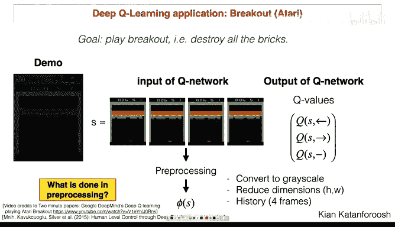

折扣可以变化，但通常保持在0到1之间。

如果折扣因子 `γ` 等于1，意味着时间长短无关紧要，只想最大化回报，那么最佳策略是什么？最佳策略是右、右、右，然后总奖励是11。这样我们就到达了终止状态，并获得11的奖励。

现在假设 `γ` 为0.9，情况会稍微复杂一些。我将引导你完成一个非常简单的算法，它允许我们确定最佳策略，并将数字放入一个矩阵中。例如，我们将定义一个 **Q表**。

Q代表价值函数，Q学习、Q*等术语都源于Q学习。假设我们有一个Q表，其大小为状态数乘以动作数，在我们的例子中是5行2列。Q表的每个条目本质上代表了在状态 `S` 采取动作 `A` 有多好。

如果我们有一个包含这些数字的表格，我们是否就解决了问题？在任意时刻，智能体只需查看表格：我处于状态3，查看第一列会告诉我动作1的价值，查看第二列会告诉我动作2的价值，这样我就有了做出决策所需的一切。这个表格确实是你想要找到的东西。

---

## 回溯算法与贝尔曼方程

现在，我们找到这个表格的方法是通过一种回溯算法，将环境编码为一棵树并遍历它。过程如下：我从状态S2开始，面前有两个选择：我可以向左走，获得即时奖励2；或者向右走，获得即时奖励0，并进入状态3。状态3不是终止状态，所以我可以从状态3开始进行同样的操作。在状态3，我有两个选择：向左走，奖励0，进入S2；或者向右走，获得即时奖励+1，进入S4。从S4开始，我又有两个选择：向左回到S3，奖励0；或者向右，获得惊人的奖励+10，并进入终止状态S5。

这是我的即时奖励地图，还不是我的折扣回报。现在我们要做的是回溯这棵树，以计算折扣回报。如果我在S3这里，我看到在S4可以获得即时奖励+1，我想计算当我在S3时能获得的最大回报。在S4，我最多可以获得+10，但我需要对其进行折扣。我的折扣是0.9，所以将10乘以0.9。这告诉我，从S4开始，我可以期望得到9，加上我从S3移动到S4时获得的即时奖励1，我可以将这个数字更新为10。这意味着从S3开始，你能期望的最好折扣回报是10，即 `1 + 0.9 * 10`。

现在让我们在S2进行同样的操作。在S2，我向左进入S1可以获得即时奖励2，或者向右进入S3可以获得即时奖励0。S1不值得，我们已经知道这一点，因为当我在S3时，实际上可以期望得到10，但我需要对其进行折扣，`0.9 * 10 = 9`，加上从S2到S3的即时奖励0，这告诉我从状态2（我们的初始状态）开始的折扣回报是9。

这是一个简单的回溯。现在我可以将这些值复制回Q表。我们基本上完成了游戏。此时，我们可以查看某一行，例如我处于状态3，查看Q表的第三行，看到我有两个选择：如果我向左回到S2，最终我的折扣回报将是8.1；如果我向右进入S4，我将得到10，因为我会得到 `1 + 0.9 * 10 = 10`。

这是一个玩具示例，但它告诉你，如果你能够回溯整个环境，你将能够构建一个庞大的Q表，并可以将其交给你的智能体来做出决策。

---

## 策略与贝尔曼最优性方程

强化学习中最重要的概念之一是黑板上的这个方程，称为**贝尔曼最优性方程**。通常你会看到它记为 `Q*(s, a) = r + γ * max_{a'} Q*(s', a')`。

让我为你解释这个方程，因为它非常重要。这个方程被称为最优性方程，因为你的最优Q表将遵循这个方程。这个方程可以应用于任何状态-动作对，并且仍然成立。

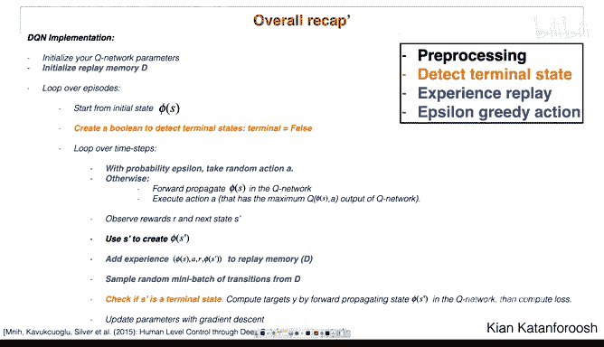

贝尔曼方程之所以是最优性方程的直觉在于：如果你有完美的Q函数（Q表），并且你处于某个状态 `s`，执行了某个动作 `a`，你将观察到一个奖励 `r`。由于你采取了一个动作，你将处于一个新状态 `s'`，从这个新状态开始，你可以重复刚才的操作。因为你进行了回溯等操作，这个方程将成立，因为它是即时奖励加上折扣乘以你在下一个状态 `s'` 可以采取的最佳动作的价值。

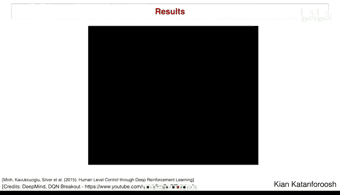

这完全就是我们刚才所做的回溯。即时奖励加上折扣乘以你在下一个状态 `s'` 可以采取的最佳可能动作的价值。

我要介绍的最后一个词汇概念是**策略**。策略是一个函数，给定你的状态，它会告诉你该做什么。在Q学习中，这个策略定义为 `argmax_{a} Q*(s, a)`。本质上，它说的是：查看表格，查看某个状态 `s`，你想要的策略（即你应该做什么，这个函数告诉你最佳策略）就是查看所有可能的动作，选择具有最高Q值的那个动作。

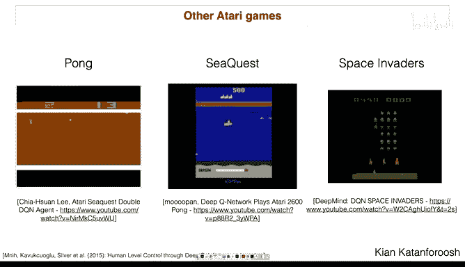

这是一个非常简单的例子，但它是Q学习的核心。稍后你将广泛使用策略。虽然有很多强化学习算法，但理解策略这个概念很重要。在Q学习中，策略是给定状态下最佳Q值的argmax，它告诉你采取哪个动作，这是你需要理解的核心内容。

请记住这个贝尔曼方程，因为我们稍后会重用它。

---

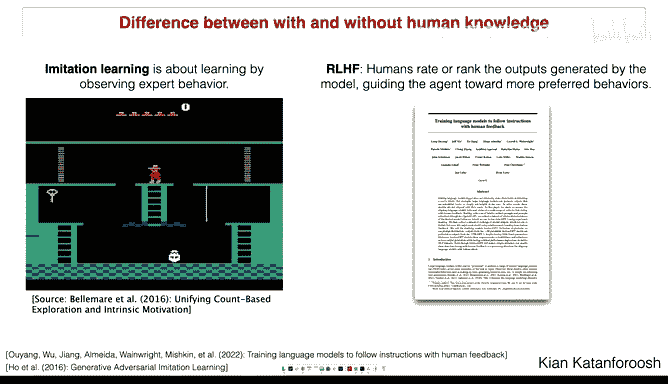

## 从Q表到深度Q网络

这种方法（Q表）的主要问题是状态和动作空间可能非常庞大。拥有一个通过回溯发现的矩阵，并且每次你想执行一个动作时都必须查找给定状态的可能动作，这变得不可能。想象一下将这个算法用于围棋游戏，那里有如此多的状态和如此多的可能动作（你可以将棋子放在棋盘上的任何位置），你可以想象这个矩阵变得有多大，使用起来有多么不可能。

这就是我们的问题，也是深度学习发挥作用的时候。

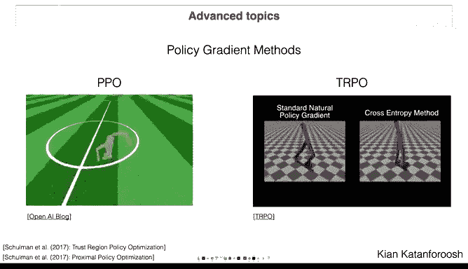

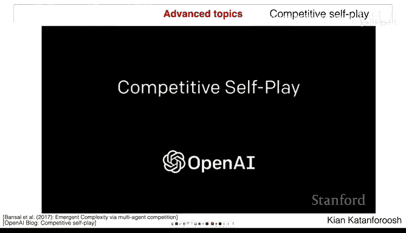

我们将稍微不同地构建问题。我们将不再使用Q表，而是利用神经网络是通用函数逼近器这一事实，定义一个本质上是神经网络的Q函数。这个函数可以接受一个状态 `s` 和一个动作 `a`，并告诉你该动作在状态 `s` 下有多好。

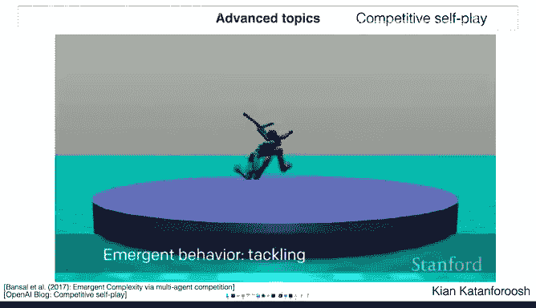

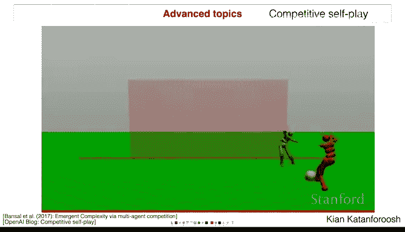

因此，不再是在矩阵中查找，你只需在神经网络中进行一次前向传播，它就会给你答案。对于状态和动作很多的游戏来说，这感觉是一个更好的解决方案。

以下是相同的问题陈述：过去我们寻找一个Q表，这次我们将寻找一个神经网络。我们要做的一件事是将输出层定义为有两个输出。给定某个状态作为输入（可以将其视为一个独热编码向量），例如状态2编码为 `[0, 1, 0, 0, 0]`。如果你将这个状态传递给这个具有多个层的Q函数，它将给出两个输出：一个输出对应 `Q(s, 动作右)`，另一个对应 `Q(s, 动作左)`，因为这是两个动作。如果我们有更多动作，我们只需增加输出层，输出层中可能有更多神经元。

---

## 训练深度Q网络

最大的问题是：我们如何训练这个网络？因为我们不是在经典的监督学习中，我们没有标签。这是一个难题，但你会怎么做？鉴于我们没有传统的X和Y对，你将如何训练这个神经网络？记住，一开始这个神经网络会给你垃圾信息，它接受状态 `s`，可能会告诉你去左边或右边，但这完全是随机的。那么，你将如何调整它，使其能够做出真正好的决策？

我们目前对这个问题的了解有哪些？我们可以利用哪些游戏规则来估计什么是好的？我们拥有的一个东西是每个游戏的奖励结构，这绝对应该用来估计一个好的决策是什么样的。

问题是不是在每个状态你都能看到奖励。如果你看很多围棋对局，你可能在50步之后才能看到奖励。那么在这种情况下你该怎么做？

一种可能性是遍历游戏树，尝试每一个可能的动作，然后回溯。但在围棋中，你可以把棋子放在任何地方。这棵树一开始就有13x13种选择，然后呈指数级增长，这是不可行的。但如果有某些动作比其他动作更可能发生呢？我们真的需要探索整棵树吗？你如何确定哪个动作可能比另一个更好？

我们可以使用期望回报来估计。但如何在不至少遍历一次树的情况下知道期望回报呢？这正是我们将要做的，但我们将使用贝尔曼方程，因为关于这个问题我们知道两件事：我们知道奖励结构，我们也知道完美的Q函数将遵循我们已知的贝尔曼方程。最终，贝尔曼方程应该得到遵守，这意味着对于每个状态，如果你想知道给定动作下该状态的Q值，你将通过查看即时奖励加上折扣乘以从下一个状态开始所有动作中最佳Q值来获得。这个方程将被遵守。这些是我们仅有的信息，我们将大量使用它们来定义我们的标签，并模仿经典的监督学习方法。

我们有一个神经网络，它有 `Q(s, 左)` 和 `Q(s, 右)`，代表在该状态下向左或向右有多好。我在屏幕右上角粘贴了贝尔曼方程。

我们将定义一个损失函数。为简单起见，因为这些是我们使用的标量值，我们可以使用L2损失（平方损失），它比较某个标签 `y` 和某个状态某个动作的Q值。我们希望最小化这个损失函数，意味着 `y` 和给定状态给定动作的Q值尽可能接近。

我们将利用奖励和贝尔曼方程。我们目前没有 `y`。在监督学习中，你有一张猫的图片，标签是1或0。这里我们没有 `y`，所以我们必须想出一个好的 `y` 的估计，实际上比随机更好。假设在此时，当我把状态 `s` 输入网络时，结果向左的Q值高于向右的Q值。这意味着在那一刻，Q函数告诉我向左比向右更好。这在开始时是随机的，完全随机。

我要做的是使用我观察到的向左的即时奖励，加上折扣项乘以基于我当前Q值在下一步可以采取的最佳动作的Q值，作为我的目标值 `y`。这非常重要。记住，这个目标是有偏差的，它不是一个完美的目标，但总比没有好。它不仅告诉我们向左有好的奖励，我们应该考虑这可能是一步好棋，因为我们看到了即时奖励，而且除此之外，我们还知道在训练结束时，Q值应该遵循贝尔曼方程。所以我们为什么不将目标设为贝尔曼方程呢？

因此，我们加上当你处于下一个状态时的折扣最大未来奖励。你处于状态 `s`，你向左走，现在你处于下一个状态 `s'_左`。你再次查看你的Q值并选择最好的一个，然后在这里加上那个数字。

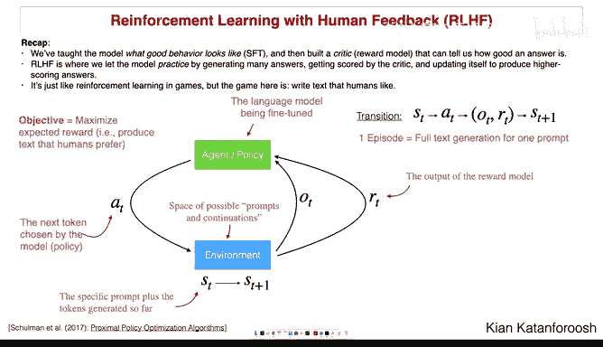

在这个过程中实际上有两个前向传播路径。一个前向传播路径是你将状态 `s` 输入Q网络，查看向左和向右两个选项，然后你决定向左。然后你将这个值与目标 `y` 进行比较。但为了得到目标 `y`，我需要进行另一个前向传播：我采取向左的动作，执行它，得到一个下一个状态 `s'`，我将这个 `s'` 输入Q网络，查看我拥有的两个选项，选择最好的一个，并在这里加上它（乘以折扣）。

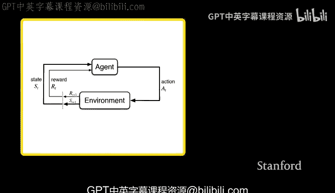

根本上发生的是：我们有一个在开始时随机的Q网络，它从未观察过奖励，我们只知道在某个时刻它会达到一个完美的Q函数。但我们目前能做的最好的是说，作为