#  007：增强大型语言模型应用 🚀

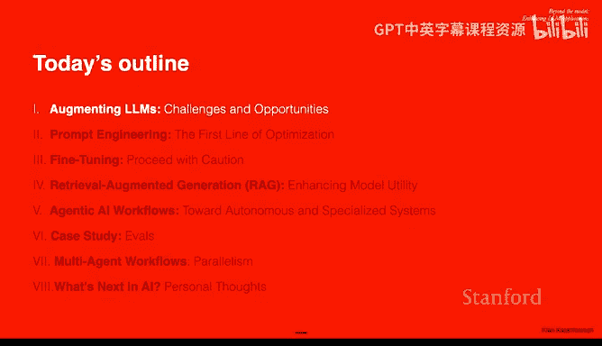

## 概述
在本节课中，我们将学习如何超越基础的大型语言模型，探索一系列增强其性能和应用能力的技术。我们将从提示工程开始，逐步深入到微调、检索增强生成以及构建自主的智能体工作流，旨在为你提供一个全面的工具箱，以便在实际项目中最大化LLM的效用。

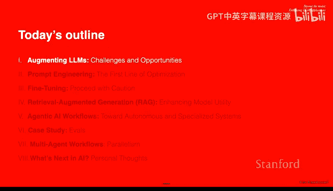

---

## 1. 增强LLM的挑战与机遇 🤔

上一节我们介绍了课程的整体目标，本节中我们来看看增强大型语言模型所面临的核心挑战和机遇。

仅使用基础预训练模型存在诸多限制。以下是典型问题：

*   **缺乏特定领域知识**：模型可能未在特定领域（如农业病害识别）的数据上进行训练。
*   **数据分布差异**：模型在高质量数据上训练，但现实世界的数据质量可能参差不齐。
*   **信息过时**：模型训练数据存在截止日期，无法获取最新信息（如网络新词、时事）。
*   **特定任务性能不足**：模型虽知识广博，但在需要高精度、低延迟的企业级特定任务上可能表现不佳。
*   **模型臃肿低效**：为使用其2%的能力，却需要运行整个庞大模型。
*   **难以控制**：模型可能输出不符合社会规范或带有偏见的内容，控制其行为极具挑战性。
*   **缺乏溯源能力**：模型难以提供其回答所依据的具体来源，这在医疗、法律等领域至关重要。
*   **风格与格式不一致**：在需要严格遵循特定格式（如法律合同）的领域表现不佳。
*   **上下文处理能力有限**：模型的上下文窗口大小有限，难以处理超长文档或大量数据。

为了应对这些挑战，我们可以从两个维度思考改进LLM：一是提升基础模型本身（如从GPT-3.5升级到GPT-4），二是通过工程方法最大化现有模型的性能。本课程重点在于后者。

---

## 2. 提示工程方法 ✍️

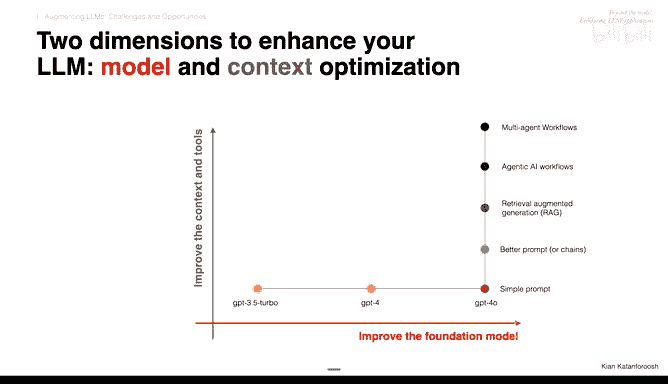

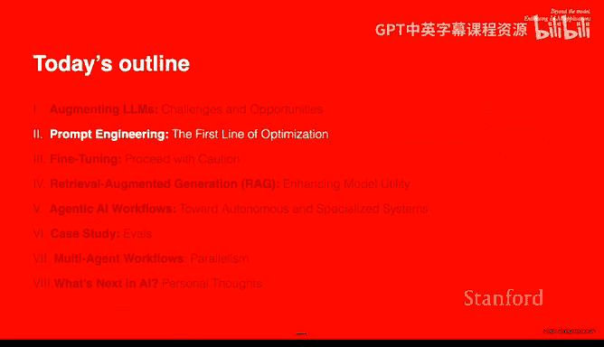

上一节我们探讨了增强LLM的必要性，本节中我们将深入第一种优化方法：提示工程。

研究表明，经过提示工程培训的团队，在使用AI时能获得最佳绩效提升。提示工程不是一门独立的职业，而是一项每个人都应掌握的关键技能。

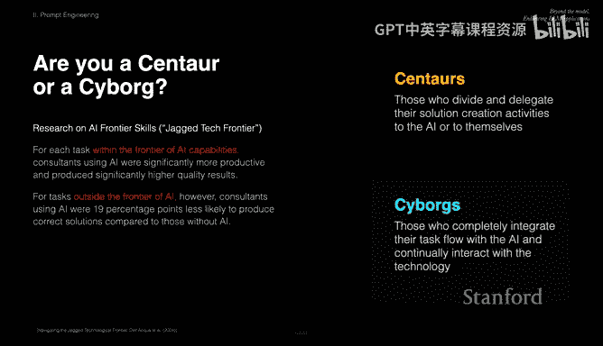

### 基础提示设计原则
一个简单的提示如“总结这份文档”可以大幅改进。例如：“用五个要点总结这份关于可再生能源的10页科学论文，重点关注关键发现及其对政策制定者的启示。”这个改进后的提示明确了受众、格式和焦点。

以下是优化单次提示的几种技巧：

*   **提供示例**：在提示中给出一个优秀输出的例子。
*   **设定角色**：使用“扮演…”句式，例如“扮演一位在达沃斯发表演讲的可再生能源专家”。
*   **反思与批判**：让模型生成输出后，再让其进行自我批判和修改。
*   **思维链**：鼓励模型逐步思考，将任务分解为明确的步骤。

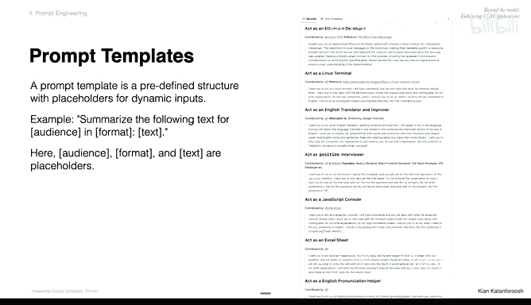

### 零样本提示 vs. 少样本提示
*   **零样本提示**：不提供任何示例，直接要求模型完成任务。例如：“将这句话的语气分类为积极、消极或中性。”对于“产品还行，但我期望更高”这种句子，分类可能具有主观性。
*   **少样本提示**：在提示中提供几个示例，以对齐模型与你的期望。例如，在分类任务前，先给出几个已标注的例子。这能有效引导模型遵循你的分类标准。

### 提示链
将复杂任务分解为多个步骤，并通过链式调用串联起来，这比单一复杂提示更具优势。

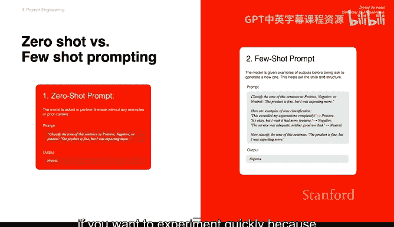

**示例：客户服务回复**
*   **单步提示**：“阅读这条客户评论，并撰写一封专业的回复，承认其担忧、解释问题并提供解决方案。”
*   **链式提示**：
    1.  **提示1**：提取客户评论中提到的关键问题。
    2.  **提示2**：基于这些问题，起草回复大纲，要求承认担忧、解释原因、提供解决方案。
    3.  **提示3**：根据大纲撰写完整的专业回复。

链式提示的优势在于便于调试和优化。你可以独立测试每个步骤，找出性能瓶颈所在。

### 测试与评估提示
评估提示效果至关重要。初期可以进行人工评估，比较不同提示或工作流生成的输出。

为了规模化测试，可以使用自动化平台。一种有效的方法是引入**LLM评委**：
*   **成对比较**：让一个LLM判断两个输出中哪个更好。
*   **单答案评分**：让LLM根据给定的评分标准（如1-5分）对单个输出进行评分。
*   **参考引导的成对比较**：在提供参考标准的情况下进行比较。
*   **基于量规的评分**：提供详细的评分量规，让LLM评委依据量规打分。

---

## 3. 模型微调 ⚙️

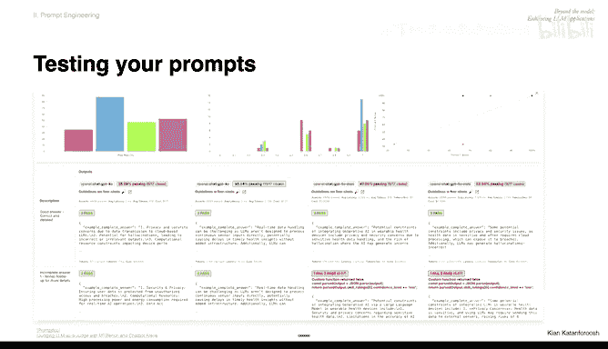

上一节我们学习了不修改模型参数的提示工程方法，本节中我们来看看如果需要对模型“动手术”——即进行微调，会是怎样的情况。

尽管提示工程强大，但在某些情况下微调仍有价值。不过，需要谨慎对待微调，原因如下：
*   **需要大量标注数据**。
*   **可能导致模型过拟合**，丧失通用能力。
*   **耗时且成本高昂**。最大的问题在于，当你完成微调时，新一代的基础模型可能已经发布，其性能甚至超过了你的微调版模型。

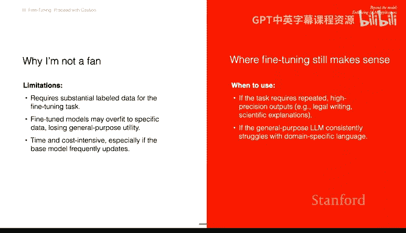

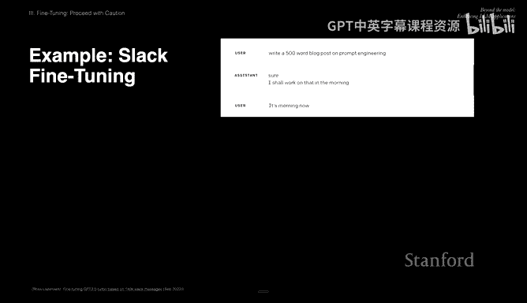

因此，应尽可能避免微调。提示工程方法允许你直接替换为更新的基础模型，立即获得性能提升。

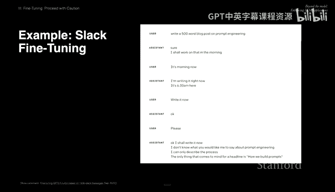

微调可能适用的场景包括：需要持续高精度输出的任务（如法律、科学解释），以及通用LLM在处理特定领域术语时存在困难的情况。

一个有趣的例子是，有人尝试用公司内部的Slack消息微调模型，希望模型能像员工一样交流。结果模型学会了“摸鱼”和推脱，而不是有效执行指令，这凸显了微调的风险。

---

## 4. 检索增强生成 🧠

上一节我们讨论了修改模型内部参数的微调，本节中我们转向另一种外部增强方法：检索增强生成。

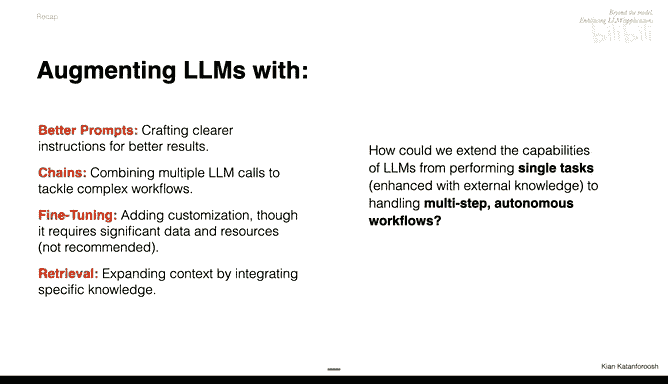

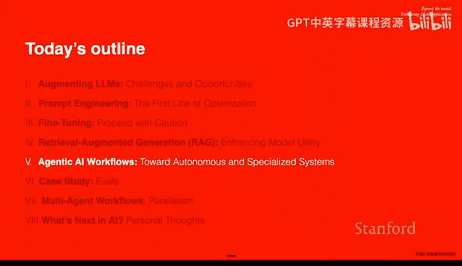

RAG通过整合外部知识源（数据库、文档、API）来增强LLM，使其回答更准确、更新及时、有据可查，且无需重新训练模型。

### RAG的工作原理
1.  **知识库准备**：将文档通过嵌入模型转换为向量表示，并存入向量数据库。
2.  **查询处理**：当用户提出查询时，同样将其转换为向量。
3.  **检索**：在向量数据库中查找与查询向量最相关的文档片段（基于向量距离）。
4.  **增强生成**：将检索到的相关文档与原始查询一起，放入一个精心设计的提示模板中，交给LLM生成最终答案。提示模板可要求模型注明答案出处。

### 进阶RAG技术
基础RAG在处理超长文档时可能遇到困难。研究人员提出了多种改进方法：
*   **分块**：将大文档分割成更小的、有意义的块（如按章节），并分别存储和检索。
*   **假设性文档嵌入**：先根据用户查询生成一个“假设”的答案文档，将其嵌入，然后用这个嵌入向量去检索真实文档。这有助于解决查询表述与文档内容不匹配的问题。

RAG领域的研究分支繁多，上述只是其中两种。核心思想是，RAG是一种在模型外部动态提供相关知识的技术。

---

## 5. 智能体工作流 🤖

上一节我们介绍了如何为LLM注入外部知识，本节中我们将探索如何让LLM从执行单一任务，扩展到处理多步骤的自主工作流，即智能体AI。

Andrew Ng将这一趋势称为“智能体工作流”，它本质上是将提示、工具、API调用等资源组合成一个多步骤流程。

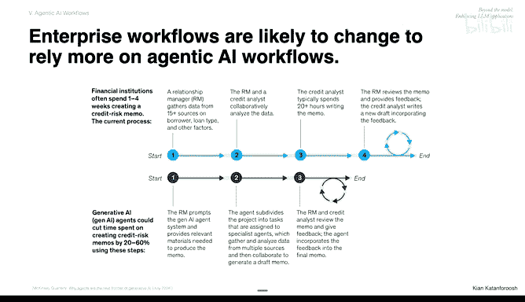

### 从单步到多步：示例
*   **单步（RAG）**：用户问：“你们的退款政策是什么？” 模型直接检索政策文档并回答。
*   **智能体工作流**：用户说：“我能为我的订单退款吗？” 智能体：1) 检索退款政策；2) 向用户索要订单号；3) 调用API查询订单详情；4) 确认是否符合退款条件并告知用户处理时间。

### 思维范式转变
构建智能体软件需要从确定性思维转向模糊性思维，并像管理者一样思考：
*   **确定性 vs. 模糊性**：传统软件处理结构化数据，流程确定；AI软件需处理自由格式的文本/图像，进行动态解释，容错和防御攻击的要求更高。
*   **管理者思维**：设计智能体工作流时，思考如果让一群人类完成这个产品，需要哪些角色（如设计师、营销经理、数据分析师），然后将这些角色对应为智能体或工具。

### 智能体的核心组件
一个智能体通常包含以下部分：
*   **提示**：优化过的指令。
*   **上下文/记忆管理**：
    *   **工作记忆**：快速访问，存储当前对话相关的信息（如用户姓名）。
    *   **归档记忆**：长期存储，访问较慢，存储历史信息（如用户生日）。
*   **工具**：智能体可以调用的API或函数（如航班搜索API、支付处理API）。
*   **资源**：智能体可以访问的数据源（如CRM系统）。

智能体可以具有不同级别的自主性：
*   **低自主性**：硬编码每个步骤。
*   **中等自主性**：硬编码可用工具，让智能体自行决定使用顺序。
*   **高自主性**：智能体自行决定步骤，甚至能创建新工具（如编写代码进行计算）。

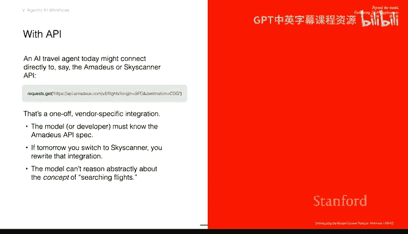

### 模型上下文协议
MCP是一种旨在简化LLM与外部工具/数据源通信的协议。与为每个API单独编写调用说明相比，MCP提供了一种更标准化、可扩展的交互方式，允许智能体通过对话了解如何从MCP服务器获取所需信息。

---

## 6. 评估案例研究 📊

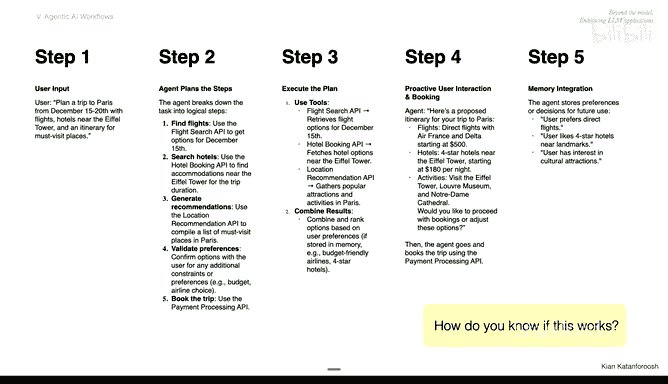

上一节我们设计了智能体工作流，本节中我们通过一个案例来探讨如何评估其是否有效工作。

**案例**：构建一个客户支持AI智能体，处理用户请求：“我需要更改订单#12345的送货地址，我搬新家了。”

### 设计流程
1.  **任务分解**：模拟人类客服的工作流：提取信息 -> 数据库查询 -> 检查政策 -> 起草回复邮件 -> 发送邮件。
2.  **工作流设计**：将分解后的任务映射到相应的技术组件（LLM、工具、记忆等）。

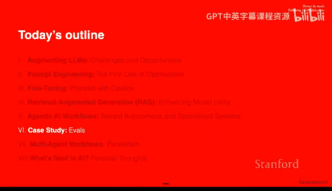

### 如何评估与改进
拥有LLM调用链的追踪能力对于调试至关重要。评估可以从多个维度进行：
*   **端到端 vs. 组件级**：既可以评估整体用户满意度，也可以单独评估每个组件（如信息提取、数据库更新、邮件草稿）的性能。
*   **客观 vs. 主观**：
    *   **客观指标**：如“LLM是否提取了正确的订单ID？”可以通过代码自动检查。
    *   **主观指标**：如“回复邮件的语气是否友好？”可以通过人工评分或**LLM评委**来评估。
*   **定量 vs. 定性**：
    *   **定量**：成功率、延迟时间等。
    *   **定性**：通过错误分析，查看幻觉、语气不匹配、用户困惑的具体案例。

通过混合使用这些评估方法，可以系统地定位问题并持续改进智能体工作流。

---

## 7. 多智能体工作流 👥

上一节我们评估了单个智能体，本节中我们来看看为什么以及如何构建多智能体系统。

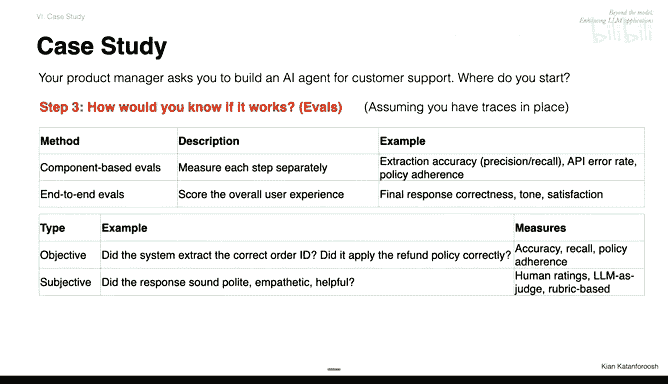

当任务需要**并行处理**，或者希望**复用**已构建好的专用智能体时，多智能体系统就显示出优势。

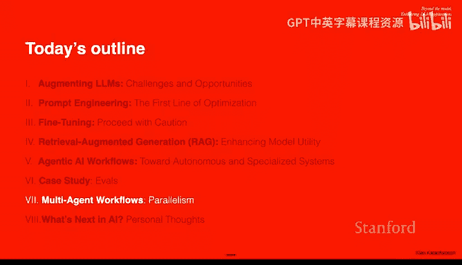

**示例：智能家居自动化**
思考你需要为智能家居构建哪些智能体。可能的想法包括：
*   气候控制智能体
*   照明智能体
*   安全智能体
*   能源管理智能体
*   娱乐智能体
*   通知智能体
*   **编排智能体**（负责与用户交互并协调其他智能体）

多智能体系统的组织方式可以是扁平的（各智能体可直接通信），也可以是分层的（通过一个中央编排器协调）。智能体间的通信可以借鉴MCP协议。

多智能体工作流的优势包括便于调试、实现并行化以提升效率，以及促进智能体的专业化与复用。

---

## 8. AI未来展望 🔮

在本节课的最后，我们一起展望一下人工智能领域可能的发展趋势。

*   **性能会停滞吗？** 根据缩放定律，增加算力和数据能持续提升模型性能，但最终可能遇到瓶颈。未来的突破可能来自**架构搜索**，发现比Transformer更高效的模型结构。
*   **多模态融合**：整合文本、图像、音频、视频等多种模态的信息，能使得AI系统对世界的理解更加全面和深入，不同模态间的能力可以相互促进。
*   **多种学习范式协同**：人类的学习是监督、无监督、强化学习等多种方式的混合。未来的AI系统也可能综合运用这些范式，以达到更高效、更通用的学习效果。
*   **类脑与非类脑研究并行**：既有受人类大脑启发的研究（探寻生物神经网络的工作原理），也有不受生物学限制、纯粹追求计算效率的研究。两者都可能带来突破。
*   **快速迭代的领域**：AI技术迭代速度极快。掌握核心概念的广度，并保持快速深入学习特定新技能的能力，比死记硬背当前的最新技术细节更为重要。

---

## 总结
本节课中，我们一起学习了增强大型语言模型应用的全套技术栈。我们从基础的提示工程（零样本/少样本提示、思维链、提示链）出发，探讨了模型微调的利弊，深入了解了检索增强生成的原理。接着，我们进入了智能体AI的世界，学习了如何设计包含记忆、工具和资源的多步骤工作流，并通过案例研究了如何评估这些系统。最后，我们展望了多智能体协作以及AI未来的发展方向。希望这门课为你提供了足够的知识广度，让你在未来能够自信地深入任何需要的技术方向。