#  008：AI职业建议 🚀

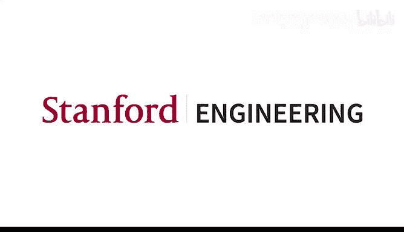

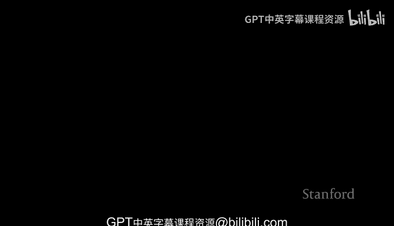

在本节课中，我们将探讨在人工智能领域构建职业生涯的机遇与策略。课程将分为两部分：首先，吴恩达教授将分享他对当前AI行业趋势的见解；随后，特邀嘉宾劳伦斯·莫罗尼将深入分析就业市场现状，并提供实用的求职与发展建议。

## 第一部分：吴恩达教授的分享

今天我想和大家聊聊在AI领域的职业建议。往年我通常独自完成这部分讲座，但今天我打算先分享几点想法，然后邀请我的好友劳伦斯·莫罗尼来演讲。他专程从西雅图来到旧金山，将为我们分享他所观察到的广阔就业市场前景以及在AI领域发展的技巧。

### 前所未有的机遇 🎯

在交给劳伦斯之前，我想分享一个观点：现在绝对是投身AI、构建AI事业的最佳时机。

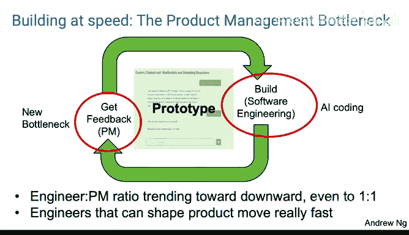

几个月前，社交媒体或传统媒体上出现了一些疑问：AI的发展是否在放缓？GPT-5有那么好吗？我认为它确实相当不错。但人们之所以提出这个问题，部分原因在于AI的基准是100%的完美答案。当你取得快速进展时，在某些点上你无法超越100%的准确率。

然而，最影响我思考的一项研究来自METR组织。他们研究了随着时间的推移，AI能够完成的任务的复杂性是如何变化的，其衡量标准是人类完成该任务所需的时间。几年前，也许GPT-2能完成人类只需几秒钟的任务，然后是四秒、八秒、一分钟、两分钟、四分钟等等。研究估计，AI能处理的任务时长每七个月翻一番。我认为，从这个指标来看，我对AI将持续进步感到乐观。以人类完成某件事所需时间来衡量的任务复杂性正在快速翻倍。同一项研究还指出，AI编码能力的翻倍时间甚至更短，大约70天。过去需要我10分钟、20分钟编写的代码，AI现在能完成得越来越多。

### 更强大与更快速的双重主题 ⚡

我认为现在是一个黄金时期，原因主要有两个主题：更强大和更快速。

在座的各位现在都能构建比地球上任何人在一年前所能构建的更强大的软件，这得益于AI构建模块，包括大模型、检索增强生成、工作流、语音AI，当然还有深度学习。事实证明，许多大语言模型对深度学习有基本的理解。如果你提示前沿模型为你实现一个Transformer网络，它在帮助你快速使用这些构建模块方面做得相当不错。因此，我们现在拥有非常强大的构建模块，这些在一两年前要么非常困难，要么根本不存在。你现在可以构建地球上其他人，甚至是技术最先进的人都无法完成的软件。

同时，借助AI编码，你编写软件的速度比以往任何时候都快得多。我个人发现，紧跟工具前沿非常重要，因为AI编码工具变化非常快。我感觉自从几个月前，我个人最喜欢的工具变成了Claude Code，取代了早期的一些工具。自从GPT-5发布以来，我认为OpenAI Codex也取得了巨大进步。今天早上，Gemini 3发布了，我今早玩了一下，似乎又是一个巨大的飞跃。所以，如果你每三个月问我一次我最喜欢的编码工具是什么，答案很可能会改变，肯定每六个月会变，甚至可能每三个月就变。我发现，在这些工具上落后半代，就意味着生产力会明显下降。我知道大家都在说AI或工程发展得如此之快，但在AI的所有领域中，AI编码工具是进步速度惊人的一个领域。使用最新一代的工具，而不是落后半代，能让你更高效。

### 产品管理的瓶颈 📈

随着我们构建更强大软件和更快构建软件的能力增强，我现在比一两年前更强烈地给出的一条建议是：直接去构建东西。在斯坦福上课，参加在线课程，此外，你构建东西并向他人展示的机会比以往任何时候都大。

但这带来了一个可能尚未被广泛认识到的奇怪影响：产品管理的瓶颈。当从清晰的软件规格说明到代码变得越来越容易时，瓶颈就越来越转向决定构建什么，或者越来越转向为你真正想要构建的东西编写清晰的规格说明。

当我构建软件时，我经常想到一个循环：编写一些软件，编写一些代码，展示给用户以获得反馈。我认为这是产品经理的工作。然后根据用户反馈，修正我对用户喜欢什么、不喜欢什么、哪些功能太难、他们想要什么功能、不想要什么功能的看法，改变我对要构建什么的想法，然后多次循环，希望迭代出用户喜爱的产品。

由于AI编码，构建软件的过程变得比以前便宜和快速得多。但这讽刺性地将瓶颈转移到了决定构建什么上。

### 工程师与产品经理角色的融合 👥

因此，我看到一些奇怪的趋势。在硅谷和许多科技公司，人们经常谈论工程师与产品经理的比例。这些比例需要谨慎看待，因为它们差异很大。你会听到公司谈论工程师与产品经理的比例大约是4:1或7:1或8:1，意思是一个产品经理编写产品规格说明可以让大约4到8个工程师保持忙碌。但由于工程速度加快，而产品管理受AI加速的程度不如工程，我看到工程师与产品经理的比例呈下降趋势，甚至可能达到2:1或1:1。我合作的一些团队提议的比例是1个产品经理对1个工程师，这几乎不同于所有传统硅谷公司的比例。

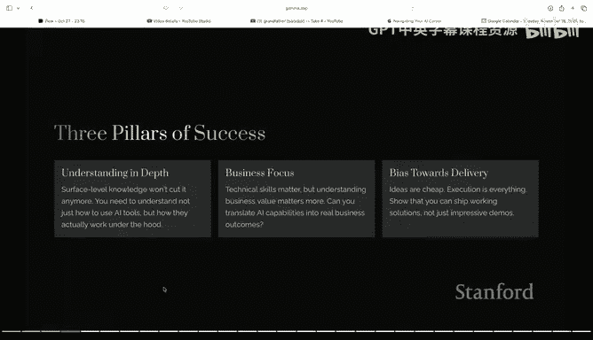

我看到的另一件事是，工程师也可以塑造产品，并且可以行动得非常快。更进一步，将工程师和产品经理的角色融合到一个人身上。我发现，那些喜欢做工程工作、不喜欢与用户交谈和进行更具人文同理心方面工作的工程师，与那些学会与用户交谈、获取反馈、培养对用户的深刻同理心从而能够决定构建什么的工程师相比，后者是我目前在硅谷看到的发展最快的人群。

在我职业生涯的早期阶段，我多年来一直后悔的一件事是，在我担任的某个角色中，我曾试图说服一群工程师做更多的产品工作，结果让一些非常优秀的工程师因为不擅长产品管理而感到难过。那是一个我后悔多年的错误，我本不应该那样做。

现在，我感觉自己又在重复那个完全相同的错误。话虽如此，我发现，我既能编写代码，又能与用户交谈以确定方向，这让我和能做到这一点的工程师行动速度快得多。因此，也许值得重新审视工程师是否能多做一点这方面的工作，因为如果你不等待别人将产品带给客户，你只需编写代码，凭直觉决定下一步做什么并迭代，这种执行速度会快得多。

### 人际网络的重要性 🤝

在交给劳伦斯之前，我想分享的最后一点是：在规划职业生涯方面，我认为对你学习速度和成功水平最强的预测因素之一是你周围的人。我们都是社会性生物，从周围的人身上学习。社会学研究表明，如果你的五个最亲密的朋友是吸烟者，你成为吸烟者的几率会高得多。虽然我不知道是否有研究表明，如果你的五个或一个最亲密的朋友是真正努力工作、有决心、快速学习、试图用AI让世界变得更美好的人，你更有可能也这样做，但我认为这几乎是肯定的。

我们所有人都受到周围人的启发。如果你能找到一群优秀的人一起工作，那将推动你前进。事实上，在斯坦福，我感到非常幸运，这里有优秀的学生群体和杰出的教职员工。我认为我们在斯坦福拥有的另一件幸运之事是紧密的联系网络。坦率地说，许多在尖端AI实验室工作的人，都是斯坦福不同教授以前的学生。因此，这种丰富的联系网络意味着，在斯坦福，我们经常能了解到很多尚未广为人知的事情，这得益于人际关系和友谊。当某家公司做了某事，我的教职员工朋友会打电话给该公司的人询问具体情况。这种丰富的联系网络意味着，当我们努力推动朋友前进时，朋友也用知识和联系网络以及AI前沿技术（不幸的是，这些并非全部在互联网上公开）来推动我们前进。

因此，当你在斯坦福时，请结交朋友，建立这种丰富的联系网络。很多时候，坦率地说，当我考虑进入某个技术方向时，我会与真正接近研究的人（无论是斯坦福的研究人员还是前沿实验室的人）打一两个电话，他们会分享一些我以前不知道的事情，这会改变我为项目选择技术架构的方式。我发现，你周围的朋友群体，那些“试试这个”、“别做那个”、“忽略那个公关”、“实际上别试那个东西”的小建议，对你引导项目方向的能力有很大影响。所以，在斯坦福期间，请利用好这种联系网络。斯坦福拥有的这种联系网络实际上非常独特。世界上有很多伟大的大学，但在当前这个时刻，我真的认为世界上没有哪所大学能像斯坦福这样，拥有如此丰富的联系网络连接到所有领先的AI领域。

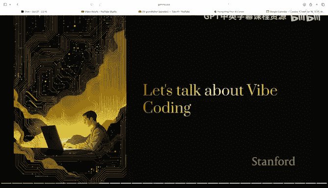

但对我来说，我们也很幸运能在这里与一个优秀的人群社区一起工作和学习。

### 选择团队而非公司品牌 🏢

对于你们来说，如果申请工作，对你的职业成功更重要的事情是，如果你去一家公司，重要的是你每天与之共事的人。这里有一个我告诉过上一届学生并重复的故事：多年前我认识的一位斯坦福学生，他在斯坦福做得很好，我认为他是个佼佼者。他申请了一家公司的工作，并得到了这家拥有热门AI品牌的公司的工作机会。这家公司拒绝告诉他他将加入哪个团队。他们说，先来签工作合同，有一个轮换系统、匹配系统等等，先签了字，然后我们再为你找个好项目。部分原因是因为这是一家好公司，他的父母为他能进入这家公司感到自豪。他没有加入这家公司，希望能从事令人兴奋的AI项目。签了合同后，他被分配到公司的后端Java支付处理系统工作。

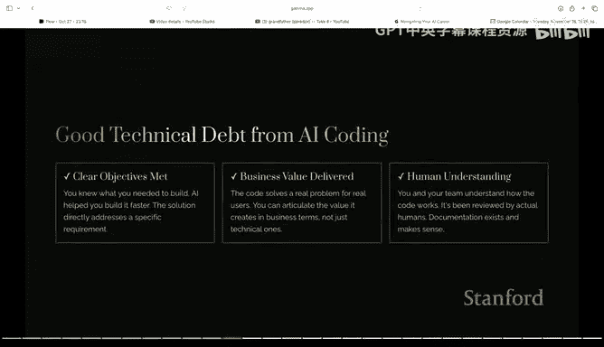

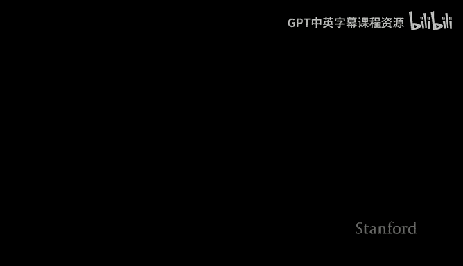

我并不是说做Java后端支付处理系统不好，我认为它们很棒，但这是一位AI学生，没有被匹配到AI项目。因此，大约一年时间里他非常沮丧，大约一年后他离开了这家公司。不幸的是，我在几年前在CS230讲过这个故事。然后，在我已经在这个课上讲过这个故事几年后，CS229的另一位学生与同一家公司经历了同样的经历，虽然不是Java后端支付处理，但是另一个项目。我认为，努力弄清楚你每天实际将与谁共事，并确保你周围是能激励你、从事令人兴奋项目的人，这很重要。坦率地说，如果一家公司拒绝告诉你将被分配到哪个团队，这确实让我怀疑会发生什么。

我认为，与其为品牌最热门的公司工作，有时如果你找到一个真正优秀的团队，里面有非常努力、知识渊博、聪明、试图做优秀AI的人，即使公司品牌不那么热门，这通常意味着你实际上能学得更快，职业发展得更好。毕竟，我们不是从走进公司大门时公司标志带来的兴奋感中学习，而是从每天打交道的人身上学习。

因此，我敦促你们将其作为选择过程、决定做什么的巨大标准。我认为，我建议的第一点是，现在比以往任何时候都更容易更快地构建强大的软件。这意味着要负责任，不要构建伤害他人的软件。同时，你们每个人都可以构建很多东西。我发现，世界上的想法数量远远多于有能力构建它们的人。我知道，对于应届大学毕业生来说，找工作变得更难了，但同时，很多团队就是找不到足够有技能的人。

世界上有很多项目，如果你不构建它，我认为也没有其他人会构建它。所以，只要你不伤害他人，负责任地去做，有很多事情你不需要等待许可，不需要等待别人先做。失败的成本比以前低得多，因为你浪费了一个周末但学到了东西，这对我来说似乎没问题。因此，我认为，只要你负责任，尝试并构建很多东西，将是帮助你们职业生涯最重要的事情。

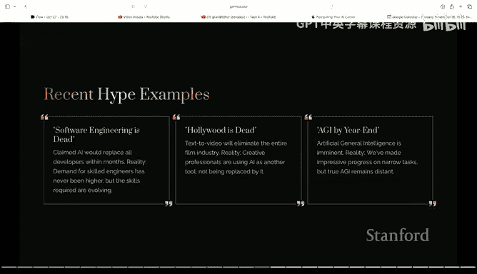

### 关于努力工作的思考 💪

我想说的最后一件事是，在某些圈子里，这可能被认为在政治上不正确，但我还是要说：在某些圈子里，鼓励他人努力工作已变得在政治上不正确。

我要鼓励你们努力工作。我认为有些人不喜欢这一点的原因是，有些人正处于生活中的某个阶段，无法努力工作。例如，我的孩子出生时，我在短时间内没有努力工作。有些人因为受伤、残疾或其他非常正当的原因，在那一刻无法努力工作，你应该尊重他们，支持他们，确保他们得到很好的照顾，即使他们没有努力工作。

话虽如此，我所有非常成功的博士生，我看到他们每个人都工作得非常努力。凌晨两点坐着进行超参数调整，我经历过，现在有时仍然这样做。如果你有幸处于生活中可以努力工作的位置，现在有如此多的机会去做事情。如果你像我一样兴奋，利用晚上和周末编码、构建东西、获取用户反馈，如果你投入并做这些事情，它将增加你成功的可能性。所以，也许我会因为鼓励你们努力工作而惹上一些麻烦，但我发现事实是，努力工作的人能完成更多事情。当然，我们也应该尊重那些不处于能够努力工作位置的人。但在看一些无聊的电视节目和周末编写代理代码尝试某事之间，我几乎每次都会选择后者，除非有时我也会看电视节目，但我希望你们也这样做。

好了，以上就是我想说的主要内容。现在我想把讲台交给我的好友劳伦斯·莫罗尼，他将分享更多关于AI职业建议的内容。简单介绍一下，劳伦斯和我认识很久了，他做了很多在线教育工作，有时和我的团队合作，教了很多人TensorFlow，教了很多人PyTorch。他在谷歌担任了多年的首席AI倡导者，现在在OpenAI领导一个团队。我也很喜欢他的几本书，这是他最近出版的一本关于PyTorch的新书，这是一本优秀的PyTorch入门书，他在许多圈子里都是非常受欢迎的演讲者。所以当他同意来为我们演讲时，我非常感激。

## 第二部分：劳伦斯·莫罗尼的分享

大家好，我是劳伦斯。很高兴来到这里。我想先强调一下吴恩达教授早些时候谈到的一点：选择与你共事的人非常重要。但我也想从另一个角度说明，公司在面试你时也在选择你，好的公司真的也想选择他们愿意共事的人。

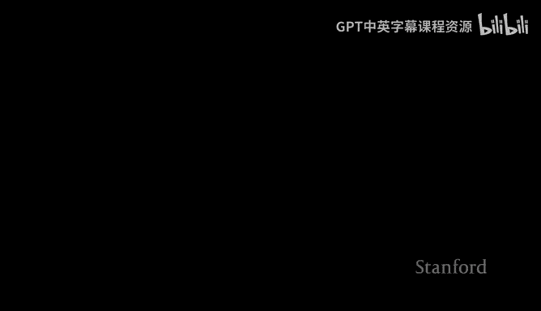

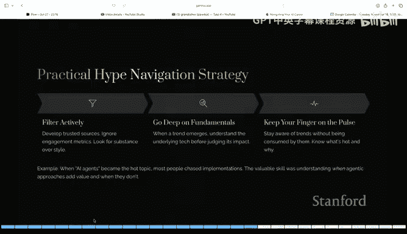

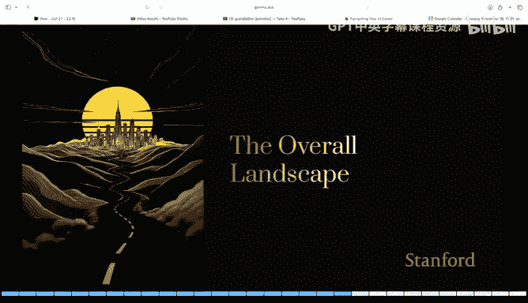

过去18个月里，我指导了很多寻找职业的年轻人。我想讲一个年轻人的故事。这个小伙子受过良好教育，经验丰富，编码能力超强。他能应对面前的每一个挑战。他在四月份被裁员了，他从事医疗软件工作，而医疗软件业务发生了巨大变化，联邦政府在多个领域削减了资金，他被裁员了。以他的经验、能力和技能，他认为再找一份工作会非常容易。但这个可怜的小伙子四月份过得很糟糕，他被裁员前不久，女朋友和他分手了，几周后，他的狗死了。所以他状态不好。

几个月后，我和他坐下来看了看，他有一个申请工作的电子表格，里面追踪了300多个工作。其中一些工作，他实际上进入了面试流程，并且在一些公司面试得很深入，比如Meta、微软和其他一些大型科技公司，进行了很多轮面试。每次到了最后阶段，他知道自己面试得很好，解决了所有编码问题，与人们进行了很好的交谈，至少他认为如此。然后每次在一天内，招聘人员就会打电话给他说：不，你没有得到这份工作。这令人心碎。正如我所说，他追踪了300多个工作。

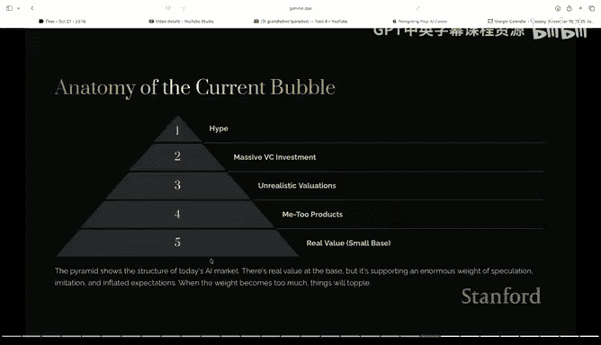

我开始和他一起进行模拟面试，做一些调整。哦，是杰夫·贝佐斯的公司，不是亚马逊，是另一家他面试过的大型科技公司。我开始和他一起工作，进行测试面试等等。他是一个非常出色的候选人，我无法弄清楚问题出在哪里。

直到我决定尝试进行一种不同的面试，我给了他一个非常棘手的面试，我给了他一些困难的LeetCode问题，给了他一些编码中非常晦涩的边界情况，然后观察他的反应。他的反应方式是根据招聘手册中给他的建议。很多招聘手册会说：你将有机会分享意见，你必须坚持立场，必须有主见，不要屈服。他对这一点的理解是变得非常、非常强硬。

所以我会挑他代码的毛病，我会挑出可能不起作用的边界情况，我会给他一个危机测试。而他得到的“坚持立场”的建议，最终使他在这些面试环境中变得有些敌对。

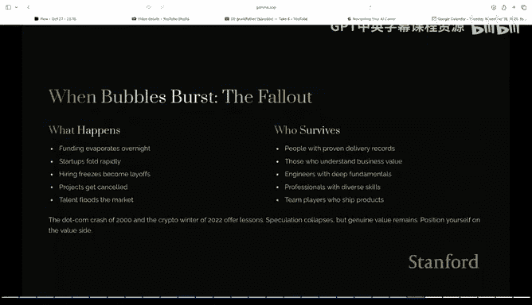

我从吴恩达教授刚才谈到的角度看待这个问题：好的团队，可以一起共事的人。从面试官的角度来看，如果我在管理这个团队，这个人就是那种陈词滥调的“10倍工程师”，但我不希望他靠近我的团队，因为这种态度。我们在这方面进行了改进，调整了这一点。奇怪的是，他实际上是一个非常友善的人，只是这是他得到的建议，而他遵循了这个建议，结果在这么多面试中失败了。所以，当他面试下一份工作时，那是一家非常重视团队合作的公司。好消息是，他得到了那份工作，现在在那里工作，薪水比被裁员前翻了一番，现在回想起来，他有大约六个月的“有趣”失业期。但当时他经历这一切时，那是一段非常艰难的时期。

所以，从另一方面来说，如果你在考察一家公司，考察你将与之共事的人，这非常重要，但也要意识到他们也在以同样的方式考察你。所以，如果你参加过技术面试辅导，他们给了你“坚持立场、有主见”的建议，这样做是好的，但不要在这个过程中表现得像个混蛋。

### 当前就业市场现状 📊

大家能看到我的幻灯片吗？好的，我是劳伦斯。我在科技行业工作的时间比ChatGPT认为草莓里有原子还要长。我在许多大型科技公司工作过，在微软工作了很多年，在谷歌工作了很多年，也在路透社这样的地方工作过，在美国和国外都参与过很多初创公司的工作。

所以，我今天真正想谈的是，思考一下当前的职业前景，特别是在AI领域。首先，正如吴恩达教授所说，你们在斯坦福，有能力利用在斯坦福的人际网络，利用你们拥有的声望。我说要利用你拥有的每一种武器，因为不幸的是，当前的形势并不理想。

我们经历了一些非常困难的时期。你只需要看看新闻，就能看到大规模的科技裁员、科技行业招聘放缓等等。但如果你方法得当，这未必是件坏事。

我想快速看一下就业市场的现实情况。实际上，出于兴趣，我想了解一下，你们是三年级学生吗？你们是今年毕业还是明年毕业？你们是四年制中的第三年？三年制中的第三年？所以你们将在即将到来的夏天毕业。有多少人已经在找工作了？好的，相当多。很多人已经成功了？没有人？哦，一个。好的，差不多。好的，很好。所以你们可能已经看到了一些迹象。

初级招聘显著放缓。我所说的“初级”，指的是毕业生水平。高调裁员占据新闻头条。几年前我在谷歌时，他们进行了有史以来最大规模的裁员。我们看到亚马逊、微软等公司也在裁员。感觉入门级职位稀缺。我强调了“感觉”这个词，稍后我想更详细地探讨这一点。此外，竞争激烈。

但我的问题是，你应该担心吗？我说不。因为如果你能以正确的方式处理事情，特别是理解AI领域变化的速度，那么我认为拥有正确心态的人将会蓬勃发展。

### AI招聘格局的变化 🔄

我这么说是什么意思呢？正如吴恩达教授提到的，AI招聘格局正在变化，因为AI行业正在变化。实际上，我早在1992年就首次接触AI，在AI寒冬之前工作了一段时间，然后一切都急剧失败了。但我被AI的魅力所吸引，然后在2015年，当谷歌推出TensorFlow时，我又被拉回了这个领域，成为AI热潮的一部分，推出TensorFlow，向数百万人推广TensorFlow，并见证了发生的变化。

但在2021年、2022年，我们遭遇了全球疫情。全球疫情导致了大规模的工业放缓。这种大规模的工业放缓意味着公司不得不开始转向直接创收的领域。在谷歌，TensorFlow是一个开源产品，它不直接创收。我们开始缩减规模。世界上每家公司此时也都缩减了招聘规模。

然后到了2022年、2023年左右，发生了什么？我们开始走出全球疫情。我们开始意识到所有行业都积压了大量未完成的招聘。同时，我们也进入了一个AI爆炸式发展的时代，这得益于像吴恩达教授这样的人的工作。世界正在转向并改变为一切以AI为先。每家公司都需要疯狂招聘。

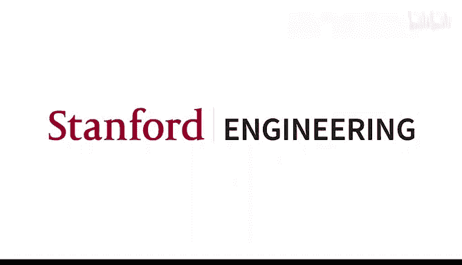

2022年、2023年每家公司疯狂招聘的结果是，大多数公司最终都过度招聘了。这通常意味着，那些没有资格担任更高职位的人通常得到了更高的职位，因为你必须进入竞价战才能获得人才。你最终会有人才争夺战，最终会出现像吴恩达教授讲的故事那样的情况：这里有一个