#  009：我的模型内部发生了什么？🔍

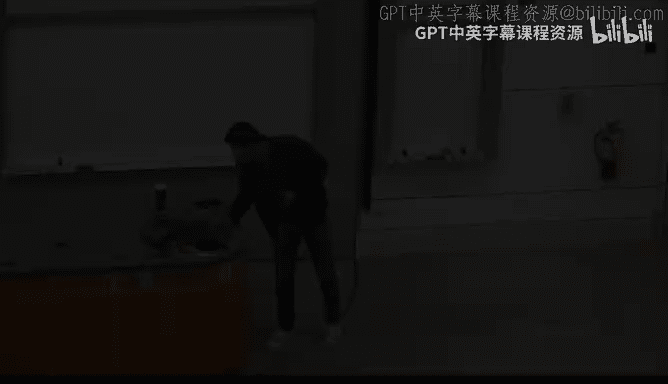

在本节课中，我们将深入探讨神经网络（包括卷积神经网络和Transformer）的内部工作机制。我们将学习一系列可视化与解释方法，帮助你理解模型如何做出决策。课程将从经典的卷积神经网络入手，逐步过渡到前沿大模型的分析技术。

---

## 案例研究：模型训练师的一天 😊

假设你是一家前沿实验室的模型训练师，正在训练一个拥有2000亿参数的模型。一夜之间，新生成的模型检查点通过了训练安全检查，但出现了一些问题：模型在推理基准测试上表现变差，一些安全评估失败，并且在用于智能体工作流时出现了奇怪的延迟峰值。

你的副总裁想知道发生了什么。在修改代码或重新训练模型之前，你会首先检查哪些证据？

以下是大家讨论后可能关注的几个方面：

*   **错误分析**：查看推理基准和安全评估中失败的案例，寻找模式以定位问题根源。
*   **训练过程监控**：检查训练损失曲线是否平滑，验证损失是否与训练损失趋势一致。关注是否有异常的梯度爆炸或消失。
*   **数据批次检查**：检查最近训练的数据批次，看是否存在数据污染或偏差。
*   **硬件问题排查**：考虑到延迟峰值，检查硬件是否出现故障。
*   **模型内部检查**：对于语言模型，可以可视化注意力图，检查不同词元之间的关系是否合理。
*   **敏感性分析**：检查超参数（如优化器、学习率计划）是否设置不当，或对照已知的缩放定律分析模型规模、数据量和计算量是否匹配。
*   **专家混合模型**：如果模型是专家混合架构，检查路由模块是否失效，或是否总是选择相同的专家。

通常，这些解决方案可以归纳为四个方向：**训练与缩放**、**模型内部表示与行为**、**数据与分布**以及**多层级能力评估**。

接下来，我们将从卷积神经网络开始，深入其内部，然后再回到前沿模型的分析。

---

## 卷积神经网络的可解释性 🖼️

### 案例：动物园动物分类器

假设你为动物园构建了一个动物分类器，但动物园管理员因为不理解模型的决策过程，不愿意在没有人工监督的情况下使用它。你如何缓解他们的担忧，并让他们对模型的决策过程有直观的理解？

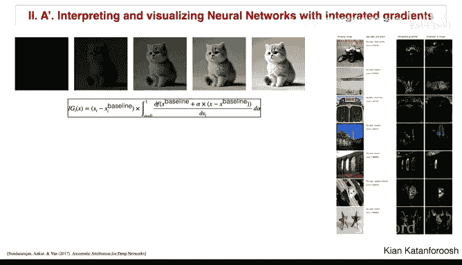

我们可以采用多种方法：

*   **教育解释**：解释Softmax层如何输出每个动物类别的概率，以及卷积滤波器如何扫描图像以学习特征。
*   **数据搜索**：展示模型在大量动物图片上表现良好的例子，建立初步信任。
*   **更深入的证明**：我们需要更系统的方法来证明模型确实在关注图像的正确部分。

### 方法一：显著图

一个基本方法是计算输出类别分数相对于输入图像的梯度。具体来说，对于“狗”这个类别，我们计算其得分（Softmax之前）对每个输入像素的偏导数：

**公式**：`∂(score_dog) / ∂X`

这会产生一个矩阵，其中较亮的像素表示其梯度较高，即改变该像素会显著影响“狗”的得分；较暗的像素则影响很小。这种方法称为**显著图**，可以快速显示模型在预测“狗”时关注了图像的哪些区域。

**注意**：这里使用Softmax之前的分数，是因为Softmax之后的概率依赖于所有类别的分数，而不仅仅是“狗”的分数。

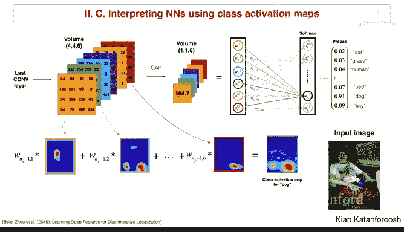

显著图的一个主要问题是它只在像素级别进行分析，缺乏语义连贯性。因此，更常用的方法是**积分梯度**。它通过从基准图像（如全黑图像）到原始图像之间路径上的梯度积分，生成更具解释性的结果。

### 方法二：遮挡敏感性

另一种更直观的方法是**遮挡敏感性分析**。具体操作是：用一个小方块（如灰色方块）遮挡输入图像的不同区域，然后观察目标类别（如“狗”）得分的变化。

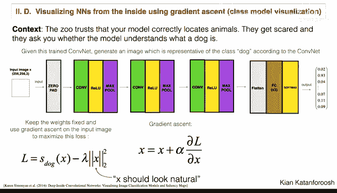

*   如果遮挡区域与物体（如狗的脸部）重叠时得分显著下降，说明模型确实在关注该区域。
*   如果遮挡无关区域时得分不变甚至上升，说明模型忽略了这些无关信息。

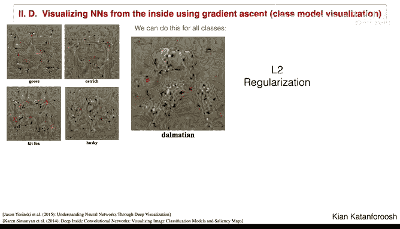

通过在整个图像上滑动遮挡方块并记录得分变化，可以绘制出类别概率热图。这种方法计算量较大，但结果非常直观。

### 方法三：类激活图

为了提供实时的决策过程可视化，我们需要一种可以集成到网络中的方法。传统CNN架构的瓶颈在于全连接层，它们混合了所有的空间信息，使得追溯回输入图像变得困难。

解决方案是修改网络架构：将最后的全连接层替换为**全局平均池化层**和一个全连接层。

**工作原理**：
1.  假设最后一个卷积层输出一个体积（例如 `4x4x6`，6个通道的特征图）。
2.  全局平均池化对每个通道的特征图取平均值，得到一个 `6x1x1` 的向量。这个向量保留了每个特征图的激活强度信息。
3.  这个向量再通过一个全连接层和Softmax得到分类概率。

**关键优势**：现在，最终类别的得分可以追溯到每个特征图的贡献。通过将最后一个全连接层中对应于“狗”类别的权重，与对应的特征图进行加权求和，我们可以生成一个**类激活图**，直观显示图像的哪些区域对预测“狗”贡献最大。

这种方法及其改进版（如Grad-CAM）是理解CNN决策重点的强大工具。

### 方法四：类模型可视化

我们可以进一步“询问”模型：你认为“狗”的最佳代表是什么？这可以通过优化输入图像来实现。

**方法**：定义一个损失函数，目标是最大化“狗”类别（Softmax前）的得分，同时加入正则化项以确保生成的图像看起来自然（像素值在合理范围内）。然后，从一个随机噪声图像开始，使用梯度上升算法迭代更新像素值，直到损失函数最大化。

生成的结果图像可以揭示模型对某个类别的“内部概念”。例如，模型可能认为“斑点狗”就是“白色背景上的黑色斑点”，或者“鹅”总是成群出现。这有助于我们发现模型可能存在的误解。

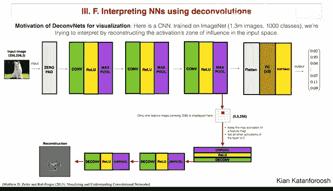

这种方法也可以应用于网络内部的任何神经元，通过最大化特定神经元的激活，来理解该神经元所响应的输入模式。

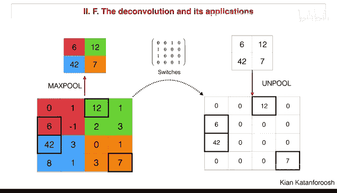

### 方法五：数据集搜索

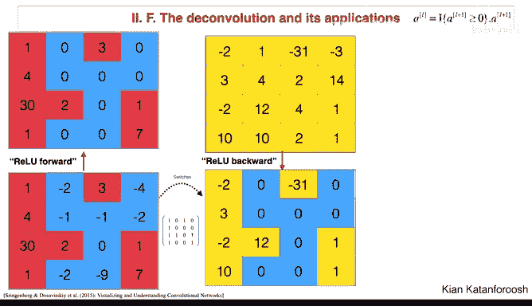

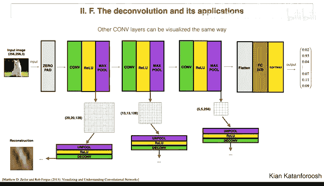

最简单直观的方法是**数据集搜索**。具体做法是：选择一个特定的滤波器（或其特征图），然后在整个验证集上搜索，找出使该特征图激活值最高的前几张图像。

*   如果激活最高的图像都是“衬衫”，那么这个滤波器很可能学会了检测“衬衫”。
*   如果激活最高的图像都包含明显的“边缘”，那么这个滤波器可能是一个边缘检测器。

通过为网络中的每个滤波器执行此操作，我们可以解释大多数滤波器学习到的特征。需要注意的是，越深层的滤波器，其感受野越大，看到的图像区域也越大，因此提取的特征也更抽象。

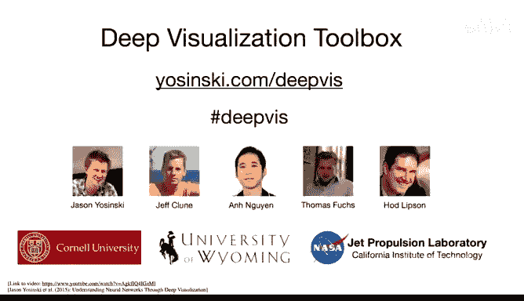

### 方法六：反卷积与网络逆向工程

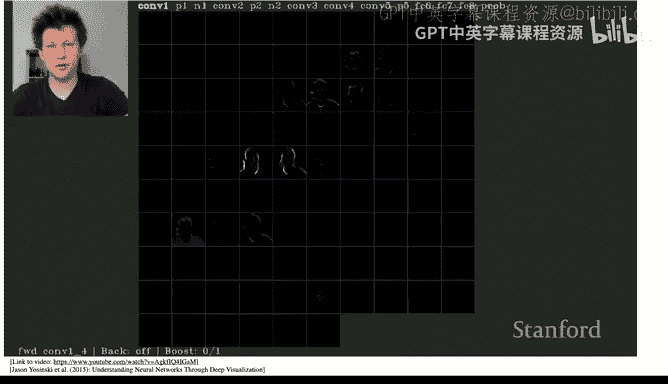

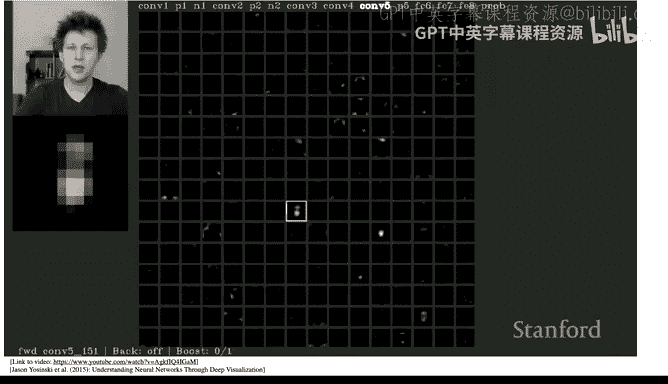

为了更精确地逆向工程一个激活的原因，我们可以使用**反卷积**（或转置卷积）技术。核心思想是：在网络前向传播时，记录下关键信息（如最大池化的位置“开关”），然后构建一个反向网络，将某个特定的高层激活映射回输入像素空间。

**简化数学原理（以1D卷积为例）**：
1.  一个步长为2的1D卷积操作可以写成一个矩阵 `W` 与输入向量 `X` 的乘法，得到输出向量 `Y`：`Y = W * X`。
2.  在理想情况下（如滤波器是正交的），其逆操作就是其转置：`X ≈ W^T * Y`。
3.  这等价于一个步长为1/2的“子像素卷积”操作：先将 `Y` 在元素间插入零进行上采样，然后使用翻转后的滤波器进行卷积。

**应用流程**：
1.  前向传播一张图像，在某一层选择一个特征图，并找到其中激活值最高的那个位置。
2.  将该位置以外的激活全部置零。
3.  利用记录的反向传播信息（池化开关、Relu等）和翻转的滤波器，通过一系列“反池化”和“反卷积”操作，将该激活反向映射到输入空间。
4.  最终得到输入图像中的一个裁剪区域，该区域正是导致该特征图高度激活的原因。

通过这种方法，我们可以可视化网络任何层次中滤波器所响应的具体图像模式，从浅层的边缘、纹理到深层的复杂形状和物体部件。

---

## 前沿模型的分析技术 🚀

### 从CNN到Transformer

CNN主要处理局部信息（边缘、纹理、形状），而现代大模型（如Transformer）则侧重于概念或词元之间的关系和语义。

Transformer的两个核心可解释组件是：
1.  **注意力模式**：可视化注意力权重，可以显示模型在处理一个词元时，关注了序列中的哪些其他词元。这有助于理解模型如何建立词与词之间的联系（如代词指代、句法结构）。
2.  **词嵌入**：通过降维技术（如t-SNE）可视化词嵌入空间，可以检查语义相近的词是否在空间中彼此靠近，从而验证模型是否学到了有意义的语言表示。

然而，现代Transformer极其复杂，当前的前沿研究也只能较好地解释小型（如两层）Transformer。像Anthropic公司关于“Transformer电路”和“归纳头”的研究，是这一领域的代表性工作。

### 训练与缩放诊断

前沿实验室如何判断模型训练是否良好？

*   **损失曲线**：监控训练损失和验证损失，确保它们平滑下降。异常的跳跃或震荡可能预示着数据批次问题、梯度问题或代码错误。
*   **训练遥测数据**：跟踪梯度范数、学习率计划、硬件利用率等指标。
*   **缩放定律**：这是非常重要的分析工具。通过分析模型性能（如测试损失）与模型规模、计算量、数据量之间的幂律关系，可以指导资源分配。例如，Chinchilla论文指出，当时的大模型（如GPT-3）可能训练数据不足，而非参数不够。遵循缩放定律可以帮助决定：是应该增加计算、收集更多数据，还是扩大模型规模。

### 能力与安全评估

实验室通过广泛的基准测试来评估模型能力（如推理、编码、数学、多语言）和安全性。

*   **基准测试**：用于比较不同检查点或模型之间的性能。但需警惕**基准污染**问题——如果测试数据不小心混入了训练集，会导致分数虚高。可以通过n-gram搜索、哈希或嵌入相似性检查来检测污染。
*   **安全评估**：包括对抗性攻击（越狱、社会工程）、有害内容生成、幻觉、隐私泄露等多方面的压力测试。评估不仅针对模型本身，也针对其在实际智能体工作流中的表现。

### 数据诊断

数据质量至关重要，实验室会监控多种数据问题：

*   **分布检查**：跟踪训练数据中不同领域（如维基百科、代码、法律文本）的比例。如果某个领域数据不足，模型在该领域的性能可能会下降。需要通过采样策略来平衡领域分布。
*   **词元统计**：监控关键词元（如数学符号）的频率变化。如果某个重要词元出现频率漂移，可能影响相关任务性能。
*   **污染检测**：如前所述，检测并清除训练数据中可能包含的测试集信息。

---

## 总结 📝

本节课我们一起深入探索了神经网络的黑箱。

*   我们首先学习了多种用于**卷积神经网络**的可视化与解释方法：
    *   **显著图**和**积分梯度**用于理解输入像素对输出的影响。
    *   **遮挡敏感性**直观地展示了模型关注的图像区域。
    *   **类激活图**通过修改网络架构，实现了决策过程的可视化。
    *   **类模型可视化**和**数据集搜索**帮助我们理解模型内部神经元和滤波器学习到的概念。
    *   **反卷积/逆向工程**让我们能够将高层的激活追溯回具体的输入模式。
*   随后，我们将视野扩展到**前沿大模型**，了解了当前的研究方向：
    *   通过**注意力模式**和**词嵌入可视化**来理解Transformer。
    *   利用**损失曲线**、**缩放定律**进行训练诊断和资源规划。
    *   通过**多维度基准测试**和**安全评估**来全面衡量模型能力与风险。
    *   运用**数据分布分析**和**污染检测**来保障数据质量。

这些工具和方法构成了模型开发者和研究者理解、调试和改进模型的工具箱。虽然前沿模型的完全可解释性仍是巨大挑战，但掌握这些基础技术将为你未来探索更复杂的模型内部机制奠定坚实的基础。