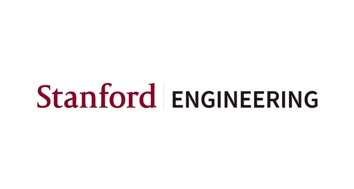
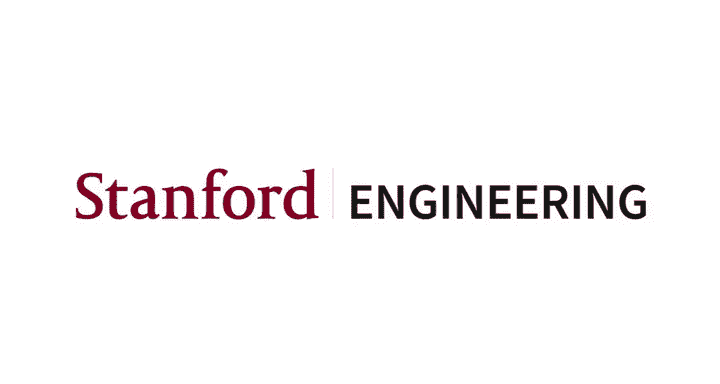

#  010：聊天机器人案例研究与结语 🤖




在本节课中，我们将通过一个聊天机器人的小型案例研究，来回顾并应用本课程中学到的深度学习知识。随后，我们将进行课堂总结，并提供一些关于期末项目和未来学习方向的建议。

---

## 聊天机器人案例研究

上一节我们回顾了课程的整体脉络，本节中我们来看看如何构建一个简单的聊天机器人，帮助学生查找课程信息或进行选课。

### 核心概念与术语

在深入技术细节之前，我们首先需要了解一些构建对话助手时常用的术语。

*   **话语**：用户输入或助手输出的一个句子。
*   **意图**：用户话语背后的目的。在我们的案例中，意图只有两种：`查找课程信息` 或 `选课`。
*   **槽位**：为完成特定意图所需收集的具体信息。例如，对于“选课”意图，需要填充的槽位可能包括：`课程代码`、`学期` 和 `年份`。
*   **单轮对话**：仅包含一次用户话语和一次助手回复的交互。
*   **多轮对话**：包含多次来回交互的对话，需要跟踪上下文。

### 意图识别

我们的第一个任务是识别用户的意图。这是一个典型的序列分类问题。

以下是构建意图识别模型所需的数据集示例：
```python
# 输入（用户话语） -> 输出（意图标签）
"我想选修CS106A来学习编程。" -> "enroll"
"2019年春季有哪些本科历史课程？" -> "inform"
```
我们可以使用循环神经网络或卷积神经网络来构建分类器。卷积网络的一个优势是，如果意图通常由输入序列中的少数几个关键词决定，那么卷积滤波器可以有效地捕捉到这些模式。

### 槽位填充

识别意图后，我们需要提取完成该意图所需的详细信息，即填充槽位。这是一个序列到序列的标注问题。

以下是槽位标注的数据格式示例（以航班预订为例）：
```
用户话语： "我想预订12月5日周二从巴黎到吉隆坡的航班。"
槽位标签： O   O   O   B-day I-day O   B-departure O B-arrival I-arrival O
```
*   **B-**：表示一个槽位值的开始。
*   **I-**：表示一个槽位值的中间或结尾。
*   **O**：表示该词不属于任何槽位。

对于我们的选课案例，“我想选修CS106A来学习编程”这句话的槽位标签可能是：`O O O B-code O O O`，表示识别出了课程代码槽位。

### 联合训练与数据获取

意图识别和槽位填充模型可以共享底层的特征提取层（如一个LSTM层），然后通过两个不同的输出头进行**联合训练**。总损失函数是两个任务损失函数的简单求和。

获取标注数据是构建模型的关键步骤。以下是几种常见方法：

*   **人工标注**：最准确但最耗时。
*   **自动生成**：利用已有的数据库（课程列表、日期等）和句子模板，通过替换占位符自动生成大量带标注的数据。
*   **利用现有模型**：使用成熟的词性标注或命名实体识别模型进行初步标注，再进行人工修正。

### 处理上下文与多轮对话

当用户的话语信息不全时，就需要进行多轮对话。例如，用户说“我想选CS106A”，但没有提供学期和年份。这时，助手需要询问缺失的信息，并在后续对话中结合上下文来理解用户的回答（如“2019年冬季”）。

一种处理上下文的方法是使用**记忆网络**。该网络会将历史对话记录在“记忆”中。当处理当前用户话语时，网络会计算当前话语编码与所有历史记忆之间的注意力权重，从而得到一个融合了相关上下文的向量，再用于当前的槽位填充任务。

### 评估与扩展

评估聊天机器人性能可以从模块和整体两个层面进行：

*   **模块评估**：使用精确率、召回率、F1分数等指标分别评估意图分类器和槽位填充器的性能。
*   **整体评估**：通常采用人工评估，例如，让评估者为机器人生成的多个候选回复在“恰当性”上打分（1-5分），通过平均意见分来比较不同模型的优劣。

如果要将文本聊天机器人升级为语音助手，则需要在前后端分别增加**语音转文本**和**文本转语音**模块。

---

## 期末项目建议 📝

本节我们将提供一些关于完成和提交期末项目的具体建议，帮助大家取得好成绩。

在撰写项目报告时，请务必注意以下几点：

*   **问题描述**：像论文摘要一样清晰、准确地描述你的项目。
*   **超参数调优**：报告你尝试过的超参数及其结果，并解释最终选择的原因。
*   **写作与解释**：注意语言清晰，避免拼写错误。详细解释你做出的每一个重要选择（如模型架构、数据处理方法）。
*   **数据预处理**：如果适用，请详细说明数据清洗和预处理步骤。
*   **代码与结果**：说明有多少代码是自己编写的。即使结果未达预期，也要完整报告并分析原因。
*   **讨论与展望**：包含对结果的深入分析，并讨论如果时间更充裕，下一步会做什么。
*   **格式与长度**：核心报告请控制在5页以内，可添加附录。

对于最终的海报展示，请准备好进行**3分钟的项目介绍**，并接受2分钟的提问。

---

## 后续学习方向 🚀

CS230课程结束后，你可以通过多种途径继续深化在深度学习及相关领域的知识。

斯坦福大学提供了许多相关的进阶课程，例如：

*   **CS224N**：自然语言处理与深度学习
*   **CS231N**：计算机视觉中的卷积神经网络
*   **CS236**：深度生成模型
*   **CS229**：机器学习
*   **CS234**：强化学习

此外，也可以关注业界的研究动态，将所学知识应用到软件行业之外更广阔的领域，如医疗、农业、教育、气候等，这些领域存在着大量尚未被挖掘的AI应用机会。

---

## 课程总结与寄语

本节课我们一起学习了如何将深度学习技术应用于构建一个简单的任务导向型聊天机器人，涵盖了意图识别、槽位填充、上下文管理和评估方法。我们也回顾了完成期末项目的关键要点，并展望了未来的学习路径。

你们通过这门课程掌握的技能是独特且强大的。深度学习领域发展迅速，你们学到的很多知识在几年前甚至还不存在。希望你们能利用这些技能，不仅去创造商业价值，更能去解决那些对社会和人类至关重要的挑战——无论是改善医疗可及性、应对气候变化，还是提升教育质量。许多最有价值的AI应用机会存在于软件行业之外。

最后，衷心感谢大家在整个课程中的辛勤付出。我们期待在项目展示会上看到你们的精彩工作。请带着在这里获得的“超能力”，继续探索、创造，并享受这个过程，去做那些真正重要的工作。



祝大家好运！